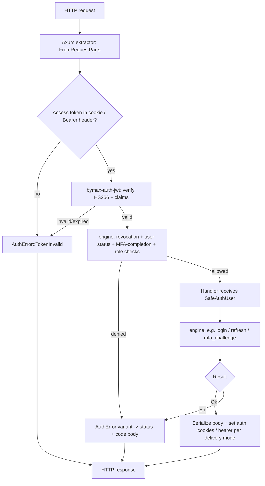

# rust-auth — Complete Technical Specification

> **Status**: 📝 Draft · **Owner**: Bymax One · **Last updated**: 2026-06-17
> **Artifacts**: `bymax-auth` (crates.io, Rust backend) · `@bymax-one/rust-auth` (npm, React/Next.js frontend)
> **Parity target**: `@bymax-one/nest-auth` v1.0.x — full feature parity
> **Related**: [nest-auth technical spec](../../nest-auth/docs/technical_specification.md) · Bymax Lib Standards · Rust stack conventions

---

This document is the **single source of truth** for the `rust-auth` library. It defines what the library is, what it must do (full parity with `@bymax-one/nest-auth`), and how it is built, tested, and published. It deliberately includes conceptual Rust signatures, crate trees, configuration schemas, and catalogs (Redis keys, error codes, dependencies) — but no full implementations; those are produced during development. Downstream, this spec feeds the phased roadmap and the per-task breakdown.

**How to read this document.** Sections 1–2 frame the *what and why* (overview, scope, scenarios, success criteria). Sections 3–17 specify the *Rust backend* (`bymax-auth` on crates.io). Sections 18–19 specify the *frontend distribution* (`@bymax-one/rust-auth` on npm) and dependencies. Sections 20–22 cover quality, release engineering, and explicit non-goals. Section 23 records constraints, risks, open questions, and references. Section 24 enumerates the inviolable **security invariants** the implementation and CI must protect. Section 25 lists the official examples and the production **dogfooding** consumer.

## Table of Contents

1. Overview & Value Proposition
2. Scope, Scenarios & Success Criteria
3. Architecture
4. Workspace & Package Structure
5. Configuration API
6. Repository & Provider Contracts
7. Core Engine & Services
8. HTTP Adapter — Axum
9. Hooks System
10. Email Provider Interface
11. OAuth System
12. Redis Strategy
13. JWT & Token Strategy
14. Cookie Management & Token Delivery
15. Error Model & Codes Catalog
16. Rate Limiting
17. Cryptography & Security Model
18. Frontend & npm Distribution
19. Dependencies & Feature Flags
20. Testing Strategy & Quality Gates
21. CI/CD & Release Engineering
22. What Is NOT in the Library
23. Constraints, Risks, Open Questions & References
24. Security Invariants
25. Examples & Dogfooding

---
## 1. Overview & Value Proposition

### 1.1 Goal

> As a backend engineer building a Rust service, I want a complete, batteries-included authentication and authorization library — JWT sessions, MFA, OAuth, RBAC, multi-tenancy, brute-force protection, password reset, email verification, invitations, and platform-admin support — so that I can ship production-grade auth without re-implementing security-critical primitives, while my React/Next.js frontend keeps using the exact same hooks and client it already knows.

`rust-auth` is a faithful, full-parity port of the NestJS library `@bymax-one/nest-auth` to a Rust backend, paired with the same React/TypeScript frontend surface published to npm. "Full parity" means full **feature** parity, always — every feature that exists in `@bymax-one/nest-auth` today exists here. It also means **behavioral** parity out of the box: the default configuration profile, `AuthConfig::nest_compat_defaults()` (the `Default`), reproduces nest-auth's operational defaults exactly — email-verification `required = true`, brute-force `maxAttempts = 5`, password-reset token/OTP TTL 600 s, invitation TTL 48 h — so a deployment that changes nothing behaves like nest-auth. A hardened greenfield profile (`AuthConfig::secure_defaults()`, Argon2id) is opt-in, not the default; both profiles are defined in §5. The backend is rewritten in Rust, and the browser/edge layers are kept in TypeScript and fed from the Rust core.

### 1.2 What `rust-auth` is

- A **framework-agnostic Rust auth engine** (`bymax-auth-core`) exposing all authentication and authorization flows, with a first-class **Axum** HTTP adapter (`bymax-auth-axum`). Published to **crates.io** behind a single facade crate, `bymax-auth`.
- A **React/Next.js frontend package** (`@bymax-one/rust-auth`, published to **npm**) preserving the existing `@bymax-one/nest-auth` web API — `./shared`, `./client`, `./react`, `./nextjs` — talking to the Rust backend over HTTP.
- A **shared source of truth**: TypeScript types and constants are generated from the Rust types crate (via `ts-rs`), and the edge JWT verification used by Next.js middleware is compiled from the same Rust crypto code to WebAssembly (`bymax-auth-wasm`). Server and edge therefore share one verified implementation, and the frontend never drifts from the backend contract.

### 1.3 Why it exists

- **Security-critical code belongs in a memory-safe, type-safe language.** Token handling, password hashing, constant-time comparisons, and AEAD encryption are exactly the surface where Rust's guarantees pay off.
- **One contract, two ecosystems.** Teams running a Rust backend get a real crate; teams with React/Next.js frontends get the same ergonomic hooks/client they already use — both fed from one core so error codes, JWT payloads, and route constants cannot diverge.
- **Authority and reuse.** Like `@bymax-one/nest-auth`, this is a public, professionally maintained library: 100% test coverage, mutation testing close to 100%, supply-chain hardening, and OIDC trusted publishing.

### 1.4 Who uses it

- **Rust backend engineers** (Axum today; Actix/Poem possible later via additional adapters) — depend on `bymax-auth` from crates.io, implement a handful of repository/provider traits against their database and email service, and mount the router.
- **Frontend engineers** (React 19 / Next.js 16) — install `@bymax-one/rust-auth` from npm and use `AuthProvider`, `useAuth`, `useSession`, the typed client, and the Next.js middleware/route handlers, unchanged from `@bymax-one/nest-auth`.

### 1.5 Distribution model

One core, two registries (detailed in §4 and §18):

| Audience | Artifact | Registry | Mechanism |
| --- | --- | --- | --- |
| Rust backend | `bymax-auth` (facade) + internal crates | crates.io | `cargo add bymax-auth --features axum,redis,mfa,oauth`; one import root `bymax_auth::*` |
| React/Next.js frontend | `@bymax-one/rust-auth` | npm | one package, subpaths `./shared` `./client` `./react` `./nextjs` |

The backend cannot be an npm package (a tokio/Redis server does not run as WASM) and React hooks cannot be a crate; the two artifacts are bound together by sharing the same Rust core (generated types + WASM edge crypto), which preserves the "one library" experience `@bymax-one/nest-auth` achieved with npm subpaths.

### 1.6 Design principles

1. **Framework-agnostic core.** All logic lives in `bymax-auth-core`, which depends on **no web framework, no HTTP types, and no Redis** — those belong strictly downstream, in adapters and store crates. The trait set is the architectural seam, and **Axum is the first official adapter**; others can follow without touching the core. v1 standardizes on **Tokio** for the async engine and the official adapters, while the `types` / `crypto` / `jwt` trio stays runtime-free and WASM-safe (§3.1–§3.2).
2. **Composition over a DI container.** Pluggable parts are traits held as `Arc<dyn _>`; configuration and wiring use a builder that validates at startup — no reflection, no decorator metadata.
3. **Pure-Rust, single-source crypto.** All cryptography uses the RustCrypto ecosystem; JWT is HS256 (pinned) implemented in pure Rust so the identical code runs on the server and at the edge (WASM).
4. **Secure by default.** HttpOnly + Secure + SameSite cookies; constant-time comparisons everywhere secrets are checked; secrets never logged; algorithm confusion structurally impossible.
5. **Zero contract drift.** Frontend types and constants are generated from the Rust types crate; the edge JWT verifier is the Rust verifier compiled to WASM.
6. **Opt-in surface, zero overhead.** Feature flags + builder toggles mean unconfigured features compile out and unmounted routes do not exist.
7. **Minimal, auditable dependency footprint.** The mandatory dependency tree is deliberately tiny — `serde` + `thiserror` + the RustCrypto primitives + a pure-Rust JWT + `async-trait` + `tracing` — because that is all the always-compiled core needs. Every heavy integration (web framework, Redis client, HTTP client) is **either feature-gated or pluggable behind a trait**, so adding `bymax-auth` to a consumer's graph pulls in almost nothing it did not already ask for. This is the Rust translation of `nest-auth`'s "zero direct dependencies" stance — which Node could afford only because it ships `node:crypto`; Rust has no std crypto, so the faithful equivalent is a tiny mandatory core plus opt-in everything-else. Every direct dependency is individually justified (§19.6) and supply-chain-gated by a `cargo-deny` ban-list and a transitive-dependency budget (§19.6, §21).
8. **Quality as a gate, not a goal.** 100% coverage is the floor; mutation testing (near 100%) is the pre-release gate; supply-chain and provenance checks are mandatory.
9. **Idiomatic, statically-checked public API.** The surface follows the Rust API Guidelines: a builder for complex construction (`AuthEngineBuilder`), named enums instead of boolean traps or magic strings for every library-owned choice (algorithm, token delivery, `SameSite`, eviction, reset method), typed errors only (`AuthError` / `ConfigError` / `RepositoryError` — never stringly errors), `#![deny(missing_docs)]` with runnable rustdoc examples, `#![forbid(unsafe_code)]`, and a pinned MSRV on edition 2024 (§3.8, §4.6).

### 1.7 Background — why now

`@bymax-one/nest-auth` is the canonical Bymax auth library and the reference for the `@bymax-one/*` lib standards. As Bymax adopts Rust for performance- and security-sensitive backends, the same battle-tested auth feature set is needed natively in Rust — without forcing frontend teams to relearn an API or maintain a parallel, drift-prone TypeScript contract. Porting the backend to Rust while keeping the proven React surface, fed from one core, delivers that with no regression in developer experience and a net gain in safety.

---
## 2. Scope, Scenarios & Success Criteria

### 2.1 In scope (v1 — full feature parity with `@bymax-one/nest-auth`)

Every capability below is **in v1**. None is deferred; the library does not reach 1.0 until all are present, tested to 100% coverage, and mutation-tested near 100%. Parity here is full **feature** parity (always) plus **behavioral** parity out of the box: `AuthConfig::nest_compat_defaults()` is the `Default` profile, so a deployment's operational defaults already match nest-auth (email-verification `required = true`, brute-force `maxAttempts = 5`, password-reset TTL 600 s, invitation TTL 48 h); the hardened `AuthConfig::secure_defaults()` profile is opt-in. Both profiles are defined in §5 and are not redefined here.

- **Local authentication** — registration, login, logout, `me`, with hashed passwords (scrypt **and** Argon2id, configurable, rehash-on-verify).
- **JWT sessions** — short-lived HS256 access tokens + opaque refresh tokens with rotation, a configurable grace window, and JTI-based revocation.
- **Refresh-token family & sessions** — Redis-backed sessions with device/IP metadata, listing, single/all revocation, and FIFO eviction at a configurable concurrent-session limit.
- **MFA (TOTP)** — setup with otpauth URI + recovery codes, verify-enable, login challenge (TOTP or recovery code), disable, recovery-code regeneration; encrypted secret at rest (AES-256-GCM), hashed recovery codes, anti-replay.
- **OAuth 2.0** — pluggable providers with a built-in Google provider, PKCE + state CSRF protection, account create/link/reject decisioning, and an MFA branch.
- **Password reset** — both token-link and OTP methods, with anti-enumeration.
- **Email verification** — OTP-based, with resend.
- **Invitations** — tokenized invite create/accept with role + tenant assignment.
- **RBAC** — role hierarchy with single-level denormalized lookup; route-level role requirements; self-or-admin access.
- **Multi-tenancy** — tenant resolution and tenant-scoped lookups.
- **Platform administration** — a separate admin identity domain (login/me/logout/refresh + MFA challenge) distinct from tenant users.
- **Brute-force protection** — hashed-identifier, fixed-window counters in Redis (engine-level), complementary to edge rate limiting.
- **Rate limiting** — per-route HTTP limits at the adapter (tower layer).
- **Pluggable infrastructure** — repository, email-provider, hooks, session-store, and OAuth-provider traits; consumer supplies the database (sqlx/SeaORM/Diesel) and email service.
- **Frontend parity** — `./shared` (generated types + constants), `./client` (typed fetch client), `./react` (AuthProvider + hooks), `./nextjs` (auth proxy middleware, refresh/logout route handlers, edge JWT helpers via WASM).

### 2.2 Out of scope

See §22 for the authoritative list. In short: no database/ORM layer, no concrete email provider, no UI components beyond the kept React hooks, no session backend other than the Redis store trait, and the OAuth system is a client (not an identity-provider/host).

### 2.3 Future (post-v1, not committed here)

- Additional OAuth providers beyond Google (GitHub, Microsoft, Apple) — the trait is designed for this from day one.
- Additional HTTP adapters (Actix Web, Poem) over the unchanged core.
- Optional native Node binding (NAPI-RS) exposing engine primitives to Node servers.
- WebAuthn/passkeys.

### 2.4 User scenarios

1. **As a Rust backend engineer**, I add `bymax-auth` with the features I need, implement `UserRepository` and `EmailProvider` against my stack, build the `AuthEngine` with a validated config, mount the router, and have every auth endpoint working.
2. **As a frontend engineer**, I install `@bymax-one/rust-auth`, wrap my app in `AuthProvider`, and call `useAuth().login(...)` — exactly as with `@bymax-one/nest-auth` — against the Rust backend.
3. **As an end user**, I register, verify my email by OTP, log in, am challenged for my TOTP code when MFA is enabled, and stay logged in across requests via silent refresh.
4. **As an end user**, I sign in with Google; if my email matches an existing account the identities are linked, otherwise an account is created, and MFA still applies.
5. **As an end user who forgot my password**, I request a reset, receive a link or OTP, set a new password, and all my other sessions are revoked.
6. **As a platform administrator**, I log into the admin domain with my own credentials and MFA, separate from any tenant.
7. **As a Next.js developer**, my middleware verifies the access token at the edge using the same HS256 logic as the backend (compiled to WASM), with no network call.

### 2.5 Success criteria

| # | Criterion | How we verify |
| --- | --- | --- |
| 1 | Every `@bymax-one/nest-auth` feature (§2.1) is present, and behavior-compatible under the default `nest_compat_defaults()` profile (§5) | Parity audit against the nest-auth source + this spec; integration tests per flow |
| 2 | 100% test coverage (line/branch/region) across all crates | `cargo llvm-cov` gate in CI, per-crate and workspace |
| 3 | Mutation score near 100% (mirroring nest-auth's ~99%) | `cargo-mutants` pre-release gate; surviving/equivalent mutants documented |
| 4 | Backend publishes to crates.io and frontend to npm, both via OIDC trusted publishing | Tagged release runs the `release` workflow successfully; provenance attached |
| 5 | The Rust JWT verifier compiles to `wasm32` and runs in the Next.js edge runtime | `wasm-bindgen-test` + a dogfood Next.js app verifying tokens at the edge |
| 6 | Frontend types/constants are generated from Rust with zero manual drift | `ts-rs` generation runs in CI; a check fails the build if generated output is stale |
| 7 | `clippy -D warnings` and `rustfmt --check` clean; `#![deny(missing_docs)]` on public crates | CI lint + doc-coverage gate |
| 8 | Supply chain is clean (advisories, licenses) | `cargo-deny` + `cargo-audit` in CI; OSSF Scorecard |
| 9 | A consumer can build a working Axum backend and a working Next.js frontend from the published artifacts | Dogfood/smoke test before tagging |
| 10 | The public API is idiomatic and stable: Rust API Guidelines (strong types, no boolean traps, typed errors), MSRV honored on edition 2024 | CI builds with the pinned MSRV toolchain and on `wasm32-unknown-unknown`; `cargo public-api` snapshot + `cargo-semver-checks` gate the surface; API-guidelines checklist in review |

---
## 3. Architecture

`rust-auth` is a full-parity Rust port of `@bymax-one/nest-auth`. It keeps every behaviour, flow, and security guarantee of the NestJS package, but re-grounds the backend on a **framework-agnostic core engine** written in 100% Rust. The frontend contract is unchanged: React/TypeScript hooks (`useAuth`, `useSession`, `useAuthStatus`), a fetch-based client, and Next.js middleware continue to talk to the backend over HTTP. What changes underneath is the substrate — a NestJS dynamic module becomes a Rust workspace whose center is a pure-logic `AuthEngine`, wrapped by thin HTTP adapters.

This section describes the architectural skeleton: the core/adapter split, the native-vs-WASM compilation boundary, dependency injection by traits instead of a DI container, the initialization path, the lifecycle of an authenticated request, and the concurrency model.

### 3.1 Framework-agnostic core + adapter pattern

In `nest-auth`, the entry point is a NestJS **Dynamic Module** that is imported into each host SaaS application; controllers, services, guards, and decorators are all NestJS constructs and cannot be lifted out of the framework. `rust-auth` inverts this dependency. The authentication logic lives in `bymax-auth-core`, which has **zero knowledge of HTTP, routing, or any web framework**. It exposes a single orchestration type, `AuthEngine`, whose methods take plain owned/borrowed Rust inputs (command structs) and return plain Rust results (`Result<T, AuthError>`), with no `Request`, `Response`, header map, or cookie type anywhere in its signatures. The same exclusion applies to storage: `bymax-auth-core` has **no dependency on Redis** — or on any concrete datastore — because persistence is reached only through the `SessionStore` / `OtpStore` / `BruteForceStore` traits, whose canonical implementation lives in the separate `bymax-auth-redis` crate. **The trait set is the architectural seam:** everything framework- or infrastructure-specific sits on the far side of a trait, leaving the core as pure orchestration that compiles and tests with no web framework and no Redis present.

An **HTTP adapter** is one consumer of that core. The first official adapter is `bymax-auth-axum`; it is responsible for everything framework-shaped — extracting JWTs from cookies or `Authorization` headers, deserializing request bodies into command structs, mapping `AuthError` variants to status codes, and writing `Set-Cookie` headers. Because the core is framework-free, additional adapters (Actix Web, Poem, tower-only, or even a non-HTTP gRPC front) can be written later without touching `bymax-auth-core`. The adapter depends on the core; the core never depends on the adapter.

```
            HTTP adapters (one per framework — Axum first)
        ┌───────────────┬───────────────┬───────────────┐
        │ bymax-auth-   │  (Actix —     │  (Poem —      │
        │ axum          │   possible)   │   possible)   │
        └───────┬───────┴───────┬───────┴───────┬───────┘
                │               │               │
                └───────────────┼───────────────┘
                                ▼
                      bymax-auth-core
                  ┌──────────────────────────┐
                  │  AuthEngine               │   pure orchestration
                  │  flows (login, mfa, …)    │   no HTTP / no framework
                  │  traits (UserRepository,  │
                  │  EmailProvider, hooks …)  │
                  └────┬───────────┬──────────┘
                       │           │
       ┌───────────────┘           └───────────────┐
       ▼                                            ▼
 host-supplied trait impls               internal building blocks
 (Arc<dyn UserRepository>,               (bymax-auth-crypto,
  Arc<dyn EmailProvider>,                 bymax-auth-jwt,
  Arc<dyn SessionStore>, …)               bymax-auth-types)
```

The core is built from a small set of **internal building-block crates**:

- `bymax-auth-types` — pure data: `AuthUser`, `SafeAuthUser`, `AuthPlatformUser`, JWT claim structs, result/error enums, config value types. Serde-(de)serializable and `ts-rs`-annotated.
- `bymax-auth-crypto` — password hashing (scrypt + Argon2id), AES-256-GCM, secure-token generation, SHA-256/HMAC-SHA256, constant-time comparison, and TOTP (RFC 6238 / RFC 4226).
- `bymax-auth-jwt` — HS256 sign/verify, claim validation, algorithm pinning.

These three are the same crates the edge (WASM) build uses, which is what makes the next subsection's boundary load-bearing rather than cosmetic.

### 3.2 Native vs WASM compilation split

`nest-auth` runs the same TypeScript on Node and (a subset) on the Edge runtime, switching from `node:crypto` to the Web Crypto API by hand. `rust-auth` replaces that hand-maintained fork with **one Rust crypto/JWT implementation compiled to two targets**: native (server) and `wasm32-unknown-unknown` (edge, via `wasm-bindgen`). The edge middleware verifying a JWT and the server issuing it run *byte-for-byte the same verification code*.

This is only possible if a clearly delimited set of crates is kept **pure and synchronous** — no `tokio`, no I/O, no OS handles, nothing that cannot compile to WASM:

| Crate | Nature | wasm-safe? | Rationale |
|---|---|---|---|
| `bymax-auth-types` | pure data, serde | yes | no runtime, no I/O — just structs/enums |
| `bymax-auth-crypto` | pure compute | yes | hashing/AEAD/TOTP over in-memory bytes; uses RustCrypto crates that build for `wasm32` |
| `bymax-auth-jwt` | pure compute | yes | HS256 sign/verify is CPU-only; depends only on `crypto` + `types` |
| `bymax-auth-wasm` | wasm bindings | yes (is the wasm artifact) | thin `wasm-bindgen` facade over `jwt` + `types` for edge verification |
| `bymax-auth-core` | async orchestration | **no** | holds trait objects performing async I/O; depends on `tokio` |
| `bymax-auth-redis` | async I/O | **no** | network client (`SessionStore`/`OtpStore`/`BruteForceStore` backed by Redis) |
| `bymax-auth-axum` | async HTTP server | **no** | tower/hyper/axum — server-only |
| `bymax-auth-client` | async HTTP client | **no** | `reqwest`-based typed client; native + browser builds, not part of the edge-verify artifact |

**The boundary is enforced by the dependency graph, not by convention.** `bymax-auth-crypto`, `bymax-auth-jwt`, and `bymax-auth-types` must never gain a dependency (direct or transitive) on `tokio`, on a network/file API, or on any crate that pulls one in. Because `bymax-auth-wasm` depends *only* on `jwt` + `types`, any accidental introduction of an async/server-only dependency into that subtree breaks the `wasm32-unknown-unknown` build immediately. The WASM target is therefore a **compile-time tripwire** that keeps the shared crates honest: if it stops building, the purity invariant has been violated. CI compiles the WASM crate as a first-class check for exactly this reason.

A consequence worth stating explicitly: anything that needs Redis, the system clock as an async resource, randomness from an async source, or network access **must** live in `core` or above, never in the three shared crates. Time and randomness are passed into the pure crates as plain values (e.g. a Unix timestamp, a pre-generated secret buffer) so they stay deterministic and WASM-safe. Concretely, v1 standardizes on **Tokio** as the async runtime for `bymax-auth-core` and the official adapters (§3.6), while `bymax-auth-types`, `bymax-auth-crypto`, and `bymax-auth-jwt` take **no runtime dependency at all** — no `tokio`, nothing async — which is exactly what lets them compile to `wasm32` and be reused from any runtime.

### 3.3 Dependency injection by traits + builder (vs the NestJS DI container)

NestJS wires dependencies through a runtime **DI container**: `registerAsync()` resolves a configuration factory, injects providers by token (`BYMAX_AUTH_USER_REPOSITORY`, `BYMAX_AUTH_REDIS_CLIENT`, …), and registers controllers/guards conditionally. Resolution and most validation happen as the container boots.

Rust has no DI container, and `rust-auth` deliberately does not emulate one. Instead it uses the idiomatic Rust equivalent: **define capabilities as traits, inject concrete implementations as trait objects behind `Arc`, and assemble them with a builder.** The host application supplies its own implementations of the core traits; `AuthEngine` stores them as `Arc<dyn Trait>` fields and calls through them. The trait set mirrors the `nest-auth` injection tokens and fallback providers one-to-one:

| Core trait | nest-auth equivalent | Role |
|---|---|---|
| `UserRepository` | `IUserRepository` (`BYMAX_AUTH_USER_REPOSITORY`) | tenant/dashboard user persistence |
| `PlatformUserRepository` | `IPlatformUserRepository` | platform-admin persistence |
| `EmailProvider` | `IEmailProvider` (NoOp fallback) | transactional emails |
| `AuthHooks` | `IAuthHooks` (NoOp fallback) | lifecycle extension points |
| `SessionStore` | session half of `AuthRedisService` | refresh-session storage |
| `OtpStore` | OTP/verification half of Redis | OTP records with attempt counters |
| `BruteForceStore` | brute-force half of Redis | attempt counters with fixed TTL |
| `OAuthProvider` | `OAuthProviderPlugin` | per-provider OAuth (Google built-in) |

Conceptually (illustrative — see §7.0.1 for the authoritative engine shape):

```rust
pub struct AuthEngine {
    config: AuthConfig,
    users: Arc<dyn UserRepository>,
    platform_users: Option<Arc<dyn PlatformUserRepository>>,
    email: Arc<dyn EmailProvider>,
    hooks: Arc<dyn AuthHooks>,
    sessions: Arc<dyn SessionStore>,
    otp: Arc<dyn OtpStore>,
    brute_force: Arc<dyn BruteForceStore>,
    oauth_providers: HashMap<String, Arc<dyn OAuthProvider>>,
    // internal collaborators: token manager, password hasher, …
}
```

The builder, `AuthEngineBuilder`, plays the role of `registerAsync()` plus the `ResolvedOptions` validation pass. Defaults and a `NoOpEmailProvider` / `NoOpAuthHooks` stand in for unset optional collaborators, exactly as `nest-auth` auto-registers fallbacks. **All startup validation is concentrated in one fallible step:**

```rust
impl AuthEngineBuilder {
    pub fn user_repository(self, repo: Arc<dyn UserRepository>) -> Self;
    pub fn platform_user_repository(self, repo: Arc<dyn PlatformUserRepository>) -> Self;
    pub fn email_provider(self, email: Arc<dyn EmailProvider>) -> Self;
    pub fn hooks(self, hooks: Arc<dyn AuthHooks>) -> Self;
    // The three stores can be supplied individually …
    pub fn session_store(self, store: Arc<dyn SessionStore>) -> Self;
    pub fn otp_store(self, store: Arc<dyn OtpStore>) -> Self;
    pub fn brute_force_store(self, store: Arc<dyn BruteForceStore>) -> Self;
    /// … or fanned out from a single backend that implements all three. The
    /// canonical `bymax-auth-redis::RedisStores` satisfies
    /// `SessionStore + OtpStore + BruteForceStore`, so one call wires them all.
    pub fn redis_stores(self, stores: impl Into<Arc<RedisStores>>) -> Self;
    pub fn oauth_provider(self, provider: Arc<dyn OAuthProvider>) -> Self;
    /// HTTP transport used by OAuth providers for token exchange / profile fetch
    /// (§11.1.1). Optional: with the `oauth-reqwest` feature the builder defaults
    /// it to `ReqwestHttpClient`; otherwise the consumer supplies its own
    /// `HttpClient` and pulls in no HTTP-client dependency.
    pub fn http_client(self, http: Arc<dyn HttpClient>) -> Self;
    pub fn config(self, config: AuthConfig) -> Self;

    /// Validate config + presence of required collaborators, then assemble.
    pub fn build(self) -> Result<AuthEngine, ConfigError>;
}
```

A consumer therefore either calls the three individual setters (e.g. when the
stores live in different backends) or the `redis_stores` convenience, which
registers the same handle behind all three store traits in one step (the form
used in §5.4).

`build()` performs the same cross-validation `resolveOptions()` does in `nest-auth`, returning a typed `ConfigError` instead of throwing:

- JWT secret present, ≥ 32 chars, Shannon entropy ≥ 3.5 bits/char, no degenerate/repetitive patterns.
- Password-hashing parameters in range (scrypt cost a power of two ≥ 2¹⁴; Argon2id parameters within accepted bounds).
- MFA: if MFA is enabled, `encryption_key` decodes to exactly 32 bytes and `issuer` is non-empty.
- Platform: if platform is enabled, a `PlatformUserRepository` was supplied.
- OAuth: if an OAuth feature is on, at least one `OAuthProvider` is registered and redirect URLs satisfy the production HTTPS/relative-path rule.
- Cookie/route coherence (e.g. the MFA temp-cookie path matches the real MFA route; `SameSite=None` requires secure cookies).
- Feature/collaborator coherence: every enabled flow has the stores and repositories it needs.

The contrast with NestJS is deliberate: there are **no decorators, no reflection, and no token registry**. Wiring is ordinary constructor code, missing dependencies are caught by the type system or by `build()`, and the validated `AuthEngine` is the single thing handed to the adapter. This is more verbose than `registerAsync({...})` but fully explicit and statically checked.

### 3.4 Initialization flow

The end-to-end startup path mirrors `nest-auth`'s "registerAsync → resolve → validate → register controllers → ready", expressed in Rust:

1. **Construct `AuthConfig`** — the host builds the typed config (literals, environment, or a config crate). `AuthConfig` is the `BymaxAuthModuleOptions` analogue and lives in `bymax-auth-core` (§5.1).
2. **Instantiate collaborators** — the host creates its `UserRepository`, `EmailProvider`, Redis-backed stores (from `bymax-auth-redis`), optional `PlatformUserRepository`, `AuthHooks`, and any `OAuthProvider`s, each wrapped in `Arc`.
3. **Builder assembly** — feed config + collaborators into `AuthEngineBuilder`.
4. **Validate + build** — call `build()`. On `Err(ConfigError)` the process fails fast at startup (the parity of a NestJS bootstrap throwing). On `Ok`, an immutable, fully-wired `AuthEngine` is produced.
5. **Wrap for sharing** — place the engine in `Arc<AuthEngine>` (it is the application-lifetime singleton; see §3.6).
6. **Mount the Axum router** — call the adapter's router factory, which returns a `Router` whose handlers close over `Arc<AuthEngine>` (via tower `State`). Feature-gated route groups (MFA, OAuth, platform, sessions, invitations, password-reset) are attached according to the enabled features and config, mirroring `nest-auth`'s conditional controller registration.
7. **Compose into the host service** — the host nests the auth router under its chosen prefix (default `/auth`) and serves it with hyper/tokio alongside its own routes.

```rust
let engine = AuthEngineBuilder::new()
    .config(config)
    .user_repository(users)
    .email_provider(email)
    .session_store(sessions)
    .otp_store(otp)
    .brute_force_store(brute_force)
    .build()?;                       // ConfigError ⇒ fail fast at boot

let engine = Arc::new(engine);
let auth_router = bymax_auth_axum::router(engine.clone()); // feature-gated groups
let app = Router::new().nest("/auth", auth_router);        // host composition
```

### 3.5 Lifecycle of an authenticated request (Axum adapter)

A protected request follows the same gauntlet as `nest-auth`'s guard chain (`JwtAuthGuard → UserStatusGuard → MfaRequiredGuard → RolesGuard → controller`), but expressed as **Axum extractors + engine calls** instead of NestJS guards. The adapter's job is purely translation; every decision of consequence is an `AuthEngine` method.

A custom extractor (e.g. `AuthenticatedUser`) runs in the `FromRequestParts` phase. It pulls the access token from the configured cookie or the `Authorization: Bearer` header and asks the engine to verify it. JWT signature/expiry verification is delegated to `bymax-auth-jwt` (the same code the WASM edge build uses); revocation, user-status, MFA-completion, and role checks are engine calls that may consult the stores. A failure short-circuits with a typed `AuthError`, which the adapter maps to the canonical HTTP status + error-code body. On success the extractor yields a `SafeAuthUser`-shaped value to the handler, the analogue of `request.user` populated by `@CurrentUser()`.



The right-hand side (handler → engine flow → response) is where token issuance and cookie writing happen. The engine returns a delivery-mode-agnostic result (e.g. `AuthResult` or an `MfaChallenge`); the adapter applies the configured `cookie` / `bearer` / `both` strategy, writing canonical `Set-Cookie` attributes (`HttpOnly`, `Secure`, `SameSite`, `Path`, `Domain`, `Max-Age`) and the `has_session` signal cookie. This keeps cookie semantics — the `TokenDeliveryService` responsibility in `nest-auth` — entirely inside the adapter, where the HTTP types live, while the engine stays transport-neutral.

### 3.6 Concurrency and state model

`AuthEngine` is an **application-lifetime singleton** shared as `Arc<AuthEngine>`, the direct analogue of NestJS's default-singleton providers. There is **no request-scoped state**: every per-request value (the decoded user, the IP, the user-agent, the parsed command body) is constructed by the extractor/handler and passed *into* engine methods as arguments, then dropped at the end of the request. The engine and its `Arc<dyn …>` collaborators are immutable after `build()`; nothing in the hot path mutates shared engine state, so the only synchronization is `Arc`'s reference counting. Cloning the engine handle for each handler is a cheap atomic increment.

All mutable, shared runtime state lives **behind the store traits** — refresh sessions, OTP records, brute-force counters, revocation entries, OAuth state — and the canonical implementation puts it in Redis (`bymax-auth-redis`). Operations that must be race-free (refresh-token rotation with its grace window, session revocation, session-detail rotation, single-use OTP/recovery-code consumption) are expressed as atomic store operations — Lua scripts in the Redis implementation — exactly as in `nest-auth`. This means horizontal scaling works the same way: multiple stateless backend instances share one Redis, and correctness rests on Redis atomicity rather than in-process locks.

The async runtime is **tokio**. The core's async surface and all I/O-bound collaborators (`SessionStore`, `OtpStore`, `BruteForceStore`, `EmailProvider`, `OAuthProvider`, the Redis crate, the Axum adapter, and the `reqwest`-based client) are async and tokio-driven. CPU-bound cryptography (scrypt/Argon2id, AEAD, TOTP) is synchronous in `bymax-auth-crypto`; password hashing in particular is deliberately expensive, so the adapter/core runs it on tokio's blocking pool (`spawn_blocking`) to avoid stalling async worker threads.

### 3.7 `async fn` in traits: object-safe plugins vs generic call sites

A Rust-specific decision underpins the trait-based DI above. As of the 2024 edition, `async fn` in traits is stable, but a trait containing a bare `async fn` is **not `dyn`-compatible** (not object-safe): the desugared return type is an opaque per-impl `Future`, so the compiler cannot build a vtable for it, and `Arc<dyn Trait>` will not compile. Because the whole DI strategy depends on storing collaborators as `Arc<dyn Trait>`, the engine's plugin traits must be object-safe.

The rule for `rust-auth`:

- **Object-safe plugin traits** — every trait stored as a trait object (`UserRepository`, `PlatformUserRepository`, `EmailProvider`, `AuthHooks`, `SessionStore`, `OtpStore`, `BruteForceStore`, `OAuthProvider`) is declared with **`#[async_trait]`**. The macro rewrites each `async fn` into a method returning `Pin<Box<dyn Future + Send>>`, which *is* object-safe, so `Arc<dyn UserRepository>` works. The one-time heap allocation per call is negligible against the network/DB I/O these methods perform.

```rust
#[async_trait]
pub trait UserRepository: Send + Sync {
    async fn find_by_id(&self, id: &str, tenant_id: Option<&str>)
        -> Result<Option<AuthUser>, RepoError>;
    async fn find_by_email(&self, email: &str, tenant_id: &str)
        -> Result<Option<AuthUser>, RepoError>;
    async fn create(&self, data: CreateUserData) -> Result<AuthUser, RepoError>;
    // … parity with IUserRepository
}
```

- **Native `async fn` at generic, statically-dispatched call sites** — internal collaborators and helpers that are *not* stored as `dyn` (e.g. monomorphized helpers, or APIs taking `impl Trait` / `<T: Trait>`) use plain `async fn` in traits with **no macro and no boxing**, getting zero-cost static dispatch. The boxing tax is paid only where dynamic dispatch is genuinely needed — the host-pluggable boundary.

- **Purely-synchronous resolver traits need no macro at all.** A resolver whose method does not perform I/O (e.g. `CookieDomainResolver::resolve(&self, host: &str) -> Vec<String>`) is an ordinary sync trait and is **object-safe without `#[async_trait]`** — it can be stored as `Arc<dyn CookieDomainResolver>` directly. Only the resolvers that genuinely await (e.g. `TenantIdResolver`, `MaxSessionsResolver`) carry `#[async_trait]`; the cookie-domain resolver deliberately does not (see §5.2).

Trait objects also carry `Send + Sync` bounds so the engine (and any `Future` awaiting through it) is `Send` and can cross tokio worker threads.

### 3.8 Idiomatic Rust public API (adherence to the Rust API Guidelines)

The public surface is built to the **Rust API Guidelines**; the same discipline that makes the engine safe makes it predictable to call. The concrete commitments:

- **Builders for complex construction (C-BUILDER).** `AuthEngine` is never assembled field-by-field by callers; it is produced by `AuthEngineBuilder`, which gathers collaborators and config and runs one fallible `build()` (§3.3, §5.4). Construction is therefore order-independent and validation is concentrated in a single place.

- **Strong types instead of stringly-typed inputs (C-NEWTYPE, C-CUSTOM-TYPE).** Every *library-owned, closed* choice is a named enum — never a magic string or bare integer: `JwtAlgorithm` (single-variant, so an asymmetric algorithm is *unrepresentable* and algorithm confusion is impossible by construction), `PasswordAlgorithm`, `TokenDelivery`, `SameSite`, `EvictionStrategy`, `ResetMethod`. Secrets are `SecretString`, not `String`, so they cannot be logged or compared naïvely. The *consumer-owned, open* vocabularies — `role`, `status`, `tenant_id` — are intentionally plain strings because the **consumer** defines that vocabulary; critically, the engine **never parses or branches on their textual content** (the only operations are role-hierarchy key lookup, `blocked_statuses` membership, and tenant-scoped equality), so they are opaque identifiers rather than a stringly-typed control surface, and a consumer may wrap them in its own newtypes. The net guarantee: no public method accepts a magic string whose value the library interprets.

- **No boolean traps.** The API avoids positional `bool` arguments, whose meaning is invisible at the call site. Mode-like choices are named enums (`TokenDelivery::Both`, `SameSite::None`) or named builder methods, not `f(true, false)`. The `bool`s that remain are **named struct fields** in config (`sessions.enabled`, `password.rehash_on_verify`, `email_verification.required`), self-documenting at the call site as `enabled: true`; the anti-pattern the guideline targets is the *positional* boolean argument, which this surface does not contain.

- **Typed errors only (C-GOOD-ERR).** Fallible operations return `Result<T, E>` with a concrete `thiserror` enum — `AuthError` for flows, `ConfigError` for startup, `RepositoryError` for the storage seam (§5.5, §6.5). There are no `Result<_, String>` or opaque `anyhow::Error` values on the public surface; every failure a caller must distinguish is its own variant.

- **Documentation is part of the contract (C-EXAMPLE, C-FAILURE).** Every public crate sets `#![deny(missing_docs)]`, key items carry runnable rustdoc examples (compiled as doctests), and fallible items document their error conditions. Every own crate also sets `#![forbid(unsafe_code)]`, so the safety and documentation guarantees are machine-checked rather than aspirational.

- **Predictable, additive features.** Optional capability is exposed as additive Cargo features (§4.3): enabling one only *adds* items, never changes the meaning of an existing API. `docs.rs` renders the complete surface by building the facade with `--features full` (§4.4).

- **Stable, versioned contract.** The MSRV is pinned on **edition 2024** (§4.6), and the public surface is snapshotted (`cargo public-api`) and checked for semver compliance (`cargo-semver-checks`) in CI, so a breaking change cannot ship unnoticed.

These choices are why the signatures in §3.3 and §5 read as ordinary Rust: owned/borrowed inputs, an enum for every mode, a builder for assembly, and a typed `Result` out.
## 4. Workspace & Package Structure

`rust-auth` is a single Cargo **workspace** containing the internal crates, the WASM bindings, the TypeScript layers, docs, and CI. It dual-publishes: to crates.io through one **facade crate** (`bymax-auth`) that re-exports the internal crates behind feature flags, and to npm as one **package** (`@bymax-one/rust-auth`) with subpath exports. The guiding principle matches `nest-auth`'s "one install, multiple entry points" model — but applied twice, once per registry.

### 4.1 Workspace tree

```
rust-auth/
├── Cargo.toml                      # [workspace] — members, resolver "3", shared deps
├── Cargo.lock                      # committed (this is a library workspace with bins/examples)
├── rust-toolchain.toml             # pins channel + components + wasm target
├── README.md
├── LICENSE
│
├── crates/                         # ── Rust crates published to crates.io ──
│   ├── bymax-auth/                 # FACADE — the only crate users add directly
│   │   ├── Cargo.toml              #   feature flags map → internal crates
│   │   └── src/lib.rs              #   re-exports; `pub use` per feature
│   │
│   ├── bymax-auth-types/           # pure data: AuthUser, claims, results, errors, config
│   │   └── src/lib.rs              #   serde + ts-rs derives (TS generation source)
│   ├── bymax-auth-crypto/          # scrypt + Argon2id, AES-256-GCM, TOTP, HMAC, ct-compare
│   ├── bymax-auth-jwt/             # HS256 sign/verify, claim validation, algorithm pinning
│   │
│   ├── bymax-auth-core/            # AuthEngine + AuthEngineBuilder, all flows, plugin traits
│   ├── bymax-auth-redis/           # SessionStore/OtpStore/BruteForceStore over Redis (Lua)
│   ├── bymax-auth-axum/            # Axum adapter: router, extractors, cookie delivery
│   └── bymax-auth-client/          # reqwest typed client (native + browser) — Rust consumers
│
├── bindings/                       # ── WASM, npm-only (not published to crates.io) ──
│   └── bymax-auth-wasm/            # wasm-bindgen facade over jwt + types (edge verification)
│       ├── Cargo.toml              #   crate-type = ["cdylib"]
│       └── src/lib.rs
│
├── packages/                       # ── TypeScript layers for @bymax-one/rust-auth ──
│   └── rust-auth/
│       ├── package.json            #   "exports" map: ./shared ./client ./react ./nextjs
│       ├── tsconfig.json
│       ├── src/
│       │   ├── shared/             #   generated ts-rs types + constants (re-exports wasm types)
│       │   ├── client/             #   fetch-based auth client (pure TS, port of nest-auth/client)
│       │   ├── react/              #   AuthProvider, useAuth, useSession, useAuthStatus
│       │   └── nextjs/             #   proxy, route handlers; JWT verify via WASM
│       └── wasm/                   #   wasm-pack output of bymax-auth-wasm (consumed by ./nextjs)
│
├── docs/                           # this specification + generated rustdoc/typedoc
│
├── xtask/                          # optional dev-automation bin (ts-rs gen, wasm build, release)
│
└── .github/
    └── workflows/                  # CI: fmt, clippy, test, llvm-cov, mutants, wasm build, publish
```

Notes:
- `crates/` holds everything published to crates.io; the backend facade `bymax-auth` (and the internal crates it re-exports) is distributed via **crates.io only** and is **never** bundled into the npm package. `bindings/` is npm-only — `bymax-auth-wasm` is a **build artifact for the npm package** (the WASM input to the TS layers, produced by `wasm-pack build bindings/bymax-auth-wasm`), **not a crates.io crate**, so it is intentionally kept out of `crates/`.
- `packages/` is the npm side. Its `./shared` and `./nextjs` subpaths are derived from Rust (ts-rs types and the WASM artifact); `./client` and `./react` are hand-written TypeScript ported from `nest-auth`.
- `xtask` follows the cargo-xtask convention: a normal binary in the workspace used to drive codegen (`ts-rs`), WASM packaging (`wasm-pack`/`wasm-bindgen`), and release orchestration, so contributors run `cargo xtask <job>` with no extra global tooling.

### 4.2 Crate purposes and dependency graph

| Crate | One-line purpose | Key dependencies |
|---|---|---|
| `bymax-auth` | Facade: single crates.io entry point; feature flags re-export internal crates | the internal crates below (all optional, behind features) |
| `bymax-auth-types` | Pure shared data — users, JWT claims, results, error enums, config values | `serde`, `ts-rs`; **no** tokio/I/O |
| `bymax-auth-crypto` | Password hashing (scrypt + Argon2id), AES-256-GCM, TOTP, HMAC, constant-time compare | RustCrypto: `scrypt`, `argon2`, `aes-gcm`, `hmac`, `sha2`, `subtle`, `getrandom`; `bymax-auth-types` |
| `bymax-auth-jwt` | HS256 sign/verify, claim validation, algorithm pinning | `bymax-auth-crypto`, `bymax-auth-types`, base64/serde-json |
| `bymax-auth-core` | `AuthEngine` + `AuthEngineBuilder`; all auth flows; object-safe plugin traits (incl. `HttpClient`) | `bymax-auth-{types,crypto,jwt}`, `tokio`, `async-trait`, `tracing`; optional `reqwest` only under `oauth-reqwest` (default `ReqwestHttpClient`) |
| `bymax-auth-redis` | Redis-backed `SessionStore`/`OtpStore`/`BruteForceStore` (atomic Lua ops, namespacing) | `bymax-auth-core` (traits), `bymax-auth-types`, a Redis client, `tokio`, `async-trait` |
| `bymax-auth-axum` | Axum HTTP adapter — router, JWT extractors, error→status mapping, cookie delivery | `bymax-auth-core`, `axum`, `tower`, `tokio`, cookie/headers crates |
| `bymax-auth-client` | `reqwest`-based typed auth client for Rust consumers (native + browser) | `bymax-auth-types`, `reqwest`, `tokio` |
| `bymax-auth-wasm` | `wasm-bindgen` facade exposing edge JWT verification to JS | `bymax-auth-jwt`, `bymax-auth-types`, `wasm-bindgen` |

```mermaid
graph TD
    types[bymax-auth-types<br/>pure data]
    crypto[bymax-auth-crypto<br/>pure compute]
    jwt[bymax-auth-jwt<br/>pure compute]
    core[bymax-auth-core<br/>async engine + traits]
    redis[bymax-auth-redis<br/>async stores]
    axum[bymax-auth-axum<br/>async HTTP adapter]
    client[bymax-auth-client<br/>async HTTP client]
    wasm[bymax-auth-wasm<br/>edge verify, npm-only]
    facade[bymax-auth<br/>FACADE / crates.io]

    crypto --> types
    jwt --> crypto
    jwt --> types
    core --> types
    core --> crypto
    core --> jwt
    redis --> core
    redis --> types
    axum --> core
    client --> types
    wasm --> jwt
    wasm --> types

    facade -. axum .-> axum
    facade -. redis .-> redis
    facade -. client .-> client
    facade -. core/mfa/oauth/... .-> core

    subgraph WASM_SAFE [wasm32-safe: pure + sync]
        types
        crypto
        jwt
        wasm
    end
```

The dashed edges from `bymax-auth` are **feature-gated**: the facade depends on an internal crate only when the corresponding feature is enabled. The `WASM_SAFE` subgraph is the closure that compiles to `wasm32-unknown-unknown`; nothing inside it may depend on anything outside it (see §3.2 — the WASM build is the enforcing tripwire).

Two invariants the graph makes visible. First, each crate has **exactly one responsibility** — types, crypto, jwt, core, redis, axum, client, wasm, facade — and no crate reaches across that split. Second, **`bymax-auth-core` depends on none of the adapters or store backends**: the edges to `redis`, `axum`, and `client` all point *inward toward* the core, never out of it, which is what lets the engine compile and run its tests with no web framework and no Redis present.

### 4.3 The facade crate `bymax-auth`

`bymax-auth` exists so a Rust consumer adds **one dependency and imports from one root** (`bymax_auth::…`), regardless of how the internals are split. The internal crates are still published to crates.io (semver, docs.rs, transitive resolution), but they are **transparent**: users are not expected to depend on them directly. The facade pattern is the Rust counterpart to `nest-auth`'s single npm package with subpaths — here the "subpaths" are Cargo features.

Feature → crate(s) → capability:

| Feature | Enables crate(s) | Adds |
|---|---|---|
| *(base, no feature)* | `bymax-auth-{types,crypto,jwt}` + `bymax-auth-core` | core types, password hashing, JWT sign/verify, and the **always-compiled** engine: the `auth` and `password-reset` flows ship unconditionally. There is **no `core` feature**, and no `auth`/`password-reset` feature — those flows are opt-**out** at *runtime* via `ControllerToggles` (§5.1.8), never gated at compile time. |
| `scrypt` *(default)* | `bymax-auth-crypto/scrypt` | scrypt password hasher (default algorithm) |
| `argon2` | `bymax-auth-crypto/argon2` | Argon2id hasher; with `scrypt` enables rehash-on-verify migration |
| `sessions` | `bymax-auth-core/sessions` | refresh-session lifecycle, listing, revocation, FIFO eviction |
| `mfa` | `bymax-auth-core/mfa` | TOTP setup/verify/challenge/disable, recovery codes |
| `oauth` | `bymax-auth-core/oauth` + `OAuthProvider`/`HttpClient` traits | OAuth orchestration + Google provider built-in; **no HTTP-client dependency** — transport is injected (§11.1.1) |
| `oauth-reqwest` | `oauth` + `dep:reqwest` (`ReqwestHttpClient`) | bundled `reqwest`-backed `HttpClient` default for the built-in provider; off by default — omit it and supply your own `HttpClient` to add zero HTTP deps |
| `platform` | `bymax-auth-core/platform` + `PlatformUserRepository` | platform-admin auth surface |
| `invitations` | `bymax-auth-core/invitations` | invitation create/accept |
| `redis` | `bymax-auth-redis` | Redis-backed `SessionStore`/`OtpStore`/`BruteForceStore` |
| `axum` | `bymax-auth-axum` | Axum router, extractors, cookie delivery |
| `client` | `bymax-auth-client` | `reqwest` typed client for Rust consumers |
| _(no facade feature)_ | `bymax-auth-{types,crypto,jwt}` | the `wasm32`-safe subset is the facade built with all server features off (`--no-default-features --features scrypt`). The npm edge bindings are a **separate** crate, `bymax-auth-wasm`, that depends directly on those three base crates — not reached through the facade |
| `full` | all of the above | everything (convenience meta-feature) |

Representative `crates/bymax-auth/Cargo.toml` `[features]` block:

```toml
[features]
default = ["scrypt"]

# crypto algorithm selection (forwarded to bymax-auth-crypto)
scrypt = ["bymax-auth-crypto/scrypt"]
argon2 = ["bymax-auth-crypto/argon2"]

# engine flows: the `auth` and `password-reset` flows are NOT features — they are
# always compiled into bymax-auth-core and toggled at runtime via ControllerToggles.
# The optional flows below each enable a bymax-auth-core sub-feature. There is no
# `core` feature: bymax-auth-core is a non-optional dependency (see [dependencies]).
sessions       = ["bymax-auth-core/sessions"]
mfa            = ["bymax-auth-core/mfa"]
oauth          = ["bymax-auth-core/oauth"]                  # OAuth orchestration + traits; NO http client
oauth-reqwest  = ["oauth", "bymax-auth-core/oauth-reqwest"] # default ReqwestHttpClient (pulls reqwest)
platform       = ["bymax-auth-core/platform"]
invitations    = ["bymax-auth-core/invitations"]

# infrastructure / adapters (optional crates pulled in only when selected)
redis  = ["dep:bymax-auth-redis"]
axum   = ["dep:bymax-auth-axum"]
client = ["dep:bymax-auth-client"]
# NOTE: there is deliberately no `wasm` facade feature. The npm edge bindings live in
# the separate `bymax-auth-wasm` crate (bindings/), which depends directly on
# bymax-auth-{crypto,jwt,types}. The wasm32-safe subset of the facade itself is simply
# `--no-default-features --features scrypt` (no redis/axum/client). Keeping the binding
# out of the facade avoids a published crate depending on an npm-only artifact.

full = [
    "scrypt", "argon2", "sessions", "mfa",
    "oauth", "oauth-reqwest", "platform", "invitations", "redis", "axum", "client",
]

[dependencies]
bymax-auth-types  = { version = "=0.1.0", path = "../bymax-auth-types" }
bymax-auth-crypto = { version = "=0.1.0", path = "../bymax-auth-crypto", default-features = false }
bymax-auth-jwt    = { version = "=0.1.0", path = "../bymax-auth-jwt" }
bymax-auth-core   = { version = "=0.1.0", path = "../bymax-auth-core", default-features = false } # always linked — no `core` feature
bymax-auth-redis  = { version = "=0.1.0", path = "../bymax-auth-redis",  optional = true }
bymax-auth-axum   = { version = "=0.1.0", path = "../bymax-auth-axum",   optional = true }
bymax-auth-client = { version = "=0.1.0", path = "../bymax-auth-client", optional = true }
# bymax-auth-wasm is NOT a dependency of the facade — it is a standalone bindings crate
# (bindings/bymax-auth-wasm) consumed only by the npm build via wasm-pack.

# docs.rs renders the full public surface by building the facade with every feature.
[package.metadata.docs.rs]
features = ["full"]
rustdoc-args = ["--cfg", "docsrs"]
```

`src/lib.rs` re-exports a flat surface and gates the optional pieces with `#[cfg(feature = …)]`, so `AuthEngine`, the plugin traits, and the error/result types are reachable as `bymax_auth::…` and the adapter as `bymax_auth::axum::…` only when compiled in.

**Feature-flag discipline.** The feature set is deliberately small, additive, and one-feature-per-capability. *Additive* is load-bearing: because Cargo unifies features across a dependency graph, enabling a feature may only *add* items and wiring — never remove or alter existing behavior — so one dependency turning on `mfa` or `argon2` can never change the API another dependency observes. The taxonomy stays fixed: `default = ["scrypt"]`; one feature per optional flow (`sessions`, `mfa`, `oauth`, `platform`, `invitations`) and per adapter (`redis`, `axum`, `client`); the capability split `scrypt` / `argon2`; and the deliberate `oauth` / `oauth-reqwest` separation so OAuth orchestration pulls in **no** HTTP-client dependency unless the consumer opts into the bundled `reqwest` transport (§11.1.1). A consumer pays — in compile time, binary size, and attack surface — only for the features it turns on; everything else is not merely inert but **absent from the build**.

### 4.4 crates.io consumer experience

One install, one import root:

```bash
cargo add bymax-auth --features axum,redis,mfa,oauth
```

```rust
use bymax_auth::{AuthEngine, AuthEngineBuilder, AuthConfig};
use bymax_auth::{UserRepository, EmailProvider, SessionStore};   // plugin traits
use bymax_auth::axum as auth_axum;                                // adapter (feature = "axum")
use bymax_auth::redis::RedisStores;                               // stores (feature = "redis")
```

The sub-crates appear in the dependency tree and on docs.rs (they are real published crates), but a consumer never names them: the facade is the contract, and the split is an implementation detail. This is the exact ergonomic promise of `nest-auth` — install one thing, import from one place — translated to Cargo's feature system. (`docs.rs` is configured to build the facade with `--features full` so the rendered docs show the complete surface — see the `[package.metadata.docs.rs]` block in §4.3.)

### 4.5 The npm package `@bymax-one/rust-auth`

The frontend is unchanged from `nest-auth`'s philosophy: one npm install, subpath exports. What changes is that the backend subpath disappears (the server is Rust now) and two subpaths are **derived from Rust** rather than hand-written.

`packages/rust-auth/package.json` `exports`:

```json
{
  "name": "@bymax-one/rust-auth",
  "exports": {
    "./shared": {
      "types": "./dist/shared/index.d.ts",
      "import": "./dist/shared/index.mjs",
      "require": "./dist/shared/index.cjs"
    },
    "./client": {
      "types": "./dist/client/index.d.ts",
      "import": "./dist/client/index.mjs",
      "require": "./dist/client/index.cjs"
    },
    "./react": {
      "types": "./dist/react/index.d.ts",
      "import": "./dist/react/index.mjs",
      "require": "./dist/react/index.cjs"
    },
    "./nextjs": {
      "types": "./dist/nextjs/index.d.ts",
      "import": "./dist/nextjs/index.mjs",
      "require": "./dist/nextjs/index.cjs"
    }
  }
}
```

| Subpath | Contents | Built from |
|---|---|---|
| `./shared` | Types + constants (`AuthUser` client view, JWT payloads, error codes, route maps, cookie names) | **Rust** — `ts-rs` generates `.d.ts` from `bymax-auth-types`; constants mirrored/generated. Source of truth is Rust. |
| `./client` | Fetch-based `createAuthClient` / `createAuthFetch` (auto-refresh, single-flight) | **Pure TS** — ported 1:1 from `nest-auth/client`; depends only on `./shared` + global `fetch` |
| `./react` | `AuthProvider`, `useAuth`, `useSession`, `useAuthStatus` | **Pure TS** — ported from `nest-auth/react`; peer dep `react ^19`; depends on `./client` + `./shared` |
| `./nextjs` | `createAuthProxy`, silent/client refresh + logout handlers, JWT helpers | **WASM + TS** — edge JWT verification is `bymax-auth-wasm`; handler/proxy plumbing is TS. Peer deps `next ^16`, `react ^19` |

The decisive difference from `nest-auth/nextjs`: there, `verifyJwtToken` is a hand-written Web Crypto HS256 implementation that must be kept byte-compatible with the Node signer by discipline. Here, `./nextjs` calls **`bymax-auth-wasm`**, which is `bymax-auth-jwt` compiled to WASM — the *same* verification code the Rust server uses to sign and verify. The edge and the server cannot drift, because they are one implementation. `decodeJwtToken` (unverified, display-only) remains a trivial TS helper.

Mapping every `nest-auth` subpath to its new home:

| `nest-auth` subpath | Role | New home in `rust-auth` |
|---|---|---|
| `.` (server, NestJS module) | Backend runtime | **Rust workspace** — `bymax-auth` facade (`bymax-auth-core` + `bymax-auth-axum` + `bymax-auth-redis`). Not an npm subpath anymore. |
| `./shared` | Types + constants | `@bymax-one/rust-auth/shared` — generated from `bymax-auth-types` via `ts-rs` |
| `./client` | Fetch client | `@bymax-one/rust-auth/client` — pure TS port |
| `./react` | React hooks | `@bymax-one/rust-auth/react` — pure TS port |
| `./nextjs` | Edge proxy + handlers + JWT helpers | `@bymax-one/rust-auth/nextjs` — TS plumbing + `bymax-auth-wasm` for verification |

The subpath dependency graph is preserved from `nest-auth`: `shared` (zero deps) ← `client` ← `react`, and `shared` + WASM ← `nextjs`.

### 4.6 MSRV, edition, and toolchain pinning

- **Rust edition: 2024** for every crate in the workspace. The DI-by-traits design relies on stable `async fn` in traits (edition-2024-era), with object-safe plugin traits using `#[async_trait]` (see §3.7).
- **MSRV (minimum supported Rust version):** the lowest stable toolchain on which the whole workspace — including the `wasm32-unknown-unknown` build — compiles. It is declared via `rust-version` in each crate's `[package]` (and surfaced in the facade), and enforced in CI by building with the MSRV toolchain so a bump is a deliberate, visible change rather than an accident.
- **Toolchain pinning:** a committed `rust-toolchain.toml` pins the channel and the components/targets every contributor and CI runner needs, so codegen, lint, and the WASM build are reproducible:

```toml
[toolchain]
channel = "1.XX.0"                         # pinned stable; bumped intentionally with MSRV
components = ["rustfmt", "clippy", "llvm-tools-preview"]
targets = ["wasm32-unknown-unknown"]       # required for the edge-verify (WASM) build
profile = "minimal"
```

`llvm-tools-preview` is present for `cargo-llvm-cov` (the 100%-coverage gate); the `wasm32-unknown-unknown` target is mandatory because the edge JWT artifact and the §3.2 purity tripwire both depend on it building in CI. `cargo-mutants`, `cargo-llvm-cov`, and `wasm-pack` are dev tools invoked via `xtask`/CI rather than pinned in the toolchain file.
## 5. Configuration API

The configuration surface is the single, validated entry point into the engine. It is the Rust counterpart of nest-auth's `BymaxAuthModuleOptions` and reproduces its capability set exactly — JWT, role hierarchies, password hashing, token delivery, cookies, MFA, sessions, brute-force protection, password reset, email verification, platform admin, invitations, OAuth, routing, tenancy, Redis namespacing, blocked statuses, and the user-status cache — while adapting the shape to idiomatic Rust.

Two complementary mechanisms cover what nest-auth expresses through a single options object plus NestJS provider tokens:

1. **`AuthConfig`** — a plain, owned, `Clone`-able data struct that carries every static knob. It is framework-agnostic and lives in `bymax-auth-core`. Resolver functions (cookie domains, per-user session limits, tenant id) are modeled as boxed trait objects rather than closures-in-a-struct so the type stays `Send + Sync + 'static` and object-safe.
2. **`AuthEngineBuilder`** — a fluent builder that accepts the config plus the consumer-supplied trait implementations (the equivalent of nest-auth's injection tokens: `UserRepository`, `EmailProvider`, `AuthHooks`, `SessionStore`, `OtpStore`, `BruteForceStore`, the Redis-backed stores, `OAuthProvider`s, and — when platform admin is enabled — `PlatformUserRepository`). `build()` runs full startup validation and returns `Result<AuthEngine, ConfigError>`.

Unlike nest-auth, where the secret and the role hierarchy are the only structurally-required options, the Rust builder enforces required collaborators at the type level: a `UserRepository` and a `SessionStore`/Redis store are required to call `build()`. Everything else either has a secure default or is gated behind a feature/builder toggle.

### 5.1 `AuthConfig` and nested groups

`AuthConfig` is grouped identically to `BymaxAuthModuleOptions` so that each group can be defaulted independently and overridden field-by-field. All groups except `jwt` and `roles` derive `Default`; the two required groups are passed explicitly to the builder.

```rust
/// Top-level, owned configuration consumed by `AuthEngineBuilder::build`.
///
/// Framework-agnostic. Static knobs only — consumer collaborators
/// (repositories, stores, providers, hooks) are supplied to the builder,
/// not embedded here. `Clone` so the engine can hand snapshots to tasks.
#[derive(Clone)]
pub struct AuthConfig {
    pub jwt: JwtConfig,
    pub roles: RolesConfig,
    pub password: PasswordConfig,
    pub token_delivery: TokenDelivery,
    pub secure_cookies: Option<bool>,
    pub cookies: CookieConfig,
    pub mfa: Option<MfaConfig>,
    pub sessions: SessionConfig,
    pub brute_force: BruteForceConfig,
    pub password_reset: PasswordResetConfig,
    pub email_verification: EmailVerificationConfig,
    pub platform: PlatformConfig,
    pub invitations: InvitationConfig,
    pub oauth: OAuthConfig,
    pub route_prefix: String,
    pub redis_namespace: String,
    pub blocked_statuses: Vec<String>,
    pub user_status_cache_ttl: Duration,
    pub controllers: ControllerToggles,
    /// Resolves the tenant id from request parts. When `Some`, the resolved
    /// value is authoritative and any `tenant_id` in the request body is
    /// ignored entirely — never read, merged, or used as a fallback
    /// (anti-spoofing parity with nest-auth's `tenantIdResolver`; see §5.7).
    pub tenant_id_resolver: Option<Arc<dyn TenantIdResolver>>,
}
```

#### 5.1.1 JWT

```rust
#[derive(Clone)]
pub struct JwtConfig {
    /// Signing secret. Required. Validated at startup (length + entropy).
    /// Never logged — only length/entropy appear in error messages.
    pub secret: SecretString,
    /// Access token lifetime. Default: 15m.
    pub access_expires_in: Duration,
    /// Access-token cookie `Max-Age`. Default: 15m (kept consistent with `access_expires_in`).
    pub access_cookie_max_age: Duration,
    /// Refresh token lifetime in days. Default: 7.
    pub refresh_expires_in_days: u32,
    /// Pinned to `Hs256`. The enum carries a single variant so callers cannot
    /// select an asymmetric algorithm (algorithm-confusion prevention).
    pub algorithm: JwtAlgorithm,
    /// Grace window during which a rotated refresh token stays valid. Default: 30s.
    pub refresh_grace_window: Duration,
}

/// Single-variant enum: only HS256 is representable.
#[derive(Clone, Copy, Default)]
pub enum JwtAlgorithm {
    #[default]
    Hs256,
}
```

`SecretString` comes from the `secrecy` crate — a mandatory-core dependency (§19.1) layered on `zeroize` — and guarantees the secret is redacted in `Debug`/`Display` and zeroized on drop (the `secrecy`↔`zeroize` split is detailed in §17.1). This is the Rust enforcement of nest-auth's "the secret value is never logged" rule.

#### 5.1.2 Roles

```rust
#[derive(Clone, Default)]
pub struct RolesConfig {
    /// Dashboard/tenant hierarchy. Required, non-empty. Fully denormalized:
    /// each role lists ALL roles it transitively includes (single-level lookup).
    pub hierarchy: HashMap<String, Vec<String>>,
    /// Platform-admin hierarchy. Required when `platform.enabled`.
    pub platform_hierarchy: Option<HashMap<String, Vec<String>>>,
}
```

#### 5.1.3 Password (configurable scrypt + Argon2id)

This is the one place where the Rust port deliberately extends nest-auth. nest-auth ships scrypt only; the Rust engine keeps **scrypt as the always-compiled default writer** and adds **Argon2id behind the `argon2` Cargo feature** (§17.1, §19.2). It selects an *active* algorithm for new hashes (default `Scrypt`) and **rehashes on verify** when a verified hash was produced by a non-active algorithm or with weaker-than-current parameters. The wire format is self-describing (PHC-style string), so a single store column round-trips either algorithm. The two ready-made postures that bundle these choices are defined in §5.1.9.

```rust
#[derive(Clone)]
pub struct PasswordConfig {
    /// Algorithm used to hash NEW passwords. Verification accepts either.
    pub active_algorithm: PasswordAlgorithm,
    /// When true, a successful verify whose stored hash is not the active
    /// algorithm — or is weaker than current params — triggers a transparent
    /// rehash. The engine calls `UserRepository::update_password` with the new hash.
    pub rehash_on_verify: bool,
    pub scrypt: ScryptParams,
    pub argon2: Argon2Params,
}

#[derive(Clone, Copy, Default)]
pub enum PasswordAlgorithm {
    /// Parity with nest-auth's existing hashes; remains verifiable forever.
    /// The `Scrypt` variant is always representable, so this `#[default]` compiles
    /// even in an argon2-only build. Because the `default` feature set enables
    /// `scrypt`, the out-of-the-box default is backed by a compiled hasher;
    /// selecting `Scrypt` with the `scrypt` feature disabled is a `ConfigError` at
    /// `build()` (§5.1.9, §17.1), never undefined behaviour.
    #[default]
    Scrypt,
    /// CPU/memory-hard, OWASP first choice; recommended writer for new projects.
    /// Compile-gated behind the `argon2` feature, so Argon2id is only
    /// *selectable* once that feature is enabled.
    #[cfg(feature = "argon2")]
    Argon2id,
}

#[derive(Clone, Copy)]
pub struct ScryptParams {
    /// CPU/memory cost N. Power of two. Default 32768 (2^15). Min 16384 (2^14).
    pub cost_factor: u32,
    /// Block size r. Default 8.
    pub block_size: u32,
    /// Parallelization p. Default 1.
    pub parallelization: u32,
}

#[derive(Clone, Copy)]
pub struct Argon2Params {
    /// Memory cost in KiB. Default 19456 (19 MiB, OWASP baseline). Min 19456
    /// (the OWASP production floor — weaker values are rejected at `build()`).
    pub memory_kib: u32,
    /// Iterations (time cost). Default 2. Min 2 (OWASP production floor).
    pub iterations: u32,
    /// Degree of parallelism (lanes). Default 1.
    pub parallelism: u32,
}
```

#### 5.1.4 Token delivery, secure cookies, cookies

```rust
#[derive(Clone, Copy, Default)]
pub enum TokenDelivery {
    /// HttpOnly cookies. Recommended for same-origin web/SPA.
    #[default]
    Cookie,
    /// Tokens in the response body; guards read `Authorization: Bearer`.
    Bearer,
    /// Both — cookies AND body; guards accept either.
    Both,
}

#[derive(Clone)]
pub struct CookieConfig {
    pub access_token_name: String,   // default "access_token"
    pub refresh_token_name: String,  // default "refresh_token"
    pub session_signal_name: String, // default "has_session" (non-HttpOnly login signal)
    pub refresh_cookie_path: String, // default "/auth" — scopes refresh cookie to the refresh endpoint
    pub mfa_temp_cookie_path: String,// default "/auth/mfa" — scopes the OAuth-MFA temp cookie
    pub same_site: SameSite,         // default Lax
    /// Resolves cookie `Domain`(s) from the request host (multi-domain support).
    pub resolve_domains: Option<Arc<dyn CookieDomainResolver>>,
}

#[derive(Clone, Copy, Default)]
pub enum SameSite { #[default] Lax, Strict, None }
```

`secure_cookies` is `Option<bool>`: `None` resolves at `build()` time to `true` only when the process is running in production (the Rust analogue of `NODE_ENV === 'production'`, read once at startup from a configurable `Environment` passed to the builder — never re-read per request).

The `Environment` is an explicit enum supplied to the builder via `AuthEngineBuilder::environment(..)` (§5.2); the library never reads the ambient process env itself. It is secure-by-default — `Production` — so an unset `secure_cookies` resolves to `true` and the production-gated OAuth-redirect checks (§5.5 rules 16, 18) apply unless the host explicitly opts into `Development`/`Test`:

```rust
#[derive(Clone, Copy, PartialEq, Eq, Default)]
pub enum Environment { #[default] Production, Development, Test }
```

#### 5.1.5 MFA (TOTP)

```rust
#[derive(Clone)]
pub struct MfaConfig {
    /// AES-256-GCM key for TOTP-secret encryption. Required when `mfa` is `Some`.
    /// Must decode (base64, standard or url-safe) to exactly 32 bytes.
    pub encryption_key: SecretString,
    /// Issuer shown in authenticator apps. Required when `mfa` is `Some`.
    pub issuer: String,
    /// Recovery codes generated on enable. Default 8.
    pub recovery_code_count: u8,
    /// Accepted ± periods of 30s drift. Default 1.
    pub totp_window: u8,
}
```

Modeling MFA as `Option<MfaConfig>` makes the nest-auth invariant "`encryptionKey` and `issuer` are required when MFA is configured" structurally true — the two fields are non-`Option` inside `MfaConfig`, so a present `MfaConfig` always carries them.

#### 5.1.6 Sessions, brute force, password reset, email verification, platform, invitations

```rust
#[derive(Clone)]
pub struct SessionConfig {
    pub enabled: bool,             // default false
    pub default_max_sessions: u32, // default 5; the fallback used when no resolver is set or the resolver fails (see §7.4.2)
    pub eviction_strategy: EvictionStrategy, // default Fifo
    /// Per-user limit override (plan/role aware). When set and it returns
    /// successfully, overrides `default_max_sessions`; otherwise the default applies.
    pub max_sessions_resolver: Option<Arc<dyn MaxSessionsResolver>>,
}

#[derive(Clone, Copy, Default)]
pub enum EvictionStrategy { #[default] Fifo }

#[derive(Clone, Copy)]
pub struct BruteForceConfig {
    pub max_attempts: u32,      // default 5
    pub window: Duration,       // default 900s (fixed window — does not extend on each failure)
}

#[derive(Clone, Copy)]
pub struct PasswordResetConfig {
    pub method: ResetMethod,    // default Token
    pub token_ttl: Duration,    // default 600s
    pub otp_ttl: Duration,      // default 600s
    pub otp_length: u8,         // default 6; valid range 4..=8
}

#[derive(Clone, Copy, Default)]
pub enum ResetMethod { #[default] Token, Otp }

#[derive(Clone, Copy)]
pub struct EmailVerificationConfig {
    pub required: bool,         // default true (secure by default)
    pub otp_ttl: Duration,      // default 600s
}

#[derive(Clone, Copy)]
pub struct PlatformConfig {
    pub enabled: bool,          // default false; requires roles.platform_hierarchy
}

#[derive(Clone, Copy)]
pub struct InvitationConfig {
    pub enabled: bool,          // default false
    pub token_ttl: Duration,    // default 172_800s (48h)
}
```

#### 5.1.7 OAuth

OAuth providers are supplied as trait objects on the builder (see 5.2); `OAuthConfig` holds the static redirect/flow knobs and the per-provider static credentials. Google is the built-in provider and is configured here.

```rust
#[derive(Clone, Default)]
pub struct OAuthConfig {
    /// 302 target after a successful callback. Requires `Cookie` or `Both` delivery.
    pub success_redirect_url: Option<String>,
    /// 302 target when the callback completes for an MFA-enabled user (before tokens).
    /// A short-lived `mfa_temp_token` cookie is planted; compatible with any delivery mode.
    pub mfa_redirect_url: Option<String>,
    /// 302 target on an `AuthError` callback failure; `?error=<code>` is appended.
    pub error_redirect_url: Option<String>,
    /// Allow-list of permitted redirect/callback hosts (§11.4). When non-empty,
    /// every configured `*_redirect_url` and each provider `callback_url` MUST
    /// resolve to a listed host — closing open-redirect even if a URL is
    /// misconfigured. Empty = no host restriction beyond the https/relative
    /// checks (§5.5 rules 16, 18).
    pub redirect_allowlist: Vec<String>,
    /// Built-in Google provider credentials. `Some` enables Google.
    pub google: Option<GoogleOAuthConfig>,
}

#[derive(Clone)]
pub struct GoogleOAuthConfig {
    pub client_id: String,
    pub client_secret: SecretString,
    pub callback_url: String,
    pub scope: Vec<String>, // default ["openid", "email", "profile"]
}
```

#### 5.1.8 Controller toggles

`ControllerToggles` is the data-side mirror of nest-auth's `controllers.*`. It governs which route groups the Axum router mounts (see 5.6). It does not, by itself, change which services the core builds — that is driven by the presence of the relevant config group and collaborators, exactly as in nest-auth.

```rust
#[derive(Clone, Copy)]
pub struct ControllerToggles {
    pub auth: bool,           // default true  (opt-out)
    pub password_reset: bool, // default true  (opt-out)
    pub mfa: bool,            // default false (opt-in; requires `mfa` config)
    pub sessions: bool,       // default false (auto-true when sessions.enabled)
    pub platform: bool,       // default false (auto-true when platform.enabled)
    pub oauth: bool,          // default false (opt-in; requires an OAuth provider)
    pub invitations: bool,    // default false (auto-true when invitations.enabled)
}
```

#### 5.1.9 Default profiles: `nest_compat_defaults()` and `secure_defaults()`

`AuthConfig` exposes two named constructors so a deployment picks an operational posture explicitly instead of assembling one field-by-field. **Both seed every group with the same already-secure operational defaults** — the verified nest-auth set (`email_verification.required = true`, `brute_force.max_attempts = 5`, `password_reset.token_ttl = 600s`, `invitations.token_ttl = 172_800s` / 48 h) plus the JWT, cookie, and session defaults of §5.3 — and **differ only in the password hasher**. Any field may still be overridden afterward (`SomeGroup { .. }, ..AuthConfig::nest_compat_defaults()`).

- **`AuthConfig::default()` ≡ `AuthConfig::nest_compat_defaults()`** — the drop-in, behaviorally-compatible profile. `active_algorithm = PasswordAlgorithm::Scrypt`, matching nest-auth's stored corpus exactly. This is the `Default` impl. Because the `default` feature set enables `scrypt`, it works out of the box and **never references an uncompiled algorithm**; a build that disables default features must enable at least one hasher feature (`scrypt` or `argon2`) and pick a matching `active_algorithm` (§17.1). Use it to run an existing nest-auth deployment with identical runtime behavior.
- **`AuthConfig::secure_defaults()`** — `#[cfg(feature = "argon2")]`; **requires the `argon2` feature** and is simply absent from the API when that feature is off. Same operational defaults, but `active_algorithm = PasswordAlgorithm::Argon2id` with the OWASP params of §5.1.3. Recommended for new Rust projects; the *only* delta from `nest_compat_defaults()` is the new-hash algorithm — existing scrypt hashes still verify and migrate lazily via rehash-on-verify (§17.1).

**Why this resolves the scrypt-vs-Argon2id conflict.** Because `PasswordAlgorithm::Argon2id` is itself `#[cfg(feature = "argon2")]` (§5.1.3) and `active_algorithm` defaults to `Scrypt`, the default configuration can never select an algorithm that was not compiled in. Argon2id becomes selectable — and `secure_defaults()` becomes callable — only when the `argon2` feature is enabled.

**"Full parity," precisely.** `rust-auth` keeps **full *feature* parity** with nest-auth at all times — every flow and option is reproduced (§5). **Behavioral parity** (byte-compatible hashing and the same operational defaults) is what `nest_compat_defaults()` (= `Default`) delivers. `secure_defaults()` is the **hardened greenfield profile** that trades drop-in hash compatibility for Argon2id while preserving every other behavior.

### 5.2 Resolver traits

The three nest-auth function-valued options become object-safe `#[async_trait]` traits so they can be stored as `Arc<dyn _>` inside `AuthConfig` and remain `Send + Sync`.

```rust
#[async_trait]
pub trait TenantIdResolver: Send + Sync {
    /// Must return a non-empty tenant id or an error. Returning an empty string
    /// is treated as misconfiguration and the request is rejected.
    async fn resolve(&self, parts: &RequestParts) -> Result<String, TenantResolveError>;
}

pub trait CookieDomainResolver: Send + Sync {
    /// Returns the `Domain` attribute(s) to set, derived from the request host.
    fn resolve(&self, request_host: &str) -> Vec<String>;
}

#[async_trait]
pub trait MaxSessionsResolver: Send + Sync {
    async fn resolve(&self, user: &AuthUser) -> u32;
}
```

`RequestParts` is a framework-neutral view (method, URI, host, headers) owned by `bymax-auth-core`; the Axum adapter constructs it from `http::request::Parts`, keeping the resolver trait free of any web-framework type.

### 5.3 Options table with defaults

The **Default** column lists `AuthConfig::default()` (≡ `nest_compat_defaults()`, §5.1.9). `secure_defaults()` is identical except `password.active_algorithm = Argon2id` (and so requires the `argon2` feature).

| Option | Type | Required | Default | Notes |
| --- | --- | --- | --- | --- |
| `jwt.secret` | `SecretString` | Yes | — | >= 32 chars, Shannon entropy >= 3.5 bits/char |
| `jwt.access_expires_in` | `Duration` | No | `15m` | Access token lifetime |
| `jwt.access_cookie_max_age` | `Duration` | No | `15m` | Access cookie `Max-Age` |
| `jwt.refresh_expires_in_days` | `u32` | No | `7` | Refresh lifetime (days) |
| `jwt.algorithm` | `JwtAlgorithm` | No | `Hs256` | Pinned — HS256 only |
| `jwt.refresh_grace_window` | `Duration` | No | `30s` | Must be < refresh lifetime |
| `roles.hierarchy` | `HashMap<String, Vec<String>>` | Yes | — | Non-empty; referential integrity enforced |
| `roles.platform_hierarchy` | `Option<HashMap<…>>` | Cond. | `None` | Required when `platform.enabled` |
| `password.active_algorithm` | `PasswordAlgorithm` | No | `Scrypt` | New-hash algorithm; `Argon2id` requires the `argon2` feature (§5.1.9) |
| `password.rehash_on_verify` | `bool` | No | `true` | Transparent upgrade on verify |
| `password.scrypt.cost_factor` | `u32` | No | `32768` | Power of 2, min `16384` |
| `password.scrypt.block_size` | `u32` | No | `8` | scrypt r |
| `password.scrypt.parallelization` | `u32` | No | `1` | scrypt p |
| `password.argon2.memory_kib` | `u32` | No | `19456` | min `19456` (OWASP) |
| `password.argon2.iterations` | `u32` | No | `2` | min `2` (OWASP) |
| `password.argon2.parallelism` | `u32` | No | `1` | lanes |
| `token_delivery` | `TokenDelivery` | No | `Cookie` | `Cookie` / `Bearer` / `Both` |
| `secure_cookies` | `Option<bool>` | No | `None` → prod-only | Resolved once at startup |
| `cookies.access_token_name` | `String` | No | `access_token` | |
| `cookies.refresh_token_name` | `String` | No | `refresh_token` | |
| `cookies.session_signal_name` | `String` | No | `has_session` | Non-HttpOnly login signal |
| `cookies.refresh_cookie_path` | `String` | No | `/auth` | Must align with `route_prefix` |
| `cookies.mfa_temp_cookie_path` | `String` | No | `/auth/mfa` | Scopes OAuth-MFA temp cookie |
| `cookies.same_site` | `SameSite` | No | `Lax` | `None` requires `secure_cookies` |
| `cookies.resolve_domains` | `Option<Arc<dyn …>>` | No | `None` | Multi-domain resolver |
| `mfa` | `Option<MfaConfig>` | Cond. | `None` | Presence enables MFA config |
| `mfa.encryption_key` | `SecretString` | Cond. | — | Decodes to exactly 32 bytes |
| `mfa.issuer` | `String` | Cond. | — | Shown in authenticator apps |
| `mfa.recovery_code_count` | `u8` | No | `8` | |
| `mfa.totp_window` | `u8` | No | `1` | ± 30s periods |
| `sessions.enabled` | `bool` | No | `false` | |
| `sessions.default_max_sessions` | `u32` | No | `5` | Fallback when no resolver is set or the resolver fails |
| `sessions.eviction_strategy` | `EvictionStrategy` | No | `Fifo` | |
| `sessions.max_sessions_resolver` | `Option<Arc<dyn …>>` | No | `None` | Per-user override |
| `brute_force.max_attempts` | `u32` | No | `5` | |
| `brute_force.window` | `Duration` | No | `900s` | Fixed window |
| `password_reset.method` | `ResetMethod` | No | `Token` | |
| `password_reset.token_ttl` | `Duration` | No | `600s` | |
| `password_reset.otp_ttl` | `Duration` | No | `600s` | |
| `password_reset.otp_length` | `u8` | No | `6` | Range `4..=8` |
| `email_verification.required` | `bool` | No | `true` | Secure by default |
| `email_verification.otp_ttl` | `Duration` | No | `600s` | |
| `platform.enabled` | `bool` | No | `false` | Requires platform hierarchy + repo |
| `invitations.enabled` | `bool` | No | `false` | |
| `invitations.token_ttl` | `Duration` | No | `172_800s` | 48h |
| `oauth.success_redirect_url` | `Option<String>` | No | `None` | Requires `Cookie`/`Both` |
| `oauth.mfa_redirect_url` | `Option<String>` | No | `None` | Any delivery mode |
| `oauth.error_redirect_url` | `Option<String>` | No | `None` | Appends `?error=<code>` |
| `oauth.redirect_allowlist` | `Vec<String>` | No | `[]` | Permitted redirect/callback hosts (§11.4) |
| `oauth.google` | `Option<GoogleOAuthConfig>` | Cond. | `None` | Built-in Google provider |
| `route_prefix` | `String` | No | `auth` | |
| `redis_namespace` | `String` | No | `auth` | All keys prefixed `{ns}:` |
| `blocked_statuses` | `Vec<String>` | No | `["BANNED","INACTIVE","SUSPENDED"]` | |
| `user_status_cache_ttl` | `Duration` | No | `60s` | Status revocation latency |
| `controllers.*` | `ControllerToggles` | No | see 5.1.8 | Gates router mounting |
| `tenant_id_resolver` | `Option<Arc<dyn …>>` | No | `None` | Anti-spoofing |

### 5.4 Builder usage

The builder separates **required** collaborators (enforced before `build()` can succeed) from **optional** ones (defaulted to no-op or unconfigured). Required: `AuthConfig` (with `jwt` + `roles`), a `UserRepository`, and the Redis-backed stores (`SessionStore`, `OtpStore`, `BruteForceStore`) — most deployments satisfy the three stores with a single `bymax-auth-redis` adapter. Optional: `EmailProvider` (defaults to `NoOpEmailProvider`), `AuthHooks` (defaults to `NoOpAuthHooks`), `PlatformUserRepository` (required only when `platform.enabled`), and OAuth providers.

```rust
let engine: AuthEngine = AuthEngine::builder()
    // Greenfield Rust deployment: start from the hardened profile (`secure_defaults`,
    // §5.1.9) — Argon2id writer, requires the `argon2` feature. For drop-in nest-auth
    // behavioral parity instead, start from `AuthConfig::default()` (≡ `nest_compat_defaults`,
    // scrypt writer); both carry the same secure operational defaults — only the hasher differs.
    .config(AuthConfig {
        jwt: JwtConfig {
            secret: SecretString::from(std::env::var("JWT_SECRET")?),
            access_expires_in: Duration::from_secs(15 * 60),
            refresh_expires_in_days: 7,
            ..JwtConfig::default()
        },
        roles: RolesConfig {
            hierarchy: HashMap::from([
                ("OWNER".into(),  vec!["ADMIN".into(), "MEMBER".into(), "VIEWER".into()]),
                ("ADMIN".into(),  vec!["MEMBER".into(), "VIEWER".into()]),
                ("MEMBER".into(), vec!["VIEWER".into()]),
                ("VIEWER".into(), vec![]),
            ]),
            platform_hierarchy: None,
        },
        sessions: SessionConfig { enabled: true, default_max_sessions: 5, ..Default::default() },
        ..AuthConfig::secure_defaults() // operational defaults already match nest-auth; writer = Argon2id
    })
    // Required collaborators (compile-time path to a buildable engine):
    .user_repository(Arc::new(SqlxUserRepository::new(pool.clone())))
    .redis_stores(Arc::new(RedisStores::connect(&redis_url).await?)) // SessionStore + OtpStore + BruteForceStore
    // Optional collaborators:
    .email_provider(Arc::new(ResendEmailProvider::new(api_key)))     // else NoOpEmailProvider
    .hooks(Arc::new(AppAuthHooks::new(audit.clone())))               // else NoOpAuthHooks
    .build()?; // -> Result<AuthEngine, ConfigError>
```

When `platform.enabled` is set without `.platform_user_repository(..)`, or when `mfa` is `Some` and the builder cannot satisfy the MFA collaborators, `build()` returns `Err(ConfigError::…)` rather than panicking — startup fails fast, mirroring nest-auth's module bootstrap.

### 5.5 Startup validation

`build()` resolves defaults and then validates every security-critical invariant, returning the first violation as a `ConfigError`. The Axum adapter surfaces this at application boot, so a misconfigured deployment never starts. Validation is total — it never logs the secret, only its measured properties.

```rust
#[derive(Debug, thiserror::Error)]
pub enum ConfigError {
    #[error("jwt.secret must be at least 32 characters (got {len})")]
    JwtSecretTooShort { len: usize },
    #[error("jwt.secret entropy {entropy:.2} bits/char is below the 3.5 minimum")]
    JwtSecretLowEntropy { entropy: f64 },
    #[error("jwt.refresh_grace_window ({grace}s) must be < refresh lifetime ({lifetime}s)")]
    RefreshGraceTooLarge { grace: u64, lifetime: u64 },
    #[error("jwt.refresh_expires_in_days must be a positive value (got {got})")]
    RefreshLifetimeInvalid { got: u32 },
    #[error("roles.hierarchy must not be empty")]
    EmptyRoleHierarchy,
    #[error("roles.hierarchy['{role}'] references unknown role '{child}'")]
    UnknownRoleReference { role: String, child: String },
    #[error("roles.platform_hierarchy is required when platform.enabled")]
    MissingPlatformHierarchy,
    #[error("platform.enabled requires a PlatformUserRepository")]
    MissingPlatformRepository,
    #[error("password.scrypt.cost_factor must be a power of two >= 16384 (got {got})")]
    ScryptCostFactor { got: u32 },
    #[error("password.argon2.memory_kib must be >= 19456 (OWASP floor; got {got})")]
    Argon2Memory { got: u32 },
    #[error("password.argon2.iterations must be >= 2 (OWASP floor; got {got})")]
    Argon2Iterations { got: u32 },
    #[error("mfa.encryption_key must decode to exactly 32 bytes (got {got})")]
    MfaKeyLength { got: usize },
    #[error("mfa.issuer is required when mfa is configured")]
    MfaIssuerMissing,
    #[error("controllers.mfa is enabled but no mfa config was provided")]
    MfaToggleWithoutConfig,
    #[error("password_reset.otp_length must be within 4..=8 (got {got})")]
    OtpLengthRange { got: u8 },
    #[error("oauth.{provider}.{field} is required when the provider is configured")]
    OAuthFieldMissing { provider: String, field: String },
    #[error("oauth.{provider}.callback_url must use https in production (got {got})")]
    OAuthCallbackInsecure { provider: String, got: String },
    #[error("oauth.success_redirect_url requires token_delivery Cookie or Both")]
    OAuthRedirectNeedsCookie,
    #[error("oauth.{kind}_redirect_url must be https or a same-origin path in production (got {got})")]
    OAuthRedirectInsecure { kind: String, got: String },
    #[error("oauth redirect/callback URL {url} is not in oauth.redirect_allowlist")]
    OAuthRedirectNotAllowlisted { url: String },
    #[error("cookies.same_site = None requires secure_cookies = true")]
    SameSiteNoneRequiresSecure,
    #[error("route_prefix '{prefix}' requires cookies.refresh_cookie_path to be set explicitly")]
    RefreshPathMismatch { prefix: String },
    #[error("controllers.oauth is enabled but no OAuth provider was registered")]
    OAuthToggleWithoutProvider,
    #[error("a UserRepository is required")]
    MissingUserRepository,
    #[error("a SessionStore/OtpStore/BruteForceStore is required")]
    MissingStores,
}
```

Validation rules, in the order applied (parity with `resolveOptions`):

| # | Rule | Error |
| --- | --- | --- |
| 1 | `jwt.secret` length >= 32 | `JwtSecretTooShort` |
| 2 | `jwt.secret` Shannon entropy >= 3.5 bits/char | `JwtSecretLowEntropy` |
| 3 | `jwt.refresh_expires_in_days > 0` and finite | `RefreshLifetimeInvalid` |
| 4 | `jwt.refresh_grace_window < refresh_expires_in_days * 86400` | `RefreshGraceTooLarge` |
| 5 | `roles.hierarchy` non-empty | `EmptyRoleHierarchy` |
| 6 | every child role is declared as a key (referential integrity) | `UnknownRoleReference` |
| 7 | `platform.enabled` ⇒ `roles.platform_hierarchy` present | `MissingPlatformHierarchy` |
| 8 | `platform.enabled` ⇒ `PlatformUserRepository` supplied | `MissingPlatformRepository` |
| 9 | `password.scrypt.cost_factor` power of two and >= 16384 | `ScryptCostFactor` |
| 10 | `password.argon2.memory_kib >= 19456` and `iterations >= 2` (OWASP production floor) | `Argon2Memory` / `Argon2Iterations` |
| 11 | `mfa.encryption_key` decodes (base64 std or url-safe) to 32 bytes | `MfaKeyLength` |
| 12 | `mfa` present ⇒ `issuer` non-empty | `MfaIssuerMissing` |
| 13 | `controllers.mfa` ⇒ `mfa` config present | `MfaToggleWithoutConfig` |
| 14 | `password_reset.otp_length` in `4..=8` | `OtpLengthRange` |
| 15 | each configured OAuth provider has `client_id`/`client_secret`/`callback_url` | `OAuthFieldMissing` |
| 16 | OAuth `callback_url` is https in production | `OAuthCallbackInsecure` |
| 17 | `oauth.success_redirect_url` set ⇒ delivery is `Cookie`/`Both` | `OAuthRedirectNeedsCookie` |
| 18 | `success`/`mfa`/`error` redirect URLs are https or `/`-relative in production, and — when `oauth.redirect_allowlist` is non-empty — every `*_redirect_url` and provider `callback_url` resolves to an allowlisted host | `OAuthRedirectInsecure` / `OAuthRedirectNotAllowlisted` |
| 19 | `cookies.same_site = None` ⇒ `secure_cookies` resolved `true` | `SameSiteNoneRequiresSecure` |
| 20 | `route_prefix != "auth"` ⇒ `cookies.refresh_cookie_path` set | `RefreshPathMismatch` |
| 21 | `controllers.oauth` ⇒ at least one OAuth provider registered | `OAuthToggleWithoutProvider` |
| 22 | `UserRepository` supplied | `MissingUserRepository` |
| 23 | session/OTP/brute-force stores supplied | `MissingStores` |

The entropy gate is a first-order filter (it detects extreme low-diversity secrets such as a single repeated character) and is documented as necessary-but-not-sufficient; the operational guidance is to generate the secret with 32 random bytes encoded as base64.

Two values are derived during `build()` and stored on the resolved engine, not exposed in `AuthConfig`:

- **`secure_cookies` (resolved bool):** `config.secure_cookies` if `Some`, else `environment == Production`.
- **HMAC key (`SecretString`):** `SHA-256("bymax-auth:hmac-key:v1" || jwt.secret)`. Used to hash Redis identifiers (brute-force, OTP, MFA setup, anti-replay) so the JWT signing key and the identifier-hashing key are cryptographically independent. Rotating `jwt.secret` rotates this key automatically. The domain-separation label is a fixed constant; changing it invalidates every existing keyed identifier and is therefore a breaking change.

### 5.6 Mapping `controllers.*` to Rust (feature flags + builder toggles + router mounting)

nest-auth expresses opt-in/opt-out at one layer (the dynamic module's `controllers` field, cross-validated against feature config). The Rust port spreads the same decision across three coordinated layers, from coarsest to finest:

1. **Cargo feature flags (compile-time, on the facade crate `bymax-auth`).** Each *optional* route group is gated behind a feature so a consumer can exclude its code entirely. The flow features are `mfa`, `sessions`, `platform`, `oauth`, `invitations`, plus the transport features `axum`/`client` and the hasher features `scrypt` (the default, enabled by `default`) / `argon2` (Argon2id, opt-in). There is no `wasm` facade feature — the edge binding is the separate `bymax-auth-wasm` crate (§4). The non-hasher mandatory crypto set is always compiled (§17.1). **The `auth` and `password-reset` flows are not features** — they are always compiled into `bymax-auth-core` and can only be opted **out** at runtime (layer 2); there is no `core` feature. A disabled *optional* feature means the corresponding controller code, DTOs, and the relevant `OAuthProvider` plumbing are not compiled into the binary at all — the strongest form of opt-out, with zero runtime cost and a smaller attack surface. `bymax-auth-core` always compiles the always-on engine logic (`auth` + `password-reset`); the facade's features select which optional flows, adapters and route modules are pulled in.

2. **Builder toggles (`ControllerToggles`, runtime).** Within the set of compiled-in groups, `ControllerToggles` decides which are actually active for this engine instance. Defaults match nest-auth precisely: `auth` and `password_reset` are `true` (opt-out); `mfa`, `oauth` are `false` (opt-in); `sessions`, `platform`, `invitations` default `false` but are auto-promoted to `true` during `build()` when their feature config is enabled (`sessions.enabled`, `platform.enabled`, `invitations.enabled`) — the same "default true when X.enabled" behavior nest-auth documents. The cross-validation lives in `build()`: enabling a toggle without its prerequisite config is a `ConfigError` (rules 13 and 21 above).

3. **Axum router mounting (`bymax-auth-axum`).** The adapter does **not** accept an independent set of group flags — its `RouteGroups` is **derived from the engine's resolved `ControllerToggles`** (with `platform_mfa = platform && mfa`), so routing can never disagree with what the engine actually wired. `AuthRouter::from_engine(&engine)` reads those resolved toggles and mounts exactly the matching route groups under `route_prefix`. A toggle that is `false` (or whose feature is absent) contributes no routes. This is the Rust equivalent of NestJS registering — or not registering — a controller class.

The route groups and the toggle/feature that gates each:

| Route group | Mounted paths (under `route_prefix`) | Gated by toggle | Cargo feature |
| --- | --- | --- | --- |
| Auth | `/register` `/login` `/logout` `/refresh` `/me` `/verify-email` `/resend-verification` | `auth` (default on) | — (always compiled) |
| Password reset | `/password/forgot-password` `/password/reset-password` `/password/verify-otp` `/password/resend-otp` | `password_reset` (default on) | — (always compiled) |
| MFA | `/mfa/setup` `/mfa/verify-enable` `/mfa/challenge` `/mfa/disable` | `mfa` (opt-in) | `mfa` |
| Sessions | `/sessions` (GET, DELETE) `/sessions/:id` (DELETE) | `sessions` (auto when `sessions.enabled`) | `sessions` |
| Platform | `/platform/login` `/platform/me` `/platform/logout` `/platform/refresh` `/platform/sessions` (and `/platform/mfa/challenge` when `mfa` is also on) | `platform` (auto when `platform.enabled`) | `platform` |
| OAuth | `/oauth/:provider/authorize` `/oauth/:provider/callback` | `oauth` (opt-in) | `oauth` |
| Invitations | `/invitations` `/invitations/accept` | `invitations` (auto when `invitations.enabled`) | `invitations` |

For consumers using the framework-agnostic core directly (no Axum), the toggles still gate which engine methods are wired and which background tasks run; routing is simply the consumer's responsibility. The edge JWT verifier (`bymax-auth-wasm`) is independent of all toggles — it only ever verifies HS256 access tokens locally and mounts no routes.

### 5.7 Multi-tenancy: resolver authority and tenant scoping

Multi-tenant deployments derive tenant scope from the request context, never from client-controlled input. The rules:

- **The `TenantIdResolver` is authoritative.** When a resolver is configured (§5.1, §5.2), the tenant id it returns from `RequestParts` (host/subdomain, a verified JWT claim, a header, …) is the **only** tenant id the engine uses for that request. **Any `tenant_id` present in the request body is ignored** — it is never read, merged, or used as a fallback. This is the anti-spoofing guarantee: a caller cannot widen or cross tenant scope by editing a JSON field. A resolver that returns an empty string is treated as misconfiguration and the request is rejected; it never silently degrades to "no tenant".

- **Single-tenant deployments may omit the resolver.** With no resolver configured, the engine operates under a single, static tenant scope (the default tenant) — the correct mode for single-tenant apps. **Multi-tenant deployments must configure a resolver** so that scope comes from the request context rather than the body; this is a coherence expectation, not a convention left to discipline.

- **Every tenant-scoped query carries the tenant id.** The resolved tenant id is threaded into all `UserRepository` reads and writes (§6.2) — `find_by_email`, `find_by_oauth_id`, and the tenant-scoped `find_by_id` — so the storage layer enforces isolation (and, where available, database row-level security); a cross-tenant lookup must return `Ok(None)`, never another tenant's row. Mutable store state (sessions, OTPs, brute-force counters, OAuth state) is namespaced (`redis_namespace` plus the derived keys of §5.5) so per-tenant records cannot collide.

- **Tenant and platform are separate identity domains with separate role hierarchies.** `roles.hierarchy` governs dashboard/tenant users (`AuthUser`); `roles.platform_hierarchy` governs platform administrators (`AuthPlatformUser`), who are **not tenant-scoped at all** (§6.3) and authenticate through a distinct surface (the platform routes of §5.6). The two hierarchies are validated independently (§5.5, rules 5–8) and never share roles by accident: a tenant role grants nothing on the platform side, and vice versa.

The net effect mirrors nest-auth's `tenantIdResolver` contract exactly: resolver-supplied scope wins, body-supplied scope is discarded, and the operator/tenant split is a hard boundary rather than a role convention.
## 6. Repository & Provider Contracts

The engine owns no database, ORM, or schema. Everything that persists state behind the auth flows is reached through a small set of object-safe traits that the consuming application implements against its own storage. This is the Rust counterpart of nest-auth's `IUserRepository` / `IPlatformUserRepository` injection tokens: the library defines the canonical user shapes and the contract; the consumer bridges them to a real table.

All repository traits are declared with `#[async_trait]` so they remain object-safe and can be stored on the engine as `Arc<dyn UserRepository>`. Every fallible method returns `Result<_, RepositoryError>` (see 6.5). The domain structs live in `bymax-auth-types` and derive `serde` + `ts-rs` so the same field set is the single source of truth for the generated TypeScript types consumed by the React/HTTP frontend.

Two typing principles from §3.8 are visible throughout these contracts. **Secrets are isolated, not projected:** `password_hash`, `mfa_secret`, and `mfa_recovery_codes` exist only on `AuthUser` / `AuthPlatformUser` and are removed by the type system in `SafeAuthUser` / `SafeAuthPlatformUser` (distinct structs reached through an infallible `From`), so credential material cannot reach a hook, a response body, or a log by accident. **Consumer-owned vocabularies stay opaque:** `role`, `status`, and `tenant_id` are plain strings the engine never parses for meaning — `role` keys into the configured hierarchy, `status` is tested for `blocked_statuses` membership, and `tenant_id` is used only as a scoping predicate — so they are black-box identifiers, not a stringly-typed control surface.

### 6.1 Domain structs

#### 6.1.1 `AuthUser`

The canonical dashboard/tenant user. Returned by every authentication operation and projected (minus secrets) into JWT access-token payloads. The consumer persists these fields in its own table and maps rows to this struct.

```rust
/// Authenticated dashboard/tenant user. The consumer's storage is the
/// system of record; this struct is the library's view of one row.
#[derive(Clone, Debug, Serialize, Deserialize, TS)]
#[ts(export)]
pub struct AuthUser {
    /// Unique internal identifier (UUID or similar).
    pub id: String,
    /// Primary email. Used for login and verification.
    pub email: String,
    /// Display name.
    pub name: String,
    /// Password hash produced by the crypto layer (PHC string: scrypt or argon2id).
    /// `None` for OAuth-only users who never set a local password.
    /// Never holds plaintext.
    #[ts(optional)]
    pub password_hash: Option<String>,
    /// Authorization role (application-defined; keys into the role hierarchy).
    pub role: String,
    /// Account lifecycle status (application-defined; compared against `blocked_statuses`).
    pub status: String,
    /// Tenant scope.
    pub tenant_id: String,
    /// Whether the email has been verified.
    pub email_verified: bool,
    /// Whether TOTP MFA is currently enabled.
    pub mfa_enabled: bool,
    /// AES-256-GCM-encrypted TOTP secret. `None` until MFA is configured.
    /// Stored encrypted; decrypted only at verification time.
    #[ts(optional)]
    pub mfa_secret: Option<String>,
    /// HMAC-SHA-256-keyed recovery-code hashes (`hmac_sha256(code, hmac_key)`). `None` until MFA is configured.
    /// Compared in constant time — never with `==` on the raw value.
    #[ts(optional)]
    pub mfa_recovery_codes: Option<Vec<String>>,
    /// Primary OAuth provider id (e.g. "google"). `None` for local-only accounts.
    #[ts(optional)]
    pub oauth_provider: Option<String>,
    /// User's id within the OAuth provider. `None` for local-only accounts.
    #[ts(optional)]
    pub oauth_provider_id: Option<String>,
    /// Most recent successful login, or `None` if never logged in.
    pub last_login_at: Option<OffsetDateTime>,
    /// Record creation time.
    pub created_at: OffsetDateTime,
}
```

#### 6.1.2 `SafeAuthUser`

The credential-free projection. This is the type handed to hooks, returned to callers, and serialized into API responses. It exists so that `password_hash`, `mfa_secret`, and `mfa_recovery_codes` cannot be forwarded to code that has no business seeing them — the Rust analogue of nest-auth's `Omit<AuthUser, 'passwordHash' | 'mfaSecret' | 'mfaRecoveryCodes'>`. It is a distinct struct (not a type alias) so the omission is enforced by the type system, and it carries an infallible `From<AuthUser>` conversion that drops the secret fields.

```rust
/// `AuthUser` with all credential/secret fields removed. Safe to serialize
/// and to pass to consumer hooks. Produced via `SafeAuthUser::from(auth_user)`.
#[derive(Clone, Debug, Serialize, Deserialize, TS)]
#[ts(export)]
pub struct SafeAuthUser {
    pub id: String,
    pub email: String,
    pub name: String,
    pub role: String,
    pub status: String,
    pub tenant_id: String,
    pub email_verified: bool,
    pub mfa_enabled: bool,
    #[ts(optional)]
    pub oauth_provider: Option<String>,
    #[ts(optional)]
    pub oauth_provider_id: Option<String>,
    pub last_login_at: Option<OffsetDateTime>,
    pub created_at: OffsetDateTime,
}

impl From<AuthUser> for SafeAuthUser { /* drops password_hash, mfa_secret, mfa_recovery_codes */ }
```

#### 6.1.3 `AuthPlatformUser`

The platform administrator record — the operator layer above tenants. Differs from `AuthUser` exactly as in nest-auth: `password_hash` is **non-optional** (platform admins always have a local credential and never use OAuth), there is no `email_verified` field (accounts are provisioned directly by operators), and an `updated_at` field is present to support audit and cache invalidation. Its credential-free projection is `SafeAuthPlatformUser`, produced the same way.

```rust
/// Authenticated platform administrator (operator/super-admin layer).
#[derive(Clone, Debug, Serialize, Deserialize, TS)]
#[ts(export)]
pub struct AuthPlatformUser {
    pub id: String,
    pub email: String,
    pub name: String,
    /// scrypt/argon2id hash. Never `None` — platform admins always have a password.
    pub password_hash: String,
    pub role: String,
    pub status: String,
    pub mfa_enabled: bool,
    #[ts(optional)]
    pub mfa_secret: Option<String>,        // AES-256-GCM encrypted
    #[ts(optional)]
    pub mfa_recovery_codes: Option<Vec<String>>, // HMAC-SHA-256 keyed hashes
    /// Logical platform id for multi-platform deployments. `None` when single-platform.
    #[ts(optional)]
    pub platform_id: Option<String>,
    pub last_login_at: Option<OffsetDateTime>,
    /// Last modification time — supports audit and status-cache invalidation.
    pub updated_at: OffsetDateTime,
    pub created_at: OffsetDateTime,
}

#[derive(Clone, Debug, Serialize, Deserialize, TS)]
#[ts(export)]
pub struct SafeAuthPlatformUser { /* AuthPlatformUser minus password_hash/mfa_secret/mfa_recovery_codes */ }

impl From<AuthPlatformUser> for SafeAuthPlatformUser { /* drops secret fields */ }
```

#### 6.1.4 Write payloads

The three input structs the engine passes into repository write methods. `password_hash` is always a hash produced by the crypto layer — the contract forbids passing plaintext. Optional fields fall back to engine/application defaults when `None` (defaults noted per field, matching nest-auth).

```rust
/// Payload to create a new local (email + password) user.
#[derive(Clone, Debug)]
pub struct CreateUserData {
    pub email: String,
    pub name: String,
    /// Hash from the crypto layer. `None` for OAuth-only accounts. Never plaintext.
    pub password_hash: Option<String>,
    /// Defaults to the application base role when `None`.
    pub role: Option<String>,
    /// Defaults to "pending" when `None`.
    pub status: Option<String>,
    pub tenant_id: String,
    /// Defaults to `false` when `None`.
    pub email_verified: Option<bool>,
}

/// Payload to create a user originating from an OAuth provider.
/// Such users have no local password (`password_hash` is implicitly `None`);
/// one may be added later via `update_password`.
#[derive(Clone, Debug)]
pub struct CreateWithOAuthData {
    pub email: String,
    pub name: String,
    /// Defaults to the application base role when `None`.
    pub role: Option<String>,
    /// Defaults to "active" when `None`.
    pub status: Option<String>,
    pub tenant_id: String,
    /// Set `true` when the provider guarantees a verified email.
    pub email_verified: Option<bool>,
    pub oauth_provider: String,
    pub oauth_provider_id: String,
}

/// Payload to update a user's TOTP MFA configuration.
/// `None` for the secret/codes clears them (disabling MFA).
#[derive(Clone, Debug)]
pub struct UpdateMfaData {
    pub mfa_enabled: bool,
    /// AES-256-GCM-encrypted secret, or `None` to clear.
    pub mfa_secret: Option<String>,
    /// HMAC-SHA-256-keyed code hashes, or `None` to clear.
    pub mfa_recovery_codes: Option<Vec<String>>,
}
```

The platform MFA update uses the structurally identical `UpdatePlatformMfaData` (same three fields), kept as a distinct type for parity and to allow the two flows to diverge without a breaking change.

### 6.2 `UserRepository`

The dashboard/tenant persistence contract. The consumer implements it once against its database; the engine never imports a concrete model. Tenant scoping is expressed entirely through method parameters — the implementation is responsible for translating `tenant_id` into the appropriate `WHERE` clause so that cross-tenant reads return `Ok(None)`.

```rust
#[async_trait]
pub trait UserRepository: Send + Sync {
    /// Find by internal id. When `tenant_id` is `Some`, the row must belong to
    /// that tenant or the method returns `Ok(None)`. Pass `None` only in
    /// internal admin flows where cross-tenant access is intentional.
    async fn find_by_id(
        &self,
        id: &str,
        tenant_id: Option<&str>,
    ) -> Result<Option<AuthUser>, RepositoryError>;

    /// Find by email within a tenant (case-insensitive comparison recommended).
    async fn find_by_email(
        &self,
        email: &str,
        tenant_id: &str,
    ) -> Result<Option<AuthUser>, RepositoryError>;

    /// Insert a new local user. `data.password_hash` is a crypto-layer hash.
    async fn create(&self, data: CreateUserData) -> Result<AuthUser, RepositoryError>;

    /// Replace the stored password hash. Never plaintext.
    async fn update_password(&self, id: &str, password_hash: &str)
        -> Result<(), RepositoryError>;

    /// Apply a new TOTP MFA configuration (enable/disable/clear).
    async fn update_mfa(&self, id: &str, data: UpdateMfaData) -> Result<(), RepositoryError>;

    /// Stamp the current time as the last successful login.
    async fn update_last_login(&self, id: &str) -> Result<(), RepositoryError>;

    /// Update the account lifecycle status (e.g. "active", "suspended").
    async fn update_status(&self, id: &str, status: &str) -> Result<(), RepositoryError>;

    /// Mark the email verified or unverified.
    async fn update_email_verified(&self, id: &str, verified: bool)
        -> Result<(), RepositoryError>;

    /// Find by OAuth identity. Query by BOTH provider and provider_id to avoid
    /// cross-provider id collisions; scope by tenant for isolation.
    async fn find_by_oauth_id(
        &self,
        provider: &str,
        provider_id: &str,
        tenant_id: &str,
    ) -> Result<Option<AuthUser>, RepositoryError>;

    /// Link an existing user to an OAuth identity.
    async fn link_oauth(
        &self,
        user_id: &str,
        provider: &str,
        provider_id: &str,
    ) -> Result<(), RepositoryError>;

    /// Insert a new user originating from OAuth (no local password).
    async fn create_with_oauth(
        &self,
        data: CreateWithOAuthData,
    ) -> Result<AuthUser, RepositoryError>;
}
```

### 6.3 `PlatformUserRepository`

The operator-layer contract, required only when `platform.enabled`. It is narrower than `UserRepository`: there is no tenant parameter (platform admins are not tenant-scoped), no email-verification method (admins are provisioned directly), and no OAuth methods (admins authenticate with a local password only).

```rust
#[async_trait]
pub trait PlatformUserRepository: Send + Sync {
    /// Find a platform admin by internal id.
    async fn find_by_id(&self, id: &str) -> Result<Option<AuthPlatformUser>, RepositoryError>;

    /// Find a platform admin by email (case-insensitive recommended). Used during
    /// login to locate the account before verifying the password.
    async fn find_by_email(&self, email: &str)
        -> Result<Option<AuthPlatformUser>, RepositoryError>;

    /// Stamp the current time as the last successful login.
    async fn update_last_login(&self, id: &str) -> Result<(), RepositoryError>;

    /// Apply a new TOTP MFA configuration. The caller has already encrypted the
    /// secret (AES-256-GCM) and keyed-hashed the recovery codes (HMAC-SHA-256).
    async fn update_mfa(&self, id: &str, data: UpdatePlatformMfaData)
        -> Result<(), RepositoryError>;

    /// Replace the stored password hash (crypto-layer hash, never plaintext).
    async fn update_password(&self, id: &str, password_hash: &str)
        -> Result<(), RepositoryError>;

    /// Update the account lifecycle status.
    async fn update_status(&self, id: &str, status: &str) -> Result<(), RepositoryError>;
}
```

### 6.4 Implementation guidance

These traits are DB-agnostic by design. A consumer implements them with whatever async data layer they already use — `sqlx` (Postgres/MySQL/SQLite), SeaORM, or Diesel via `diesel-async`. The engine has no compile-time or runtime dependency on any of them; it depends only on the trait.

- **Mapping rows to structs.** The implementation owns the table shape. Map each column to the corresponding `AuthUser` / `AuthPlatformUser` field. Store `password_hash` as a single text column (the PHC string round-trips either scrypt or argon2id, so no schema change is needed when the active algorithm differs from a stored hash). Store `mfa_secret` as the AES-256-GCM ciphertext string and `mfa_recovery_codes` as the HMAC-SHA-256 keyed hashes (e.g. a text array or a child table) — never the plaintext secret or raw codes.
- **Tenant scoping.** Implement `tenant_id` as a mandatory predicate on every tenant-scoped query. `find_by_id(id, Some(tenant))` must not return a row from another tenant; return `Ok(None)` instead. This keeps isolation in the storage layer where the consumer can also enforce row-level security if the database supports it. The `tenant_id` the engine passes is always the value resolved from the request context by the `TenantIdResolver` (or the static default tenant) — never a value read from the request body, which the engine ignores (§5.7) — so the implementation may treat the supplied `tenant_id` as trusted scope and must apply it to **every** read and write.
- **Errors.** Translate "row not found" to `Ok(None)`, not an error — the engine distinguishes "no such user" (a normal control-flow outcome) from "the database failed" (a `RepositoryError`). Map unique-constraint violations on email to `RepositoryError::Conflict` so the engine can surface the correct `auth.email_already_exists`; map everything else (connection loss, timeouts, serialization failures) to `RepositoryError::Backend`.
- **Idempotency of writes.** `update_*` methods target a single row by id and should be safe to call repeatedly. `create` / `create_with_oauth` should rely on a database unique constraint (email per tenant) rather than a read-then-write check, to avoid a race under concurrent registration.

### 6.5 `RepositoryError`

A single error enum spans both repositories. The engine maps each variant onto the appropriate `AuthError` / HTTP response; the consumer never constructs an `AuthError` directly from a repository.

```rust
#[derive(Debug, thiserror::Error)]
pub enum RepositoryError {
    /// Unique-constraint violation (e.g. duplicate email within a tenant).
    /// The engine maps this to `auth.email_already_exists`.
    #[error("conflict: {0}")]
    Conflict(String),
    /// Any underlying datastore failure (connection, timeout, serialization).
    /// The engine maps this to an internal error and logs it via `tracing`.
    #[error("repository backend error")]
    Backend(#[source] Box<dyn std::error::Error + Send + Sync>),
}
```

"Not found" is intentionally absent: it is represented by `Ok(None)` on the read methods. This keeps the common, non-exceptional case out of the error channel and makes the contract unambiguous for implementers.
## 7. Core Engine & Services

This section is the authoritative specification of the `rust-auth` core: the framework-agnostic engine and the services it composes. It is a full-parity port of the `@bymax-one/nest-auth` server services (`AuthService`, `TokenManagerService`, `PasswordService`, `SessionService`, `MfaService`, `OtpService`, `BruteForceService`, `PasswordResetService`, `PlatformAuthService`, `InvitationService`, `TokenDeliveryService`). NestJS dependency injection is replaced with explicit construction; the Express `Request`/`Response` coupling is removed from the core and pushed to the Axum adapter (see §8). All async methods return `Result<T, AuthError>` unless stated otherwise.

### 7.0 Design model

#### 7.0.1 The `AuthEngine`

`AuthEngine` is the single composition root. It owns the resolved configuration and the trait objects supplied by the host application, constructs every internal service once, and exposes the public operations. It performs **no** HTTP I/O: it accepts plain value inputs (DTO structs + a `RequestContext`) and returns plain value outputs (`AuthResult`, `LoginResult`, `RotatedTokens`, `SafeAuthUser`, …). The Axum adapter is the only layer that touches cookies, headers, and status codes.

```rust
pub struct AuthEngine {
    config: Arc<ResolvedConfig>,
    user_repo: Arc<dyn UserRepository>,
    platform_user_repo: Option<Arc<dyn PlatformUserRepository>>,
    email: Arc<dyn EmailProvider>,         // NoOp default when host supplies none
    hooks: Arc<dyn AuthHooks>,             // NoOp default when host supplies none
    oauth_providers: HashMap<String, Arc<dyn OAuthProvider>>,
    // Internal services (constructed in `AuthEngine::build`):
    passwords: PasswordService,
    tokens: TokenManagerService,
    sessions: SessionService,
    mfa: Option<MfaService>,
    otp: OtpService,
    brute_force: BruteForceService,
    password_reset: PasswordResetService,
    platform_auth: Option<PlatformAuthService>,
    invitations: Option<InvitationService>,
    token_delivery: TokenDeliveryService,
}
```

`AuthEngine` is `Send + Sync` and is shared as `Arc<AuthEngine>`. All internal services hold `Arc` clones of the same `SessionStore`/`OtpStore`/`BruteForceStore` handles (backed by `bymax-auth-redis`) and the same `Arc<ResolvedConfig>`. The builder cross-validates configuration (e.g. MFA requested but no `mfa.encryption_key`; platform requested but no `PlatformUserRepository`) and fails fast with a descriptive `ConfigError` before any request is served.

#### 7.0.2 `RequestContext`

Every public operation receives a `RequestContext` carrying the transport-derived, security-relevant metadata that nest-auth read off the Express `Request`:

```rust
pub struct RequestContext {
    pub ip: String,                 // trusted client IP (adapter resolves proxy)
    pub user_agent: String,
    pub sanitized_headers: BTreeMap<String, String>, // sensitive headers removed
}
```

The adapter builds `sanitized_headers` by stripping `authorization`, `cookie`, `x-csrf-token`, `x-access-token`, and similar, then lowercasing keys (parity with nest-auth `sanitizeHeaders`). The core passes this verbatim into `HookContext`.

#### 7.0.3 `HookContext` and hook discipline

```rust
pub struct HookContext {
    pub user_id: Option<String>,
    pub email: Option<String>,
    pub tenant_id: Option<String>,
    pub ip: String,
    pub user_agent: String,
    pub sanitized_headers: BTreeMap<String, String>,
}
```

**Hook discipline (invariant, identical to nest-auth):** only `before_register` (and `on_oauth_login`, covered in §11) may block a flow. Every `after_*` / `on_*` hook is **fire-and-forget under one model** (shared verbatim with §9.4): the engine moves owned data (a `SafeAuthUser` clone + `HookContext`) into a **detached `tokio::spawn` task wrapped in a 5 s `tokio::time::timeout` ceiling**. A slow or hanging hook therefore can never stall the auth response; a hook that errors, times out, or panics is isolated by the task boundary (the runtime catches the panic — it never unwinds into the caller) and logged via `tracing::error!`, and it never rolls back a completed DB/Redis mutation. The 5 s ceiling is the single knob bounding hook latency impact.

#### 7.0.4 `SafeAuthUser` projection

The internal repository row (`AuthUser`) carries `password_hash`, `mfa_secret`, and `mfa_recovery_codes`. These three fields are stripped by a `to_safe_user(&AuthUser) -> SafeAuthUser` projection (and `to_safe_platform_user`) before a user object is returned to a caller, passed to a hook, or handed to an email provider. The credential/secret fields never leave the service layer. (Types defined in §6; `bymax-auth-types`.)

#### 7.0.5 Crates used

- `bymax-auth-types` — DTOs, `AuthResult`, `LoginResult`, `RotatedTokens`, `SafeAuthUser`, `AuthError`/`AuthErrorCode`, trait definitions.
- `bymax-auth-crypto` — `PasswordService` hashing primitives, AES-256-GCM, secure-token/HMAC/SHA-256, constant-time compare, TOTP.
- `bymax-auth-jwt` — HS256 sign/verify, claim structs, decode-without-verify.
- `bymax-auth-redis` — `SessionStore` / `OtpStore` / `BruteForceStore` trait impls, namespaced keys, atomic Lua helpers.
- `bymax-auth-core` — `AuthEngine` and all services in this section.

#### 7.0.6 Store traits (Redis abstraction)

The services never touch Redis directly; they depend on the three **domain-level** store traits defined authoritatively in **§12.3** — `SessionStore`, `OtpStore`, `BruteForceStore` — plus the auxiliary single-purpose stores (`MfaStore`, `OAuthStateStore`, `PasswordResetStore`, `InvitationStore`, `UserStatusCache`). These present an intent-named surface keyed by `SessionKind { Dashboard, Platform }`, **not** low-level Redis verbs:

- `SessionStore`: `create_session(kind, …)` · `rotate(kind, …) -> RotateOutcome` · `find_session(kind, …)` · `list_sessions(kind, user)` · `revoke_session(kind, user, hash)` · `revoke_all(kind, user)` · `blacklist_access(jti_or_hash, ttl)` · `is_blacklisted(jti_or_hash)`.
- `OtpStore`: `put(purpose, id, code, ttl)` · `verify(purpose, id, code, max_attempts)` · `try_begin_resend(purpose, id, cooldown)`.
- `BruteForceStore`: `is_locked(id, max_attempts)` · `record_failure(id, window)` · `reset(id)` · `remaining_lockout_secs(id)`.

The key prefixes (`rt:`/`prt:`, `rp:`/`prp:`, `sess:`/`psess:`, `sd:`/`psd:`, `rv:`, `otp:`, `lf:`, …), the stored JSON value shapes, the `{namespace}:` prefixing, and the atomic Lua scripts are **implementation details owned by the `bymax-auth-redis` store impl** and catalogued in §12.4/§12.5 — they are never exposed on the trait. Where an algorithm below mentions a Redis-level step (e.g. adding a member to the `sess:` set, writing an `sd:` detail record, planting an `rp:` grace pointer), that describes the *internal* behavior of the corresponding domain method in the §12 store, not an additional trait method the service calls. Access-token revocation is therefore always `blacklist_access` / `is_blacklisted` — never a low-level `set_revoked` / `is_revoked`.

---

### 7.1 Authentication flows (`AuthEngine` orchestration)

`AuthEngine` owns the dashboard/tenant authentication lifecycle. It delegates hashing to `PasswordService`, token issuance/rotation to `TokenManagerService`, lockout to `BruteForceService`, session tracking to `SessionService`, and OTP to `OtpService`. The methods below are the public surface.

```rust
impl AuthEngine {
    pub async fn register(&self, dto: RegisterDto, ctx: &RequestContext) -> Result<AuthResult, AuthError>;
    pub async fn login(&self, dto: LoginDto, ctx: &RequestContext) -> Result<LoginResult, AuthError>;
    pub async fn logout(&self, access_token: &str, raw_refresh: &str, user_id: &str) -> Result<(), AuthError>;
    pub async fn refresh(&self, old_refresh: &str, ip: &str, user_agent: &str) -> Result<RotatedTokens, AuthError>;
    pub async fn me(&self, user_id: &str) -> Result<SafeAuthUser, AuthError>;
    pub async fn verify_email(&self, tenant_id: &str, email: &str, otp: &str) -> Result<(), AuthError>;
    pub async fn resend_verification_email(&self, tenant_id: &str, email: &str) -> Result<(), AuthError>;
    pub async fn issue_tokens_for_user_id(&self, user_id: &str, ip: &str, user_agent: &str) -> Result<AuthResult, AuthError>;
}
```

`LoginResult` is the enum `Success(AuthResult) | MfaChallenge(MfaChallengeResult)`. `RotatedTokens` carries `{ session: { user_id, tenant_id, role }, access_token, raw_refresh_token }` — a minimal identity, **not** a full user (parity with nest-auth `RotatedTokenResult`; the adapter fetches the full user from the repo if it needs to echo it).

A module-level constant `ANTI_ENUM_MIN_MS: u64 = 300` governs timing normalization on email-existence-revealing endpoints.

#### 7.1.1 `register`

Purpose: create a new local (email + password) tenant user, optionally send an email-verification OTP, and issue a full session. Registration **always** issues tokens, even when `email_verification.required` is true, so the host can render a "verify your email" screen for an authenticated user; the *next* login after the access token expires is blocked with `EMAIL_NOT_VERIFIED`.

Algorithm:
1. Resolve `tenant_id` via `config.tenant_id_resolver` if present, else use `dto.tenant_id`.
2. Build `HookContext` from `ctx` + `tenant_id` + `dto.email`.
3. If `before_register` hook is set, await it. If it returns `allowed = false`, return `AuthError::Forbidden`. If it returns `modified_data`, merge `role` / `status` / `email_verified` overrides **immutably** into a working copy of the create-data (never mutate the validated DTO).
4. `user_repo.find_by_email(email, tenant_id)`. If `Some`, return `EmailAlreadyExists` (uniqueness check precedes hashing — cheaper than wasting an Argon2/scrypt derivation on conflict).
5. `passwords.hash(&dto.password)` → PHC string (§7.2).
6. `user_repo.create(CreateUserData { email, name, password_hash, tenant_id, role?, status?, email_verified? })`. When `email_verification.required`, force `email_verified = false`; otherwise honor the hook override if present.
7. If `email_verification.required`, call `send_verification_otp(tenant_id, email, new_user.id)` (§7.1.6).
8. Project to `SafeAuthUser`; `tokens.issue_tokens(safe_user, ip, user_agent, None)` → `AuthResult` (+ `raw_refresh_token`).
9. If `sessions.enabled`, `sessions.create_session(id, raw_refresh, ip, user_agent)` to enforce the concurrent-session limit.
10. Spawn `after_register(safe_user, ctx)` fire-and-forget.
11. Return `AuthResult`.

Security: uniqueness-before-hash avoids a CPU-amplification oracle on duplicate emails; `before_register` is the only blocking hook; credential fields are stripped before step 8.
Traits/crates: `UserRepository`, `AuthHooks`, `EmailProvider`, `PasswordService` (crypto), `TokenManagerService` (jwt+redis), `SessionService`.

#### 7.1.2 `login`

Purpose: authenticate email + password; return either `Success(AuthResult)` or `MfaChallenge` when MFA is enabled.

Algorithm:
1. Resolve `tenant_id` (as in `register`).
2. Compute the brute-force identifier: `hmac_sha256(format!("{tenant_id}:{email}"), config.hmac_key)`. The `:` separator gives prefix-collision resistance; HMAC (not bare SHA-256) blocks rainbow-table reversal of the low-entropy email and keeps the Redis-identifier domain independent of the JWT secret.
3. `brute_force.is_locked_out(&id)`. If locked, fetch `remaining_lockout_seconds` and return `AccountLocked` with HTTP 429 and a `retry_after_seconds` detail.
4. Await `before_login(email, tenant_id, ctx)` if set.
5. `user_repo.find_by_email(email, tenant_id)`.
6. **User-not-found / null-hash path:** perform a throw-away `passwords.verify(&dto.password, &SENTINEL_HASH)` against a **startup-loaded sentinel hash** (a valid PHC string computed once at boot with the configured algorithm/params), discard the boolean, then `brute_force.record_failure(&id)` and return `InvalidCredentials`. Always running the KDF keeps login latency uniform whether or not the email exists, so timing cannot be used as an enumeration oracle; the lockout counter remains the primary defense. (Agrees with §15.5 / §17.2.)
7. Status gate: `assert_user_not_blocked(&user)` (§7.1.7) — runs **before** the expensive hash compare so blocked accounts never consume KDF CPU.
8. Email-verification gate: if `email_verification.required && !user.email_verified`, return `EmailNotVerified`.
9. `passwords.verify(&dto.password, &user.password_hash)`. On `false`: `brute_force.record_failure(&id)`, return `InvalidCredentials`.
10. On match: `brute_force.reset_failures(&id)`.
11. **Rehash-on-verify:** if `config.password.rehash_on_verify` is set **and** `passwords.needs_rehash(&user.password_hash)` (algorithm or params no longer match the configured current scheme), spawn a fire-and-forget task: `passwords.hash(&dto.password)` → `user_repo.update_password(id, new_hash)`. Failure is logged, never blocks login (§7.2.3).
12. MFA branch: if `user.mfa_enabled`, `tokens.issue_mfa_temp_token(user.id, MfaContext::Dashboard)` and return `LoginResult::MfaChallenge(MfaChallengeResult { mfa_required: true, mfa_temp_token })` (shape in §13.3).
13. Else project to `SafeAuthUser`; `tokens.issue_tokens(...)`; if `sessions.enabled`, `sessions.create_session(...)`.
14. Spawn fire-and-forget: `user_repo.update_last_login(id)` and `after_login(safe_user, ctx)`.
15. Return `Success(AuthResult)`.

Security: generic `InvalidCredentials` for both unknown-email and wrong-password (no enumeration); status & verification gates precede the KDF; rehash-on-verify upgrades stored hashes transparently when cost parameters are raised or the algorithm is switched.
Traits/crates: `UserRepository`, `BruteForceStore`, `PasswordService`, `TokenManagerService`, `SessionService`, `AuthHooks`.

#### 7.1.3 `logout`

Purpose: revoke the current access token (JTI blacklist) and delete the refresh session.

Algorithm:
1. Decode the access token **without** verifying (it may already be expired at logout). On decode failure, skip the blacklist step.
2. Compute `remaining_ttl = exp - now`. If `> 0`, `session_store.blacklist_access(&jti, remaining_ttl)` (the store owns the `rv:` prefix; §12.3).
3. Revoke the refresh session: `session_hash = sha256(raw_refresh)`; `sessions.revoke_session(SessionKind::Dashboard, user_id, &session_hash)` removes the `rt:` record together with its `sess:` membership and `sd:` detail in one ownership-checked domain call (§12.3 / §12.5.2). Idempotent: `SessionNotFound` is ignored (the session may already have been rotated or evicted); any other error is logged.
4. Spawn `after_logout(user_id, empty_ctx)` fire-and-forget.

Security: the blacklist closes the window where a stolen, still-valid access token could be replayed after logout; refresh deletion is unconditional.
Traits/crates: `bymax-auth-jwt` (decode), `SessionStore`, `SessionService`, `AuthHooks`.

#### 7.1.4 `refresh`

Purpose: rotate the refresh token, returning a fresh access token + refresh token.

Algorithm:
1. `tokens.reissue_tokens(old_refresh, ip, user_agent)` → `RotatedTokens` (atomic rotation with grace window; §7.3.3).
2. If `sessions.enabled`, spawn fire-and-forget `sessions.rotate_session(sha256(old_refresh), sha256(new_refresh), ip, user_agent)` — the `sd:` detail record is display-only metadata; a rotation failure must not invalidate the already-issued tokens.
3. Return `RotatedTokens`.

Security: rotation invalidates the old refresh token atomically; the grace window absorbs concurrent retries without enabling unbounded reuse (§7.3.3).
Traits/crates: `TokenManagerService`, `SessionService`.

#### 7.1.5 `me`

Purpose: return the full `SafeAuthUser` for the authenticated subject.

Algorithm:
1. `user_repo.find_by_id(user_id, None)`. If `None`, return `TokenInvalid` (the JWT references a user that no longer exists).
2. Project to `SafeAuthUser` and return.

#### 7.1.6 `verify_email` / `resend_verification_email` / `send_verification_otp`

`verify_email(tenant_id, email, otp)`:
1. `identifier = hmac_sha256("{tenant_id}:{email}", hmac_key)`.
2. `otp.verify("email_verification", &identifier, otp)` (constant-time, attempt-counted, timing-normalized; §7.6).
3. `user_repo.find_by_email(email, tenant_id)`. If `None`, return `OtpInvalid` (not a distinct "user not found" — avoids a post-OTP enumeration oracle). The user is identified server-side from the `(tenant_id, email)` pair; the client never supplies `user_id`, so a valid OTP cannot verify a different account.
4. `user_repo.update_email_verified(id, true)`.
5. Spawn `after_email_verified(safe_user, empty_ctx)` fire-and-forget.

`resend_verification_email(tenant_id, email)` — anti-enumeration + atomic cooldown:
1. Start a timer.
2. `otp.try_begin_resend(OtpPurpose::EmailVerification, &identifier, 60)` — the `OtpStore` cooldown gate (atomic `SET NX EX` on `resend:email_verification:{hmac_sha256("{tenant_id}:{email}")}`, §12.3/§12.4). If it returns `false` (already sent within 60 s), sleep to `ANTI_ENUM_MIN_MS` and return (silent success) — no TOCTOU.
3. `find_by_email`; if user exists and `!email_verified`, `send_verification_otp(...)`.
4. Sleep so total elapsed ≥ `ANTI_ENUM_MIN_MS`, then return.

`send_verification_otp(tenant_id, email, user_id)` (private):
1. If no email provider, log and return.
2. `identifier = hmac_sha256(...)`; `otp = otp.generate(6)`; `otp.store("email_verification", &identifier, &otp, email_verification.otp_ttl_seconds)`.
3. Spawn fire-and-forget `email.send_email_verification_otp(email, otp, locale)`.

Security: fixed 6-digit OTP, single-use, attempt-limited; resend cooldown prevents OTP flooding; identical response timing regardless of account existence.
Traits/crates: `OtpStore`, `UserRepository`, `EmailProvider`, `AuthHooks`.

#### 7.1.7 `issue_tokens_for_user_id` (password-less issuance)

Purpose: issue a full dashboard session for an existing user **without** a password (workspace-switch / impersonation). **Authorization is the caller's responsibility** — the adapter/host must have already proven ownership.

Algorithm:
1. `find_by_id(user_id)`. If `None`, return `TokenInvalid`.
2. `assert_user_not_blocked(&user)` — identical status gate to `login`, so a SUSPENDED/BANNED/INACTIVE user cannot be revived through the switch.
3. If `email_verification.required && !email_verified`, return `EmailNotVerified`.
4. If `user.mfa_enabled`, return `MfaRequired` (no challenge issued) — the host must detect this *before* calling and route through the MFA challenge instead; issuing `mfa_verified = false` tokens here would 401 every subsequent guarded request.
5. Project to `SafeAuthUser`; `tokens.issue_tokens(...)`; if `sessions.enabled`, `create_session(...)`.
6. Spawn `update_last_login` + `after_login` fire-and-forget.
7. Return `AuthResult`.

#### 7.1.8 `assert_user_not_blocked` (private helper)

Maps `user.status` (case-insensitive) against `config.blocked_statuses` (default `["BANNED","INACTIVE","SUSPENDED"]`). On a match, returns the status-specific `AuthError` with HTTP 403: `banned → AccountBanned`, `inactive → AccountInactive`, `suspended → AccountSuspended`, `pending`/`pending_approval → PendingApproval`, fallback `AccountInactive`.

#### 7.1.9 Session renewal and fixation resistance

Classic session fixation requires a server-issued identifier that exists *before*
authentication and is then promoted to an authenticated session. `rust-auth` is
structurally immune to that shape: it sets **no** server session identifier prior
to login (there is no pre-auth session cookie to fixate), and every authenticated
session id is freshly minted — a CSPRNG opaque refresh token (§13.4) plus a fresh
access-token `jti` (§7.3.1) — at the moment authentication succeeds. No
client-supplied or pre-auth value is ever adopted as a session key. The invariant
this section makes explicit: **a session identifier is renewed (new id minted,
the prior one invalidated) on every authentication boundary and every privilege
change.** Concretely:

- **After login / register / invitation-accept / OAuth success:** a brand-new
  refresh session + `jti` are issued (§7.1.1, §7.1.2, §7.10, §11.3). Nothing
  carries over from the unauthenticated request.
- **After MFA completion (challenge success):** the pre-MFA `mfa_temp` token is
  single-use and consumed atomically (§7.5.6); the engine then mints a *new*
  full session with `mfa_verified = true` (§7.5.3). The temp token is never
  upgraded in place — it cannot become the long-lived session id.
- **After MFA enable/disable:** `sessions.revoke_all` invalidates every existing
  refresh session (§7.5.2, §7.5.4), forcing fresh, correctly-flagged tokens.
- **After password reset:** `sessions.revoke_all` runs after the password update
  (§7.8.5), so no pre-reset session survives.
- **After a privilege / role / status change driven by the host:** because access
  tokens are stateless and carry `role`/`status`, a change in the user store does
  not retroactively shrink a token already in a client's hands — it would remain
  valid until its ≤15 min expiry. The host therefore **MUST** call the engine's
  revoke-all path (`AuthEngine`/`PlatformAuthService` revoke-all → the
  `invalidate_user_sessions` Lua, §12.5) on any privilege downgrade or status
  transition into `blocked_statuses`; the `us:` status cache (§8.3.7) closes the
  access-token window on the next request, and the next login/refresh mints tokens
  bearing the new role. This is the explicit "renew on privilege change" rule of
  §24.

WebSocket upgrades inherit this posture: the upgrade ticket (§7.3.6) is minted
from an already-renewed, MFA-satisfied session and is itself single-use, so it
introduces no fixation surface.

---

### 7.2 `PasswordService` (configurable scrypt + Argon2id, PHC, rehash-on-verify)

Purpose: hash and verify passwords using a **configurable** memory-hard KDF — `scrypt` (RFC 7914) or `argon2id` (RFC 9106) — with a random per-password salt, constant-time verification, and automatic rehash-on-verify when a stored hash uses an outdated algorithm or weaker-than-current parameters. Lives in `bymax-auth-crypto`; constructed by `AuthEngine` from `config.password`.

> OWASP precedence is Argon2id > scrypt > bcrypt. `rust-auth` supports both Argon2id and scrypt and lets the host choose; both avoid bcrypt's 72-byte truncation. Argon2id is the recommended default for new deployments; scrypt remains for parity with existing nest-auth hash stores during migration.

`PasswordConfig` is defined **once**, in §5.1.3 — the nested shape `{ active_algorithm, rehash_on_verify, scrypt: ScryptParams, argon2: Argon2Params }`. It is **not** redefined here; `PasswordService` is constructed from `config.password` and reads `active_algorithm` for new hashes and `rehash_on_verify` to gate the upgrade path.

```rust
pub struct PasswordService { /* resolved from config.password: active_algorithm + scrypt/argon2 params */ }

impl PasswordService {
    pub async fn hash(&self, plain: &str) -> Result<String, AuthError>;          // PHC string, hashed with `active_algorithm`
    pub async fn verify(&self, plain: &str, phc: &str) -> Result<bool, AuthError>; // never errors on bad hash → false
    pub fn needs_rehash(&self, phc: &str) -> bool;                                 // see §7.2.3
}
```

Derived-key length is 32 bytes for both algorithms. Salt is 16 random bytes from a CSPRNG (`OsRng`).

**Never block the async runtime (mandatory).** Both `hash` and `verify` are CPU- and memory-intensive (~100–200 ms of memory-hard work). Every call — including the throw-away sentinel verify on the user-not-found path (§7.1.2) and the rehash-on-verify upgrade (§7.2.3) — is dispatched to **`tokio::task::spawn_blocking`** so the KDF runs on the blocking thread pool and a single login can never stall the Tokio worker that drives every other in-flight request. A naive in-place `argon2`/`scrypt` call on an async worker would convert a burst of logins into a runtime-wide latency cliff (and a trivial DoS vector); routing through `spawn_blocking` is therefore a hard requirement, not an optimization.

**Parameter floor validated at startup.** The KDF cost parameters (`scrypt` N/r/p, `argon2id` m/t/p) are bounded below by a security floor; the builder validates `config.password` against that floor at construction time and fails fast with a `ConfigError` rather than silently accepting weak settings, so a misconfigured deployment never serves a single request with sub-minimum hardening. The concrete floor values and their justification are owned by §17 (crypto primitives & parameters) and are not restated here.

#### 7.2.1 Wire / storage format (PHC string)

Unlike nest-auth's bespoke `scrypt:{salt_hex}:{derived_hex}` format, `rust-auth` stores the **standard PHC string** (`$<id>$<params>$<b64salt>$<b64hash>`), which self-describes the algorithm and parameters and makes `needs_rehash` trivial and unambiguous:

- Argon2id: `$argon2id$v=19$m=19456,t=2,p=1$<b64salt>$<b64hash>`
- scrypt: `$scrypt$ln=15,r=8,p=1$<b64salt>$<b64hash>` (`ln = log2(N)`)

Base64 is the PHC standard (no padding). The `password-hash` crate family (`argon2`, `scrypt`, `password-hash`) produces and parses these strings. A legacy nest-auth `scrypt:hex:hex` value, if present in a migrated DB, is recognized by a compatibility parser and always reported by `needs_rehash` as stale so it is upgraded to PHC form on the next successful login.

#### 7.2.2 `hash` and `verify`

`hash`:
1. Generate a 16-byte random salt.
2. Derive with the **current** `config.password.active_algorithm` and its parameters.
3. Return the PHC string.

`verify`:
1. Parse `phc`. If parsing fails (malformed/unknown), return `Ok(false)` — never `Err` (uniform error-path timing; the caller cannot distinguish "invalid hash" from "wrong password").
2. Select the verifier from the **parsed** algorithm id (not the configured current one) so that hashes written under a previous scheme still verify.
3. Re-derive using the salt and parameters embedded in the PHC string and compare in constant time (`PasswordHash::verify_password`, which uses a constant-time equality internally). Return the boolean.

#### 7.2.3 `needs_rehash` and rehash-on-verify

`needs_rehash(phc) -> bool` returns `true` when **any** of:
- the parsed algorithm differs from `config.password.active_algorithm`; or
- the parsed parameters are weaker than the configured current parameters (`scrypt` N/r/p, or `argon2id` m/t/p below configured); or
- the value is a legacy non-PHC format.

The rehash itself is performed by the **caller** (`AuthEngine::login`, `PlatformAuthService::login`) only when `config.password.rehash_on_verify` is enabled and only **after** a successful `verify`, as a fire-and-forget task: hash the just-proven plaintext with the current scheme and `update_password`. This upgrades the stored corpus transparently as operators raise cost factors or migrate scrypt → Argon2id, with zero user friction and no impact on login latency.

Security: random salt per password; memory-hard KDF; constant-time compare; `verify` is total (no panics, no error leakage). Recovery codes are **not** hashed by this service — they are high-entropy and use a keyed HMAC-SHA-256 instead (§7.5).
Crates: `bymax-auth-crypto` (`argon2`, `scrypt`, `password-hash`, `rand_core::OsRng`).

---

### 7.3 `TokenManagerService`

Purpose: issue HS256 access tokens + opaque refresh tokens, rotate refresh tokens atomically with a grace window, blacklist revoked access-token JTIs, and issue/verify single-use MFA temp tokens. Lives in `bymax-auth-core`, using `bymax-auth-jwt` and `SessionStore`.

```rust
impl TokenManagerService {
    pub fn issue_access(&self, claims: DashboardClaims) -> Result<String, AuthError>;
    pub async fn issue_tokens(&self, user: &SafeAuthUser, ip: &str, ua: &str, overrides: Option<TokenOverrides>) -> Result<AuthResult, AuthError>;
    pub async fn issue_platform_tokens(&self, admin: &SafeAuthPlatformUser, ip: &str, ua: &str, overrides: Option<TokenOverrides>) -> Result<PlatformAuthResult, AuthError>;
    pub async fn reissue_tokens(&self, old_refresh: &str, ip: &str, ua: &str) -> Result<RotatedTokens, AuthError>;
    pub async fn reissue_platform_tokens(&self, old_refresh: &str, ip: &str, ua: &str) -> Result<RotatedTokens, AuthError>;
    pub fn decode_token(&self, token: &str) -> Result<AnyClaims, AuthError>;     // no signature/expiry check — internal only
    pub async fn issue_mfa_temp_token(&self, user_id: &str, ctx: MfaContext) -> Result<String, AuthError>;
    pub async fn verify_mfa_temp_token(&self, token: &str) -> Result<MfaTempVerified, AuthError>; // does NOT consume
    pub async fn consume_mfa_temp_token(&self, jti: &str) -> Result<(), AuthError>;
    // WebSocket upgrade tickets (feature `websocket`; §7.3.6) — opaque, single-use,
    // so an access/refresh JWT is never placed in a URL.
    pub async fn issue_ws_ticket(&self, snapshot: WsTicketSnapshot) -> Result<String, AuthError>;
    pub async fn redeem_ws_ticket(&self, raw_ticket: &str) -> Result<DashboardClaims, AuthError>;
}
```

Constants: `MFA_TEMP_TOKEN_TTL_SECONDS: u64 = 300`; `WS_TICKET_TTL_SECONDS: u64 = 30`.

Refresh-session record stored as JSON under `rt:{sha256(token)}` (dashboard) / `prt:{sha256(token)}` (platform):

```rust
struct RefreshSession {
    user_id: String,
    tenant_id: String,  // "" for platform
    role: String,
    device: String,
    ip: String,
    created_at: String, // RFC3339
    mfa_enabled: bool,  // propagated into rotated tokens; mfa_verified is NEVER stored
}
```

#### 7.3.1 Access tokens (HS256)

`issue_access` builds claims, generates a fresh `jti = Uuid::new_v4()`, and signs with HS256 (algorithm pinned to `HS256` — RS256/ES256 are rejected on verify to prevent algorithm-confusion). `expires_in = config.jwt.access_expires_in` (default 15m). Dashboard claims include `sub, tenant_id, role, type:"dashboard", status, mfa_enabled, mfa_verified, jti, iat, exp`; platform claims drop `tenant_id` and set `type:"platform"`.

#### 7.3.2 `issue_tokens` (access + opaque refresh)

1. Build + sign access token (`mfa_verified = overrides.mfa_verified ?? false`).
2. `raw_refresh = Uuid::new_v4()`; `hash = sha256(raw_refresh)`; `key = "rt:{hash}"`.
3. Build `RefreshSession` (with `mfa_enabled` from the user). `ttl = refresh_expires_in_days * 86400`.
4. `set_session(key, json, ttl)`.
5. Track in the per-user set so MFA enable/disable can invalidate all sessions atomically: `sadd("sess:{user_id}", "rt:{hash}")`, then `expire("sess:{user_id}", ttl)`.
6. Return `AuthResult { user, access_token, raw_refresh_token }`.

Platform variant uses `prt:` and stores `tenant_id = ""`.

#### 7.3.3 `reissue_tokens` (atomic rotation + grace window)

Rotation is atomic at the read-and-delete step via Lua so a refresh token can never be double-spent into two live primary sessions.

`ROTATE_LUA` (KEYS[1] = `rt:{old_hash}`): `GET` the old session; if absent return nil; else `DEL` it and return the old JSON. The new session is written **by Rust** afterwards using the parsed real user data, so no hollow placeholder is ever stored.

Algorithm:
1. `old_hash = sha256(old_refresh)`; pre-generate `new_raw = Uuid::new_v4()`, `new_hash = sha256(new_raw)`.
2. `refresh_ttl = days*86400`; `grace_ttl = config.jwt.refresh_grace_window_seconds` (default 30).
3. `old_json = session_store.rotate_take_old("rt:{old_hash}")` (runs `ROTATE_LUA`).
4. **Primary path** (`Some(json)`): parse → `RefreshSession`; build new session (carry `mfa_enabled`); `set_session("rt:{new_hash}", json, refresh_ttl)`; write the grace pointer holding the **new session JSON** — never the raw refresh token — `set_session("rp:{old_hash}", new_json, grace_ttl)` (the `rp:`/`prp:` value is the `SessionRecord`, so a Redis compromise never exposes a live token; see §12.4 / §12.5.1); update the per-user set: `srem` old `rt:`, `sadd` new `rt:` and the `rp:{old_hash}` grace key, `expire` the set. Build `RotatedTokens`.
5. **Grace path** (`None`): `getdel("rp:{old_hash}")`. If `Some`, this is a concurrent retry whose primary was already consumed — parse the pointed-to session JSON and **mint a fresh token** for that identity, but **do not** write another grace pointer (single-shot: chaining grace pointers would let a captured token keep a session alive indefinitely). `sadd` the new `rt:` to the set; `expire`. Build `RotatedTokens`.
6. If both are `None`, return `RefreshTokenInvalid`.

`parse_session` rejects malformed JSON or missing `user_id`/`role` with `RefreshTokenInvalid`; absent `mfa_enabled` defaults to `false`.

`build_rotated_result`: issues an access token with `status = ""` (the Redis session does not carry full user data — status guards must consult the repo/status cache, not the rotated JWT) and `mfa_verified = false` (rotation always drops verification; the user re-acquires it only via the MFA challenge), while `mfa_enabled` is carried from the session so the MFA guard keeps enforcing.

Platform rotation (`reissue_platform_tokens`) mirrors this with `prt:`/`prp:` prefixes and `tenant_id = ""`.

#### 7.3.4 Access-token revocation blacklist (JTI)

On logout, the access token's `jti` is written to `rv:{jti}` with TTL = remaining token lifetime (§7.1.3 / §7.9). Guards (§8) call `session_store.is_blacklisted(&jti)` (the store owns the `rv:` prefix; §12.3) after signature/expiry verification and reject with `TokenInvalid` on a hit. The TTL self-prunes the entry exactly when the token would have expired anyway.

#### 7.3.5 MFA temp tokens (split verify/consume)

`issue_mfa_temp_token`:
1. `jti = Uuid::new_v4()`; sign `MfaTempClaims { jti, sub: user_id, type:"mfa_challenge", context, iat, exp }` with 300 s expiry, HS256.
2. `set_session("mfa:{sha256(jti)}", user_id, 300)` (key derived from `jti`, not the full token, to minimize keyspace disclosure).
3. Reset the per-user MFA-challenge brute-force counter `del("lf:{hmac_sha256(\"challenge:{user_id}\")}")` — a fresh login proves renewed password possession and restarts the MFA budget from zero (the counter still caps wrong codes within a single token).
4. Return the signed token.

`verify_mfa_temp_token` (does **not** consume): verify signature + expiry (HS256); `GET` (not GETDEL) `mfa:{sha256(jti)}`; if `None`, return `MfaTempTokenInvalid`; cross-check stored `user_id == sub` (defense-in-depth); return `{ user_id, context, jti }`. **Why split:** an atomic GETDEL here would consume the token on a single mistyped digit, dead-ending the retry as `MfaTempTokenInvalid` instead of the retryable `MfaInvalidCode`. The split keeps the token alive within its TTL for retries; the brute-force counter caps attempts; the residual TOCTOU collapses into "two valid sessions for the same legitimate user" — benign.

`consume_mfa_temp_token(jti)`: deletes `mfa:{sha256(jti)}`. Idempotent. Called **only after** the code is confirmed valid (§7.5.3). For the **TOTP** path this delete is **fused with the anti-replay mark into a single atomic Lua step** (§7.5.6): marking the code used (`tu:`) and consuming the temp token (`mfa:`) cannot interleave. The residual race is benign — two concurrent *correct* submissions collapse into one consume plus at most one extra valid session for the same legitimate user. (Recovery-code submissions carry no `tu:` marker, so the consume runs standalone after the used code is spliced out.)

#### 7.3.6 WebSocket upgrade tickets (single-use; never a JWT in the URL)

Browsers cannot set headers on the native `WebSocket` handshake, yet an access or
refresh token must **never** travel in a query string (proxy logs, history, and
`Referer` retain it — §24). `issue_ws_ticket` / `redeem_ws_ticket` close that gap
with a credential that is opaque, single-use, short-lived, and worthless against
the REST API. They are compiled only under the `websocket` Cargo feature and back
the `WsAuthUser` upgrade extractor (§8.7).

`issue_ws_ticket(snapshot)` — called from an already-authorized request (`POST
/auth/ws-ticket` gates on `AuthUser` + `UserStatus` + `MfaSatisfied`, so a live,
non-blocked, MFA-satisfied session is proven *before* a ticket exists):
1. `raw = generate_secure_token(32)` — opaque CSPRNG, **not** a JWT; `hash = sha256(raw)`.
2. `set_session("wst:{hash}", json(snapshot), WS_TICKET_TTL_SECONDS)` (~30 s). The `WsTicketSnapshot` carries only the verified identity already on the access token (`sub, tenant_id, role, status, mfa_enabled, mfa_verified`) — no secret, no signature.
3. Return `raw` (delivered as the body's `{ ticket }`).

`redeem_ws_ticket(raw)` — called once, inside the upgrade extractor:
1. `getdel("wst:{sha256(raw)}")` — atomic single-use; `None` (absent / expired / already redeemed) → `TokenInvalid`, handshake refused.
2. Rebuild a `DashboardClaims` value from the snapshot (an authorization snapshot for the socket's lifetime — it is **not** re-signed and confers no REST access) and return it.

Security: the HS256 signature, `type = dashboard` assertion, and `rv:{jti}`
revocation check are all enforced at **mint** time (they gate `AuthUser`); the
ticket itself is redeemable exactly once and only at the upgrade endpoint, so a
leaked WS URL exposes at most one already-consumed, seconds-long handshake. The
`wst:` key holds the snapshot (not a token), so a Redis snapshot leaks no
credential.

Security: opaque refresh tokens (hashed at rest); atomic non-reusable rotation; single-shot grace window; HS256-pinned signing; JTI blacklist for logout; MFA temp token is signed, short-lived, single-use, and brute-force-capped; WebSocket upgrade uses a single-use ticket, never an access JWT in the URL.
Traits/crates: `bymax-auth-jwt`, `SessionStore`, `bymax-auth-crypto` (sha256, hmac, secure-token), `uuid`.

---

### 7.4 `SessionService`

Purpose: create/list/revoke/revoke-all refresh sessions, enforce a per-user concurrent-session limit via FIFO eviction, store device/IP metadata, and fire new-session / session-evicted hooks. Atomic Lua guards ownership-checked revoke and detail rotation. Lives in `bymax-auth-core` over `SessionStore`.

```rust
impl SessionService {
    pub async fn create_session(&self, user_id: &str, raw_refresh: &str, ip: &str, ua: &str) -> Result<String, AuthError>; // returns sha256 hash
    pub async fn list_sessions(&self, user_id: &str, current_hash: Option<&str>) -> Result<Vec<SessionInfo>, AuthError>;
    pub async fn revoke_session(&self, user_id: &str, session_hash: &str) -> Result<(), AuthError>;
    pub async fn revoke_all_except_current(&self, user_id: &str, current_hash: &str) -> Result<(), AuthError>;
    pub async fn rotate_session(&self, old_hash: &str, new_hash: &str, ip: &str, ua: &str) -> Result<(), AuthError>;
}
```

Constants: `MAX_IP_LENGTH: usize = 45` (IPv6 max — IP is truncated before storage to bound attacker-controlled `X-Forwarded-For`). `SESSION_HASH_RE = ^[a-f0-9]{64}$`.

`SessionInfo` (display-safe, returned to the user): `{ id (first 8 hex of hash), session_hash, device, ip, is_current, created_at (ms), last_activity_at (ms) }`. Internal detail stored under `sd:{hash}` as `StoredSessionDetail { device, ip, created_at, last_activity_at }` with the same TTL as the refresh token.

`parse_user_agent(ua) -> String` is a regex-only (no external UA library) parser returning `"{Browser} on {OS}"`. Browser precedence: Edge > Opera > Chrome > Firefox > Safari (requires `Version/`). OS: Android > iOS > Windows > macOS > Linux. Unknowns become `"Unknown Browser" / "Unknown OS"`.

#### 7.4.1 `create_session`

**Caller ordering contract:** must be called **after** `TokenManagerService` has already added `rt:{hash}` to `sess:{user_id}` (so the limit check counts it).

1. `hash = sha256(raw_refresh)`; `device = parse_user_agent(ua)`; `now = epoch_ms`; `ttl = days*86400`.
2. `set_session("sd:{hash}", json(detail with ip truncated to MAX_IP_LENGTH), ttl)`.
3. `enforce_session_limit(user_id, &hash, ip, ua)`.
4. If `on_new_session` hook is set: fetch the user, project `SafeAuthUser`, build a minimal `SessionInfo` (`session_hash = hash[..8]`), and spawn the hook fire-and-forget.
5. Return `hash`.

#### 7.4.2 `enforce_session_limit` (FIFO eviction)

1. `members = smembers("sess:{user_id}")`; keep only `rt:`-prefixed (exclude `rp:` grace pointers).
2. `limit = resolve_session_limit(user_id)` — calls `config.sessions.max_sessions_resolver(user)` if set, else `default_max_sessions`; falls back to default if the user is missing or the resolver errors.
3. If `rt_members.len() <= limit`, return.
4. For each `rt:` member, read `sd:{hash}.created_at` (missing/unparseable → treated as oldest, `0`). Sort ascending by `created_at`.
5. `evict_count = len - limit`; choose the oldest `evict_count`, **excluding** `new_hash`.
6. For each victim (best-effort, errors logged not propagated — the new session is already committed): `del("rt:{hash}")`, `srem("sess:{user_id}", "rt:{hash}")`, `del("sd:{hash}")`; spawn `on_session_evicted(user_id, hash, ctx)` fire-and-forget.

> **Concurrency caveat & the `= 1` case.** The `SMEMBERS → read created_at → DEL` sequence is **best-effort, not atomic**: N simultaneous logins can transiently overshoot the cap by up to **N−1** sessions before eviction settles. This is acceptable for a *soft* cap (`default_max_sessions >= 2`), which is the documented behavior. For a **hard** cap — in particular `default_max_sessions = 1`, where any overshoot means a second concurrent session briefly coexists — best-effort FIFO is insufficient: enforcement MUST instead run as a single atomic `enforce_session_limit` Lua (`SMEMBERS` + conditional `DEL` of the over-limit members in one script, mirroring §12.5.2's ownership-checked pattern) so the live count can never exceed the limit even under a race. `rotate_session` already uses fully atomic Lua; `create_session`'s limit step is the one to harden when a strict cap is required.

#### 7.4.3 `list_sessions`

1. `smembers("sess:{user_id}")`, keep `rt:` members.
2. For each, `get("sd:{hash}")`. Missing or unparseable detail → mark the member **stale**, skip it.
3. Build `SessionInfo`; `is_current = timing_safe_compare(hash, current_hash.unwrap_or(""))` (a 64-char hash never length-matches `""`, so absent current → all `false`).
4. Asynchronously `srem` all stale members (fire-and-forget; logs truncate the key to `rt:` + 8 chars to avoid leaking full hashes).
5. Sort by `created_at` descending (newest first); return.

#### 7.4.4 `revoke_session` (atomic, ownership-checked)

`assert_valid_session_hash` first: if the hash is not 64 lowercase hex, return `SessionNotFound` (intentionally — callers cannot distinguish "bad format" from "absent", preventing format enumeration). Then run `REVOKE_SESSION_LUA` via `revoke_owned_session`:

`REVOKE_SESSION_LUA` (KEYS = `sess:{user}`, `rt:{hash}`, `sd:{hash}`; ARGV = `rt:{hash}` set-member value): `SISMEMBER`; if `0` return `0`; else `DEL rt`, `SREM` member, `DEL sd`, return `1`. If the result is `0`, return `SessionNotFound`. The single round-trip eliminates the TOCTOU between the ownership check and deletion.

#### 7.4.5 `revoke_all_except_current`

`assert_valid_session_hash(current)`; `smembers`; for each `rt:` member whose hash ≠ current (constant-time compare), call `revoke_session`. Swallow `SessionNotFound` (a concurrent logout may have removed it); re-throw any other error.

#### 7.4.6 `rotate_session` (atomic detail rotation)

Called by `AuthEngine::refresh` after token rotation succeeds.
1. Validate both hashes; if `old == new` (constant-time), return early.
2. Read `sd:{old_hash}` and preserve its `created_at` (so session age is stable across rotations); fall back to `now` if missing/unparseable.
3. `ROTATE_SESSION_DETAIL_LUA` (KEYS = `sd:{old}`, `sd:{new}`; ARGV = new JSON, ttl): `DEL old`; `SET new EX ttl`; `return 1`. Atomic so a concurrent `list_sessions` never observes neither key (which would spuriously classify the session as stale).

Security: ownership-checked atomic revoke; FIFO eviction caps concurrent sessions; IP truncated; stale-key self-healing; hashes validated before use; full hashes never logged.
Traits/crates: `SessionStore`, `UserRepository` (limit resolver + hook user fetch), `AuthHooks`, `bymax-auth-crypto`.

---

### 7.5 `MfaService`

Purpose: TOTP-based MFA lifecycle for dashboard users and platform admins — setup (secret + otpauth URI + recovery codes), verify-and-enable, challenge (TOTP or recovery code), disable, and recovery-code regeneration. The stored TOTP secret is AES-256-GCM encrypted; recovery codes are hashed; TOTP verification is anti-replayed. Only constructed when `config.mfa` is present. Lives in `bymax-auth-core`, using `bymax-auth-crypto`.

```rust
pub enum MfaContext { Dashboard, Platform }

pub struct MfaSetupResult { pub secret: String, pub qr_code_uri: String, pub recovery_codes: Vec<String> }

impl MfaService {
    pub async fn setup(&self, user_id: &str, ctx: MfaContext) -> Result<MfaSetupResult, AuthError>;
    pub async fn verify_and_enable(&self, user_id: &str, code: &str, ip: &str, ua: &str, ctx: MfaContext) -> Result<(), AuthError>;
    pub async fn challenge(&self, mfa_temp_token: &str, code: &str, ip: &str, ua: &str) -> Result<LoginResultMfa, AuthError>; // dashboard or platform result
    pub async fn disable(&self, user_id: &str, code: &str, ip: &str, ua: &str, ctx: MfaContext) -> Result<(), AuthError>;
    pub async fn regenerate_recovery_codes(&self, user_id: &str, totp_code: &str, ip: &str, ua: &str, ctx: MfaContext) -> Result<Vec<String>, AuthError>;
}
```

Constants: `MFA_SETUP_TTL_SECONDS = 600`; `TOTP_ANTI_REPLAY_TTL_SECONDS = 90` (covers the full ±1-period acceptance span (2·window+1)·30 = 90 s plus buffer); `DEFAULT_RECOVERY_CODE_COUNT = 8`.

Pending-setup record (Redis, AES-256-GCM-protected so a setup-window Redis compromise leaks nothing): `MfaSetupData { encrypted_secret, hashed_codes: Vec<String>, encrypted_plain_codes }`.

Recovery codes: each is 12 random bytes → 24 hex chars, grouped `XXXX-XXXX-XXXX-XXXX-XXXX-XXXX` (96-bit entropy), uppercased. Stored as **keyed HMAC-SHA-256 hashes** (`hmac_sha256(code, hmac_key)`); the plaintext set is shown once and compared in constant time on the challenge. **Divergence from nest-auth (intentional):** nest-auth hashes recovery codes with scrypt via its `PasswordService`; `rust-auth` uses a keyed HMAC because the codes carry 96 bits of entropy, so a fast keyed hash gives equivalent offline resistance without paying scrypt CPU on every challenge attempt (and without an O(N) KDF amplification vector across the code set).

#### 7.5.1 `setup` (idempotent)

1. If `ctx == Platform` and no platform repo, return `MfaNotEnabled` (fail-fast on misconfiguration — never persist a platform secret on a tenant row).
2. Fetch the user for the context; if `mfa_enabled`, return `MfaAlreadyEnabled`.
3. `setup_key = "mfa_setup:{hmac_sha256(user_id)}"`.
4. **Fast-path idempotency:** `get(setup_key)`; if present, decrypt the secret + plain codes and return them (avoids re-running scrypt/Argon2 + AES — blocks a CPU-amplification vector via repeated `/mfa/setup`).
5. First-time: `generate_totp_secret()` → base32 secret; AES-256-GCM-encrypt it; generate + hash `recovery_code_count` codes; AES-encrypt the plain codes JSON; build `MfaSetupData`.
6. `set_if_absent(setup_key, json, 600)` (atomic SET NX). If it loses the race, re-`get` and return the winner's data; on the extremely rare expiry-between-NX-and-GET, store our own data.
7. `qr_code_uri = build_totp_uri(secret, user.email, config.mfa.issuer)`.
8. Return `{ secret, qr_code_uri, recovery_codes }`.

#### 7.5.2 `verify_and_enable`

1. Platform-repo guard (as above).
2. Fetch user; if `mfa_enabled`, return `MfaAlreadyEnabled`.
3. `get(setup_key)`; if `None`, `MfaSetupRequired`. Parse `MfaSetupData` (corrupt → opaque `MfaSetupRequired`). Decrypt the secret.
4. `verify_totp_with_anti_replay(user_id, secret, code, window)`. If invalid, `MfaInvalidCode`. (Anti-replay is applied even on enable so an intercepted code cannot be reused via challenge.)
5. **Atomic completion gate:** `getdel(setup_key)`; if `None`, a concurrent request already completed → `MfaSetupRequired` (prevents duplicate `update_mfa` + duplicate "MFA enabled" email).
6. `update_mfa(user_id, { mfa_enabled: true, mfa_secret: encrypted_secret, mfa_recovery_codes: hashed_codes })` on the correct repo.
7. `sessions.revoke_all(kind, user_id)` (the domain op — the `invalidate_user_sessions` Lua, §12.3/§12.5) — force re-auth through the MFA challenge (existing access tokens up to 15 min remain valid; accepted tradeoff).
8. `email.send_mfa_enabled_notification(...)`; spawn `after_mfa_enabled` fire-and-forget.

#### 7.5.3 `challenge`

Public, pre-auth (holder has only a temp token) — brute-force runs early.
1. `tokens.verify_mfa_temp_token(mfa_temp_token)` → `{ user_id, context, jti }`. **Not consumed yet.**
2. `bf_id = hmac_sha256("challenge:{user_id}")`; `is_locked_out` → `AccountLocked`. (The `challenge:` namespace is isolated from `disable:` so a pre-auth attacker cannot exhaust the lockout and block the authenticated user's `disable`.)
3. Fetch the user for the context; if `!mfa_enabled || mfa_secret.is_none()`, `MfaNotEnabled`.
4. Decrypt the secret. If `code` matches `^\d{6}$`, validate via `verify_totp_with_anti_replay`; else iterate the hashed recovery codes via `verify_recovery_code` (returns the matching index, stops at first match).
5. If invalid: `record_failure(&bf_id)`, return `MfaInvalidCode` (temp token stays alive → retryable; lockout eventually triggers).
6. `reset_failures(&bf_id)`.
7. Consume the temp token. **TOTP:** the consume was already performed atomically with the anti-replay mark inside step 4's single Lua (§7.5.6). **Recovery code:** `tokens.consume_mfa_temp_token(jti)` runs here (idempotent).
8. If a recovery code was used, remove it from the stored set (`splice` index out) and `update_mfa` on the correct repo.
9. Issue full tokens with `mfa_verified = true`: dashboard → `issue_tokens` (+ `create_session` if enabled); platform → `issue_platform_tokens`. Spawn `after_login` fire-and-forget.
10. Return the dashboard or platform result.

#### 7.5.4 `disable`

Authenticated endpoint — fetch precedes brute-force (the JWT already binds the caller to a `user_id`; the counter throttles TOTP guesses, not enumeration).
1. Fetch user; if `!mfa_enabled`, `MfaNotEnabled`.
2. `bf_id = hmac_sha256("disable:{user_id}")`; `is_locked_out` → `AccountLocked`.
3. If `mfa_secret` absent (inconsistency), `TokenInvalid`. Decrypt secret.
4. `verify_totp_with_anti_replay` — **only TOTP** accepted (recovery codes cannot disable MFA by design). Invalid → `record_failure` + `MfaInvalidCode`.
5. `reset_failures`; `update_mfa(user_id, { mfa_enabled: false, mfa_secret: None, mfa_recovery_codes: None })`.
6. `sessions.revoke_all(kind, user_id)` (domain op; §12.3) so subsequent rotations emit `mfa_enabled:false`/`mfa_verified:false`, clearing stale `mfa_verified:true` claims.
7. `email.send_mfa_disabled_notification(...)`; spawn `after_mfa_disabled` fire-and-forget.

#### 7.5.5 `regenerate_recovery_codes`

Same posture as `disable` (TOTP-only, `disable:` counter namespace shared) **except sessions are intentionally NOT invalidated** — the TOTP secret is unchanged, so existing `mfa_verified:true` tokens remain valid against the same factor; forcing re-login on a routine hygiene action would be punitive without benefit.
1. Platform-repo guard. Fetch user; `!mfa_enabled` → `MfaNotEnabled`. `is_locked_out("disable:{user_id}")` → `AccountLocked`. `mfa_secret` absent → `TokenInvalid`.
2. Verify TOTP (anti-replay). Invalid → `record_failure` + `MfaInvalidCode`. Else `reset_failures`.
3. Generate + hash a fresh code set (same entropy/format/keyed-HMAC-SHA-256 hashing as setup — only the hashes are persisted, never the plaintext). `update_mfa` preserves the existing `mfa_secret` and **atomically replaces** `mfa_recovery_codes` in a single write: the prior set is invalidated wholesale, so an old recovery code can never coexist with the new set.
4. Spawn `after_mfa_recovery_codes_regenerated` fire-and-forget; return the new plaintext codes **once** (one-time display — they are never recoverable afterward, only the HMAC hashes remain).

This is an **official v1 endpoint** (`POST /auth/mfa/recovery-codes`, §8.2.2), not a deferred primitive: a user regenerates their codes after a successful TOTP re-auth (the strong-re-auth gate of step 2), the old codes are invalidated atomically, and the new set is shown exactly once.

#### 7.5.6 `verify_totp_with_anti_replay` (private)

1. `verify_totp(secret, code, window)` (HMAC-SHA1, 30 s period, 6 digits, ±window). If `false`, return `false`.
2. `replay_key = "tu:{hmac_sha256(\"{user_id}:{code}\")}"`; set it `NX EX 90`. If it was already present (already seen), return `false` (replay rejected). The HMAC ties the marker to both user and code value — no plaintext code in Redis, no cross-user replay.

**Challenge fusion (anti-replay + single-use temp token, one atomic Lua).** On the login / OAuth MFA *challenge* path the `tu:` marker set and the temp-token consume are **not** two round-trips — they are one Lua script: `SET tu:{hmac_sha256("{user_id}:{code}")} "1" NX EX 90`; *iff* the marker was newly created, `DEL mfa:{sha256(jti)}`; return whether it was new. This makes "mark this TOTP code used" and "consume this temp token" a single atomic step, so a replayed code can never consume a second token and a token can never be consumed without simultaneously burning its code. **Residual benign race (documented):** two concurrent submissions of the *same correct* code collapse to one winner — one consume, one issued session; the loser sees the marker already present and receives `MfaInvalidCode` (retryable within the token TTL). The standalone form above (no `mfa:` delete) is what `verify_and_enable` / `disable` / `regenerate_recovery_codes` use, since those flows have no temp token to consume.

Security: secret encrypted at rest (AES-256-GCM, authenticated); recovery codes hashed (96-bit entropy); anti-replay on every TOTP path; namespaced brute-force counters; atomic single-consume gates; fail-fast platform misconfiguration; decrypt failures surfaced as opaque `TokenInvalid`.
Traits/crates: `bymax-auth-crypto` (`totp`, AES-256-GCM, `hmac_sha256` for keyed recovery-code hashing + constant-time compare), `UserRepository` + `PlatformUserRepository`, `TokenManagerService`, `BruteForceStore`, `SessionStore`, `SessionService`, `EmailProvider`, `AuthHooks`.

---

### 7.6 `OtpService`

Purpose: generate cryptographically secure numeric OTPs, store them with an attempt counter and TTL, and verify them atomically with constant-time comparison and timing normalization. Lives in `bymax-auth-core` over `OtpStore`.

```rust
impl OtpService {
    pub fn generate(&self, length: usize) -> String;                              // default 6
    pub async fn store(&self, purpose: &str, id: &str, code: &str, ttl: u64) -> Result<(), AuthError>;
    pub async fn verify(&self, purpose: &str, id: &str, code: &str) -> Result<(), AuthError>;
}
```

Constants: `MAX_ATTEMPTS: u32 = 5`; `MIN_VERIFY_MS: u64 = 100`. Record: `OtpRecord { code: String, attempts: u32 }` stored under `otp:{purpose}:{id}` (attempts co-located with the code to save a round-trip).

`generate`: `OsRng` (`rand::rng().random_range(0..10u64.pow(length))`), zero-padded to `length` digits.

`verify` — all branches sleep so total elapsed ≥ `MIN_VERIFY_MS` (kills the "not found" vs "wrong code" timing oracle):
1. `get("otp:{purpose}:{id}")`. If `None` → normalize timing, `OtpExpired`.
2. Parse JSON; on corruption `del` the key, normalize, `OtpExpired` (indistinguishable from natural expiry).
3. If `attempts >= MAX_ATTEMPTS` → `del`, normalize, `OtpMaxAttempts`.
4. Compare: short-circuit on length mismatch (avoids the panic-equivalent of `timingSafeEqual` on unequal buffers; the digit count is already public), else `timing_safe_compare(code, record.code)`. On mismatch → `increment_attempts`, normalize, `OtpInvalid`.
5. Success → `del` the key (single-use), normalize, `Ok(())`.

`increment_attempts` (atomic): a Lua script reads the remaining TTL and re-`SET`s the record with `attempts+1` under the same TTL if the key still exists (`local ttl = TTL(k); if ttl > 0 then SET(k, v, EX, ttl) end`) — preserves expiry in one round-trip, no GET+TTL+SET race.

Security: CSPRNG OTPs; single-use; attempt-capped; constant-time; uniform timing; corrupt records fail closed.
Traits/crates: `OtpStore`, `bymax-auth-crypto` (`timing_safe_compare`), `rand`.

---

### 7.7 `BruteForceService`

Purpose: throttle credential/MFA endpoints with a fixed-window failure counter keyed on a hashed identifier; the window does **not** extend on subsequent failures; the counter resets on success. Lives in `bymax-auth-core` over `BruteForceStore`.

```rust
impl BruteForceService {
    pub async fn is_locked_out(&self, id: &str) -> Result<bool, AuthError>;
    pub async fn record_failure(&self, id: &str) -> Result<(), AuthError>;
    pub async fn reset_failures(&self, id: &str) -> Result<(), AuthError>;
    pub async fn remaining_lockout_seconds(&self, id: &str) -> Result<u64, AuthError>;
}
```

Constants: key prefix `"lf:"`; `MAX_IDENTIFIER_LENGTH = 512` bytes. Configured `max_attempts` (default **5**, matching `brute_force.max_attempts` in §5.3/§12.4/§15.3 and nest-auth's `bruteForce.maxAttempts`) and `window_seconds` (default 900).

**Identifier contract:** callers always pass a hashed identifier — `hmac_sha256(email, hmac_key)` or `sha256(ip)` — never raw PII. `validate_identifier` rejects any identifier containing `:`, `\n`, `\r` (would corrupt the namespaced key) or exceeding 512 bytes, returning `Forbidden` (logged at error level; no internal detail leaks to the response).

- `is_locked_out`: `validate`; `get("lf:{id}")`; `Some(n) && n >= max_attempts` → `true`, else `false`.
- `record_failure`: `validate`; `incr_with_fixed_ttl("lf:{id}", window_seconds)` — Lua `INCR`, and `EXPIRE` **only** when the value transitions `0 → 1`, so the window starts at the first failure and an attacker cannot defer lockout by pacing one request per `(window-1)` seconds.
- `reset_failures`: `validate`; `del("lf:{id}")` — called after every successful auth so a legitimate user isn't locked out by earlier failures. **Invariant:** always call `is_locked_out` before `record_failure` to avoid an extra increment on an already-locked account.
- `remaining_lockout_seconds`: `ttl("lf:{id}")` clamped to `>= 0`.

Security: no PII in Redis; non-extending fixed window; identifier sanitization prevents key injection.
Traits/crates: `BruteForceStore`, `bymax-auth-crypto` (hashing performed by callers).

---

### 7.8 `PasswordResetService`

Purpose: password reset via **token** method or **OTP** method (selected by `config.password_reset.method`), with anti-enumeration on initiation/resend, a short-lived verified-token exchange for the OTP method, and session invalidation on completion. Lives in `bymax-auth-core`.

```rust
impl PasswordResetService {
    pub async fn initiate_reset(&self, dto: ForgotPasswordDto) -> Result<(), AuthError>;     // never reveals existence
    pub async fn reset_password(&self, dto: ResetPasswordDto) -> Result<(), AuthError>;       // token | otp | verified_token
    pub async fn verify_otp(&self, dto: VerifyOtpDto) -> Result<String, AuthError>;           // returns verified_token
    pub async fn resend_otp(&self, dto: ResendOtpDto) -> Result<(), AuthError>;
}
```

Constants: `ANTI_ENUM_MIN_MS = 300`; `VERIFIED_TOKEN_TTL_SECONDS = 300`; purpose `"password_reset"`. Redis keys: `pr:{sha256(token)}`, `prv:{sha256(verified_token)}` (the §12.4 catalog prefixes), both storing `ResetContext { user_id, email, tenant_id }`. OTP identifier: `hmac_sha256("{tenant_id}:{email}", hmac_key)`.

#### 7.8.1 `initiate_reset` (anti-enumeration)

Always returns `Ok(())`, even on unknown email, blocked account, or email-provider failure; always takes ≥ `ANTI_ENUM_MIN_MS`.
1. Start timer.
2. `find_by_email(email, tenant_id)`. If `Some` and not blocked (`config.blocked_statuses`), branch on `method`: `otp → send_otp`, else `send_token`.
3. Catch and log any error.
4. Sleep to `ANTI_ENUM_MIN_MS`; return.

`send_token`: `raw = generate_secure_token(32)`; store `ResetContext` under `pr:{sha256(raw)}` with `token_ttl_seconds`; spawn `email.send_password_reset_token(email, raw)`; **on send failure, delete the Redis key** (so an undeliverable token doesn't linger in a Redis snapshot).
`send_otp`: `otp = generate(otp_length)`; `otp.store("password_reset", id, otp, otp_ttl_seconds)`; spawn `email.send_password_reset_otp(email, otp)`. (Email is fire-and-forget so its RTT does not perturb the normalized timing.)

#### 7.8.2 `reset_password`

Exactly one proof field must be present.
1. Count present proofs among `{token, otp, verified_token}`; if `> 1`, `PasswordResetTokenInvalid`.
2. If `method == token`: require `token`, else `PasswordResetTokenInvalid`; `reset_with_token`.
3. If `method == otp`: reject a `token` (explicit method mismatch); else `verified_token → reset_with_verified_token`, `otp → reset_with_otp`; if none, `PasswordResetTokenInvalid`.

`reset_with_token` / `reset_with_verified_token`: `getdel` the Redis key (atomic single-use). If `None`, `PasswordResetTokenInvalid`. Parse `ResetContext`. **Defense-in-depth:** compare `sha256(context.email) ⟂ sha256(email)` and `sha256(context.tenant_id) ⟂ sha256(tenant_id)` with `timing_safe_compare` on the fixed-length digests (hashing first removes the variable-length oracle that a raw compare would expose). Mismatch → `PasswordResetTokenInvalid`. Then `apply_password_reset`.
`reset_with_otp`: `otp.verify("password_reset", id, otp)`; `find_by_email`; if `None`, `PasswordResetTokenInvalid`; `apply_password_reset`.

#### 7.8.3 `verify_otp`

1. `otp.verify("password_reset", id, dto.otp)` (consumes on success).
2. `find_by_email`; if `None`, `PasswordResetTokenInvalid` (don't issue a verified token for a vanished account).
3. `raw_verified = generate_secure_token()`; store `ResetContext` under `prv:{sha256(raw_verified)}` with 300 s TTL; return `raw_verified`.

#### 7.8.4 `resend_otp`

Anti-enumeration + atomic 60 s cooldown via `otp.try_begin_resend(OtpPurpose::PasswordReset, &id, 60)` (the `OtpStore` cooldown gate on `resend:password_reset:{id}`, §12.3); same structure as §7.1.6 resend; always ≥ `ANTI_ENUM_MIN_MS`.

#### 7.8.5 `apply_password_reset` (private)

1. `passwords.hash(new_password)` → `update_password(user_id, hash)`.
2. `sessions.revoke_all(SessionKind::Dashboard, user_id)` (the atomic `invalidate_user_sessions` Lua; §12.3) — revoke all refresh sessions.
3. Spawn `after_password_reset` fire-and-forget.

> **Operation order is security-critical:** password is updated **before** sessions are invalidated. A crash between the two leaves stale refresh tokens alive only until TTL — but the old password is already dead, so a stolen password cannot mint new sessions. The reverse order would leave the old password valid if `update_password` failed after invalidation. Cross-store (DB↔Redis) atomicity is unavailable; this ordering minimizes partial-failure blast radius.

Security: uniform anti-enumeration responses + timing; single-use atomic token/OTP consumption; verified-token method keeps the reset form decoupled from the OTP entry; digest-based context binding; all sessions revoked on reset.
Traits/crates: `UserRepository`, `OtpStore`, `PasswordService`, `EmailProvider`, `SessionStore`, `AuthHooks`, `bymax-auth-crypto`.

---

### 7.9 `PlatformAuthService`

Purpose: authentication for platform administrators — login, logout, refresh, get-me, and revoke-all-sessions. Platform admins are **not** tenant-scoped, have **no** email-verification flow and **no** OAuth, and always use bearer-mode delivery. Only constructed when `config.platform.enabled`. Lives in `bymax-auth-core`.

```rust
impl PlatformAuthService {
    pub async fn login(&self, dto: PlatformLoginDto, ip: &str, ua: &str) -> Result<PlatformLoginResult, AuthError>; // enum: Success(PlatformAuthResult) | MfaChallenge(MfaChallengeResult) (§13.3)
    pub async fn logout(&self, user_id: &str, jti: &str, exp: i64, raw_refresh: &str) -> Result<(), AuthError>;
    pub async fn refresh(&self, raw_refresh: &str, ip: &str, ua: &str) -> Result<RotatedTokens, AuthError>;
    pub async fn me(&self, user_id: &str) -> Result<SafeAuthPlatformUser, AuthError>;
    pub async fn revoke_all_platform_sessions(&self, user_id: &str) -> Result<(), AuthError>;
}
```

`login`:
1. `bf_id = hmac_sha256("platform:{email}", hmac_key)`; `is_locked_out` → `AccountLocked` (429, `retry_after_seconds`).
2. `platform_user_repo.find_by_email(email)`. If `None`: run a throw-away `passwords.verify(password, &SENTINEL_HASH)` against the startup-loaded sentinel (uniform latency — same anti-enumeration discipline as §7.1.2), then `record_failure`, `InvalidCredentials`.
3. `passwords.verify(password, admin.password_hash)`. On `false`: `record_failure`, `InvalidCredentials`.
4. `reset_failures`. (Rehash-on-verify §7.2.3 may run fire-and-forget here as well.)
5. If `admin.mfa_enabled`: `issue_mfa_temp_token(admin.id, MfaContext::Platform)`, return `MfaChallenge(MfaChallengeResult { mfa_required: true, mfa_temp_token })` (§13.3).
6. Strip credentials → `SafeAuthPlatformUser`; `issue_platform_tokens(...)`; spawn `update_last_login` fire-and-forget; return `Success(PlatformAuthResult)`.

`logout`: `remaining = max(0, exp - now)`; if `> 0`, `blacklist_access(&jti, remaining)` (the store owns the `rv:` prefix). `hash = sha256(raw_refresh)`; then `revoke_session(SessionKind::Platform, user_id, &hash)` removes the `prt:` record, its `psd:` detail, the `psess:{user_id}` membership, and the `prp:` grace pointer from the last rotation in one ownership-checked domain call — keeping the set accurate for a future `revoke_all`.
`refresh`: delegates to `tokens.reissue_platform_tokens(...)`.
`me`: `find_by_id`; `None` → `TokenInvalid`; strip credentials → `SafeAuthPlatformUser`.
`revoke_all_platform_sessions`: `sessions.revoke_all(SessionKind::Platform, user_id)` (the atomic `invalidate_user_sessions` Lua: SMEMBERS → DEL each namespaced member → DEL the set, one round-trip).

Security: HMAC identifier (no PII); generic credential errors; JTI blacklist on logout; both primary + grace keys cleaned; no tenant/email-verification/OAuth surface for the operator layer.
Traits/crates: `PlatformUserRepository`, `PasswordService`, `TokenManagerService`, `BruteForceStore`, `SessionStore`.

---

### 7.10 `InvitationService`

Purpose: create tenant invitations (secure single-use token + stored metadata + email) and accept them (create the user, issue a full session). Only constructed when `config.invitations.enabled`. Lives in `bymax-auth-core`.

```rust
impl InvitationService {
    pub async fn invite(&self, inviter_user_id: &str, email: &str, role: &str, tenant_id: &str, tenant_name: Option<&str>) -> Result<(), AuthError>;
    pub async fn accept_invitation(&self, dto: AcceptInvitationDto, ip: &str, ua: &str, headers: BTreeMap<String, String>) -> Result<AuthResult, AuthError>;
}
```

Stored payload `StoredInvitation { email, role, tenant_id, inviter_user_id, created_at }` under `inv:{sha256(token)}`; the raw token is never persisted. Token TTL from `config.invitations.token_ttl_seconds` (default 172800 = 48 h).

`invite`:
1. Normalize `email` (trim + lowercase) at the service boundary.
2. If `role` is not a key in `config.roles.hierarchy`, `InsufficientRole` (403).
3. `find_by_id(inviter_user_id)`; `None` → `TokenInvalid`.
4. `has_role(inviter.role, role, &hierarchy)` — the inviter must hold a role ≥ the invited role; else `InsufficientRole` (403).
5. `raw = generate_secure_token(32)` (64 hex); store `StoredInvitation` under `inv:{sha256(raw)}` with the TTL.
6. `email.send_invitation(email, InviteData { inviter_name, tenant_name: tenant_name.unwrap_or(tenant_id), invite_token: raw, expires_at })`. The raw token is **not** logged; the email provider builds the accept URL.

`accept_invitation`:
1. `getdel("inv:{sha256(dto.token)}")` (atomic single-use). `None` → `InvalidInvitationToken`.
2. Parse + structurally validate the JSON (`is_stored_invitation`); malformed → `InvalidInvitationToken`.
3. Re-validate `invitation.role` against the hierarchy (guards against a tampered Redis value escalating privilege) → else `InvalidInvitationToken`.
4. `find_by_email(invitation.email, invitation.tenant_id)`; if `Some`, `EmailAlreadyExists`.
5. `passwords.hash(dto.password)`.
6. `create(CreateUserData { email, name: dto.name, password_hash, role: invitation.role, tenant_id, email_verified: true })` — invitation implies email ownership.
7. Strip credentials → `SafeAuthUser`; `issue_tokens(...)`; if `sessions.enabled`, `create_session(...)` (so the invited account is visible/revocable in session management).
8. Spawn `after_invitation_accepted(safe_user, ctx)` fire-and-forget (ctx uses `sanitize_headers(headers)`).
9. Return `AuthResult`.

Security: secure single-use tokens (raw never stored/logged); role-authorization on create AND re-validation on accept (anti-tamper); duplicate-registration guard; `email_verified: true` justified by token possession. **Redis-write trust assumption:** the stored `StoredInvitation` payload is trusted on accept, so an attacker with *write* access to Redis could forge an invitation (role/tenant/email) that the accept flow would honor; the role re-validation (step 3) blocks privilege escalation but not a forged tenant/email. Deployments that do not fully trust their Redis SHOULD additionally **HMAC-sign the stored payload** — persist `hmac_sha256(json, hmac_key)` alongside it and verify the tag on accept — so a tampered or forged record is rejected outright.
Traits/crates: `UserRepository`, `EmailProvider`, `AuthHooks`, `SessionStore`, `PasswordService`, `SessionService`, `TokenManagerService`, `bymax-auth-crypto`, roles util.

---

### 7.11 `TokenDeliveryService`

Purpose: translate an `AuthResult` / `PlatformAuthResult` into a transport-shaped response according to the configured delivery mode (`cookie` | `bearer` | `both`), set/clear auth cookies and the non-HttpOnly session-signal cookie, and extract access/refresh tokens from a request. This is the one service whose outputs the Axum adapter maps onto HTTP; in the framework-agnostic core it operates on a small `CookieJar`/`HeaderMap` abstraction rather than Express types.

```rust
pub enum DeliveredAuth {
    Cookie { user: SafeAuthUser, cookies: Vec<SetCookie> },
    Bearer { user: SafeAuthUser, access_token: String, refresh_token: String },
    Both   { user: SafeAuthUser, access_token: String, refresh_token: String, cookies: Vec<SetCookie> },
}

impl TokenDeliveryService {
    pub fn deliver_auth(&self, result: AuthResult, host: Option<&str>) -> DeliveredAuth;
    pub fn deliver_refresh(&self, result: AuthResult, host: Option<&str>) -> DeliveredAuth; // same logic, distinct call site
    pub fn deliver_platform_auth(&self, result: PlatformAuthResult) -> PlatformBearer;      // ALWAYS bearer
    pub fn clear_auth_session(&self, host: Option<&str>) -> Vec<SetCookie>;                 // no-op (empty) in bearer mode
    pub fn extract_access_token(&self, cookies: &CookieMap, headers: &HeaderMap) -> Option<String>;
    pub fn extract_refresh_token(&self, cookies: &CookieMap, body_refresh: Option<&str>) -> Option<String>;
    pub fn extract_platform_access_token(&self, headers: &HeaderMap) -> Option<String>;     // ALWAYS bearer header
    pub fn extract_platform_refresh_token(&self, body_refresh: Option<&str>) -> Option<String>; // ALWAYS body
    pub fn resolve_cookie_domains(&self, host: Option<&str>) -> Vec<String>;
}
```

`HOSTNAME_RE = ^[a-z0-9.-]+$` (case-insensitive) validates any host before it becomes a cookie `Domain`, rejecting header-injection attempts (e.g. `Host: evil.com; Path=/`).

#### 7.11.1 Delivery by mode

`deliver_auth(result, host)` reads `config.token_delivery`:
- `cookie` (default): emit `SetCookie`s for the resolved domains (or one domain-less cookie if none resolve); response body carries `{ user }` only.
- `bearer`: no cookies; body carries `{ user, access_token, refresh_token }`.
- `both`: cookies **and** `{ user, access_token, refresh_token }`.

`deliver_platform_auth` is **always bearer** regardless of mode — the operator dashboard is not a browser session; it returns `{ admin, access_token, refresh_token }` (the internal `raw_refresh_token` is renamed to `refresh_token` so internal naming never leaks into the wire shape).

#### 7.11.2 Cookie attributes (`set_auth_cookies`)

For each resolved domain, emit three cookies with `SameSite = config.cookies.same_site` (default `lax`) and `Secure = config.secure_cookies` (default `NODE_ENV == production` equivalent → from config):
- access: name `config.cookies.access_token_name` (default `access_token`), `HttpOnly`, `max_age = jwt.access_cookie_max_age` (a `Duration`). Cookie ages are carried as `Duration` end-to-end; the adapter converts to the integer the cookie layer expects only at serialization time (milliseconds in the JS cookie convention, seconds on the HTTP `Max-Age` wire).
- refresh: name `config.cookies.refresh_token_name` (default `refresh_token`), `HttpOnly`, `path = cookies.refresh_cookie_path` (default `/auth`), `max_age` = the refresh lifetime as a `Duration` (`refresh_expires_in_days` days).
- session signal: name `config.cookies.session_signal_name` (default `has_session`), value `"1"`, **not** HttpOnly (client JS reads it to know a refresh session exists), `max_age` mirrors the **refresh** lifetime (not the access) so the client can still trigger a silent refresh in the window after the access token expires but before the refresh session does.

`clear_auth_session`: no-op in `bearer` mode; otherwise clear all three on the resolved domains (refresh cookie cleared with its `path`; signal cookie cleared as non-HttpOnly).

#### 7.11.3 Domain resolution

`resolve_cookie_domains(host)`: if `config.cookies.resolve_domains` is configured and a host is present, validate the host and delegate to that closure (multi-domain support); else return `[validated_host]` or `[]`. An empty result means "set no explicit `Domain` attribute".

#### 7.11.4 Extraction

`extract_access_token`: `cookie` → access cookie; `bearer` → `Authorization: Bearer <token>` (parsed with whitespace tolerance: trim, split on `\s+`, require exactly two parts and a case-insensitive `bearer`); `both` → cookie first, then header.
`extract_refresh_token`: `cookie` → refresh cookie; `bearer` → body `refresh_token` field; `both` → cookie then body.
Platform extraction always reads the bearer header (access) and body `refresh_token` (refresh), bypassing the mode switch.

**No token in the query string (invariant).** None of the extraction paths — dashboard or platform, access or refresh — ever reads a token from the URL/query string. The only accepted channels are the `HttpOnly` cookie and the `Authorization: Bearer` header (access) and the cookie or request body (refresh). Query strings are persisted in proxy access logs, browser history, and `Referer` headers, so a token placed there is a standing leak; this library structurally refuses that channel. The single, deliberately narrow exception is the WebSocket upgrade, which carries a **single-use, short-lived ticket** (not an access/refresh JWT — §7.3.6 / §8.7), redeemable exactly once and only at the upgrade endpoint. See §24.

Security: HttpOnly access/refresh cookies; `Secure` in production; scoped refresh path; validated cookie domains (no host-header injection); non-HttpOnly signal cookie carries no token, only a boolean presence flag; platform tokens never placed in cookies; tokens never accepted from the query string.
Traits/crates: `bymax-auth-types` (`AuthResult`, `PlatformAuthResult`, `SafeAuthUser`), `ResolvedConfig`.

---

### 7.12 Service composition summary

| Service | Primary trait deps | Primary crate deps | Atomic Lua used |
| --- | --- | --- | --- |
| `AuthEngine` (flows) | `UserRepository`, `AuthHooks`, `EmailProvider` | core, jwt, crypto, redis | (delegated) |
| `PasswordService` | — | crypto (`argon2`, `scrypt`, `password-hash`) | — |
| `TokenManagerService` | `SessionStore` | jwt, crypto | `ROTATE_LUA` |
| `SessionService` | `SessionStore`, `UserRepository`, `AuthHooks` | crypto | `REVOKE_SESSION_LUA`, `ROTATE_SESSION_DETAIL_LUA` |
| `MfaService` | `UserRepository`, `PlatformUserRepository`, `SessionStore`, `BruteForceStore`, `EmailProvider`, `AuthHooks` | crypto (totp, aes-gcm), jwt | `invalidate_user_sessions`, setnx |
| `OtpService` | `OtpStore` | crypto | increment-attempts |
| `BruteForceService` | `BruteForceStore` | crypto (callers) | `incr_with_fixed_ttl` |
| `PasswordResetService` | `UserRepository`, `OtpStore`, `EmailProvider`, `SessionStore`, `AuthHooks` | crypto | `invalidate_user_sessions`, getdel, setnx |
| `PlatformAuthService` | `PlatformUserRepository`, `SessionStore`, `BruteForceStore` | jwt, crypto | `ROTATE_LUA` (platform), `invalidate_user_sessions` |
| `InvitationService` | `UserRepository`, `EmailProvider`, `AuthHooks`, `SessionStore` | crypto | getdel |
| `TokenDeliveryService` | — | types | — |

All cross-store mutations follow the security-before-availability ordering established above (credential change before session invalidation; uniqueness/status/verification gates before KDF work; brute-force ordering invariant). Every `after_*`/`on_*` hook is fire-and-forget; only `before_register` (and OAuth's `on_oauth_login`) can block a flow.
## 8. HTTP Adapter — Axum

The `bymax-auth-axum` crate is the **first** HTTP adapter built on top of the
framework-agnostic `bymax-auth-core` crate. It owns nothing security-critical:
every credential check, token operation, MFA verification, OAuth orchestration,
and Redis interaction lives in `bymax-auth-core` behind the `AuthEngine`. The
adapter's sole responsibilities are:

1. **Routing** — translate HTTP method + path into a call on the engine.
2. **Extraction** — turn cookies / `Authorization` headers / query strings into
   typed request guards (the Rust analogue of NestJS guards + param decorators).
3. **Validation** — deserialize and validate request bodies (`serde` + `garde`).
4. **Delivery** — write tokens to cookies and/or the response body per the
   configured `TokenDelivery` mode (see §14).
5. **Error mapping** — convert `AuthError` into an HTTP response.

This split mirrors the boundary that the NestJS package draws between its
controllers/guards/decorators and its services: the controllers are "thin —
validate input, delegate to the service, deliver the response." `bymax-auth-axum`
is exactly that thin layer, expressed in Axum 0.8 idioms.

> **Parity note.** Every route, guard semantic, decorator, and DTO described in
> §7 and §8 of the nest-auth specification has a 1:1 representation here. Where
> the NestJS package uses runtime metadata + a guard pipeline
> (`JwtAuthGuard → UserStatusGuard → MfaRequiredGuard → RolesGuard`), the Axum
> adapter uses **typed extractors** resolved by the framework before the handler
> runs. The ordering is encoded in the extractor composition, not in a decorator
> list.

---

### 8.1 Router factory

The adapter exposes a single public constructor that takes a fully-built
`AuthEngine` plus the adapter-level configuration, and returns an
`axum::Router`. Only the route groups enabled by configuration/Cargo features
are mounted — an unconfigured group contributes **zero** routes, matching the
nest-auth principle that "when an opt-in module is not configured, its
controllers, guards, and services are not registered."

```rust
/// Adapter-level configuration. Mirrors the routing options of
/// `BymaxAuthModuleOptions` (route prefix, cookie names, rate limits).
/// Persistence/crypto config lives on the engine, not here — and **which route
/// groups mount is NOT configured here**: it is derived from the engine's
/// resolved `ControllerToggles` (see `RouteGroups`).
pub struct AxumAuthConfig {
    /// Path prefix applied to every mounted group. Default: "auth".
    pub route_prefix: String,
    // Route groups are derived from the engine, not supplied — see `RouteGroups`.
}

/// Per-group enable flags, **derived** from the engine's resolved
/// `ControllerToggles` (§5.1.8) at router-build time — never supplied
/// independently by the consumer, so routing can never disagree with what the
/// engine actually wired. Mapping: `auth`/`mfa`/`password_reset`/`sessions`/
/// `platform`/`oauth`/`invitations` copy the matching toggle; the combined
/// `platform_mfa = platform && mfa`.
pub struct RouteGroups {
    pub auth: bool,
    pub mfa: bool,
    pub password_reset: bool,
    pub sessions: bool,
    pub platform: bool,
    pub platform_mfa: bool,
    pub oauth: bool,
    pub invitations: bool,
}

/// Shared state handed to every handler/extractor via `State<AuthState>`.
/// Cheaply cloneable (`Arc` inside). Carries the engine and resolved adapter config.
#[derive(Clone)]
pub struct AuthState {
    engine: Arc<AuthEngine>,
    config: Arc<ResolvedAxumConfig>,
}

/// Builds the auth router. Mounts only the enabled groups, nests them under
/// `route_prefix`, and applies the shared tower middleware stack (§8.8).
///
/// The returned router has its `State` already applied, so it composes directly
/// into a consumer's app via `app.merge(router)` or `app.nest("/api", router)`.
pub fn auth_router(engine: AuthEngine, config: AxumAuthConfig) -> Router;
```

Group assembly is internal and feature-gated. Each `*_routes` function returns a
`Router<AuthState>` whose paths are **relative** (no prefix); the factory nests
them under the configured prefix, exactly as the NestJS controllers use relative
prefixes and rely on `setGlobalPrefix`/`RouterModule`:

```rust
fn auth_routes() -> Router<AuthState>;            // AuthController
fn mfa_routes() -> Router<AuthState>;             // MfaController            (feature = "mfa")
fn password_reset_routes() -> Router<AuthState>;  // PasswordResetController
fn session_routes() -> Router<AuthState>;         // SessionController        (feature = "sessions")
fn platform_routes() -> Router<AuthState>;        // PlatformAuthController   (feature = "platform")
fn platform_mfa_routes() -> Router<AuthState>;    // PlatformMfaController     (feature = "platform" + "mfa")
fn oauth_routes() -> Router<AuthState>;           // OAuthController          (feature = "oauth")
fn invitation_routes() -> Router<AuthState>;      // InvitationController     (feature = "invitations")
```

A Cargo feature being **off** removes the code entirely (compile-time); a group
flag being **off** at runtime (or the engine lacking the capability) removes the
routes from the built router. Both gates must pass for a group to be reachable.

---

### 8.2 Complete route table

All paths below are shown with the default `route_prefix = "auth"`. Methods,
HTTP success codes, guard/extractor composition, and the enabling feature are
authoritative and derived from the nest-auth controllers. The **Extractors**
column lists the request guards Axum resolves *before* the handler body runs;
their ordering reproduces the NestJS guard pipeline.

#### 8.2.1 AuthController — group `auth` (always on)

| Method | Path                          | Handler               | Extractors / guards                          | Success | Body DTO                  | Feature |
| ------ | ----------------------------- | --------------------- | -------------------------------------------- | ------- | ------------------------- | ------- |
| POST   | `/auth/register`              | `register`            | `ValidatedJson<RegisterDto>`                 | 201     | `RegisterDto`             | always  |
| POST   | `/auth/login`                 | `login`               | `ValidatedJson<LoginDto>`                    | 200     | `LoginDto`                | always  |
| POST   | `/auth/logout`                | `logout`              | `AuthUser`                                   | 204     | —                         | always  |
| POST   | `/auth/refresh`               | `refresh`             | (refresh token from cookie/body)             | 200     | `RefreshDto` (bearer mode)| always  |
| GET    | `/auth/me`                    | `me`                  | `AuthUser`                                   | 200     | —                         | always  |
| POST   | `/auth/verify-email`          | `verify_email`        | `ValidatedJson<VerifyEmailDto>`              | 204     | `VerifyEmailDto`          | always  |
| POST   | `/auth/resend-verification`   | `resend_verification` | `ValidatedJson<ResendVerificationDto>`       | 204     | `ResendVerificationDto`   | always  |
| POST   | `/auth/ws-ticket`             | `ws_ticket`           | `AuthUser`, `UserStatus`, `MfaSatisfied`     | 200     | —                         | websocket |

> `register`, `login`, `refresh`, `verify-email`, and `resend-verification` are
> **public** (no `AuthUser`); they correspond to nest-auth's `@Public()` routes.
> `logout` and `me` require a valid access token. `ws-ticket` (compiled only
> under the `websocket` Cargo feature) mints the single-use WebSocket upgrade
> ticket of §8.7 and requires a fully-authorized, MFA-satisfied session; the
> access token is read from the cookie/header as usual and **never** echoed into
> a URL.

#### 8.2.2 MfaController — group `mfa` (feature `mfa`)

| Method | Path                       | Handler                   | Extractors / guards                  | Success | Body DTO                          | Feature |
| ------ | -------------------------- | ------------------------- | ------------------------------------ | ------- | --------------------------------- | ------- |
| POST   | `/auth/mfa/setup`          | `mfa_setup`               | `AuthUser` (+ `SkipMfa` semantics)   | 200     | —                                 | mfa     |
| POST   | `/auth/mfa/verify-enable`  | `mfa_verify_enable`       | `AuthUser` (+ `SkipMfa`)             | 204     | `MfaVerifyDto`                    | mfa     |
| POST   | `/auth/mfa/challenge`      | `mfa_challenge`           | `ValidatedJson<MfaChallengeDto>`     | 200     | `MfaChallengeDto`                 | mfa     |
| POST   | `/auth/mfa/disable`        | `mfa_disable`             | `AuthUser`                           | 204     | `MfaDisableDto`                   | mfa     |
| POST   | `/auth/mfa/recovery-codes` | `mfa_regen_recovery`      | `AuthUser`                           | 200     | `MfaRegenerateRecoveryCodesDto`   | mfa     |

> `mfa/challenge` is **public** + carries the MFA temp token in its body (and/or
> the `mfa_temp_token` cookie); it is the post-login exchange endpoint, so it is
> exempt from the MFA-required check (nest-auth `@Public() @SkipMfa()`). The
> management routes (`setup`, `verify-enable`) require an authenticated user but
> must bypass the MFA-required check so a user *enrolling* MFA is not locked out
> — this is the `@SkipMfa()` semantic encoded by **not** composing
> `MfaSatisfied` into those handlers (see §8.4.7). `mfa/recovery-codes`
> (`mfa_regen_recovery`) is a **first-class v1 endpoint**, not a deferred
> primitive: it requires an authenticated `AuthUser` plus a valid TOTP code in
> `MfaRegenerateRecoveryCodesDto` (the strong re-auth gate), atomically
> invalidates the prior recovery-code set, and returns the new set once (§7.5.5).

#### 8.2.3 PasswordResetController — group `password_reset` (always on)

| Method | Path                            | Handler            | Extractors / guards                     | Success | Body DTO              | Feature |
| ------ | ------------------------------- | ------------------ | --------------------------------------- | ------- | --------------------- | ------- |
| POST   | `/auth/password/forgot-password`| `forgot_password`  | `ValidatedJson<ForgotPasswordDto>`      | 200     | `ForgotPasswordDto`   | always  |
| POST   | `/auth/password/reset-password` | `reset_password`   | `ValidatedJson<ResetPasswordDto>`       | 204     | `ResetPasswordDto`    | always  |
| POST   | `/auth/password/verify-otp`     | `verify_otp`       | `ValidatedJson<VerifyOtpDto>`           | 200     | `VerifyOtpDto`        | always  |
| POST   | `/auth/password/resend-otp`     | `resend_otp`       | `ValidatedJson<ResendOtpDto>`           | 200     | `ResendOtpDto`        | always  |

> All four are public. `forgot-password`, `resend-otp` are anti-enumeration: the
> handler always returns the same status/body regardless of email existence, and
> the engine normalizes timing.

#### 8.2.4 SessionController — group `sessions` (feature `sessions`)

| Method | Path                    | Handler              | Extractors / guards            | Success | Body DTO | Feature  |
| ------ | ----------------------- | -------------------- | ------------------------------ | ------- | -------- | -------- |
| GET    | `/auth/sessions`        | `list_sessions`      | `AuthUser`, `UserStatus`       | 200     | —        | sessions |
| DELETE | `/auth/sessions/all`    | `revoke_all_sessions`| `AuthUser`, `UserStatus`       | 204     | —        | sessions |
| DELETE | `/auth/sessions/{id}`   | `revoke_session`     | `AuthUser`, `UserStatus`       | 204     | —        | sessions |

> `{id}` is the full 64-char SHA-256 session hash from `GET /auth/sessions`.
> Axum 0.8 path syntax uses braces (`/{id}`), not the colon form. The static
> `all` segment is registered and matched ahead of the `{id}` capture; in Axum
> 0.8 static segments win over captures, so declaration order is irrelevant.

#### 8.2.5 PlatformAuthController — group `platform` (feature `platform`)

| Method | Path                            | Handler            | Extractors / guards         | Success | Body DTO            | Feature  |
| ------ | ------------------------------- | ------------------ | --------------------------- | ------- | ------------------- | -------- |
| POST   | `/auth/platform/login`          | `platform_login`   | `ValidatedJson<PlatformLoginDto>` | 200 | `PlatformLoginDto`  | platform |
| POST   | `/auth/platform/mfa/challenge`  | `platform_mfa_challenge` | `ValidatedJson<MfaChallengeDto>` | 200 | `MfaChallengeDto`   | platform |
| GET    | `/auth/platform/me`             | `platform_me`      | `PlatformUser`              | 200     | —                   | platform |
| POST   | `/auth/platform/logout`         | `platform_logout`  | `PlatformUser`              | 204     | —                   | platform |
| POST   | `/auth/platform/refresh`        | `platform_refresh` | (refresh token from cookie/body) | 200 | `RefreshDto` (bearer) | platform |
| DELETE | `/auth/platform/sessions`       | `platform_revoke_all` | `PlatformUser`           | 204     | —                   | platform |

> `platform/login`, `platform/mfa/challenge`, and `platform/refresh` are public.
> The MFA challenge for platform admins lives on this controller (it is the
> post-login exchange, not an authenticated management action); the temp token
> carries a `context: platform` discriminant that the engine reads to route
> persistence through the platform user store.

#### 8.2.6 PlatformMfaController — group `platform_mfa` (feature `platform` + `mfa`)

| Method | Path                                | Handler                       | Extractors / guards | Success | Body DTO                        | Feature           |
| ------ | ----------------------------------- | ----------------------------- | ------------------- | ------- | ------------------------------- | ----------------- |
| POST   | `/auth/platform/mfa/setup`          | `platform_mfa_setup`          | `PlatformUser`      | 200     | —                               | platform + mfa    |
| POST   | `/auth/platform/mfa/verify-enable`  | `platform_mfa_verify_enable`  | `PlatformUser`      | 204     | `MfaVerifyDto`                  | platform + mfa    |
| POST   | `/auth/platform/mfa/disable`        | `platform_mfa_disable`        | `PlatformUser`      | 204     | `MfaDisableDto`                 | platform + mfa    |
| POST   | `/auth/platform/mfa/recovery-codes` | `platform_mfa_regen_recovery` | `PlatformUser`      | 200     | `MfaRegenerateRecoveryCodesDto` | platform + mfa    |

#### 8.2.7 OAuthController — group `oauth` (feature `oauth`)

| Method | Path                              | Handler          | Extractors / guards                | Success      | Query DTO                | Feature |
| ------ | --------------------------------- | ---------------- | ---------------------------------- | ------------ | ------------------------ | ------- |
| GET    | `/auth/oauth/{provider}`          | `oauth_initiate` | `ValidatedQuery<OAuthInitiateQuery>` | 302        | `OAuthInitiateQuery`     | oauth   |
| GET    | `/auth/oauth/{provider}/callback` | `oauth_callback` | `ValidatedQuery<OAuthCallbackQuery>` | 200 / 302  | `OAuthCallbackQuery`     | oauth   |

> Both are public and exempt from the MFA-required check. `oauth_initiate`
> always 302-redirects to the provider. `oauth_callback` returns 200 with the
> auth body (SPA/API mode) **or** 302 to a configured redirect URL (browser
> mode); the MFA branch returns 200 with `{ mfaRequired, mfaTempToken }` or 302
> to `mfa_redirect_url`. See §11.3.

#### 8.2.8 InvitationController — group `invitations` (feature `invitations`)

| Method | Path                        | Handler             | Extractors / guards                                       | Success | Body DTO              | Feature     |
| ------ | --------------------------- | ------------------- | --------------------------------------------------------- | ------- | --------------------- | ----------- |
| POST   | `/auth/invitations`         | `create_invitation` | `AuthUser` (+ `RequireRole<InviterRole>` when configured) | 204     | `CreateInvitationDto` | invitations |
| POST   | `/auth/invitations/accept`  | `accept_invitation` | `ValidatedJson<AcceptInvitationDto>`                      | 201     | `AcceptInvitationDto` | invitations |

> `create_invitation` derives `tenant_id` from the authenticated user's claims —
> never from the body — to prevent cross-tenant injection. `accept` is public.

---

### 8.3 Extractors — Axum 0.8 `FromRequestParts`

NestJS guards run inside a request pipeline and mutate `request.user`; NestJS
param decorators (`@CurrentUser()`) read it back. Axum has no pipeline — instead,
a handler declares the typed values it needs as parameters, and Axum resolves
each by calling the corresponding `FromRequestParts` (or `FromRequest` for
body-consuming) implementation **before** invoking the handler. A failing
extractor short-circuits with its `Rejection` (an `IntoResponse`), so an invalid
token never reaches the handler.

**Axum 0.8 specifics that shape this design:**

- `FromRequestParts` is a **native `async fn` trait** in Axum 0.8 — there is **no
  `#[async_trait]`** on extractors (unlike the `OAuthProvider` core trait, which
  remains `#[async_trait]` per the locked naming). Signatures use the
  edition-native async-in-trait form.
- Extractors that read the body (e.g. `ValidatedJson<T>`) implement
  `FromRequest` and **must be the last** handler parameter; guards that read only
  headers/cookies implement `FromRequestParts` and may appear in any order/count.
- All auth extractors require `State<AuthState>` access; they obtain it via
  `FromRef` (the state is `Clone`), so handlers and extractors share one
  `AuthState`.
- Cookie access uses a typed cookie jar extractor (e.g. `tower-cookies` /
  `axum-extra` `CookieJar`); the adapter wraps it so handlers never parse raw
  `Cookie` headers.

The common trait shape (illustrative — bodies omitted per the spec rules):

```rust
impl<S> FromRequestParts<S> for AuthUser
where
    AuthState: FromRef<S>,
    S: Send + Sync,
{
    type Rejection = AuthError; // IntoResponse — produces the JSON envelope of §8.6

    async fn from_request_parts(parts: &mut Parts, state: &S) -> Result<Self, Self::Rejection>;
}
```

#### 8.3.1 Mapping table — NestJS construct → Axum extractor

| NestJS construct                 | Axum equivalent                         | Resolution                                                                 |
| -------------------------------- | --------------------------------------- | -------------------------------------------------------------------------- |
| `JwtAuthGuard`                   | `AuthUser`                              | validate dashboard access JWT; 401 on missing/invalid/expired/revoked      |
| `OptionalAuthGuard`              | `OptionalAuthUser`                      | same, but `None` instead of 401 when absent/invalid                        |
| `JwtPlatformGuard`               | `PlatformUser`                          | validate platform access JWT (`type = platform`)                           |
| `RolesGuard` + `@Roles(...)`     | `RequireRole<R>`                        | role hierarchy check against dashboard hierarchy                           |
| `PlatformRolesGuard` + `@PlatformRoles(...)` | `RequirePlatformRole<R>`    | role hierarchy check against platform hierarchy                            |
| `UserStatusGuard`                | `UserStatus` (or folded into `AuthUser`)| Redis-cached blocked-status check                                          |
| `MfaRequiredGuard`               | `MfaSatisfied`                          | require `mfa_verified` claim when account has MFA                          |
| `SelfOrAdminGuard`               | `SelfOrAdmin` (path-param aware)        | allow when `path.user_id == claims.sub` or role ≥ admin                    |
| `@CurrentUser()`                 | `CurrentUser` (param)                   | the verified claims as a handler parameter                                 |
| `@CurrentUser('sub')`            | `CurrentUser` + field access            | read a single claim off `CurrentUser`                                      |
| `@Public()`                      | **absence** of `AuthUser` in the handler| public = the handler simply does not request an auth extractor            |
| `@SkipMfa()`                     | **absence** of `MfaSatisfied`           | skip-MFA = the handler requests `AuthUser` but not `MfaSatisfied`          |
| `WsJwtGuard`                     | `WsAuthUser` (ws upgrade extractor)     | validate dashboard JWT for the WebSocket upgrade (see §8.7)                |

The two "absence" rows are the key insight: in NestJS, `@Public` and `@SkipMfa`
are *opt-outs* read by always-applied global guards. In Axum there are no global
guards — protection is **opt-in per handler** by declaring the relevant
extractor. A public route is simply one whose handler takes no auth extractor;
an MFA-exempt-but-authenticated route takes `AuthUser` but not `MfaSatisfied`.
This makes the security posture of each route locally readable at its signature.

#### 8.3.2 `AuthUser`

Validates the **dashboard** access JWT. Token source follows the configured
`TokenDelivery` mode (§14): cookie first, then `Authorization: Bearer`, or only
one of them. Validation reproduces the nest-auth `JwtAuthGuard` exactly:

1. Extract the raw token (cookie or bearer). Missing → `AuthError::TokenInvalid`
   (401). (The engine treats a missing token as invalid; nest-auth's internal
   `TOKEN_MISSING` collapses to the same client-facing `token_invalid`.)
2. Verify the signature with the algorithm **pinned to HS256** (rejects
   `alg: none` and asymmetric-algorithm confusion, CVE-2015-9235). Failure →
   `TokenInvalid`.
3. Assert `claims.token_type == "dashboard"` — platform / `mfa_temp` tokens are
   rejected with `TokenInvalid`.
4. Check the Redis revocation list by `jti` (`rv:{jti}`). Present →
   `TokenRevoked` (401).
5. On success, the extractor value carries the verified claims.

```rust
/// Verified dashboard access-token claims. Presence in a handler signature makes
/// the route require authentication (the `JwtAuthGuard` equivalent).
pub struct AuthUser(pub DashboardClaims);
```

The signature verification, type assertion, and revocation lookup are performed
by `AuthEngine::verify_access_token` in `bymax-auth-core`; the extractor only
sources the token and maps the engine result to a `Rejection`.

#### 8.3.3 `OptionalAuthUser`

Identical sourcing/validation to `AuthUser`, but never rejects: an absent,
malformed, expired, or revoked token yields `None`. Used for public endpoints
that render extra content for signed-in users.

```rust
pub struct OptionalAuthUser(pub Option<DashboardClaims>);
```

#### 8.3.4 `RequireRole<R>`

Encodes `@Roles(...)` + `RolesGuard`. The required role is a **const generic
marker type** implementing a `Role` trait, so the requirement is part of the
handler's type and cannot drift from the guard at runtime. Resolving
`RequireRole<R>` first resolves `AuthUser` (so it implies authentication), then
checks the user's role against the configured **dashboard** hierarchy via
`AuthEngine::role_satisfies(user_role, R::NAME)`. The hierarchy is the same
fully-denormalized `Record<role, role[]>` from config: a parent role satisfies
any role it inherits.

```rust
/// Marker implemented by consumer role types; `NAME` matches a key in `roles.hierarchy`.
pub trait Role { const NAME: &'static str; }

/// Requires `AuthUser` AND that the user's role satisfies `R` per the hierarchy.
/// 403 `INSUFFICIENT_ROLE` on failure.
pub struct RequireRole<R: Role>(pub DashboardClaims, PhantomData<R>);
```

Failure maps to `AuthError::InsufficientRole` (403). Because `RequireRole<R>`
contains the claims, a handler that needs both the role gate and the user can
take just `RequireRole<Admin>` and read `.0`.

#### 8.3.5 `PlatformUser`

The platform twin of `AuthUser`: validates the platform access JWT, asserting
`claims.token_type == "platform"`. A dashboard token presented here is rejected
with `AuthError::PlatformAuthRequired` (401), mirroring `JwtPlatformGuard`. The
secret is shared with the dashboard guard; isolation is enforced by the
`token_type` claim, not by a separate key.

```rust
pub struct PlatformUser(pub PlatformClaims);
```

#### 8.3.6 `RequirePlatformRole<R>`

Platform analogue of `RequireRole<R>` — resolves `PlatformUser`, then checks the
role against the **platform** hierarchy (`roles.platformHierarchy`). 403
`INSUFFICIENT_ROLE` on failure.

```rust
pub struct RequirePlatformRole<R: PlatformRole>(pub PlatformClaims, PhantomData<R>);
```

#### 8.3.7 `CurrentUser`, `UserStatus`, `MfaSatisfied`, `SelfOrAdmin`

- **`CurrentUser`** — the `@CurrentUser()` param decorator. Functionally the same
  as `AuthUser` (it requires and exposes the verified claims); the distinct name
  is kept for parity and reads naturally as a handler parameter. A single claim
  (`@CurrentUser('sub')`) is obtained by field access on `CurrentUser.0`.

  ```rust
  pub struct CurrentUser(pub DashboardClaims);
  ```

- **`UserStatus`** — the `UserStatusGuard`. Resolves `AuthUser`, then reads the
  user's status from the Redis cache (`us:{sub}`, TTL `user_status_cache_ttl`),
  falling back to the user store on a miss and re-caching. If the status is in
  the configured `blocked_statuses`, it rejects with the status-specific code:
  `AccountBanned` / `AccountInactive` / `AccountSuspended` / `PendingApproval`
  (all 403). The cache and its invalidation-on-`update_status` are engine
  responsibilities; the extractor calls `AuthEngine::assert_user_active(sub)`.

- **`MfaSatisfied`** — the `MfaRequiredGuard`. Resolves `AuthUser`, then requires
  `claims.mfa_verified == true` when the account has MFA enabled; otherwise
  rejects with `AuthError::MfaRequired` (403). Routes that should be reachable
  *during* MFA enrolment (`mfa/setup`, `mfa/verify-enable`) deliberately omit
  this extractor — that omission **is** the `@SkipMfa()` semantic.

- **`SelfOrAdmin`** — the `SelfOrAdminGuard`. A path-parameter-aware extractor:
  resolves `AuthUser` and the `{user_id}` path segment, and admits the request
  when `path.user_id == claims.sub` **or** the user's role satisfies the
  configured admin role. The id-equality check is the primary IDOR defense;
  consumers using non-UUID ids supply their own id parsing.

These compose: a route equivalent to nest-auth's
`@UseGuards(JwtAuthGuard, UserStatusGuard, MfaRequiredGuard) @Roles('OWNER')`
is a handler taking `RequireRole<Owner>`, `UserStatus`, and `MfaSatisfied`. Each
re-resolves `AuthUser` cheaply (the token is parsed once and cached on `Parts`
extensions to avoid repeated signature verification within a single request).

> **Performance note.** To avoid verifying the JWT N times when several auth
> extractors are stacked, the first extractor to run inserts the verified claims
> into `parts.extensions`; subsequent extractors read from there. This keeps the
> composition ergonomic without paying for redundant HMAC verifications.

---

### 8.4 Request validation (DTO equivalent)

NestJS uses `class-validator` DTOs behind a `ValidationPipe` configured with
`whitelist: true, forbidNonWhitelisted: true`. The Rust adapter uses **`serde`
for deserialization** + a declarative validation crate (**`garde`**) for field
rules, wrapped in a custom **`ValidatedJson<T>`**
extractor (and **`ValidatedQuery<T>`** for query strings).

```rust
/// Body extractor: deserialize JSON into `T`, reject unknown fields
/// (`#[serde(deny_unknown_fields)]` on `T` == `forbidNonWhitelisted`), then run
/// `T`'s `garde` validation. Any failure → `AuthError::Validation` (400) with the
/// standard JSON envelope. Must be the last handler argument (consumes the body).
pub struct ValidatedJson<T>(pub T);

/// Query-string twin of `ValidatedJson`, for the OAuth endpoints.
pub struct ValidatedQuery<T>(pub T);
```

`deny_unknown_fields` reproduces `forbidNonWhitelisted` (a body with an
unexpected field 400s rather than being silently stripped); `garde`
attributes reproduce the `@IsEmail`, `@MinLength`, `@MaxLength`, `@Length`
constraints. Field rules are derived directly from the nest-auth DTOs.

#### 8.4.1 Input DTO structs

```rust
#[derive(Deserialize, Validate)]
#[serde(deny_unknown_fields)]
pub struct RegisterDto {
    #[garde(email)]
    pub email: String,
    #[garde(length(min = 8, max = 128))]
    pub password: String,
    #[garde(length(min = 2))]
    pub name: String,
    #[garde(length(min = 1))]
    pub tenant_id: String,
}

#[derive(Deserialize, Validate)]
#[serde(deny_unknown_fields)]
pub struct LoginDto {
    #[garde(email)]
    pub email: String,
    #[garde(length(max = 128))]
    pub password: String,
    #[garde(length(min = 1))]
    pub tenant_id: String,
}

#[derive(Deserialize, Validate)]
#[serde(deny_unknown_fields)]
pub struct ForgotPasswordDto {
    #[garde(email)]
    pub email: String,
    #[garde(length(min = 1))]
    pub tenant_id: String,
}

#[derive(Deserialize, Validate)]
#[serde(deny_unknown_fields)]
pub struct ResetPasswordDto {
    #[garde(email)]
    pub email: String,
    #[garde(length(min = 8, max = 128))]
    pub new_password: String,
    /// method = "token": the emailed reset token.
    #[garde(skip)]
    pub token: Option<String>,
    /// method = "otp": the numeric OTP.
    #[garde(skip)]
    pub otp: Option<String>,
    /// 2-step flow: the verified-token issued by `verify-otp`.
    #[garde(skip)]
    pub verified_token: Option<String>,
    #[garde(length(min = 1))]
    pub tenant_id: String,
}

#[derive(Deserialize, Validate)]
#[serde(deny_unknown_fields)]
pub struct VerifyOtpDto {
    #[garde(email)]
    pub email: String,
    #[garde(length(min = 4, max = 8))]
    pub otp: String,
    #[garde(length(min = 1))]
    pub tenant_id: String,
}

#[derive(Deserialize, Validate)]
#[serde(deny_unknown_fields)]
pub struct ResendOtpDto {
    #[garde(email)]
    pub email: String,
    #[garde(length(min = 1))]
    pub tenant_id: String,
}

#[derive(Deserialize, Validate)]
#[serde(deny_unknown_fields)]
pub struct VerifyEmailDto {
    #[garde(email)]
    pub email: String,
    #[garde(length(min = 4, max = 8))]
    pub otp: String,
    #[garde(length(min = 1))]
    pub tenant_id: String,
}

#[derive(Deserialize, Validate)]
#[serde(deny_unknown_fields)]
pub struct ResendVerificationDto {
    #[garde(email)]
    pub email: String,
    #[garde(length(min = 1))]
    pub tenant_id: String,
}

#[derive(Deserialize, Validate)]
#[serde(deny_unknown_fields)]
pub struct MfaVerifyDto {
    /// 6-digit TOTP shown by the authenticator during enrolment.
    #[garde(length(min = 6, max = 6))]
    pub code: String,
}

#[derive(Deserialize, Validate)]
#[serde(deny_unknown_fields)]
pub struct MfaChallengeDto {
    #[garde(length(min = 1))]
    pub mfa_temp_token: String,
    /// 6-digit TOTP or a recovery code. Max 128 prevents hash-bombing.
    #[garde(length(min = 1, max = 128))]
    pub code: String,
}

#[derive(Deserialize, Validate)]
#[serde(deny_unknown_fields)]
pub struct MfaDisableDto {
    /// TOTP only — recovery codes are not accepted for disable, by design.
    #[garde(length(min = 6, max = 6))]
    pub code: String,
}

#[derive(Deserialize, Validate)]
#[serde(deny_unknown_fields)]
pub struct MfaRegenerateRecoveryCodesDto {
    #[garde(length(min = 6, max = 6))]
    pub code: String,
}

#[derive(Deserialize, Validate)]
#[serde(deny_unknown_fields)]
pub struct PlatformLoginDto {
    #[garde(email)]
    pub email: String,
    #[garde(length(max = 128))]
    pub password: String,
}

#[derive(Deserialize, Validate)]
#[serde(deny_unknown_fields)]
pub struct CreateInvitationDto {
    #[garde(email)]
    pub email: String,
    /// Validated against the configured role hierarchy by the engine; an unknown
    /// role is rejected. `tenant_id` is NOT a field — it is taken from the JWT.
    #[garde(length(min = 1))]
    pub role: String,
    #[garde(skip)]
    pub tenant_name: Option<String>,
}

#[derive(Deserialize, Validate)]
#[serde(deny_unknown_fields)]
pub struct AcceptInvitationDto {
    #[garde(length(min = 1))]
    pub token: String,
    #[garde(length(min = 2))]
    pub name: String,
    #[garde(length(min = 8, max = 128))]
    pub password: String,
}

/// Bearer-mode only: the refresh token in the body. In cookie mode it is read
/// from the refresh cookie and this struct is unused.
#[derive(Deserialize, Validate)]
#[serde(deny_unknown_fields)]
pub struct RefreshDto {
    #[garde(skip)]
    pub refresh_token: Option<String>,
}
```

The OAuth query DTOs (`OAuthInitiateQuery`, `OAuthCallbackQuery`) are defined in
§11 alongside the OAuth flow.

---

### 8.5 Token delivery in handlers

Handlers do not hand-roll cookies. A `TokenDelivery` helper on `AuthState`
(backed by the engine's resolved cookie/delivery config, §14) writes the auth
outcome into the response per the configured mode:

- `cookie` — set `access_token`, `refresh_token` (path-scoped), and the
  non-HttpOnly `has_session` signal cookie; body carries only the safe user.
- `bearer` — no cookies; body carries `{ user, access_token, refresh_token }`.
- `both` — set cookies **and** return tokens in the body.

The helper produces an `impl IntoResponse` carrying the right `Set-Cookie`
headers and JSON body, so a handler returns `delivery.deliver(result)` directly.
This mirrors nest-auth's `TokenDeliveryService.deliverAuthResponse`.

---

### 8.6 `AuthError` → `IntoResponse`

`AuthError` is the single error type returned by the engine and by every
extractor rejection. It implements `IntoResponse`, producing the canonical JSON
envelope and HTTP status. The envelope matches nest-auth's `AuthException`
output exactly:

```json
{ "error": { "code": "auth.invalid_credentials", "message": "Invalid email or password", "details": null } }
```

```rust
impl IntoResponse for AuthError {
    fn into_response(self) -> Response;
    // Builds `{ "error": { code, message, details } }`, sets the status from the
    // variant (table below), and adds `Retry-After` for the rate-limit/lockout codes.
}
```

The status map is authoritative and identical to §15.3 of the nest-auth spec:

| `AuthError` variant            | code                                  | HTTP |
| ------------------------------ | ------------------------------------- | ---- |
| `InvalidCredentials`           | `auth.invalid_credentials`            | 401  |
| `AccountLocked`                | `auth.account_locked`                 | 429  |
| `AccountInactive`              | `auth.account_inactive`               | 403  |
| `AccountSuspended`             | `auth.account_suspended`              | 403  |
| `AccountBanned`                | `auth.account_banned`                 | 403  |
| `PendingApproval`              | `auth.pending_approval`               | 403  |
| `TokenExpired`                 | `auth.token_expired`                  | 401  |
| `TokenRevoked`                 | `auth.token_revoked`                  | 401  |
| `TokenInvalid`                 | `auth.token_invalid`                  | 401  |
| `RefreshTokenInvalid`          | `auth.refresh_token_invalid`          | 401  |
| `SessionExpired`               | `auth.session_expired`                | 401  |
| `SessionLimitReached`          | `auth.session_limit_reached`          | 409  |
| `SessionNotFound`              | `auth.session_not_found`              | 404  |
| `EmailAlreadyExists`           | `auth.email_already_exists`           | 409  |
| `EmailNotVerified`             | `auth.email_not_verified`             | 403  |
| `MfaRequired`                  | `auth.mfa_required`                   | 403  |
| `MfaInvalidCode`               | `auth.mfa_invalid_code`               | 401  |
| `MfaAlreadyEnabled`            | `auth.mfa_already_enabled`            | 409  |
| `MfaNotEnabled`                | `auth.mfa_not_enabled`                | 400  |
| `MfaSetupRequired`             | `auth.mfa_setup_required`             | 400  |
| `MfaTempTokenInvalid`          | `auth.mfa_temp_token_invalid`         | 401  |
| `RecoveryCodeInvalid`          | `auth.recovery_code_invalid`          | 401  |
| `PasswordTooWeak`              | `auth.password_too_weak`              | 400  |
| `PasswordResetTokenInvalid`    | `auth.password_reset_token_invalid`   | 400  |
| `PasswordResetTokenExpired`    | `auth.password_reset_token_expired`   | 400  |
| `OtpInvalid`                   | `auth.otp_invalid`                    | 401  |
| `OtpExpired`                   | `auth.otp_expired`                    | 401  |
| `OtpMaxAttempts`               | `auth.otp_max_attempts`               | 429  |
| `InsufficientRole`             | `auth.insufficient_role`              | 403  |
| `Forbidden`                    | `auth.forbidden`                      | 403  |
| `InvalidInvitationToken`       | `auth.invalid_invitation_token`       | 400  |
| `OAuthFailed`                  | `auth.oauth_failed`                   | 401  |
| `OAuthEmailMismatch`           | `auth.oauth_email_mismatch`           | 409  |
| `PlatformAuthRequired`         | `auth.platform_auth_required`         | 401  |
| `Validation`                   | `auth.validation` (field details)     | 400  |

`Validation` is the adapter-level variant produced by `ValidatedJson`/
`ValidatedQuery`; its `details` field carries the per-field messages from
`garde`. `AccountLocked` and `OtpMaxAttempts` additionally emit a `Retry-After`
header computed from the engine's remaining lockout/window TTL.

---

### 8.7 WebSocket authentication

Browsers cannot set custom headers on the native `WebSocket` handshake, so the
naive approach is to put the access JWT in the upgrade URL (`?access_token=...`).
**`rust-auth` does not do this.** An access (or refresh) token is **never**
accepted from a query string: query strings leak into proxy access logs, browser
history, and `Referer` headers, and a still-valid bearer credential sitting in
any of those is a standing compromise (the no-token-in-URL invariant of §24).
Instead the WebSocket upgrade is authenticated by a **single-use, short-lived
upgrade ticket** that is *not* a JWT and is worthless against the REST API.

**Two-step flow.**

1. **Mint (authenticated, over the secure channel).** A client that already
   holds a valid dashboard session calls `POST /auth/ws-ticket`. The handler
   composes `AuthUser` + `UserStatus` + `MfaSatisfied`, so a ticket can be minted
   only from a fully-authorized, MFA-satisfied session — the access token travels
   in the cookie / `Authorization` header as usual, **never** in a URL. The
   engine mints an opaque CSPRNG ticket, stores a verified-claims snapshot under
   `wst:{sha256(ticket)}` with a ~30 s TTL (§12.4), and returns `{ ticket }` in
   the body (`AuthEngine::issue_ws_ticket`, §7.3.6).
2. **Redeem (at the upgrade).** The browser opens `wss://…/ws?ticket=<opaque>`.
   The `WsAuthUser` extractor reads the `ticket` query parameter and **`GETDEL`s**
   `wst:{sha256(ticket)}` — atomic single-use, so the first redemption wins and
   the key is gone; a captured URL cannot be replayed. On a hit it reconstructs
   `DashboardClaims` from the stored snapshot; a missing / expired / already-
   redeemed ticket refuses the handshake with 401.

```rust
/// WebSocket-upgrade auth: redeems a single-use upgrade ticket from the `ticket`
/// query parameter (atomic GETDEL on `wst:{sha256(ticket)}`) and reconstructs the
/// dashboard claims snapshot. The access JWT is NEVER read from the URL. 401
/// (handshake refused) on a missing/expired/already-redeemed ticket.
pub struct WsAuthUser(pub DashboardClaims);
```

A gateway handler composes `WsAuthUser` with `WebSocketUpgrade`:

```rust
async fn ws_handler(
    user: WsAuthUser,
    ws: WebSocketUpgrade,
    State(state): State<AuthState>,
) -> impl IntoResponse;
// On success: ws.on_upgrade(move |socket| handle_socket(socket, user.0))
```

> **Why a ticket, not the access JWT (divergence from nest-auth, documented).**
> The NestJS `WsJwtGuard` reads the token from the handshake `Authorization`
> header and *rejects* query-string tokens (server logs / proxy caches leak query
> strings). That stance assumes a Socket.IO/`ws` client that can set handshake
> headers, and `rust-auth` preserves it for non-browser clients via a
> `WsAuthUserFromHeader` variant (the access JWT in the handshake `Authorization`
> header — still never in the URL, with the same HS256 pinning, `type =
> dashboard` assertion, and `rv:{jti}` revocation check as `AuthUser`). The
> browser `WebSocket` API cannot set headers, so rather than weaken the rule and
> allow a real bearer token in the query string, `rust-auth` adds the single-use
> ticket: the only thing that ever appears in a WS URL is a one-shot, ~30 s
> credential that (a) is redeemable exactly once, (b) is redeemable *only* at the
> upgrade endpoint — never against the REST API — and (c) carries no signature an
> attacker could forge or reuse. The HS256/type/revocation checks of the
> originating session are all enforced at **mint** time (they gate `AuthUser` on
> `POST /auth/ws-ticket`), and the ~30 s TTL bounds snapshot staleness.
> Deployments are still advised to disable query-string logging at the proxy, but
> a leak is now bounded to a single, already-consumed handshake.

The `ws-ticket` endpoint and the `WsAuthUser` / `WsAuthUserFromHeader` extractors
compile only under the `websocket` Cargo feature; with the feature off, none of
this code exists (matching the §8.1 feature-gating rule). No HTTP guard
(`AuthUser`, `PlatformUser`, …) ever sources a token from the query string —
cookie or `Authorization` header only (§7.11.4) — so the URL-borne ticket is the
sole, deliberately narrow exception to the no-token-in-URL invariant.

---

### 8.8 Tower middleware layering

The router factory applies a small, ordered tower stack. Layers are added
outermost-first via `ServiceBuilder`; per Axum/tower semantics they wrap each
request in declaration order on the way in and reverse on the way out.

| Layer                         | Crate / type                              | Purpose                                                                 |
| ----------------------------- | ----------------------------------------- | ----------------------------------------------------------------------- |
| Tracing                       | `tower_http::trace::TraceLayer`           | structured request/response spans (method, path, status, latency)       |
| Request body limit            | `tower_http::limit::RequestBodyLimitLayer`| cap body size (defense against oversized payloads to the JSON extractor)|
| Sensitive-header redaction    | `tower_http::sensitive_headers`           | strip `authorization`/`cookie` from trace output (parity with `sanitizeHeaders`) |
| CORS (optional)               | `tower_http::cors::CorsLayer`             | consumer-supplied; off by default                                       |
| Rate limiting (per-route)     | `tower_governor` (see §16)                | edge IP rate limiting, applied **per route group**, not globally        |
| Cookie management             | `tower_cookies::CookieManagerLayer`       | makes the typed `CookieJar` available to extractors and delivery        |

```rust
// Illustrative composition inside `auth_router`.
let middleware = ServiceBuilder::new()
    .layer(TraceLayer::new_for_http())
    .layer(RequestBodyLimitLayer::new(MAX_BODY_BYTES))
    .layer(CookieManagerLayer::new());
router.layer(middleware)
```

Rate-limit layers are **not** in this global stack — they are attached to
individual routes/groups so each endpoint gets its own limit, exactly as
nest-auth applies `@Throttle(AUTH_THROTTLE_CONFIGS.*)` per handler. See §16.

Tracing follows the `tracing` ecosystem: the adapter emits spans/events but does
not install a subscriber — the consuming application owns subscriber setup, so
the adapter never dictates log formatting or transport.
## 9. Hooks System

Hooks let a consumer inject custom logic at the inflection points of the auth flow without forking the engine. They are the Rust counterpart of nest-auth's `IAuthHooks`: a single object-safe trait whose methods all have default no-op implementations, so a consumer overrides only the events it cares about. The engine holds the implementation as `Arc<dyn AuthHooks>` and invokes each method through that handle — no per-hook registration.

Two design rules carry over verbatim from nest-auth:

1. **One blocking hook.** `before_register` is the only method that can change the outcome of the operation: it returns a `BeforeRegisterResult` that may reject the registration or override default field values. `before_login` may also block, but it does so by returning an `Err` rather than by a return value (there is no "allowed" flag), so a consumer chooses a meaningful error. `on_oauth_login` returns an `OAuthLoginResult` that selects how the OAuth identity is resolved (create / link / reject). Every other method is informational.
2. **`after_*` and `on_*` are fire-and-forget.** They return `Result<(), HookError>` for ergonomics, but the engine never lets their failure affect the user-facing operation — an `Err` is logged via `tracing` and dropped (see 9.4).

All hook methods receive a `SafeAuthUser` (never the secret-bearing `AuthUser`) plus a `HookContext`, exactly as in nest-auth, so credential fields can never leak into analytics, audit, or CRM code.

### 9.1 `AuthHooks` trait

```rust
#[async_trait]
pub trait AuthHooks: Send + Sync {
    // ---- Blocking / decision hooks ---------------------------------------

    /// Called BEFORE a new user is persisted. The only hook that can reject or
    /// modify registration. Return `Reject { reason }` to deny, or `Allow` with
    /// optional field overrides (role/status/email_verified).
    async fn before_register(
        &self,
        data: &RegisterAttempt,
        ctx: &HookContext,
    ) -> Result<BeforeRegisterResult, HookError> {
        let _ = (data, ctx);
        Ok(BeforeRegisterResult::Allow(RegisterOverrides::default()))
    }

    /// Called BEFORE credentials are validated on login. To block, return `Err`
    /// (there is no allow/deny flag). Returning `Ok(())` lets login proceed.
    async fn before_login(
        &self,
        email: &str,
        tenant_id: &str,
        ctx: &HookContext,
    ) -> Result<(), HookError> {
        let _ = (email, tenant_id, ctx);
        Ok(())
    }

    /// Called when an OAuth profile has arrived. Decides account resolution:
    /// `Create` a new user, `Link` to `existing_user`, or `Reject`.
    async fn on_oauth_login(
        &self,
        profile: &OAuthProfile,
        existing_user: Option<&SafeAuthUser>,
        ctx: &HookContext,
    ) -> Result<OAuthLoginResult, HookError> {
        let _ = (profile, existing_user, ctx);
        // SECURE DEFAULT: reject. OAuth sign-in is DISABLED until the deployer
        // implements this hook (the mandatory create/link/tenant-membership
        // decision). A NoOp hook must never silently create or link accounts;
        // the engine logs a startup warning when OAuth is enabled with this
        // default still in place (see §11.3).
        Ok(OAuthLoginResult::Reject {
            reason: Some("OAuth login not configured".into()),
        })
    }

    // ---- Fire-and-forget notifications (errors logged, never propagated) ---

    async fn after_register(&self, user: &SafeAuthUser, ctx: &HookContext)
        -> Result<(), HookError> { let _ = (user, ctx); Ok(()) }

    async fn after_login(&self, user: &SafeAuthUser, ctx: &HookContext)
        -> Result<(), HookError> { let _ = (user, ctx); Ok(()) }

    async fn after_logout(&self, user_id: &str, ctx: &HookContext)
        -> Result<(), HookError> { let _ = (user_id, ctx); Ok(()) }

    async fn after_email_verified(&self, user: &SafeAuthUser, ctx: &HookContext)
        -> Result<(), HookError> { let _ = (user, ctx); Ok(()) }

    async fn after_password_reset(&self, user: &SafeAuthUser, ctx: &HookContext)
        -> Result<(), HookError> { let _ = (user, ctx); Ok(()) }

    async fn after_mfa_enabled(&self, user: &SafeAuthUser, ctx: &HookContext)
        -> Result<(), HookError> { let _ = (user, ctx); Ok(()) }

    async fn after_mfa_disabled(&self, user: &SafeAuthUser, ctx: &HookContext)
        -> Result<(), HookError> { let _ = (user, ctx); Ok(()) }

    /// Called after recovery codes are regenerated. The plaintext codes are NOT
    /// passed here — they go only to the requesting client.
    async fn after_mfa_recovery_codes_regenerated(&self, user: &SafeAuthUser, ctx: &HookContext)
        -> Result<(), HookError> { let _ = (user, ctx); Ok(()) }

    async fn after_invitation_accepted(&self, user: &SafeAuthUser, ctx: &HookContext)
        -> Result<(), HookError> { let _ = (user, ctx); Ok(()) }

    /// Called when a login originates from a new device/location.
    async fn on_new_session(
        &self,
        user: &SafeAuthUser,
        session: &SessionInfo,
        ctx: &HookContext,
    ) -> Result<(), HookError> { let _ = (user, session, ctx); Ok(()) }

    /// Called when the session manager evicts a session to make room for a new
    /// one (FIFO). `evicted_session_hash` is the stored hash — never the raw token.
    /// Override this to detect silent eviction that may indicate account takeover.
    async fn on_session_evicted(
        &self,
        user_id: &str,
        evicted_session_hash: &str,
        ctx: &HookContext,
    ) -> Result<(), HookError> { let _ = (user_id, evicted_session_hash, ctx); Ok(()) }
}
```

Because every method has a default body, a consumer implements only the relevant subset:

```rust
struct AppAuthHooks { audit: Arc<AuditService> }

#[async_trait]
impl AuthHooks for AppAuthHooks {
    async fn before_register(&self, data: &RegisterAttempt, _ctx: &HookContext)
        -> Result<BeforeRegisterResult, HookError>
    {
        if !self.audit.tenant_has_seats(&data.tenant_id).await? {
            return Ok(BeforeRegisterResult::Reject {
                reason: Some("User limit reached on the current plan".into()),
            });
        }
        Ok(BeforeRegisterResult::Allow(RegisterOverrides {
            role: Some("MEMBER".into()),
            status: Some("ACTIVE".into()),
            ..Default::default()
        }))
    }

    async fn after_login(&self, user: &SafeAuthUser, ctx: &HookContext)
        -> Result<(), HookError>
    {
        self.audit.track_login(&user.id, &ctx.ip).await?; // failure is logged, not surfaced
        Ok(())
    }
}
```

### 9.2 Supporting types

```rust
/// Minimal, sanitized HTTP request context passed to every hook.
#[derive(Clone, Debug)]
pub struct HookContext {
    /// Internal user id, present once the user is identified.
    pub user_id: Option<String>,
    /// User email, present once identified.
    pub email: Option<String>,
    /// Tenant id, present in multi-tenant flows.
    pub tenant_id: Option<String>,
    /// Originating IP. Must come from a trusted-proxy configuration — never read
    /// straight from `X-Forwarded-For`, or brute-force protection and alerting
    /// can be spoofed.
    pub ip: String,
    /// Raw `User-Agent` value.
    pub user_agent: String,
    /// Headers pre-sanitized by the engine: sensitive entries (authorization,
    /// cookie, csrf/access tokens, secrets, keys) removed, keys lowercased.
    /// Safe to log or persist for audit.
    pub sanitized_headers: HashMap<String, String>,
}

/// Registration payload visible to `before_register`.
#[derive(Clone, Debug)]
pub struct RegisterAttempt {
    pub email: String,
    pub name: String,
    pub tenant_id: String,
}

/// Outcome of `before_register`.
pub enum BeforeRegisterResult {
    /// Proceed, applying the (possibly empty) field overrides.
    Allow(RegisterOverrides),
    /// Abort. `reason` may be surfaced to the client, so it must not leak
    /// sensitive detail.
    Reject { reason: Option<String> },
}

/// Field overrides applied to the new user before persistence. Only `Some`
/// fields change the defaults; `None` leaves the default in place.
#[derive(Clone, Debug, Default)]
pub struct RegisterOverrides {
    pub role: Option<String>,
    pub status: Option<String>,
    pub email_verified: Option<bool>,
}

/// Outcome of `on_oauth_login`.
pub enum OAuthLoginResult {
    /// Provision a new account from the OAuth profile.
    Create,
    /// Link the OAuth identity to the existing account.
    Link,
    /// Deny the login. `reason` may be surfaced to the client.
    Reject { reason: Option<String> },
}
```

`SessionInfo` and `OAuthProfile` are the same structs defined in §10 and §11 respectively; hooks borrow them rather than redefining their shape.

### 9.3 NoOp default

When the consumer does not supply hooks, the builder installs `NoOpAuthHooks`. It implements `AuthHooks` with no overrides, so every method uses the trait's default body: the decision hooks return their defaults (`before_register` → `Allow` with no overrides; `before_login` → `Ok(())`; `on_oauth_login` → **`Reject`**, so OAuth sign-in stays disabled until the deployer implements it) and all notifications are pure no-ops. The `before_*` defaults are permissive (parity with nest-auth's `NoOpAuthHooks`); the OAuth default is deliberately **deny-by-default** (see §11.3).

```rust
#[derive(Default)]
pub struct NoOpAuthHooks;

#[async_trait]
impl AuthHooks for NoOpAuthHooks {} // all methods use the trait defaults
```

### 9.4 Error behavior

The error contract is split cleanly by hook kind, mirroring nest-auth's "before propagates, after is logged" rule:

| Hook kind | Methods | On `Err` |
| --- | --- | --- |
| Blocking | `before_register`, `before_login` | Propagated. The engine aborts the operation and maps `HookError` to an `AuthError` so the client receives a definite failure. A `Reject` from `before_register` (not an `Err`) produces `auth.forbidden` with the supplied reason. |
| Decision | `on_oauth_login` | Propagated. An `Err` aborts the OAuth flow; a `Reject` result maps to `auth.oauth_failed` with the reason. |
| Fire-and-forget | every `after_*` and `on_*` notification | Caught. The engine logs the error via `tracing` (`warn`/`error` with the hook name and context ids, never with secret fields) and continues — the user-facing operation has already succeeded and its response is unaffected. |

```rust
#[derive(Debug, thiserror::Error)]
pub enum HookError {
    /// The hook deliberately blocks the operation (blocking/decision hooks only).
    #[error("hook rejected the operation: {0}")]
    Rejected(String),
    /// An unexpected failure inside the hook implementation.
    #[error("hook failed")]
    Internal(#[source] Box<dyn std::error::Error + Send + Sync>),
}
```

Fire-and-forget hooks follow a single model (the one stated in §7.0.3): each is spawned as a **detached `tokio::spawn` task wrapped in a 5 s `tokio::time::timeout` ceiling**, with owned data moved in. A slow or hanging hook therefore cannot stall the auth response; a hook that errors, times out, or panics is isolated by the task boundary and logged via `tracing`, never reaching the client and never rolling back the completed operation. Consumers needing longer-running work should enqueue it inside the hook and return immediately.
## 10. Email Provider Interface

The engine sends no email itself. It defines an object-safe contract — `EmailProvider`, the Rust counterpart of nest-auth's `IEmailProvider` — and the consumer supplies a concrete adapter for whatever transactional-email service they use (Resend, SES, SendGrid, Postmark, SMTP). The engine holds the adapter as `Arc<dyn EmailProvider>` and calls it at the relevant auth events. The contract describes **what** to send, never **how** to render it; template choice, layout, and localization are entirely the adapter's responsibility.

Four design principles carry over from nest-auth:

1. **Abstract** — each method names an auth event, not a template.
2. **Template-agnostic** — the consumer owns markup, branding, and copy.
3. **Asynchronous** — every method is `async` and returns `Result<(), EmailError>`.
4. **Delivery failures are the adapter's concern** — retries, dead-lettering, and provider error handling live in the implementation. The engine treats email sending as fire-and-forget: a returned `Err` is logged via `tracing` and does not fail the user-facing operation (the same posture as the fire-and-forget hooks in §9), except where a flow is explicitly gated on delivery (e.g. email-verification enrollment).

Every method takes an optional `locale: Option<&str>` (a BCP 47 tag such as `"en"` or `"pt-BR"`); the adapter falls back to a default locale when it is `None`. Implementations must never log email bodies, tokens, OTPs, or recovery codes.

### 10.1 `EmailProvider` trait

```rust
#[async_trait]
pub trait EmailProvider: Send + Sync {
    /// Password-reset link flow: send a signed, opaque reset token for the user
    /// to embed in a time-limited URL. Never log `token`.
    async fn send_password_reset_token(
        &self,
        email: &str,
        token: &str,
        locale: Option<&str>,
    ) -> Result<(), EmailError>;

    /// Password-reset OTP flow: send a short-lived numeric code. Never log `otp`.
    async fn send_password_reset_otp(
        &self,
        email: &str,
        otp: &str,
        locale: Option<&str>,
    ) -> Result<(), EmailError>;

    /// Email-verification: send the verification OTP after registration or on
    /// resend. Never log `otp`.
    async fn send_email_verification_otp(
        &self,
        email: &str,
        otp: &str,
        locale: Option<&str>,
    ) -> Result<(), EmailError>;

    /// Security alert: MFA was enabled on the account.
    async fn send_mfa_enabled(
        &self,
        email: &str,
        locale: Option<&str>,
    ) -> Result<(), EmailError>;

    /// Security alert: MFA was disabled on the account.
    async fn send_mfa_disabled(
        &self,
        email: &str,
        locale: Option<&str>,
    ) -> Result<(), EmailError>;

    /// Security alert: a new session was established from an unrecognized
    /// device/location. The body should show device, IP, and session hash so the
    /// user can judge whether the login was theirs.
    async fn send_new_session_alert(
        &self,
        email: &str,
        session: &SessionInfo,
        locale: Option<&str>,
    ) -> Result<(), EmailError>;

    /// Tenant invitation: the body should prominently show the inviter, the tenant,
    /// the accept URL (built from `invite.token`), and the expiry.
    async fn send_invitation(
        &self,
        email: &str,
        invite: &InviteData,
        locale: Option<&str>,
    ) -> Result<(), EmailError>;
}
```

### 10.2 Supporting structs

```rust
/// Details of a new session, sent in `send_new_session_alert` (and shared with
/// the `on_new_session` hook in §9).
#[derive(Clone, Debug)]
pub struct SessionInfo {
    /// Human-readable device/browser, e.g. "Chrome on macOS".
    pub device: String,
    /// Originating IP. May be personal data under GDPR/LGPD — consider masking
    /// the last octet before passing it to a third-party provider. Must come from
    /// a trusted-proxy configuration, never raw `X-Forwarded-For`.
    pub ip: String,
    /// Display-only session identifier — a short hash (e.g. first 8 hex chars of
    /// the SHA-256 of the refresh token). Never the raw token.
    pub session_hash: String,
}

/// Data required to render a tenant invitation email.
#[derive(Clone, Debug)]
pub struct InviteData {
    /// Display name of the inviter.
    pub inviter_name: String,
    /// Name of the tenant/workspace the invitee is joining.
    pub tenant_name: String,
    /// Raw invitation token (64 hex chars). The adapter builds the full accept
    /// URL, e.g. `https://app.example.com/accept-invite?token=<invite_token>`.
    pub invite_token: String,
    /// UTC instant after which the invitation is no longer valid.
    pub expires_at: OffsetDateTime,
}
```

### 10.3 `EmailError`

```rust
#[derive(Debug, thiserror::Error)]
pub enum EmailError {
    /// Any failure in the underlying transport/provider (network, auth, 5xx).
    /// The engine logs this and continues for fire-and-forget sends.
    #[error("email delivery failed")]
    Delivery(#[source] Box<dyn std::error::Error + Send + Sync>),
}
```

### 10.4 NoOp default

When the consumer supplies no provider, the builder installs `NoOpEmailProvider`. Every method returns `Ok(())` without sending anything, emitting a `tracing` debug line that records the event and recipient but redacts tokens and OTPs. This keeps local development and tests running without an email backend and matches nest-auth's `NoOpEmailProvider` fallback.

```rust
#[derive(Default)]
pub struct NoOpEmailProvider;

#[async_trait]
impl EmailProvider for NoOpEmailProvider {
    // Each method: debug-log the event + recipient (token/otp REDACTED), return Ok(()).
}
```

### 10.5 Implementing a real provider

A production adapter wraps an HTTP email API with `reqwest` (or an SMTP client). It renders the body for the requested `locale`, calls the provider, and maps transport failures to `EmailError::Delivery`. Pattern:

```rust
struct ResendEmailProvider { http: reqwest::Client, api_key: SecretString, from: String, app_url: String }

#[async_trait]
impl EmailProvider for ResendEmailProvider {
    async fn send_password_reset_token(
        &self,
        email: &str,
        token: &str,
        locale: Option<&str>,
    ) -> Result<(), EmailError> {
        let url = format!("{}/reset-password?token={}", self.app_url, token);
        let html = render_reset_email(locale.unwrap_or("en"), &url); // consumer-owned template
        self.http
            .post("https://api.resend.com/emails")
            .bearer_auth(self.api_key.expose_secret())
            .json(&json!({ "from": self.from, "to": email, "subject": "Reset your password", "html": html }))
            .send()
            .await
            .and_then(|r| r.error_for_status())
            .map_err(|e| EmailError::Delivery(Box::new(e)))?;
        Ok(())
    }
    // remaining methods follow the same shape
}
```

Implementation notes that mirror the contract's guarantees: escape every dynamic value before interpolating it into HTML; never log the `token`, `otp`, `session.session_hash`, or `invite.invite_token`; and put any retry/backoff logic inside the adapter, since the engine will not retry a failed fire-and-forget send.
## 11. OAuth System

The OAuth subsystem is a faithful Rust port of the nest-auth OAuth flow: a
provider-agnostic core (`OAuthEngine` operations on `AuthEngine`) driving
pluggable providers behind the `OAuthProvider` trait, with a built-in Google
provider implemented over `reqwest` (no passport equivalent). State and PKCE are
held in Redis with a short TTL; the `on_oauth_login` hook decides whether to
create, link, or reject; and the resolved user is either issued session tokens
or routed into an MFA challenge.

Everything security-critical (state generation/verification, code exchange
orchestration, hook invocation, token issuance, session creation) lives in
`bymax-auth-core`. The Axum adapter contributes only the two HTTP handlers and
their query DTOs (§8.2.7); the provider trait and the flow live in core so a
future adapter (or a non-HTTP caller) reuses them unchanged.

> **Gating.** The OAuth code is behind the `oauth` Cargo feature, and the routes
> are mounted only when the `oauth` group is enabled and at least one provider is
> registered. With no provider configured, OAuth contributes no routes.

---

### 11.1 `OAuthProvider` trait

Each provider implements `OAuthProvider`. Per the locked naming, this trait is
`#[async_trait]` (it predates and is independent of the Axum-extractor traits,
which use native async). The three operations map exactly to the nest-auth
`OAuthProviderPlugin`: build the authorization URL (with CSRF `state` and an
optional PKCE `code_challenge`), exchange the authorization code (with the
optional PKCE `code_verifier`), and fetch a normalized profile. Any network I/O a
provider performs (token exchange, profile fetch) goes through an injected
`Arc<dyn HttpClient>` (§11.1.1), never a hard-wired HTTP client, so the `oauth`
feature carries no transport dependency of its own.

```rust
#[async_trait]
pub trait OAuthProvider: Send + Sync {
    /// Stable provider identifier; used as the `{provider}` route segment and as
    /// the storage/lookup key (e.g. "google"). Must match `^[a-z0-9-]{1,64}$`.
    fn name(&self) -> &str;

    /// Build the provider authorization URL.
    ///
    /// - `state`: 64-hex CSRF nonce generated by the engine and validated on callback.
    /// - `code_challenge`: optional PKCE S256 challenge (RFC 7636). When `Some`,
    ///   the URL includes `code_challenge` and `code_challenge_method=S256`.
    fn authorize_url(&self, state: &str, code_challenge: Option<&str>) -> String;

    /// Exchange the authorization code for provider tokens.
    ///
    /// - `code`: authorization code from the callback.
    /// - `code_verifier`: optional PKCE verifier (RFC 7636), forwarded when the
    ///   flow was initiated with PKCE.
    async fn exchange_code(
        &self,
        code: &str,
        code_verifier: Option<&str>,
    ) -> Result<OAuthTokens, OAuthProviderError>;

    /// Fetch and normalize the user's profile using the access token.
    async fn fetch_profile(
        &self,
        access_token: &str,
    ) -> Result<OAuthProfile, OAuthProviderError>;
}
```

Supporting types:

```rust
/// Provider token-endpoint response. `access_token` is the only field the engine
/// requires; the rest are retained for providers/observability and never logged.
pub struct OAuthTokens {
    pub access_token: String,
    pub token_type: String,
    pub expires_in: Option<u64>,
    pub scope: Option<String>,
    pub id_token: Option<String>,
    pub refresh_token: Option<String>,
}

/// Normalized identity returned by every provider. Shape matches nest-auth `OAuthProfile`.
pub struct OAuthProfile {
    /// Provider name (e.g. "google").
    pub provider: String,
    /// Opaque, stable user id within the provider.
    pub provider_id: String,
    pub email: String,
    /// Display name; providers that omit it leave `None` and the engine derives
    /// a fallback from the email local-part on account creation.
    pub name: Option<String>,
    pub avatar: Option<String>,
}

/// Provider-layer transport/validation error. The engine maps every variant to
/// the client-facing `OAuthFailed` (it never leaks provider internals to callers),
/// while logging the cause for monitoring.
pub enum OAuthProviderError {
    Http(StatusCode),
    Transport(String),
    UnexpectedTokenType(String),
    EmailNotVerified,
    Decode(String),
}
```

Providers are registered as trait objects on the engine; the engine resolves one
by `name()`:

```rust
/// Registry held by the engine. Built from the consumer's OAuth config.
pub struct OAuthProviders(pub Vec<Arc<dyn OAuthProvider>>);
```

#### 11.1.1 Pluggable HTTP transport — the `HttpClient` trait

Providers that talk to a remote authorization server (token exchange, profile
fetch) do **not** embed an HTTP client. They perform every network call through a
small, object-safe **`HttpClient`** trait that lives in `bymax-auth-core`. The
trait and its request/response types carry **no external HTTP dependency** — they
are plain owned data — so the base `oauth` feature adds the orchestration and the
provider contracts without pulling `reqwest` (or any TLS stack) into the
consumer's graph. This is the OAuth-transport analogue of the repository / email
/ session-store traits: the library owns the contract, the deployment owns the
implementation.

```rust
/// Minimal, object-safe HTTP transport for OAuth providers. Lives in
/// `bymax-auth-core`; pulls in NO HTTP-client crate.
#[async_trait]
pub trait HttpClient: Send + Sync {
    /// Perform one request and return the full response. Connection, TLS,
    /// timeout, and proxy policy are the implementation's concern.
    async fn send(&self, req: HttpRequest) -> Result<HttpResponse, HttpError>;
}

/// Core-owned request value — no `http`/`reqwest` types, just owned data.
pub struct HttpRequest {
    pub method: HttpMethod,            // GET | POST — all the built-in flows need
    pub url: String,
    pub headers: Vec<(String, String)>,
    pub body: Option<Vec<u8>>,
}

pub enum HttpMethod { Get, Post }

/// Core-owned response value.
pub struct HttpResponse {
    pub status: u16,                   // e.g. 200, 400 — no external StatusCode type
    pub headers: Vec<(String, String)>,
    pub body: Vec<u8>,
}

/// Transport-layer failure (DNS, connect, TLS, timeout, body read). The OAuth
/// engine maps every variant to the opaque client-facing `OAuthFailed`.
pub enum HttpError {
    Timeout,
    Connect(String),
    Transport(String),
}
```

Two ways a deployment satisfies it:

- **Bring your own client (zero new dependencies).** A service that already has an
  HTTP client (its own `reqwest`, `hyper`, `isahc`, an internal pool, a test
  double) implements `HttpClient` over it and pulls in **nothing** new.
- **Use the bundled default.** Enabling the **`oauth-reqwest`** feature compiles a
  ready-made **`ReqwestHttpClient`** (a thin `reqwest` adapter, rustls TLS, 10 s
  per-request timeout). The `AuthEngineBuilder` then defaults `http_client` to it,
  so the common case stays one line; `reqwest` is pulled **only** by this opt-in
  feature (§19.2, §19.6).

The built-in `GoogleOAuthProvider` (§11.2) holds an `Arc<dyn HttpClient>` and
issues its token-exchange `POST` and userinfo `GET` through it. When the provider
is configured declaratively, the engine constructs it with the transport
registered via `AuthEngineBuilder::http_client(Arc<dyn HttpClient>)` (§3.3) — that
default is wired to `ReqwestHttpClient` only when `oauth-reqwest` is enabled, and
is otherwise supplied by the consumer.

---

### 11.2 Built-in Google provider

`GoogleOAuthProvider` implements `OAuthProvider` over an injected
`Arc<dyn HttpClient>` (§11.1.1) — no passport, no third-party OAuth crate, and
**no direct `reqwest` dependency** are required for the built-in path. (Consumers
who prefer the `oauth2` crate for additional providers can implement
`OAuthProvider` over it; the trait is agnostic to the transport.) Endpoints,
scopes, and the verified-email gate reproduce the nest-auth Google plugin
exactly.

```rust
pub struct GoogleOAuthProvider {
    client_id: String,
    client_secret: String,         // never logged
    callback_url: String,          // absolute redirect URI registered with Google
    scope: Vec<String>,            // default: ["openid", "email", "profile"]
    http: Arc<dyn HttpClient>,     // injected transport (§11.1.1) — not a concrete client
}

impl GoogleOAuthProvider {
    /// `http` is the injected transport (§11.1.1). With the `oauth-reqwest`
    /// feature the builder can default it to `ReqwestHttpClient`; otherwise the
    /// consumer passes its own `HttpClient`.
    pub fn new(config: GoogleOAuthConfig, http: Arc<dyn HttpClient>) -> Self;
}

pub struct GoogleOAuthConfig {
    pub client_id: String,
    pub client_secret: String,
    pub callback_url: String,
    /// Defaults to ["openid", "email", "profile"] when empty.
    pub scope: Option<Vec<String>>,
}
```

Endpoints (constants):

- Authorize: `https://accounts.google.com/o/oauth2/v2/auth`
- Token: `https://oauth2.googleapis.com/token`
- UserInfo: `https://www.googleapis.com/oauth2/v2/userinfo`

Behavior, per operation:

- **`authorize_url`** — builds the URL with `client_id`, `redirect_uri`
  (= `callback_url`), `response_type=code`, `scope` (space-joined), and `state`.
  When a `code_challenge` is supplied, adds `code_challenge` +
  `code_challenge_method=S256`. Google supports PKCE for the Authorization Code
  flow; enabling it stops an attacker who intercepts the code (referrer leak,
  history exposure) from redeeming it without the `code_verifier`.
- **`exchange_code`** — POSTs `application/x-www-form-urlencoded` with `code`,
  `client_id`, `client_secret`, `redirect_uri`, `grant_type=authorization_code`,
  and `code_verifier` when present. A non-2xx response → `Http`. The provider
  **asserts `token_type == "bearer"`** (case-insensitive) before using the
  access token as a Bearer credential; any other type → `UnexpectedTokenType`.
  The per-request timeout — a property of the supplied `HttpClient` (10 s in the
  bundled `ReqwestHttpClient`) — prevents a slow token endpoint from holding the
  request open.
- **`fetch_profile`** — GETs UserInfo with `Authorization: Bearer <token>`.
  **Rejects the profile unless Google positively returns `verified_email == true`**
  — a missing or non-true value yields `EmailNotVerified`, so a non-standard or
  changed response can never promote an unverified account to a trusted auth
  subject. Maps `id → provider_id`, `email → email`, optional `name`, optional
  `picture → avatar`. Returns `provider = "google"`.

The `access_token`, `client_secret`, and any token-endpoint payload are never
logged.

---

### 11.3 Full authorize → callback flow

The flow has two legs, both stateless across instances (all transient state is
in shared Redis), exactly mirroring nest-auth's `initiateOAuth` /
`handleCallback`.

#### 11.3.1 Initiate — `GET /auth/oauth/{provider}?tenant_id=...`

Query DTO:

```rust
#[derive(Deserialize, Validate)]
#[serde(deny_unknown_fields)]
pub struct OAuthInitiateQuery {
    /// Tenant the user will join on success. Stored in the Redis state and
    /// recovered on callback. NOT validated against the DB here — the
    /// `on_oauth_login` hook enforces tenant membership.
    #[garde(length(min = 1, max = 128))]
    pub tenant_id: String,
}
```

`AuthEngine::oauth_initiate(provider, tenant_id)` performs:

1. Validate the `provider` format (`^[a-z0-9-]{1,64}$`) and resolve the
   registered provider **before** any Redis write — an unknown provider 401s
   (`OAuthFailed`) without consuming resources.
2. Generate a 32-byte (64-hex) cryptographically random `state`.
3. Generate a 32-byte PKCE `code_verifier`; derive the `code_challenge =
   base64url(SHA-256(code_verifier))`.
4. Store `os:{sha256(state)} → { tenant_id, code_verifier }` in Redis with a
   **600s (10 min) TTL**. The raw `state` is never stored — only its hash is the
   key; the verifier is held server-side and only the challenge leaves the system.
5. Return the provider authorization URL (`provider.authorize_url(state,
   Some(code_challenge))`).

The Axum handler issues a **302 redirect** to that URL.

```rust
// Engine signature
pub async fn oauth_initiate(&self, provider: &str, tenant_id: &str)
    -> Result<String /* authorize_url */, AuthError>;
```

#### 11.3.2 Callback — `GET /auth/oauth/{provider}/callback?code=...&state=...`

Query DTO (extra standard OIDC/Google fields are accepted but unused, so
`deny_unknown_fields` does not 400 a real provider redirect):

```rust
#[derive(Deserialize, Validate)]
#[serde(deny_unknown_fields)]
pub struct OAuthCallbackQuery {
    #[garde(length(min = 1, max = 2048))]
    pub code: String,
    #[garde(length(min = 1, max = 128))]
    pub state: String,
    // Accepted-but-unused provider extras (RFC 9207 `iss`, RFC 6749 `scope`,
    // Google `authuser`/`prompt`/`hd`). Declared so validation does not reject
    // a legitimate callback; the engine derives the provider from the path.
    #[garde(skip)] pub iss: Option<String>,
    #[garde(skip)] pub scope: Option<String>,
    #[garde(skip)] pub authuser: Option<String>,
    #[garde(skip)] pub prompt: Option<String>,
    #[garde(skip)] pub hd: Option<String>,
}
```

`AuthEngine::oauth_callback(provider, code, state, ip, user_agent, headers)`
performs:

1. Validate the `provider` format and resolve the provider **before** consuming
   the state — a misconfigured provider must not silently burn the user's
   single-use state.
2. **Atomically read-and-delete** `os:{sha256(state)}` (`GETDEL`). A missing key
   (expired, forged, or already consumed) → `OAuthFailed`. This is the CSRF
   check and single-use enforcement in one step.
3. Parse the stored payload; recover `tenant_id` and `code_verifier`. A
   malformed/legacy payload → `OAuthFailed`.
4. `provider.exchange_code(code, code_verifier.as_deref())` then
   `provider.fetch_profile(tokens.access_token)`. Any provider error is logged
   and surfaced as `OAuthFailed` (provider internals never reach the client).
5. Look up an existing user by OAuth identity:
   `user_store.find_by_oauth_id(provider, profile.provider_id, tenant_id)`.
   Strip credentials to a safe projection before handing it to the hook.
6. Invoke **`on_oauth_login(profile, existing_user, ctx)`** — the mandatory
   create/link/reject decision and tenant-membership gate. The default
   `NoOpAuthHooks` implementation returns **`Reject`** (§9.1), so an install that
   has not implemented this hook has OAuth sign-in **disabled by default**: a
   `Reject` (or a hook `Err`) maps to `OAuthFailed`. **Deployers MUST implement
   `on_oauth_login` before enabling OAuth.** Because `tenant_id` arrives from the
   initiate query and is **not** validated server-side (it is only carried in the
   Redis state and recovered here, §11.3.1), this hook is the *only* place tenant
   membership is enforced. When OAuth is enabled while the hook is still the NoOp
   default, the engine emits a **startup warning** (and every callback will
   `OAuthFailed`), so the misconfiguration is loud rather than silent.
7. Execute the decision:
   - **`Create`** — `user_store.create_with_oauth({ email, name?, tenant_id,
     email_verified: true, oauth_provider, oauth_provider_id })`. Name falls back
     to the email local-part when the profile omits it.
   - **`Link`** — requires an existing user; `user_store.link_oauth(user_id,
     provider, provider_id)`, then re-fetch by primary key. A `Link` with no
     existing user → `OAuthFailed`.
   - **`Reject`** — `OAuthFailed`.
8. **MFA branch** — if the resolved user has MFA enabled, OAuth has only proven
   control of the provider account, not the second factor. Issuing a session
   with `mfa_verified: false` would be rejected on every subsequent request, so
   instead the engine issues a short-lived **MFA temp token** (`context:
   dashboard`, 300s, via the same `issue_mfa_temp_token` path the password-login
   flow uses) and returns the challenge result. No MFA-service dependency is
   needed for this branch.
9. Otherwise issue dashboard tokens for the safe user and, when sessions are
   enabled, create a tracked session.

Return shape (a 2-arm enum, discriminated like nest-auth's union):

```rust
pub enum OAuthOutcome {
    /// Full session: access + refresh + safe user. Delivered per TokenDelivery.
    Authenticated(AuthResult),
    /// MFA required: the user must complete `/auth/mfa/challenge`. Carries the
    /// shared `MfaChallengeResult` (§13.3) — the same shape the password-login path returns.
    MfaChallenge(MfaChallengeResult),
}

pub async fn oauth_callback(
    &self,
    provider: &str,
    code: &str,
    state: &str,
    ip: &str,
    user_agent: &str,
    headers: &HeaderMap,
) -> Result<OAuthOutcome, AuthError>;
```

#### 11.3.3 Result modes — redirect vs JSON

The Axum `oauth_callback` handler turns `OAuthOutcome` into the response,
honoring the three configured redirect URLs (`success_redirect_url`,
`mfa_redirect_url`, `error_redirect_url`):

| Outcome / condition                          | `*_redirect_url` set?         | Response                                                                 |
| -------------------------------------------- | ----------------------------- | ------------------------------------------------------------------------ |
| `Authenticated`                              | `success_redirect_url` = Some | set auth cookies, then **302** to that URL (browser flow); empty body    |
| `Authenticated`                              | `success_redirect_url` = None | **200** with the delivered auth body (SPA/API flow)                      |
| `MfaChallenge`                               | `mfa_redirect_url` = Some     | set the `mfa_temp_token` cookie, then **302** to that URL                 |
| `MfaChallenge`                               | `mfa_redirect_url` = None     | set the cookie + **200** `{ mfaRequired: true, mfaTempToken }`            |
| `Err(AuthError)` (an `OAuthFailed`-family)   | `error_redirect_url` = Some   | **302** to that URL with `?error=<short_code>` appended (see §11.4)       |
| `Err(AuthError)`                             | `error_redirect_url` = None   | propagate the error → standard JSON envelope (§8.6)                       |

The MFA temp cookie is `HttpOnly`, `Secure` (from `secure_cookies`), `SameSite`
(from config), path-scoped to the MFA challenge path (default `/auth/mfa`), with
`Max-Age = 300s` to exactly match the temp-token TTL (so the cookie never
out-lives the JWT and produce a misleading `MFA_TEMP_TOKEN_INVALID`).

> Only `OAuthFailed`-family `AuthError`s are converted to an error redirect;
> transport/programmer errors (an `HttpClient` transport `HttpError` surfaced as a 500) propagate
> so monitoring sees them rather than having them swallowed into a redirect.

---

### 11.4 CSRF / state protection, error codes, and open-redirect safety

**CSRF via single-use state.** In a stateless architecture there is no provider
session to bind the flow to, so the `state` nonce is the CSRF control:

1. On initiate, a 64-hex random `state` is minted and `os:{sha256(state)} →
   { tenant_id, code_verifier }` is written with a 600s TTL. Only the hash is
   stored server-side.
2. On callback, the engine **`GETDEL`s** the key — verifying existence and
   consuming it in one atomic step, so a captured `state` cannot be replayed.
3. A missing key (expired / forged / replayed) is rejected with `OAuthFailed`.

This works across multiple instances as long as they share Redis, with no sticky
sessions.

**PKCE.** The flow always uses PKCE (S256): the `code_verifier` is stored beside
the state and forwarded on exchange; only the challenge is exposed to the
provider. This defends the authorization code against interception even if
`state` alone were somehow leaked.

**Error codes.** Two client-facing codes, both mapped in §8.6:

| Code                          | HTTP | When                                                                          |
| ----------------------------- | ---- | ----------------------------------------------------------------------------- |
| `auth.oauth_failed`           | 401  | Invalid/expired/forged/consumed state; unknown provider; token-exchange or profile-fetch failure; missing/`reject` hook; `link` with no existing user; unverified provider email. The generic code avoids leaking which step failed. |
| `auth.oauth_email_mismatch`   | 409  | Reserved for the email-conflict case (provider email collides with an account that resolves to a different identity); surfaced by `on_oauth_login`/store as appropriate. |

When redirecting on error, the handler surfaces only the **short suffix** of the
code (`oauth_failed`, not `auth.oauth_failed`) as the `?error=` parameter, so the
internal `auth.` namespace is not exposed in user-facing URLs.

**Open-redirect safety.** The three redirect URLs (`success_redirect_url`,
`mfa_redirect_url`, `error_redirect_url`) and the provider `callback_url` are
**operator-configured at startup** — they are never taken from the request, which
structurally removes the classic OAuth open-redirect vector (an attacker cannot
supply a `redirect_uri`/`returnTo` of their choosing). The remaining hardening is
applied at construction time, before any request is served:

1. **No insecure redirect in production.** Each configured redirect/callback URL
   is parsed with the WHATWG `url` crate at startup. When the engine is not in a
   development profile, a non-`https` absolute URL is **rejected with a
   `ConfigError`** (same-origin relative paths are permitted; `http://localhost`
   is permitted only under the dev profile). A redirect target is therefore never
   reachable over plaintext in production, where the `?error=` suffix or set
   cookies would otherwise be exposed.
2. **Host allow-list.** The configured redirect/callback hosts are validated
   against an operator-supplied allow-list (`oauth.redirect_allowlist`); a host
   outside the list fails fast at startup. Because the values are not
   request-derived this is defense-in-depth, but it bounds blast radius if a
   configuration value is ever templated from a less-trusted source.
3. **Re-serialization on append.** When appending `?error=`, the engine
   re-serializes the already-validated URL (absolute URLs via `Url::parse`;
   same-origin relative paths via a placeholder base, preserving
   `path + query + fragment`), so a malformed configured value cannot be turned
   into an injection.

The provider `callback_url` (the `redirect_uri` sent to Google) must additionally
match a URI registered with the provider, so even a misconfigured value cannot
divert the authorization code to an attacker. Together these make the OAuth
redirect surface safe against attacker-chosen destinations at the baseline and
plaintext-free in production (the OAuth-layer view of the redirect invariants in
§24).
## 12. Redis Strategy

> **Parity contract.** `rust-auth` reproduces every Redis access pattern of `@bymax-one/nest-auth` (spec §12) byte-for-byte at the protocol level: identical key prefixes, identical value encodings, identical TTLs, identical Lua semantics. A `rust-auth` server and a `nest-auth` server pointed at the same Redis with the same namespace MUST be able to read each other's sessions, blacklist entries and OTP records without migration. This is a hard requirement for incremental rollout and for the WASM edge proxy, which reads the same `rt:`/`rv:` keyspace indirectly.

### 12.1 Crate and client choice

Redis access lives in the dedicated crate **`bymax-auth-redis`**. It depends only on `bymax-auth-types` (for `AuthError`/`AuthErrorCode` and the shared value DTOs) and on an async Redis driver. It is `#![forbid(unsafe_code)]` and never linked into the `wasm32-unknown-unknown` edge build — the edge proxy is stateless with respect to Redis and only validates JWT signatures locally (see §13).

Two client stacks are supported behind the same trait surface; the choice is a build/wiring decision, not an API decision:

| Option | Crates | When to pick |
| --- | --- | --- |
| **Default** | `redis` (with `tokio-comp`, `script`, `keep-alive` features) + `deadpool-redis` for pooling | Matches the ioredis single-connection-pool model of nest-auth; smallest dependency surface; `redis::Script` gives first-class `EVALSHA`-with-fallback for the Lua scripts in §12.5. |
| **Alternative** | `fred` | Picked when the deployment needs built-in automatic reconnection, RESP3, client-side tracking, or Redis Cluster/Sentinel topology out of the box. `fred` owns its pool, so `deadpool-redis` is dropped in this configuration. |

Both drivers expose pipelining and `EVAL`/`EVALSHA`. The concrete driver is hidden behind the store traits below, so swapping `redis` ⇄ `fred` — or substituting an in-memory fake for tests/`cargo-mutants` — never touches service code.

```rust
/// Connection handle abstraction so services hold a clonable, pooled handle
/// regardless of the underlying driver (deadpool-redis or fred).
#[async_trait::async_trait]
pub trait RedisConn: Send + Sync + Clone + 'static {
    async fn get(&self, key: &str) -> Result<Option<String>, AuthError>;
    async fn set_ex(&self, key: &str, value: &str, ttl_secs: u64) -> Result<(), AuthError>;
    async fn set_nx_ex(&self, key: &str, value: &str, ttl_secs: u64) -> Result<bool, AuthError>;
    async fn del(&self, key: &str) -> Result<(), AuthError>;
    async fn incr(&self, key: &str) -> Result<i64, AuthError>;
    async fn ttl(&self, key: &str) -> Result<i64, AuthError>;
    async fn sadd(&self, set: &str, member: &str) -> Result<i64, AuthError>;
    async fn srem(&self, set: &str, member: &str) -> Result<i64, AuthError>;
    async fn smembers(&self, set: &str) -> Result<Vec<String>, AuthError>;
    async fn sismember(&self, set: &str, member: &str) -> Result<bool, AuthError>;
    /// Runs a Lua script via EVALSHA, transparently falling back to EVAL+SCRIPT LOAD
    /// on NOSCRIPT. Keys are passed already-namespaced.
    async fn eval(&self, script: &Script, keys: &[String], args: &[String]) -> Result<RedisValue, AuthError>;
}
```

### 12.2 Namespace prefixing

Every key is transparently prefixed with `{namespace}:`. The namespace comes from resolved configuration (`redis_namespace`, default **`auth`**) and is applied in exactly one place — the namespaced wrapper — so no call site ever constructs a raw key.

```rust
/// Wraps a `RedisConn`, prepending `{namespace}:` to every key before it reaches Redis.
/// This is the ONLY component allowed to build a fully-qualified Redis key.
pub struct NamespacedRedis<C: RedisConn> {
    conn: C,
    namespace: Box<str>,
}

impl<C: RedisConn> NamespacedRedis<C> {
    pub fn new(conn: C, namespace: impl Into<Box<str>>) -> Self { /* ... */ }

    /// Returns `{namespace}:{key}`. Used internally and by Lua call sites that must
    /// reconstruct member keys from a SET (see `invalidate_user_sessions`).
    #[inline]
    fn key(&self, key: &str) -> String { /* format!("{}:{}", self.namespace, key) */ }
}
```

`eval` namespaces the `KEYS` array on the Rust side and additionally passes the namespace as an `ARGV` element for scripts that must rebuild member keys from a SET (the `sess:`/`psess:` invalidation script). This mirrors nest-auth's `invalidateUserSessions`, which passes the namespace as `ARGV[1]`.

### 12.3 Store trait abstraction (swappable Redis)

Services never touch `NamespacedRedis` directly. They depend on three focused traits, each owning one slice of the keyspace. Redis is the only shipped implementation, but the seam exists so the backing store is swappable (e.g. a clustered impl, or an in-memory fake under test) and so each trait can be mutation-tested in isolation.

```rust
/// Refresh-session lifecycle + access-JWT revocation (`rt:`/`prt:`, `rp:`/`prp:`,
/// `sess:`/`psess:`, `sd:`/`psd:`, `rv:`).
#[async_trait::async_trait]
pub trait SessionStore: Send + Sync {
    /// Persist a freshly-issued refresh session and register it in the user's session SET.
    async fn create_session(&self, kind: SessionKind, token_hash: &str, detail: &SessionRecord, ttl_secs: u64) -> Result<(), AuthError>;
    /// Atomic rotation with grace window (Lua `refresh_rotate`, §12.5.1).
    async fn rotate(&self, kind: SessionKind, old_hash: &str, new_hash: &str, new_raw: &str, new_record: &SessionRecord, refresh_ttl: u64, grace_ttl: u64) -> Result<RotateOutcome, AuthError>;
    /// Look up a live session by refresh-token hash (no rotation).
    async fn find_session(&self, kind: SessionKind, token_hash: &str) -> Result<Option<SessionRecord>, AuthError>;
    /// List all live sessions for a user (SMEMBERS + MGET of detail keys).
    async fn list_sessions(&self, kind: SessionKind, user_id: &str) -> Result<Vec<SessionDetail>, AuthError>;
    /// Ownership-checked single revoke (Lua `session_revoke`, §12.5.2) → SESSION_NOT_FOUND if not owned.
    async fn revoke_session(&self, kind: SessionKind, user_id: &str, session_hash: &str) -> Result<(), AuthError>;
    /// Revoke every session for a user in one Lua transaction (`invalidate_user_sessions`).
    async fn revoke_all(&self, kind: SessionKind, user_id: &str) -> Result<(), AuthError>;
    /// Add a JTI (preferred) or full-JWT hash to the blacklist for its remaining lifetime.
    async fn blacklist_access(&self, jti_or_hash: &str, remaining_ttl_secs: u64) -> Result<(), AuthError>;
    /// Guard check consulted by JwtAuthGuard on every protected request.
    async fn is_blacklisted(&self, jti_or_hash: &str) -> Result<bool, AuthError>;
}

/// One-time-password records for email verification and OTP-based password reset (`otp:`, `resend:`).
#[async_trait::async_trait]
pub trait OtpStore: Send + Sync {
    async fn put(&self, purpose: OtpPurpose, identifier: &str, code: &str, ttl_secs: u64) -> Result<(), AuthError>;
    /// Atomic verify+attempts+consume (Lua `otp_verify`, §12.5.4).
    async fn verify(&self, purpose: OtpPurpose, identifier: &str, code: &str, max_attempts: u32) -> Result<(), AuthError>;
    /// SET NX EX cooldown gate; false if a resend happened within the window.
    async fn try_begin_resend(&self, purpose: OtpPurpose, identifier: &str, cooldown_secs: u64) -> Result<bool, AuthError>;
}

/// Fixed-window failed-attempt counters keyed by HMAC(tenant:email) (`lf:`).
#[async_trait::async_trait]
pub trait BruteForceStore: Send + Sync {
    async fn is_locked(&self, identifier: &str, max_attempts: u32) -> Result<bool, AuthError>;
    /// Atomic INCR + EXPIRE-on-first (Lua `brute_force_incr`, §12.5.3).
    async fn record_failure(&self, identifier: &str, window_secs: u64) -> Result<i64, AuthError>;
    async fn reset(&self, identifier: &str) -> Result<(), AuthError>;
    async fn remaining_lockout_secs(&self, identifier: &str) -> Result<u64, AuthError>;
}
```

Auxiliary single-purpose keyspaces (MFA pending setup, MFA temp token, MFA anti-replay, OAuth state, password-reset token/verified, invitations, user-status cache, and — under the `websocket` feature — the single-use WebSocket upgrade ticket) are served by small store traits in the same crate (`MfaStore`, `OAuthStateStore`, `PasswordResetStore`, `InvitationStore`, `UserStatusCache`, `WsTicketStore`) following the identical pattern; their keys are catalogued in §12.4. `SessionKind` is `{ Dashboard, Platform }` and selects the prefix pair (`rt`/`prt`, `rp`/`prp`, `sess`/`psess`, `sd`/`psd`).

### 12.4 Complete Redis key catalog

All keys are `{namespace}:{prefix}:{identifier}` (default namespace `auth`). Every high-entropy secret (refresh token, reset token, invitation token, OAuth state, MFA temp token) is **SHA-256 hashed before becoming a key**, so the raw secret is never resident in Redis. Low-entropy identifiers (email) are keyed via **HMAC-SHA-256(value, server_secret)**, never bare SHA-256 (see §17). Every key has a TTL — no orphan keys.

| Prefix | Key pattern | Value | TTL | Purpose |
| --- | --- | --- | --- | --- |
| `rt` | `auth:rt:{sha256(refresh_token)}` | JSON `SessionRecord` `{ userId, tenantId, role, device, ip, createdAt }` | `refresh_expires_in_days` × 86400 s | Dashboard refresh-token session. Holds everything needed to reissue an access token without a DB hit. |
| `rv` | `auth:rv:{jti}` (preferred) or `auth:rv:{sha256(jwt)}` | `"1"` | Remaining JWT lifetime computed from `exp − now` | Access-JWT revocation blacklist. Written on logout; consulted by `JwtAuthGuard`. `jti` keying avoids hashing the whole compact JWT. |
| `us` | `auth:us:{userId}` | Status string (`"ACTIVE"`, `"BANNED"`, …) | `user_status_cache_ttl_seconds` (default 60 s) | User-status cache. Avoids a DB read per request; invalidated on `update_status`. |
| `rp` | `auth:rp:{sha256(old_refresh_token)}` | JSON `SessionRecord` — the **new** session, never the raw token | `refresh_grace_window_seconds` (default 30 s) | Rotation grace pointer. Lets a legitimately-concurrent request still carrying the old token recover the rotated identity and be issued a fresh token, instead of being logged out. Stores the session record (not the raw refresh token), so a Redis snapshot never leaks a live credential. |
| `lf` | `auth:lf:{hmac_sha256(tenantId + ":" + email)}` | Numeric counter (string) | `window_seconds` (default 900 s) | Per-tenant failed-login counter. Fixed window — TTL set only on the 0→1 transition. Tenant scoping prevents cross-tenant lockout. |
| `pr` | `auth:pr:{sha256(reset_token)}` | `userId` | `password_reset.token_ttl_seconds` (default 3600 s) | Password-reset token (`method = "token"`). Consumed on use. |
| `otp` | `auth:otp:{purpose}:{hmac_sha256(tenantId + ":" + email)}` | JSON `{ code: string, attempts: number }` | `otp_ttl_seconds` (per purpose) | OTP record. `attempts` tracks failures (max 5). Purposes: `password_reset`, `email_verification`. Tenant-scoped to prevent collision. |
| `mfa` | `auth:mfa:{sha256(mfa_temp_token)}` | `userId` | 300 s (5 min) | MFA temp-token anti-replay/consumption marker. Issued after password step when MFA is enabled; deleted when the challenge succeeds or after the lockout threshold. |
| `sess` | `auth:sess:{userId}` | Redis SET of `sha256(refresh_token)` members | max refresh TTL | Dashboard active-session index. Drives listing, counting and FIFO eviction. |
| `sd` | `auth:sd:{sessionHash}` | JSON `{ device, ip, createdAt, lastActivityAt }` | max refresh TTL | Dashboard per-session detail (one member of `sess:{userId}`). |
| `inv` | `auth:inv:{sha256(invitation_token)}` | JSON `{ email, role, tenantId, inviterId }` | `invitations.token_ttl_seconds` (default 604800 s) | Pending invitation. Consumed on accept. |
| `os` | `auth:os:{sha256(state)}` | JSON `{ tenantId, codeVerifier }` | 600 s (10 min) | OAuth CSRF `state` + PKCE `code_verifier`. Single-use; deleted on callback. |
| `wst` | `auth:wst:{sha256(ws_ticket)}` | JSON `WsTicketSnapshot` `{ sub, tenantId, role, status, mfaEnabled, mfaVerified }` | `WS_TICKET_TTL_SECONDS` (30 s) | **rust-auth-only, feature `websocket`.** Single-use WebSocket upgrade ticket (§7.3.6 / §8.7). Minted from an already-authorized, MFA-satisfied session and redeemed once (`GETDEL`) at the WS handshake, so an access JWT never appears in a URL. The value is a verified-claims **snapshot**, never a token. This prefix is outside the nest-auth parity surface (nest-auth authenticates WebSockets via the `Authorization` header, not a ticket), so it is purely additive: a `nest-auth` server never reads or writes `wst:`, and cross-backend Redis sharing is unaffected. |
| `tu` | `auth:tu:{hmac_sha256(userId + ":" + code)}` | `"1"` | 90 s (≈ 3 × TOTP window) | TOTP anti-replay. The key is the **HMAC of `userId:code`**, never the raw 6-digit code (which is low-entropy and would be reversible as a bare key) — matching §7.5.6. A code that just verified is marked so it cannot be replayed inside its drift window. |
| `prt` | `auth:prt:{sha256(refresh_token)}` | JSON `{ userId, role, device, ip, createdAt }` | `refresh_expires_in_days` × 86400 s | Platform-admin refresh session. Platform analogue of `rt`. |
| `prp` | `auth:prp:{sha256(old_refresh_token)}` | JSON `SessionRecord` — the new session, never the raw token | `refresh_grace_window_seconds` (default 30 s) | Platform rotation grace pointer. Analogue of `rp`. |
| `prv` | `auth:prv:{sha256(verified_token)}` | JSON `{ email, tenantId }` | 300 s (5 min) | Password-reset OTP "verified" token (2-step OTP flow). Bridges verify-OTP → reset-password, closing the verify/reset race. Consumed on reset. |
| `mfa_setup` | `auth:mfa_setup:{hmac_sha256(userId)}` | JSON `{ encryptedSecret, hashedCodes: string[], encryptedPlainCodes }` | 600 s (10 min) | MFA pending-setup data: AES-256-GCM-encrypted TOTP secret + HMAC-SHA-256-keyed recovery-code hashes + the AES-256-GCM-encrypted plaintext codes (so the idempotent `setup()` fast-path can re-return them), held between `setup()` and `verify_enable()`. Consumed on enable. The low-entropy `userId` is keyed via HMAC-SHA-256 (§12.2), matching §7.5.1. |
| `psess` | `auth:psess:{userId}` | Redis SET of platform `sha256(refresh_token)` members | max refresh TTL | Platform active-session index. Analogue of `sess`. |
| `psd` | `auth:psd:{sessionHash}` | JSON `{ device, ip, createdAt, lastActivityAt }` | max refresh TTL | Platform per-session detail. Analogue of `sd`. |
| `resend` | `auth:resend:{purpose}:{hmac_sha256(tenantId + ":" + email)}` | `"1"` | 60 s | OTP-resend cooldown. Stops an attacker from resetting the `attempts` counter by spamming resends. Purposes: `password_reset`, `email_verification`. |

Values that are JSON are (de)serialized with `serde` + `serde_json`; the DTOs (`SessionRecord`, `SessionDetail`, the OTP record, the invitation record, the MFA-setup record) live in `bymax-auth-types` so the wire shape is shared and version-checked. Field names are camelCase to remain byte-identical with nest-auth payloads already in Redis.

### 12.5 Atomic operations (Lua scripts)

Each multi-step state transition that could race under concurrency runs as a single Lua script via `EVALSHA` (with transparent `EVAL` fallback on `NOSCRIPT`). Scripts are compiled once into `redis::Script` (or the `fred` equivalent) and cached. `KEYS` arrive already namespaced; scripts that must rebuild a member key receive the namespace in `ARGV`.

#### 12.5.1 `refresh_rotate` — refresh rotation with grace window

Prevents the classic double-rotation race: two concurrent requests carrying the same refresh token must not both succeed and mint two live sessions. The check-delete-create sequence is atomic, and the grace pointer lets a legitimately-concurrent second request recover the already-minted token instead of being logged out.

- **KEYS** — `[1]` `rt:{sha256(old)}`, `[2]` `rt:{sha256(new)}`, `[3]` `rp:{sha256(old)}` (platform variant uses `prt`/`prp`).
- **ARGV** — `[1]` new session JSON (`SessionRecord`), `[2]` refresh TTL (s), `[3]` grace TTL (s). The new **raw** token is generated in Rust and is **never** passed to the script or written to Redis.
- **Contract:**
  1. `GET KEYS[1]`. If present → `DEL KEYS[1]`; `SET KEYS[3] = ARGV[1] EX ARGV[3]` (plant the grace pointer holding the **new session JSON**, never the raw token); `SET KEYS[2] = ARGV[1] EX ARGV[2]` (new session); **return the old session JSON** (caller derives `userId`, updates the `sess:` SET + `sd:` detail).
  2. Else `GET KEYS[3]` (grace pointer). If present → **return `"GRACE:" .. session_json`**; the caller parses the pointed-to `SessionRecord` and mints a **fresh** token bound to that identity (it does *not* plant another grace pointer), so a benign concurrent retry succeeds without a logout.
  3. Else → **return `nil`** ⇒ caller raises `AuthError::RefreshTokenInvalid`.
- **Rust mapping:** `RotateOutcome::{ Rotated(SessionRecord), Grace(SessionRecord), Invalid }`. The `SessionStore::rotate` impl pattern-matches and performs the non-atomic SET bookkeeping (`SADD sess`, `SET sd`, `SREM` of the old hash) outside the script; on `Grace` it mints a fresh token for the recovered `SessionRecord`. Storing the session record — not the raw token — keeps the "no raw secret in Redis" invariant intact for the grace pointer too.

#### 12.5.2 `session_revoke` — ownership-checked single revoke

Closes an IDOR/BOLA hole: a user must not revoke a session hash they do not own.

- **KEYS** — `[1]` `sess:{userId}` (or `psess:{userId}`), `[2]` `rt:{sessionHash}` (or `prt:{sessionHash}`), `[3]` `sd:{sessionHash}` (or `psd:{sessionHash}`). All three arrive fully namespaced (built by `NamespacedRedis`), so **every** key the script touches is declared in `KEYS` — required for Redis Cluster key routing.
- **ARGV** — `[1]` `sessionHash` (the `sess:`-set member).
- **Contract:**
  1. `SISMEMBER KEYS[1] ARGV[1]`. If `0` → **return `0`** ⇒ caller raises `AuthError::SessionNotFound` (404).
  2. Else `SREM KEYS[1] ARGV[1]`; `DEL KEYS[2]`; `DEL KEYS[3]` → **return `1`**.
- **Rust mapping:** `bool`; `false` → `SessionNotFound`. The membership test and the deletes are one atomic unit, so a session cannot be half-revoked. (KEYS layout matches §7.4.4.)

#### 12.5.3 `brute_force_incr` — fixed-window failure counter

Guarantees the lockout window starts at the **first** failure and never slides forward, defeating the "one attempt just before expiry" evasion.

- **KEYS** — `[1]` `lf:{hmac(tenant:email)}`.
- **ARGV** — `[1]` window TTL (s).
- **Contract:** `INCR KEYS[1]`; **if result == 1 then `EXPIRE KEYS[1] ARGV[1]`**; return the counter. TTL is set only on the 0→1 transition; subsequent failures never extend it.
- **Rust mapping:** `i64` (new counter). `BruteForceStore::is_locked` compares against `max_attempts`; `record_failure` returns the counter so the caller can attach a `Retry-After` derived from `remaining_lockout_secs` when the threshold is crossed.

#### 12.5.4 `otp_verify` — verify + attempts + consume

Makes "compare code, bump attempts, consume on success, lock on max" a single atomic step so concurrent guesses cannot race past the attempt ceiling.

- **KEYS** — `[1]` `otp:{purpose}:{hmac(tenant:email)}`.
- **ARGV** — `[1]` submitted code, `[2]` `max_attempts` (5).
- **Contract:**
  1. `GET KEYS[1]`. If `nil` → **return `"EXPIRED"`** ⇒ `AuthError::OtpExpired`.
  2. Parse `{ code, attempts }`. If `attempts >= ARGV[2]` → `DEL KEYS[1]`; **return `"MAX"`** ⇒ `AuthError::OtpMaxAttempts` (429).
  3. Constant-time compare submitted vs stored (the script does a plain compare; **the authoritative constant-time check is re-done in Rust via `subtle`** — see §17 — the Lua compare is only to decide the attempts bump). If mismatch → re-`SET` with `attempts + 1` preserving the residual TTL (`PTTL`/`SET … PX`); **return `"INVALID"`** ⇒ `AuthError::OtpInvalid`.
  4. On match → `DEL KEYS[1]`; **return `"OK"`**.
- **Rust mapping:** an enum over the four string results. Preserving residual TTL on the attempt bump is mandatory so an attacker cannot extend the OTP lifetime by guessing.

> **Why Lua, in one line:** every one of these transitions has a read→decide→write shape where a second concurrent caller slipping between the read and the write would breach a security invariant (double session, cross-user revoke, lockout evasion, attempt-ceiling evasion). Redis runs each script to completion atomically, which is the cheapest correct primitive available and exactly what nest-auth relies on.

### 12.6 Performance and operational notes

- All operations are O(1) except `list_sessions` (`SMEMBERS` + `MGET`), which is O(N) in the number of a single user's sessions (typically < 10, hard-bounded by FIFO eviction).
- Namespacing isolates the auth keyspace from the host application's own Redis keys.
- Scripts are loaded with `SCRIPT LOAD` lazily on first use; the `NOSCRIPT` fallback keeps the system correct across Redis restarts and failovers without a warm-up step.
- The same keyspace and TTLs are honored by the `nest-auth` implementation, enabling a side-by-side migration where both backends share one Redis.
## 13. JWT & Token Strategy

> **Parity contract.** Tokens minted by `rust-auth` are bit-compatible with `@bymax-one/nest-auth` (spec §13): same algorithm (HS256), same claim names, same `type` discriminator values, same opaque-refresh model. A JWT issued by the Node backend verifies in the Rust backend and in the WASM edge proxy, and vice versa, given the same secret.

### 13.1 Algorithm: HS256, pinned

The access, platform and MFA-temp tokens are all **JWS Compact** tokens signed with **HMAC-SHA-256 (HS256)**. HS256 is pinned at both signing and verification time. The verifier never reads the token's `alg` header to choose an algorithm — it asserts `alg == "HS256"` and rejects everything else.

**Algorithm-confusion prevention (CVE-2015-9235 class).** A verifier that trusts the inbound `alg` header is exploitable two ways: `alg: "none"` (accept an unsigned token) and `alg: "RS256"` (treat the HMAC secret as an RSA public key and forge a signature). Both are structurally impossible here because:

1. The verifier is hard-wired to HS256; `none`, `RS256`, `ES256`, `PS256`, `HS384`, `HS512` etc. are all rejected before any signature math runs.
2. There is exactly one key type in the system — a symmetric secret — so there is no asymmetric public key an attacker could repurpose.

### 13.2 One pure-Rust HS256 implementation, server + edge

The HS256 sign/verify primitive is implemented once, in crate **`bymax-auth-jwt`**, and is the single source of truth for both runtimes:

- the native server (Tokio), and
- the **`bymax-auth-wasm`** edge build (`wasm32-unknown-unknown`), used by the Next.js proxy / Cloudflare-Worker-class edge to gate requests without a network hop.

It is built on RustCrypto primitives only:

| Concern | Crate | Notes |
| --- | --- | --- |
| HMAC | `hmac` | `Hmac<Sha256>` |
| Hash | `sha2` | `Sha256` |
| Constant-time tag check | `subtle` (via `hmac`'s `verify_slice`) | Comparison is constant-time; never a `==` on bytes. |
| base64url | `base64` (engine `URL_SAFE_NO_PAD`) | Header/payload/signature segments. |
| JSON | `serde` + `serde_json` | Claims (de)serialization. |

`bymax-auth-jwt` is `#![forbid(unsafe_code)]`, has **no `tokio` dependency** (signing/verifying is synchronous CPU work), and compiles cleanly to `wasm32`. The optional thin wrapper `jwt-compact` (with its RustCrypto `Hs256` backend) MAY be used instead of hand-rolling JWS framing, on the strict condition that its algorithm set is pinned to HS256 only; the hand-rolled path is preferred because the JWS Compact framing for HS256 is ~40 lines and avoids pulling extra surface into the WASM bundle.

**Why not `ring` / `jsonwebtoken` on the wasm32 path.**

- **`ring`** bundles C and platform assembly and does not target `wasm32-unknown-unknown`; depending on it would split the codebase into "edge crypto" vs "server crypto" — two implementations of the security-critical primitive, the exact thing this design forbids.
- **`jsonwebtoken`** depends on `ring`, inheriting the same wasm32 incompatibility, and historically decodes the header's `alg` as part of its flow; pinning is possible via `Validation.algorithms`, but it still cannot run at the edge.

Using RustCrypto (`hmac` + `sha2`, both pure Rust, both `no_std`-friendly) gives **one** implementation that runs everywhere. That single-source property is the whole point of choosing it.

```rust
/// Signing/verifying key. Wraps the symmetric secret; zeroized on drop.
pub struct HsKey(/* secret bytes, Zeroizing */);

/// Sign a claims struct into a compact HS256 JWS string.
/// `T` is one of DashboardClaims | PlatformClaims | MfaTempClaims.
pub fn sign<T: Serialize>(claims: &T, key: &HsKey) -> Result<String, AuthError>;

/// Verify signature + `alg == HS256` + `exp`/`iat` (with skew) and deserialize the claims.
/// Returns the typed claims on success.
pub fn verify<T: DeserializeOwned + JwtClaims>(token: &str, key: &HsKey, opts: &VerifyOptions) -> Result<T, AuthError>;

/// Decode claims WITHOUT signature/expiry verification. Display/diagnostics only.
/// NEVER an authorization input. Mirrors nest-auth `decodeToken`.
pub fn decode_unverified<T: DeserializeOwned>(token: &str) -> Result<T, AuthError>;

pub struct VerifyOptions {
    /// Pinned to ["HS256"]; verify() rejects any other `alg`.
    pub leeway_secs: u64, // clock-skew tolerance, default 0 server / small at edge — see §13.6
    pub validate_exp: bool,
    pub validate_iat: bool,
}
```

`verify` enforces, in order: structural framing (three base64url segments) → `header.alg == "HS256"` (else `AuthError::TokenInvalid`) → constant-time HMAC tag check (else `TokenInvalid`) → `exp`/`iat` temporal checks with leeway. JTI-blacklist consultation is a **separate** step performed by the guard against Redis (§13.5), because the edge build has no Redis.

### 13.3 Claims structures

Three claim types, discriminated by the `token_type` field, all serialized with `serde` to the camelCase / snake-mix wire names that nest-auth already emits. `iat`/`exp` are NumericDate (seconds since epoch) per RFC 7519.

> **Naming note.** nest-auth's wire field for the discriminator is `type` with values `"dashboard" | "platform" | "mfa_challenge"`. The canonical Rust struct field is `token_type` (since `type` is a Rust keyword) and is mapped to the wire name `type` via `#[serde(rename = "type")]`, preserving byte-level parity. The struct names are `DashboardClaims`, `PlatformClaims`, `MfaTempClaims`.

```rust
/// Access token for tenant/dashboard users. token_type wire value: "dashboard".
#[derive(Serialize, Deserialize)]
pub struct DashboardClaims {
    pub sub: String,                 // user id
    pub jti: String,                 // UUID v4 — blacklist key
    #[serde(rename = "tenantId")]
    pub tenant_id: String,
    pub role: String,
    #[serde(rename = "type")]
    pub token_type: DashboardType,   // serializes to "dashboard"
    pub status: String,              // e.g. "ACTIVE", "PENDING_APPROVAL"
    #[serde(rename = "mfaEnabled")]
    pub mfa_enabled: bool,           // account has MFA configured (drives the MFA-required guard)
    #[serde(rename = "mfaVerified")]
    pub mfa_verified: bool,
    pub iat: i64,
    pub exp: i64,
}

/// Access token for platform admins. No tenantId. token_type wire value: "platform".
#[derive(Serialize, Deserialize)]
pub struct PlatformClaims {
    pub sub: String,
    pub jti: String,
    pub role: String,
    #[serde(rename = "type")]
    pub token_type: PlatformType,    // serializes to "platform"
    #[serde(rename = "mfaEnabled")]
    pub mfa_enabled: bool,           // account has MFA configured (drives the MFA-required guard)
    #[serde(rename = "mfaVerified")]
    pub mfa_verified: bool,
    pub iat: i64,
    pub exp: i64,
}

/// Short-lived token bridging the password step and the MFA challenge.
/// token_type wire value: "mfa_challenge".
#[derive(Serialize, Deserialize)]
pub struct MfaTempClaims {
    pub sub: String,
    pub jti: String,
    #[serde(rename = "type")]
    pub token_type: MfaTempType,     // serializes to "mfa_challenge"
    pub context: MfaContext,         // Dashboard | Platform — selects repo + result type downstream
    pub iat: i64,
    pub exp: i64,
}

/// Body returned when a login (password or OAuth) needs the second factor.
/// Defined ONCE here; carried by `LoginResult::MfaChallenge` (§7.1),
/// `OAuthOutcome::MfaChallenge` (§11.3), and the platform login result.
/// Wire shape: `{ "mfaRequired": true, "mfaTempToken": "<jwt>" }`.
#[derive(Serialize, Deserialize)]
pub struct MfaChallengeResult {
    #[serde(rename = "mfaRequired")]
    pub mfa_required: bool,          // always true
    #[serde(rename = "mfaTempToken")]
    pub mfa_temp_token: String,      // the signed `MfaTempClaims` JWT
}

/// Result of a successful MFA *challenge* (`MfaService::challenge`), discriminated
/// by the temp token's `context`. A single named union over the two issue paths,
/// so the challenge return type is explicit and consistent across §7.5/§7.9.
pub enum LoginResultMfa {
    Dashboard(AuthResult),
    Platform(PlatformAuthResult),
}
```

Each `*Type` is a unit-variant enum with a fixed `#[serde(rename_all)]` mapping so a wrong discriminator fails deserialization rather than silently mis-typing a token. The guard additionally asserts the runtime `token_type` matches the endpoint class (dashboard guard rejects a platform token with `AuthError::PlatformAuthRequired` and vice-versa; MFA-temp tokens are accepted only by the challenge endpoint). `JwtClaims` is a sealed trait implemented by the three structs that exposes `exp()`/`iat()` to the temporal-claims validation.

**Not a JWT claim:** `emailVerified` is deliberately absent from the access token (matching nest-auth). Verification state is read from the user record (`/me` or the registration response), so flipping a user to verified does not require re-issuing tokens.

### 13.4 Refresh tokens: opaque, hashed at rest

Refresh tokens are **not JWTs**. Each is an opaque, high-entropy random value (UUID v4 / 16 random bytes from the CSPRNG; see §17) returned to the client and stored server-side only as `sha256(token)` under `rt:`/`prt:` (§12.4).

Rationale (parity with nest-auth):

- Not self-validating — useless to an attacker without the Redis record, so interception alone grants nothing.
- Instantly revocable — delete the Redis key.
- Carries no client-decodable claims.
- Trivial rotation — mint a new UUID.

```rust
pub struct RawRefreshToken(/* Zeroizing<String> */);

impl RawRefreshToken {
    /// CSPRNG-generated opaque token (see §17 secure token generation).
    pub fn generate() -> Self;
    /// sha256 hex — the Redis key suffix. The raw token is never stored.
    pub fn redis_hash(&self) -> String;
}
```

### 13.5 Sign / verify / decode surface and revocation

| Operation | Where | Mechanism |
| --- | --- | --- |
| **Sign access/platform** | server only | `sign(&claims, &key)` with `jti = UUID v4`, `iat = now`, `exp = now + access_expires_in`. |
| **Sign MFA-temp** | server only | `sign(&MfaTempClaims, &key)` with `exp = now + 300 s`; the `sha256(token)` is also written to `mfa:` (§12.4) for single-use enforcement. |
| **Verify access/platform** | server **and** edge | `verify::<DashboardClaims\|PlatformClaims>` → HS256-pinned signature + `exp`/`iat`. |
| **Blacklist check** | server only | `SessionStore::is_blacklisted(jti)` against `rv:` (§12.4). The edge cannot revoke per-JTI; it relies on the short access lifetime. |
| **Decode (unverified)** | server/edge | `decode_unverified` for display only — never feeds an authz decision. |

**Revocation model.** Access tokens are stateless and short-lived; immediate kill is achieved by writing the `jti` to the `rv:` blacklist with TTL = remaining lifetime (logout, forced re-auth, compromise). `JwtAuthGuard` consults `rv:` on every protected request after a successful signature verify. Refresh tokens are revoked by deleting their `rt:`/`prt:` record (single session) or via `revoke_all` (all sessions, §12.5).

### 13.6 Lifetimes, rotation, grace window, clock skew

| Token | Default lifetime | Source of truth |
| --- | --- | --- |
| Access (dashboard/platform) | `access_expires_in` = **15 min** | signed `exp`; cookie `Max-Age` = `access_cookie_max_age` (a `Duration`, default 15 min) tracks it — serialized to the cookie's integer at delivery time (§14). |
| Refresh (opaque) | `refresh_expires_in_days` = **7 days** | Redis TTL on `rt:`/`prt:`. |
| MFA-temp | **5 min** (300 s) | signed `exp` + `mfa:` Redis TTL. |
| Rotation grace window | `refresh_grace_window_seconds` = **30 s** | Redis TTL on `rp:`/`prp:`. |

**Rotation ⇄ grace relationship.** On every `/refresh`, the presented refresh token is consumed and a new one minted by the atomic `refresh_rotate` script (§12.5.1). The old token's hash is simultaneously turned into a **grace pointer** (`rp:`/`prp:`) holding the **new session record** (the `SessionRecord` JSON — never the raw token, so a Redis snapshot leaks no live credential) for `refresh_grace_window_seconds`. This reconciles two requirements that otherwise conflict:

- *One-time use* (rotation): a stolen-then-replayed refresh token must fail. After rotation the old `rt:` key is gone, so a replay falls through to the pointer.
- *Concurrency tolerance* (grace): a legitimate client that fired two refreshes nearly simultaneously (tab races, retries) would otherwise get one success and one logout. Within the grace window the second request reads the pointer (`RotateOutcome::Grace(SessionRecord)`) and is issued a **fresh** token bound to the recovered identity, so it succeeds without a logout (and without chaining another grace pointer).

After the grace window the pointer expires; a token presented past that point yields `RotateOutcome::Invalid → AuthError::RefreshTokenInvalid`. The window is intentionally short (tens of seconds) to bound the replay-after-rotation surface.

**Clock skew.** `exp`/`iat` are validated with a configurable `leeway_secs`. The native server runs with leeway `0` (its clock is authoritative and NTP-synced). The **edge** build accepts a small leeway (a few seconds, configurable) because edge nodes may drift slightly from the issuing server; the leeway is kept well under the access lifetime so it never meaningfully extends a token. Both runtimes treat `iat` in the future (beyond leeway) as `TokenInvalid`, and a missing/`exp`-past token as `TokenInvalid` (the public guard never surfaces the internal `TOKEN_EXPIRED`/`TOKEN_REVOKED` codes — see §15).

### 13.7 Transport invariant — tokens never travel in the URL

The token taxonomy above has exactly three transportable credentials, each with a
fixed, non-URL channel:

| Credential | Form | Accepted channel | Never |
| --- | --- | --- | --- |
| Access / platform / MFA-temp | signed HS256 JWT | `HttpOnly` cookie **or** `Authorization: Bearer` header | query string, request body (except the MFA-temp token, which a client submits in the challenge body/cookie) |
| Refresh | opaque random (§13.4), **never a JWT** | `HttpOnly` path-scoped cookie **or** request body | query string |
| WebSocket upgrade ticket | opaque random, **not a JWT**, single-use, ~30 s | minted over the authenticated channel, redeemed once as `?ticket=` at the WS upgrade | the REST API; reuse after redemption |

**No access or refresh token is ever read from, or written to, a query string.**
Query strings are retained in proxy access logs, browser history, and outbound
`Referer` headers, so any bearer-grade secret placed there is a standing
compromise that survives long after the request. The extractor surface (§7.11.4,
§8.3) enforces this structurally — it sources tokens only from cookies and
headers (and the body for the refresh/MFA cases).

The browser `WebSocket` API cannot set handshake headers, which historically
tempts implementations to pass the access JWT as `?access_token=…`. `rust-auth`
refuses that: the WebSocket upgrade is authenticated by the **single-use upgrade
ticket** (§7.3.6 / §8.7), an opaque value that is *not* a JWT, is redeemable
exactly once and only at the upgrade endpoint, expires in ~30 s, and confers no
REST access. A leaked WS URL therefore exposes at most one already-consumed,
seconds-long handshake rather than a live session token. This is the
JWT/token-layer statement of the no-token-in-URL invariant catalogued in §24.
## 14. Cookie Management & Token Delivery

> **Parity contract.** Cookie names, paths, flags and lifecycle match `@bymax-one/nest-auth` (spec §14). The default cookie names and the refresh path are shared constants in `bymax-auth-types` (the Rust analogue of nest-auth's `./shared`), so server, the typed client, and the WASM edge proxy agree on them without manual synchronization.

### 14.1 Cookie catalog

Three cookies. `Secure` defaults to "on in production" (gated by the resolved `secure_cookies` flag, which defaults to `true` outside development). Defaults below are byte-identical to nest-auth.

| Cookie | Default name | Path | HttpOnly | Secure | SameSite | Max-Age | Purpose |
| --- | --- | --- | --- | --- | --- | --- | --- |
| Access token | `access_token` | `/` | **yes** | prod | **Lax** | `access_cookie_max_age` (`Duration`, 15 min) | Carries the HS256 access JWT on every request. HttpOnly blocks `document.cookie` exfiltration via XSS. `Lax` permits top-level navigation while blocking cross-site POST. |
| Refresh token | `refresh_token` | `/auth` | **yes** | prod | **Strict** | refresh lifetime (`Duration`, `refresh_expires_in_days` days = 7) | Opaque refresh token. Path scoped to `/auth` so the browser only attaches it to refresh/logout endpoints, shrinking its exposure. `Strict` removes it from all cross-site requests (CSRF defense). |
| Session signal | `has_session` | `/` | **no** | prod | **Lax** | tracks the refresh cookie (7 days) | Non-HttpOnly, JS/proxy-readable hint. Value is only `"1"` — **no token, no PII**. Lets the SPA / edge proxy decide whether to attempt a silent refresh without exposing any secret. |

A fourth, ephemeral cookie exists only on the MFA-gated OAuth callback path:

| Cookie | Name | Path | HttpOnly | Secure | SameSite | Max-Age | Purpose |
| --- | --- | --- | --- | --- | --- | --- | --- |
| MFA temp | `mfa_temp_token` | `/{route_prefix}/mfa` | **yes** | prod | aligns with refresh (`Lax`/`None` per cross-site need) | **300 s** (pinned to the MFA-temp JWT lifetime) | Plants the 5-min MFA-temp JWT after an OAuth callback that still needs an MFA challenge; consumed and cleared on successful challenge. Max-Age is pinned to the JWT's 300 s so the cookie can never outlive the JWT (which would surface as a misleading "invalid MFA temp token"). |

Shared defaults (in `bymax-auth-types`, mirroring nest-auth `./shared`):

```rust
pub const AUTH_ACCESS_COOKIE_NAME: &str = "access_token";
pub const AUTH_REFRESH_COOKIE_NAME: &str = "refresh_token";
pub const AUTH_HAS_SESSION_COOKIE_NAME: &str = "has_session";
pub const AUTH_REFRESH_COOKIE_PATH: &str = "/auth"; // MUST track route_prefix
pub const MFA_TEMP_COOKIE_NAME: &str = "mfa_temp_token";
pub const MFA_TEMP_COOKIE_MAX_AGE_SECONDS: u64 = 300;
```

> **Route-prefix coupling.** If `route_prefix` is changed from `auth`, `cookies.refresh_cookie_path` and the MFA-temp cookie path MUST be updated to match (e.g. `route_prefix = "api/v1/auth"` ⇒ `refresh_cookie_path = "/api/v1/auth"`), or the browser will not attach the refresh cookie to the refresh endpoints. Resolved-options validation rejects a refresh path that is not a prefix of the refresh routes.

### 14.2 Domain resolution

An optional `resolve_domains` resolver maps the request host to the set of cookie domains. **When unset (the default), no `Domain` attribute is set at all** — cookies are scoped to the exact request host (host-only), the safe default and the behavior of §7.11.3. The library **never** derives a registrable/parent domain (e.g. `api.example.com → .example.com`) from the `Host` header on its own: that header is attacker-controlled, and a derived parent domain would silently broaden the cookie across subdomains and tenants. Multi-domain or shared-parent deployments MUST supply an explicit resolver backed by a configured **allowlist**; only then does a `Domain` get set, and only to an allowlisted value.

```rust
/// Optional consumer-supplied resolver. Receives the request host, returns the
/// domains on which each auth cookie is set. MUST validate against an allowlist.
pub type ResolveDomains = Arc<dyn Fn(&str) -> Vec<String> + Send + Sync>;
```

> **Security — host header is attacker-controlled.** The request host derives from the HTTP `Host` header, which an attacker can forge unless the proxy/LB validates it. `resolve_domains` MUST therefore validate its input against a configured allowlist and never echo the raw host back as a cookie domain; the safe fallback is to set **no `Domain`** (host-only), never a `Host`-derived registrable domain. A wildcard domain (`.example.com`) sends cookies to *every* subdomain — including other tenants — so prefer exact hosts; if a wildcard is unavoidable, the access-token guard must still assert the JWT `tenantId` matches the request's tenant (defense in depth).

### 14.3 Cookie lifecycle

Set on login/refresh, cleared on logout. The service layer never touches the HTTP response; a dedicated `TokenDelivery` component owns all cookie/body writes so handlers and the WASM proxy stay transport-agnostic.

**Login / register (no MFA), and MFA challenge success:**
1. set `access_token` (path `/`) = access JWT.
2. set `refresh_token` (path `/auth`) = opaque refresh token.
3. set `has_session` (path `/`) = `"1"`.

**Login with MFA required (password step):** no auth cookies set; body returns `{ mfaRequired: true, mfaTempToken }`. (On the OAuth callback variant, the `mfa_temp_token` cookie is planted instead — §14.1.)

**Refresh:** clear old `access_token` + `refresh_token`, then set the new pair (rotation, §13.6). `has_session` is refreshed.

**Logout:** clear `access_token` (path `/`), `refresh_token` (path `/auth`), and `has_session` (path `/`) — on every resolved domain. Clearing must reuse the exact `Path`/`Domain` the cookie was set with, or the browser keeps a stale cookie.

```rust
/// Owns every cookie/body write. The only place Set-Cookie is emitted.
pub trait TokenDelivery {
    fn deliver_auth(&self, out: &mut ResponseParts, req: &RequestParts, result: &AuthOutcome) -> AuthResponseBody;
    fn deliver_refresh(&self, out: &mut ResponseParts, req: &RequestParts, result: &AuthOutcome) -> RefreshResponseBody;
    fn extract_access(&self, req: &RequestParts) -> Option<String>;
    fn extract_refresh(&self, req: &RequestParts) -> Option<String>;
    fn clear_session(&self, out: &mut ResponseParts, req: &RequestParts);
    fn set_session_signal(&self, out: &mut ResponseParts, req: &RequestParts);
}
```

### 14.4 Token delivery modes

`token_delivery` selects how tokens reach the client — `cookie` (default), `bearer`, or `both`. The behavior matrix matches nest-auth:

| Action | `cookie` (default) | `bearer` | `both` |
| --- | --- | --- | --- |
| Login / register | set cookies; body = `{ user }` | no cookies; body = `{ user, accessToken, refreshToken }` | set cookies **and** body = `{ user, accessToken, refreshToken }` |
| Refresh | read refresh from cookie; set new cookies; body `{}` | read `refreshToken` from JSON body; body = `{ accessToken, refreshToken }` | cookie first, else body; set cookies and return tokens |
| Logout | clear cookies | blacklist via `Authorization: Bearer` token | clear cookies and blacklist the header token |
| Guard (access extraction) | `access_token` cookie | `Authorization: Bearer` | cookie first, else header |

`cookie` is the recommended mode for same-site web/SPA. `bearer` targets native/mobile clients that store tokens in OS Keychain/Keystore (security-equivalent to HttpOnly, inaccessible to other apps). `both` serves a backend fronting web and mobile simultaneously.

In `cookie` mode the access/refresh cookies carry the full protection set of §14.1/§14.5 — `HttpOnly`, `Secure` (outside development), an explicit `SameSite`, a restricted refresh `Path`, and a safely-resolved (host-only or allowlisted) `Domain` — and `SameSite=None` is rejected without `Secure` (§14.5). The table below is the **canonical recommendation** for choosing a mode by platform.

**Recommended mode by platform (canonical — referenced by §18).**

| Client / platform | Recommended `token_delivery` | Why |
| --- | --- | --- |
| Web app **same-domain** with the API (SPA + API under one registrable domain, e.g. `app.example.com` + `api.example.com`) | **`cookie`** | HttpOnly cookies are unreadable by JS, so an XSS cannot exfiltrate the token; the browser attaches them automatically. The refresh cookie stays `SameSite=Strict` + path-scoped. |
| Web app **cross-domain** to the API (different registrable domains) | **`cookie` with correctly configured CORS** (`Access-Control-Allow-Credentials: true`, an explicit allowed origin, and `SameSite=None; Secure` on the access cookie) — **or `both`** when credentialed CORS is impractical | Cross-site cookies require `SameSite=None`, which **mandates `Secure`** (§14.5). `both` lets the web app fall back to a bearer token if the credentialed-CORS topology cannot be guaranteed. |
| **Mobile / React Native** (or any native app) | **`bearer`** | No browser cookie jar; tokens live in the OS Keychain/Keystore (inaccessible to other apps — security-equivalent to HttpOnly). The client sends `Authorization: Bearer`. |
| **Web + mobile on one backend** | **`both`** | The server sets cookies (consumed by the web client) **and** returns `accessToken`/`refreshToken` in the body (consumed by the mobile client); each client uses only the half it needs. |

> This table is the single source for cookie/bearer/both guidance; §18's TypeScript client and `TokenDeliveryMode` type reference it rather than restating the policy.

### 14.5 Security constraints (enforced at config resolution and delivery)

- **`SameSite=None` ⇒ `Secure`.** Any cookie set with `SameSite=None` MUST also be `Secure`; modern browsers drop `None` cookies without `Secure`. Resolved-options validation rejects `same_site = None` while `secure_cookies = false`. This matters for cross-site SPA + API deployments that need `None` on the access cookie.
- **Refresh path scoping.** The refresh cookie's `Path` MUST equal `refresh_cookie_path` and that path MUST cover the refresh/logout endpoints only — never `/`. This is the primary blast-radius limiter for the long-lived credential.
- **Refresh `SameSite=Strict` by default.** The refresh cookie defaults to `Strict`; it is only relaxed to `Lax`/`None` when a documented cross-site refresh topology requires it, and then only together with `Secure`.
- **MFA temp cookie path scoping.** The `mfa_temp_token` cookie is path-scoped to `/{route_prefix}/mfa` so it is attached only to the challenge endpoint, and its Max-Age is pinned to the JWT's 300 s (§14.1).
- **Clear-on-logout fidelity.** Every clear reuses the original `Path`+`Domain`; mismatched attributes leave a ghost cookie that the browser still sends.
## 15. Error Model & Codes Catalog

> **Parity contract.** Every error code string (`auth.*`) and its HTTP status match `@bymax-one/nest-auth` (spec §15) exactly, so existing clients, the React layer and the typed client decode `rust-auth` errors with zero changes. Codes are stable string literals — meaningful in logs and on the wire without a lookup table.

### 15.1 `AuthError` / `AuthErrorCode`

Errors are a single `thiserror`-derived enum, `AuthError`, living in `bymax-auth-types` so server, client DTOs and the WASM edge share one definition. Each variant maps to a stable `AuthErrorCode` (the `auth.*` string) and a fixed HTTP status. The variant may carry structured `details` (e.g. `retry_after_seconds` for lockout).

```rust
/// Stable, serializable error code. Serializes to the `auth.*` string literal,
/// byte-identical to nest-auth's AUTH_ERROR_CODES.
#[derive(Clone, Copy, PartialEq, Eq, Serialize, Deserialize)]
#[serde(rename_all = "snake_case")]   // emits e.g. "auth.invalid_credentials" via per-variant rename
pub enum AuthErrorCode {
    #[serde(rename = "auth.invalid_credentials")] InvalidCredentials,
    #[serde(rename = "auth.account_locked")]      AccountLocked,
    // … one variant per row in §15.3 …
    #[serde(rename = "auth.platform_auth_required")] PlatformAuthRequired,
    // Adapter-originated — the two codes with no nest-auth `auth.*` equivalent (see §15.3):
    #[serde(rename = "auth.validation")] Validation,
    #[serde(rename = "auth.too_many_requests")] TooManyRequests,
}

/// Canonical error type thrown by every service and guard.
#[derive(thiserror::Error, Debug)]
pub enum AuthError {
    #[error("invalid credentials")]
    InvalidCredentials,
    #[error("account locked")]
    AccountLocked { retry_after_seconds: Option<u64> },
    // … one variant per code …
    #[error("platform auth required")]
    PlatformAuthRequired,

    /// Request body/query validation failure. **Adapter-originated** — one of two
    /// codes with no nest-auth equivalent (the other is `TooManyRequests`). 400;
    /// its per-field messages serialize into `error.details` (§8.6). Produced by
    /// `ValidatedJson`/`ValidatedQuery`.
    #[error("validation failed")]
    Validation { details: Vec<FieldError> },

    /// Edge per-IP rate-limit rejection, normalized into the standard envelope.
    /// **Adapter-originated** (no nest-auth `auth.*` equivalent) — synthesized at
    /// the HTTP boundary from the `tower-governor` rejection (§16.2); carries a
    /// `Retry-After` header + optional `details.retryAfterSeconds`. 429. Distinct
    /// from the engine-level `AccountLocked` (per-account lockout, also 429).
    #[error("too many requests")]
    TooManyRequests { retry_after_seconds: Option<u64> },

    /// Internal/unexpected failure (Redis down, serde failure, repository error).
    /// Maps to 500 with a generic code; the underlying cause is logged, never serialized.
    #[error("internal error")]
    Internal(#[source] anyhow::Error),
}

impl AuthError {
    pub fn code(&self) -> AuthErrorCode;          // stable auth.* code
    pub fn http_status(&self) -> u16;             // table §15.3
    pub fn client_message(&self) -> &'static str; // English default (§15.4)
    /// Whether this code is internal-only and MUST be remapped before reaching a client (§15.5).
    pub fn is_internal_only(&self) -> bool;
}
```

The `Display` impl (`#[error(...)]`) is for logs/`tracing` only — it is never the client-facing message. The client message comes from `client_message()`, the English default table; i18n is layered above by the host (the code is the stable join key).

### 15.2 Wire format

`rust-auth` emits the same envelope nest-auth's `AuthException` produces:

```json
{ "error": { "code": "auth.invalid_credentials", "message": "Invalid email or password", "details": null } }
```

`details` is `null` unless a variant carries structured data (e.g. `{ "retryAfterSeconds": 300 }` accompanying `auth.account_locked`, paired with a `Retry-After` header). The framework-agnostic, client-parsed shape exported for the typed client is the reduced `AuthErrorResponse { code, message }` — the `code` is authoritative, `message` is advisory/localizable, and `details` is optional. A serializer renders `AuthError → { error: { code, message, details } }`; both the camelCase wire envelope and the reduced client shape derive from the same `AuthErrorCode`, so they cannot drift.

### 15.3 Complete error-code catalog

All codes, grouped by domain, with HTTP status, trigger, and client-facing English message. Statuses are identical to nest-auth.

#### Credentials & account state

| Code | HTTP | When raised | Client message |
| --- | --- | --- | --- |
| `auth.invalid_credentials` | 401 | Login email not found **or** password mismatch — deliberately indistinguishable. | Invalid email or password |
| `auth.account_locked` | 429 | Brute-force counter ≥ `max_attempts` within `window_seconds`. Response carries `Retry-After` + `details.retryAfterSeconds`. | Account temporarily locked. Please try again in a few minutes. |
| `auth.account_inactive` | 403 | User status is `INACTIVE` (blocked-statuses check). | Account inactive |
| `auth.account_suspended` | 403 | User status is `SUSPENDED`. | Account suspended |
| `auth.account_banned` | 403 | User status is `BANNED`. | Account banned |
| `auth.pending_approval` | 403 | User status is `PENDING_APPROVAL`. | Account pending approval |

#### Tokens & sessions

| Code | HTTP | When raised | Client message |
| --- | --- | --- | --- |
| `auth.token_expired` | 401 | **Internal only** — access JWT past `exp`. Never surfaced publicly; remapped to `auth.token_invalid`. | Token expired |
| `auth.token_revoked` | 401 | **Internal only** — access JTI present in `rv:` blacklist. Never surfaced publicly; remapped to `auth.token_invalid`. | Token revoked |
| `auth.token_invalid` | 401 | Malformed JWT, bad signature, wrong `alg`, wrong `token_type`, or referenced user missing. The single public token-failure code. | Invalid token |
| `auth.refresh_token_invalid` | 401 | Refresh token absent from Redis (`rt:`/`prt:`) and outside the grace window. | Invalid or expired refresh token |
| `auth.session_expired` | 401 | Session backing a refresh token no longer exists. | Session expired |
| `auth.session_limit_reached` | 409 | Concurrent-session cap hit (informational; FIFO eviction normally handles this silently). | Session limit reached |
| `auth.session_not_found` | 404 | Revoke targeted a session hash not owned by the caller (ownership-checked Lua, §12.5.2) — anti-IDOR. | Session not found |

#### Registration & email

| Code | HTTP | When raised | Client message |
| --- | --- | --- | --- |
| `auth.email_already_exists` | 409 | Register with an email already present in the same tenant. (Accepted enumeration exception — §15.5.) | Email already registered |
| `auth.email_not_verified` | 403 | Login when `email_verification.required` and the user's email is unverified. | Email not verified |

#### MFA

| Code | HTTP | When raised | Client message |
| --- | --- | --- | --- |
| `auth.mfa_required` | 403 | Endpoint demands verified MFA but the JWT lacks `mfaVerified: true`. | Two-factor authentication required |
| `auth.mfa_invalid_code` | 401 | Submitted 6-digit TOTP is wrong. | Invalid MFA code |
| `auth.mfa_already_enabled` | 409 | `setup()` called while MFA already enabled. | MFA is already enabled |
| `auth.mfa_not_enabled` | 400 | `disable()`/challenge when MFA is not enabled. | MFA is not enabled |
| `auth.mfa_setup_required` | 400 | `verify_enable()` before a setup record exists. | MFA setup required |
| `auth.mfa_temp_token_invalid` | 401 | MFA-temp JWT expired, malformed, or already consumed (`mfa:` marker gone). | Invalid or expired temporary MFA token |
| `auth.recovery_code_invalid` | 401 | Submitted recovery code matches no stored hash. | Invalid recovery code |

#### Password

| Code | HTTP | When raised | Client message |
| --- | --- | --- | --- |
| `auth.password_too_weak` | 400 | New password fails minimum policy (e.g. < 8 chars). | Password too weak |
| `auth.password_reset_token_invalid` | 400 | Reset token absent from Redis (`pr:`). | Invalid password reset token |
| `auth.password_reset_token_expired` | 400 | **Internal only / unreachable by design.** The reset flow consumes the token with `GETDEL` (§7.8.2), which cannot distinguish *expired* from *missing* — both map to `auth.password_reset_token_invalid` (anti-enumeration). This code is defined for completeness but is never returned unless a deployment adds an explicit TTL pre-check. | Expired password reset token |

#### OTP

| Code | HTTP | When raised | Client message |
| --- | --- | --- | --- |
| `auth.otp_invalid` | 401 | OTP code mismatch (attempts counter bumped, §12.5.4). | Invalid OTP code |
| `auth.otp_expired` | 401 | OTP record absent (TTL elapsed). | Expired OTP code |
| `auth.otp_max_attempts` | 429 | > 5 failed OTP attempts; record locked/consumed. | Maximum number of attempts exceeded |

#### Authorization

| Code | HTTP | When raised | Client message |
| --- | --- | --- | --- |
| `auth.insufficient_role` | 403 | Caller role does not satisfy the endpoint's required role per the configured hierarchy. | Insufficient permission |
| `auth.forbidden` | 403 | Generic access-denied fallback when no more specific code applies. | Access denied |

#### Invitations

| Code | HTTP | When raised | Client message |
| --- | --- | --- | --- |
| `auth.invalid_invitation_token` | 400 | Invitation token absent from Redis (`inv:`) — invalid or expired. | Invalid or expired invitation token |

#### OAuth

| Code | HTTP | When raised | Client message |
| --- | --- | --- | --- |
| `auth.oauth_failed` | 401 | Provider rejected the request, returned an error, or `state` failed the Redis CSRF check (`os:`). | OAuth authentication failed |
| `auth.oauth_email_mismatch` | 409 | Provider-returned email does not match the account being linked. | OAuth email does not match |

#### Platform

| Code | HTTP | When raised | Client message |
| --- | --- | --- | --- |
| `auth.platform_auth_required` | 401 | Platform endpoint reached with a dashboard JWT (`token_type` mismatch). | Platform authentication required |

#### Validation (adapter-originated)

| Code | HTTP | When raised | Client message |
| --- | --- | --- | --- |
| `auth.validation` | 400 | Request body or query fails DTO validation (`ValidatedJson`/`ValidatedQuery`): wrong type, missing/unknown field, or a `garde` rule violation. **One of two adapter-originated codes with no nest-auth equivalent** (the other is `auth.too_many_requests`, below) — nest-auth surfaces these as raw `ValidationPipe` 400s; here they are normalized into the standard envelope with per-field messages under `error.details` (§8.6). | Validation failed |

#### Rate limiting (adapter-originated)

| Code | HTTP | When raised | Client message |
| --- | --- | --- | --- |
| `auth.too_many_requests` | 429 | Per-IP **edge** rate limit exceeded (`tower-governor`, §16.2). Synthesized at the HTTP boundary from the governor rejection and normalized into the standard envelope; carries a `Retry-After` header + optional `details.retryAfterSeconds`. **The second adapter-originated code with no nest-auth `auth.*` equivalent** (nest-auth surfaces a raw `ThrottlerException` 429). Deliberately distinct from the engine per-account lockout `auth.account_locked` (also 429): the edge code means "too many *requests* from this IP", the lockout means "too many *failed credential attempts* on this account" (§16.1) — clients distinguish the two by `code`. | Too many requests. Please slow down and try again shortly. |

> A `TOKEN_MISSING` sentinel may be raised internally when no access token is present on a protected route; like `TOKEN_EXPIRED`/`TOKEN_REVOKED` it is folded into the public `auth.token_invalid` 401 before reaching the client (§15.5).

### 15.4 Messages and localization

`client_message()` returns the English defaults above — the exact strings nest-auth ships in `AUTH_ERROR_MESSAGES`. They are end-user-facing defaults, not internal diagnostics. Localization is the host's responsibility, keyed on the stable `code`; the library never bakes locale logic into the error type.

### 15.5 Security principles

1. **Generic credential failure (anti-enumeration).** A missing email and a wrong password both raise `auth.invalid_credentials` with the identical message and 401. The login path also normalizes timing: a password verify is **always** run — against a **startup-loaded sentinel hash** when the user is absent — using the constant-time verifier (§7.1.2 / §17), so response latency never leaks account existence.
2. **Internal-only codes never leak.** `auth.token_expired`, `auth.token_revoked`, and the `TOKEN_MISSING` sentinel exist for internal control flow and logs only. Public guards collapse all of them into `auth.token_invalid`, denying an attacker an oracle that distinguishes "well-formed but expired" from "revoked" from "garbage." `AuthError::is_internal_only()` gates this remapping in the HTTP boundary layer.
3. **Anti-enumeration endpoints return uniform results.** `verify-email`, `resend-verification`, `forgot-password`, and `resend-otp` return the **same status and body regardless of whether the email exists**, with normalized timing; a code/token error appears only when a code/token is actually submitted and wrong. The one accepted exception is `register` (409 on duplicate email), mitigated by aggressive host-side rate limiting.
4. **No PII in logs.** Emails and tokens are never logged in clear; references use `sha256(email)[..8]` or the `jti`. The error `Display`/`tracing` output carries codes and hashes, never secrets.
5. **Consistent envelope.** Every error — including the internal `500` (`AuthError::Internal`, generic message, cause logged but never serialized) — uses the same `{ error: { code, message, details } }` shape, frustrating response-fingerprinting.
## 16. Rate Limiting

### 16.1 Two complementary layers

`rust-auth` keeps the same **hybrid** posture as nest-auth, and the distinction
is load-bearing — the two layers defend different things and must not be
conflated:

1. **HTTP rate limiting (edge, per IP)** — a tower layer (`tower_governor`) on
   the Axum routes. This is the Rust replacement for nest-auth's
   `@nestjs/throttler` + `@Throttle(AUTH_THROTTLE_CONFIGS.*)`. It caps the raw
   request rate per client IP per route, before any business logic runs. It is
   stateless-per-instance by default (in-memory token buckets) and is about
   blunt traffic shaping / cheap-request flooding.

2. **Brute-force protection (engine, per identity, Redis)** — `AuthEngine`'s
   brute-force tracking is **always active**, independent of the HTTP layer, and
   lives in `bymax-auth-core`. It counts *failed* login / MFA-challenge attempts
   per `(tenant_id, email)` (keyed by a salted hash, never raw PII) in Redis with
   a fixed window, and locks the account with `AccountLocked` (429 + `Retry-After`)
   once `max_attempts` is exceeded. Being in Redis, it is **shared across all
   instances** — a distributed attacker hitting many nodes still trips one
   counter.

> **Why both.** The edge layer throttles *requests* per IP; the engine layer
> throttles *failures* per account across the whole fleet. An attacker rotating
> IPs defeats only the edge layer — the per-account Redis counter still locks the
> target. Conversely, a flood of cheap unauthenticated requests to a public
> endpoint is absorbed by the edge layer without ever reaching Redis. Neither
> subsumes the other; this section specifies the **edge** layer. The engine
> brute-force mechanism is specified with the auth services and is summarized
> here only for contrast.

The HTTP layer is **advisory and tunable** — like `AUTH_THROTTLE_CONFIGS`, the
crate ships recommended limits, but the consuming application owns the final
policy and can override or disable any of them.

---

### 16.2 Approach — `tower_governor` per route group

The adapter uses `tower_governor` (the tower port of the `governor` GCRA rate
limiter). A `GovernorLayer` is attached to **individual routes/groups** during
router assembly — never as a single global layer — so each endpoint gets its own
limit, exactly as nest-auth attaches a distinct `@Throttle(...)` per handler.

Each limit is expressed as a `GovernorConfig` keyed by client IP. The adapter
derives the peer IP from the connection, honoring a configurable trusted-proxy
setup (e.g. `X-Forwarded-For` only when a trusted hop is present) so that a
single proxy IP is not mistaken for every client.

```rust
/// One named edge limit: `burst` requests, refilling `per_second`.
/// Modeled as governor's quota (a sustained rate plus a burst allowance).
pub struct RateLimit {
    /// Max requests in a burst.
    pub burst: u32,
    /// Sustained refill window in seconds (the period over which `burst` replenishes).
    pub per_seconds: u64,
}

/// The full set of per-route edge limits. Defaults reproduce AUTH_THROTTLE_CONFIGS
/// (see §16.3). Every field is overridable; setting one to `None` disables the
/// layer for that route (the route is still mounted — just unthrottled at the edge).
pub struct RateLimitConfig {
    pub login: Option<RateLimit>,
    pub register: Option<RateLimit>,
    pub refresh: Option<RateLimit>,
    pub forgot_password: Option<RateLimit>,
    pub reset_password: Option<RateLimit>,
    pub verify_otp: Option<RateLimit>,
    pub resend_password_otp: Option<RateLimit>,
    pub verify_email: Option<RateLimit>,
    pub resend_verification: Option<RateLimit>,
    pub mfa_setup: Option<RateLimit>,
    pub mfa_verify_enable: Option<RateLimit>,
    pub mfa_challenge: Option<RateLimit>,
    pub mfa_disable: Option<RateLimit>,
    pub platform_login: Option<RateLimit>,
    pub invitation_create: Option<RateLimit>,
    pub invitation_accept: Option<RateLimit>,
    pub list_sessions: Option<RateLimit>,
    pub revoke_session: Option<RateLimit>,
    pub revoke_all_sessions: Option<RateLimit>,
    pub oauth_initiate: Option<RateLimit>,
    pub oauth_callback: Option<RateLimit>,
}

impl Default for RateLimitConfig {
    /// Returns the recommended limits in §16.3.
    fn default() -> Self;
}
```

`RateLimitConfig` is carried on `AxumAuthConfig` (§8.1). During assembly each
group's routes are wrapped with the matching `GovernorLayer`:

```rust
// Illustrative — one route, one named limit.
let login = post(handlers::login).layer(governor_layer(&cfg.rate_limits.login));
```

When the edge limit is exceeded, `tower_governor` responds **429 Too Many
Requests** with a `Retry-After` header. The adapter normalizes this rejection
into the standard error envelope (§8.6) so a throttled response is shaped like
every other auth error: `{ "error": { "code": "auth.too_many_requests",
"message": ..., "details": null } }` with `Retry-After` preserved (and an
optional `details.retryAfterSeconds`, mirroring `auth.account_locked`). The
rejection is mapped to the **typed** `AuthErrorCode::TooManyRequests` (defined in
§15.3), so a client decodes it through the same `AuthError` path as every other
code. (This is the edge-layer code; the engine-layer lockout uses
`auth.account_locked`, also 429 — the two are **deliberately** distinguishable by
`code`: edge = too many *requests* per IP, engine = too many *failed attempts*
per account.)

---

### 16.3 Recommended limit configuration

Defaults mirror `AUTH_THROTTLE_CONFIGS` one-for-one. `burst` is the request
count; `per_seconds` is the window over which it replenishes. The login-family
limits (login / platform-login / mfa-challenge / oauth-initiate / oauth-callback)
are intentionally aligned so every credential-entry path offers the same
brute-force headroom per IP.

| Route                                   | Config field          | burst | per_seconds | Rationale                                                                 |
| --------------------------------------- | --------------------- | ----- | ----------- | ------------------------------------------------------------------------- |
| `POST /auth/login`                      | `login`               | 5     | 60          | Brute-force resistance per IP (complements engine per-account lockout).   |
| `POST /auth/register`                   | `register`            | 10    | 3600        | Throttle mass account creation.                                          |
| `POST /auth/refresh`                    | `refresh`             | 10    | 60          | Bound refresh churn.                                                      |
| `POST /auth/password/forgot-password`   | `forgot_password`     | 3     | 300         | Prevent reset-email spam.                                                 |
| `POST /auth/password/reset-password`    | `reset_password`      | 3     | 300         | Protect the reset endpoint.                                              |
| `POST /auth/password/verify-otp`        | `verify_otp`          | 3     | 300         | Earlier IP block than the engine's 5-attempt-per-OTP cap.                |
| `POST /auth/password/resend-otp`        | `resend_password_otp` | 3     | 300         | Prevent reset-OTP spam (pairs with the engine resend-cooldown).          |
| `POST /auth/verify-email`               | `verify_email`        | 5     | 60          | Bound email-verification attempts.                                       |
| `POST /auth/resend-verification`        | `resend_verification` | 3     | 300         | Prevent verification-email spam.                                         |
| `POST /auth/mfa/setup`                  | `mfa_setup`           | 5     | 60          | Bound setup attempts.                                                    |
| `POST /auth/mfa/verify-enable`          | `mfa_verify_enable`   | 5     | 60          | Bound enable attempts.                                                   |
| `POST /auth/mfa/challenge`              | `mfa_challenge`       | 5     | 60          | Aligned with `login`; engine per-account counter is the primary defense. |
| `POST /auth/mfa/disable`                | `mfa_disable`         | 3     | 300         | Protect MFA deactivation.                                                |
| `POST /auth/platform/login`             | `platform_login`      | 5     | 60          | Protect admin login.                                                     |
| `POST /auth/invitations`                | `invitation_create`   | 10    | 3600        | Prevent invitation flooding / email abuse.                              |
| `POST /auth/invitations/accept`         | `invitation_accept`   | 5     | 60          | Protect invitation acceptance (token-guess resistance).                  |
| `GET /auth/sessions`                    | `list_sessions`       | 30    | 60          | Generous read limit.                                                     |
| `DELETE /auth/sessions/{id}`            | `revoke_session`      | 10    | 60          | Bound single-session revocation.                                        |
| `DELETE /auth/sessions/all`             | `revoke_all_sessions` | 5     | 60          | Bound bulk revocation.                                                   |
| `GET /auth/oauth/{provider}`            | `oauth_initiate`      | 10    | 60          | Initiate + callback = 2 reqs/login; cap of 10 keeps effective logins ≤5. |
| `GET /auth/oauth/{provider}/callback`   | `oauth_callback`      | 10    | 60          | Matches `oauth_initiate`; prevents callback-only flooding.              |

> The platform MFA-management routes (`/auth/platform/mfa/*`) reuse the
> dashboard MFA limits (`mfa_setup`, `mfa_verify_enable`, `mfa_disable`) — they
> are authenticated management actions, not credential-entry paths.

Both platform refresh and dashboard refresh share the `refresh` limit, matching
nest-auth (platform refresh is throttled with `AUTH_THROTTLE_CONFIGS.refresh`).

---

### 16.4 Consumer tuning and overrides

The crate ships `RateLimitConfig::default()` (the table above) so the secure
defaults apply with zero configuration. Consumers tune the edge layer in three
ways, in increasing order of control:

1. **Field override.** Construct `AxumAuthConfig` with a `RateLimitConfig` that
   replaces specific fields — e.g. tighten `login` to `{ burst: 3, per_seconds:
   60 }` for a high-risk deployment, or loosen `register` behind a CAPTCHA.

2. **Per-route disable.** Set a field to `None` to drop the `GovernorLayer` for
   that route. The route stays mounted and functional; edge throttling is simply
   off for it (useful when an upstream API gateway / WAF already rate-limits, to
   avoid double-charging the same client). The engine's per-account brute-force
   protection remains active regardless — disabling the edge limit never disables
   the lockout.

3. **External enforcement.** Because the limits are plain config and the layers
   are ordinary tower layers, a consumer can disable the built-in layer entirely
   and enforce limits at the edge (API gateway, reverse proxy, CDN, or a global
   `tower_governor` layer on their own outer router). The recommended limits in
   §16.3 then serve as the policy reference to replicate there.

The keying strategy (peer IP, with trusted-proxy `X-Forwarded-For` handling) is
itself configurable on `AxumAuthConfig`, so deployments behind a known proxy can
extract the real client IP, and deployments that want a different key
(e.g. per-API-key) can supply a custom key-extractor.

> **Operational note.** The default `tower_governor` store is in-memory and thus
> **per instance** — N replicas multiply the effective edge allowance by N. This
> is acceptable because the edge layer is the *coarse* defense and the
> authoritative, fleet-wide limit on *failed credential attempts* is the
> Redis-backed engine brute-force counter. Deployments that need a strict
> fleet-wide edge limit should enforce it at a shared upstream (gateway/CDN) per
> option 3, rather than relying on the per-instance in-memory buckets.
## 17. Cryptography & Security Model

> **Parity contract.** `rust-auth` reproduces the cryptographic guarantees of `@bymax-one/nest-auth` — which builds exclusively on Node's native `node:crypto` — using the **RustCrypto** ecosystem exclusively. No C/C++ bindings, no `ring`, no OpenSSL on any path. Every primitive below is pure Rust, audited, and compiles to both the native target and `wasm32-unknown-unknown` where the edge needs it. Crypto lives in crate **`bymax-auth-crypto`** (`#![forbid(unsafe_code)]`), except the HS256 JWS primitive which lives in `bymax-auth-jwt` (§13.2) so it can be shared with the edge without dragging in password-hashing or AES code. These choices — RustCrypto-only, `#![forbid(unsafe_code)]`, and a hand-rolled pure-Rust HS256 instead of a C-backed JWT library — are equally **dependency-minimization** choices: they keep the crypto and JWT crates free of C/C++ bindings and heavy transitive trees, directly serving the minimal-dependency and supply-chain posture in §19.6.

### 17.1 Crate-by-crate crypto choices

**Always-compiled crypto vs feature-gated crypto.** The *mandatory* crypto set — compiled into every build regardless of Cargo features — is `hmac`, `sha2`, `subtle`, `rand` (with `getrandom`), and `secrecy` (which carries `zeroize`): the token, JWT, and secret primitives. The password hasher is feature-selected: **`scrypt`** is the default hasher (enabled by `default = ["scrypt"]`, dropped under `--no-default-features`) and **`argon2`** (Argon2id) is opt-in (§5.1.9, §19.2). At least one hasher feature must be enabled — a `compile_error!` fires if neither is — so a default build always has scrypt while an argon2-only build drops the `scrypt` crate entirely. The MFA primitives are gated behind the **`mfa`** feature: `aes-gcm` (TOTP-secret encryption), `sha1` (the RFC 6238 TOTP HMAC), and the Base32 codec (`data-encoding`, for `otpauth://` URIs) compile only when MFA is enabled — a build without MFA pulls `aes-gcm`/`sha1` into neither its dependency tree nor its attack surface (`data-encoding` is also used by the always-on JWT layer for base64url, so only its TOTP/Base32 path is `mfa`-gated). Each subsection below is tagged with its gate.

#### Password hashing — configurable `scrypt` + `argon2`, PHC strings, rehash-on-verify

Password hashing is **configurable** between two RustCrypto algorithms, both emitting/parsing standard **PHC** strings, both exposed through one trait:

| Algorithm | Crate | PHC prefix | Default params |
| --- | --- | --- | --- |
| **scrypt** | `scrypt` | `$scrypt$` | `N = 2^15 (32768)`, `r = 8`, `p = 1`, 32-byte output, 16-byte random salt |
| **Argon2id** | `argon2` | `$argon2id$` | `m >= 19456` KiB, `t >= 2`, `p = 1` (OWASP production floor, enforced at `build()` — §5.5); defaults `m = 19456`, `t = 2`; 16-byte salt, 32-byte output |

Both algorithms use the `password-hash` crate's `PasswordHasher`/`PasswordVerifier` traits, so the stored string is self-describing (algorithm + params + salt + digest) and verification auto-selects the algorithm from the PHC prefix — a hash written by either algorithm verifies regardless of the currently-configured default.

**Recommended vs default.** **Argon2id is the *recommended* writer for new deployments** — it is OWASP's first-choice memory-hard KDF and the more conservative choice against GPU/ASIC attackers — while **scrypt is the *default*** purely for drop-in parity with nest-auth's stored `scrypt:{salt}:{hash}` corpus. A greenfield deployment SHOULD enable the `argon2` feature (§19.2) and configure Argon2id as the writer (§19.3); scrypt verification is retained so any legacy hashes still validate and lazily migrate via rehash-on-verify. At the type level this is enforced by making `Argon2id` a `#[cfg(feature = "argon2")]` enum variant (§5.1.9): the default active algorithm is `Scrypt`, and Argon2id becomes *selectable* only once the feature is compiled in, so a default build can never name an uncompiled hasher.

**Parameter floors are validated at startup.** The selected algorithm's cost parameters are checked against configured minimum floors at `build()` (§5.5) and below-floor params are **rejected, never silently accepted**, so a misconfiguration fails fast at boot rather than silently weakening every stored hash. Argon2id's floor is the OWASP production minimum (`m ≥ 19456` KiB, `t ≥ 2`, `p ≥ 1`); scrypt's **enforced floor** is `N ≥ 2^14 (16384)` and a power of two (validated at `build()`, §5.5 rule 9), while its **default** parameter set is the nest-auth parity baseline `N = 2^15 (32768)`, `r = 8`, `p = 1` — a deployment may raise the cost but not drop `N` below the `2^14` floor.

```rust
pub enum PasswordAlgo {
    Scrypt(ScryptParams),
    /// Feature-gated: present — and selectable — only with the `argon2` feature.
    #[cfg(feature = "argon2")]
    Argon2id(Argon2Params),
}

pub trait PasswordHasherService: Send + Sync {
    /// Hash with the CONFIGURED algorithm; returns a PHC string.
    fn hash(&self, plaintext: &str) -> Result<String, AuthError>;
    /// Verify against ANY supported PHC string (algorithm auto-detected from the prefix).
    /// Returns `(verified, needs_rehash)`.
    fn verify(&self, plaintext: &str, phc: &str) -> Result<VerifyResult, AuthError>;
}

pub struct VerifyResult { pub verified: bool, pub needs_rehash: bool }
```

**Rehash-on-verify.** On a successful `verify`, the service compares the stored PHC's algorithm+params to the current configuration. If they differ — a scrypt→Argon2id migration, or a cost-factor bump — `needs_rehash = true`, and the auth service re-hashes the plaintext (already in hand) with the current config and persists it via `IUserRepository::update_password`. This transparently and lazily migrates the password corpus on each user's next successful login, with no forced reset and no plaintext ever leaving the request.

> scrypt is the parity default (matching nest-auth's `scrypt:{salt}:{hash}`); a compatibility shim parses that legacy colon-delimited format and treats it as "needs rehash" into a PHC string. Unlike bcrypt, scrypt does not truncate long passwords; the DTO caps length at 128 chars as defense-in-depth against hash-DoS.

#### MFA secret encryption (`mfa` feature) — `aes-gcm` (AES-256-GCM)

TOTP secrets are encrypted at rest with **AES-256-GCM** via the `aes-gcm` crate (`Aes256Gcm`). Wire format and parameters are byte-identical to nest-auth: a fresh random **12-byte (96-bit) IV** per encryption, a **16-byte (128-bit) auth tag**, encoded `base64(iv):base64(tag):base64(ciphertext)`.

```rust
/// AES-256-GCM. 12-byte random IV per call; 16-byte tag; tamper-detecting.
/// Wire: base64(iv):base64(tag):base64(ciphertext).
pub fn encrypt(plaintext: &str, key_b64: &str) -> Result<String, AuthError>;
pub fn decrypt(ciphertext: &str, key_b64: &str) -> Result<String, AuthError>;
```

- **Key handling.** The key is supplied as base64 decoding to **exactly 32 bytes**, validated at config-resolution time (never generated at runtime). It is held in a `Zeroizing` buffer and wiped on drop. The same key (`mfa.encryption_key`) is used for all TOTP-secret encryption.
- **IV uniqueness is mandatory.** A fresh CSPRNG IV per encryption is non-negotiable — GCM IV reuse under the same key is catastrophic (leaks the auth key). The IV is generated from `OsRng` for every `encrypt` call.
- **Tamper detection.** GCM's tag authenticates the ciphertext; a modified ciphertext, IV, or key fails the tag check and `decrypt` returns an error. All decrypt failure modes (bad format, wrong segment length, wrong key, tag mismatch) are collapsed to **one opaque `AuthError`** at the call site so the failure *type* is not an oracle.

#### HMAC / hashing — `hmac` + `sha2`, plus `sha1` for TOTP only

- **`hmac` + `sha2`** provide HMAC-SHA-256 and SHA-256:
  - SHA-256 (`sha256`) hashes **high-entropy** secrets (refresh/reset/invitation tokens, OAuth state, MFA-temp token) into Redis key suffixes, so the raw secret never resides in Redis.
  - HMAC-SHA-256 (`hmac_sha256`) keys **low-entropy** identifiers (email, `tenant:email`) for brute-force/OTP keys. Bare SHA-256 of an email is dictionary/rainbow-reversible; a server-secret-keyed HMAC is not. This is the documented split from nest-auth's `secure-token.ts`.
- **`sha1`** (RustCrypto `sha1`, compiled only with the **`mfa`** feature, alongside the `data-encoding` Base32 codec) is used **only** inside the TOTP HMAC (RFC 6238 mandates HMAC-SHA1 for authenticator-app interoperability). SHA-1's collision weakness does not apply to the HMAC-SHA1 construction (NIST SP 800-107); it is never used for general hashing and must not be swapped for SHA-256 (that would break every standard TOTP app).

#### Constant-time comparison — `subtle`

**Every** comparison of a secret, token, hash, OTP, recovery code, or HMAC tag uses `subtle::ConstantTimeEq` (or the equivalent constant-time verifier built into `hmac`/`password-hash`). A plain `==` on secret bytes is forbidden by the crate's lint policy.

```rust
/// Constant-time byte equality. The ONLY sanctioned way to compare secrets.
/// Returns early (non-constant-time) ONLY on length mismatch — callers compare
/// fixed-length digests (e.g. SHA-256) to avoid leaking length.
pub fn constant_time_eq(a: &[u8], b: &[u8]) -> bool; // wraps subtle::ConstantTimeEq
```

Length mismatch may short-circuit (it leaks only length); to avoid even that, secret comparisons are performed over fixed-length SHA-256 digests rather than raw values, exactly as in nest-auth.

#### Randomness — `rand` + `getrandom` (with the `wasm_js` feature on wasm)

All randomness — password salts, AES IVs, TOTP secrets, opaque tokens, OTP digits, OAuth state, JTIs — comes from the OS CSPRNG via `getrandom`, surfaced through `rand`'s `OsRng`. `Math.random`-class non-cryptographic generators are banned.

> **WASM RNG.** On `wasm32-unknown-unknown` in a browser/edge runtime there is no OS RNG syscall; `getrandom` must be built with its **`wasm_js`** feature so it routes to the Web Crypto `crypto.getRandomValues`. Per `getrandom`'s guidance, a reusable library must **not** enable `wasm_js` unconditionally (it would break non-Web wasm targets and bloat the lock file): `bymax-auth-crypto` therefore depends on `getrandom` but leaves the backend unselected, and still compiles cleanly for `wasm32` without it. The `wasm_js` backend is instead enabled by the **leaf wasm artifact** — the `bymax-auth-wasm` binding (the browser/edge `cdylib`) — and by this crate's own wasm tests; that leaf selects the runtime RNG for any edge code path that generates randomness. (The edge proxy primarily *verifies* JWTs and generates little to no secret material.)

#### TOTP (RFC 6238, `mfa` feature) — hand-rolled over `hmac`+`sha1`+`subtle`, base32 via `data-encoding`

TOTP is implemented per RFC 4226 (HOTP) / RFC 6238 (TOTP): HMAC-SHA1, 30-second periods, 6 digits, dynamic truncation. Secrets are ≥ 20 bytes (160 bits, RFC 4226 §4). Base32 (RFC 4648, uppercase, no padding) for the `otpauth://` URI uses the **`data-encoding`** crate (`BASE32_NOPAD`), which also leniently decodes user-entered secrets (whitespace/hyphens stripped).

```rust
pub fn generate_totp_secret() -> TotpSecret;                 // 20 random bytes (raw + base32)
pub fn build_totp_uri(secret_b32: &str, account: &str, issuer: &str) -> Result<String, AuthError>;
/// Constant-time check across ±`window` periods (default 1 = ±30 s; max 2). Uses subtle.
pub fn verify_totp(secret_b32: &str, code: &str, window: u8) -> bool;
```

Code verification compares each window candidate to the submitted code in constant time. **Anti-replay is enforced by the caller**, not the primitive: a code that just verified is written to `tu:{userId}:{code}` with a ~90 s TTL (≈ 3× window) so it cannot be reused inside its drift window (§12.4).

#### Secure token generation

Opaque refresh tokens, password-reset tokens, invitation tokens and OAuth `state` are CSPRNG-generated (UUID v4, or N random bytes hex-encoded — default 32 bytes / 256 bits) via `OsRng`. They are returned to the client once and stored only as `sha256(token)` (§13.4, §12.4). Recovery codes are CSPRNG-generated (96 bits of entropy each) and stored only as **keyed HMAC-SHA-256 hashes** (`hmac_sha256(code, hmac_key)`), never plaintext — a fast keyed hash is sufficient for high-entropy codes and avoids the per-attempt scrypt CPU that nest-auth's `PasswordService`-hashed codes incur (the one intentional divergence from nest-auth here; §7.5).

#### In-memory secret handling — `secrecy` + `zeroize`

Configured long-lived secrets — `jwt.secret`, `mfa.encryption_key`, OAuth client secrets, and the derived identifier-hashing key (§5.5) — are wrapped in `secrecy::SecretString`, never a bare `String`. `secrecy` is a mandatory-core dependency (§19.1) built directly on top of **`zeroize`**, and the two layers do distinct jobs:

- **`zeroize`** provides the guaranteed, optimizer-resistant zero-on-drop that scrubs the bytes from memory when the secret is dropped.
- **`secrecy`** adds, on top of that, (1) redacted `Debug`/`Display` (a `SecretString` prints `SecretString([REDACTED])`, so the value can never slip into a log line, panic message, or error), and (2) a safe API where the plaintext is reachable only through an explicit `expose_secret()` call, making every read of the raw value greppable and auditable.

Transient secret material not held in config — decrypted key bytes, intermediate digests — uses `zeroize::Zeroizing` directly for the same zero-on-drop guarantee without the wrapper API. Together these make nest-auth's "secrets are never logged" rule a type-system property rather than a matter of discipline.

### 17.2 Threat model & mitigations

| Threat | Mitigation |
| --- | --- |
| **Timing attacks** | All secret/token/OTP/recovery/HMAC-tag comparisons use `subtle` constant-time equality; password verification uses the constant-time `password-hash` verifier; fixed-length digests avoid length leakage. |
| **User enumeration** | Single `auth.invalid_credentials` for missing-email and wrong-password; the submitted password is always verified against a **startup-loaded sentinel hash** when the user is absent, so login latency is uniform; anti-enumeration endpoints (verify-email, resend-verification, forgot-password, resend-otp) return identical status/body with normalized timing (§15.5). |
| **Token theft / replay** | Refresh-token rotation on every refresh (old hash deleted); short (≈30 s) grace window bounds the replay-after-rotation surface while tolerating legitimate concurrency (§13.6); access revocation via `rv:` JTI blacklist; TOTP anti-replay via `tu:`; MFA-temp single-use via `mfa:`; opaque refresh tokens are inert without the Redis record. |
| **Algorithm confusion** | HS256 pinned at verify; inbound `alg` header never trusted; `none`/`RS256`/`ES256`/… rejected; only a symmetric key exists, so there is no public key to repurpose (§13.1). |
| **Secret-at-rest exposure** | TOTP secrets AES-256-GCM-encrypted (fresh 12-byte IV + 16-byte tag); passwords stored only as scrypt/Argon2id PHC hashes; recovery codes stored only as keyed HMAC-SHA-256 hashes; high-entropy tokens stored only as SHA-256; keys held in `Zeroizing` buffers and validated at startup; **secrets are never logged** — logs carry codes, `jti`, and `sha256(email)[..8]` only. |
| **Brute force** | Engine-side per-`tenant:email` fixed-window counter (`lf:`, atomic INCR+EXPIRE-on-first, §12.5.3) → `auth.account_locked` (429 + `Retry-After`); OTP attempt ceiling of 5 with atomic verify (§12.5.4); resend cooldown (`resend:`); edge proxy can pre-gate at the perimeter; per-IP throttling is layered by the host. |
| **CSRF** | Refresh cookie `SameSite=Strict` and path-scoped to `/auth`; access cookie `SameSite=Lax`; OAuth `state` (32-byte random) stored single-use in Redis (`os:`) and verified on callback; PKCE `code_verifier` supported and carried alongside the state record. |
| **Session fixation / unbounded sessions** | A fresh opaque refresh token (new session) is minted on every login; sessions are tracked per user (`sess:`/`psess:`) and capped, with FIFO eviction of the oldest when the limit is exceeded; `revoke_all` invalidates every session atomically (§12.5). |
| **Cross-tenant leakage** | brute-force/OTP keys are scoped by `tenant:email`; the access guard asserts the JWT `tenantId` matches the request's tenant; cookie-domain wildcards are discouraged and, if used, backstopped by that tenant assertion (§14.2). |

### 17.3 Security invariants the library guarantees

These are the Rust equivalents of nest-auth's "node:crypto only / `timingSafeEqual` / never log secrets / HttpOnly+Secure by default" guarantees, enforced by code review, crate lints, and tests (100% coverage + near-100% `cargo-mutants`). They are consolidated as the testable security-invariants checklist in §24:

1. **RustCrypto only.** No `ring`, no OpenSSL, no C/C++ crypto bindings on any target. The HS256 primitive is one implementation (`bymax-auth-jwt`) shared by server and edge; the password/AES/TOTP primitives live in `bymax-auth-crypto`. Both crates are `#![forbid(unsafe_code)]`. The **single documented exception** is `bymax-auth-wasm`, where `wasm-bindgen` emits generated `unsafe` glue: that crate cannot `forbid` it and instead confines `unsafe` to the bindgen boundary under `#![deny(unsafe_op_in_unsafe_fn)]` (justified in §19.4). RustCrypto-only and the hand-rolled pure-Rust HS256 are equally **dependency-minimization** choices — they keep the crypto/JWT crates free of C/C++ bindings and heavy transitive trees (supply-chain rationale: §19.6). `#![forbid(unsafe_code)]` constrains only *first-party* code; to keep visibility into the *transitive* tree a **non-blocking `cargo-geiger` scan runs at release** (§19.6, §21), reporting `unsafe` reachable through dependencies. It gates nothing on its own, but a jump in transitive `unsafe` is reviewed before publishing.
2. **Constant-time secret comparison, always.** No `==` on secret bytes anywhere; `subtle`/constant-time verifiers are the only sanctioned path.
3. **HS256 pinned.** Verification never honors the token's `alg`; non-HS256 and `none` are rejected before signature math.
4. **CSPRNG for all secret material.** `getrandom`/`OsRng` only (with the `wasm_js` feature on wasm); no `Math.random`-class generators; AES-GCM IVs are unique per encryption.
5. **Secrets encrypted/hashed at rest.** TOTP secrets AES-256-GCM-encrypted; passwords scrypt/Argon2id-hashed (PHC, rehash-on-verify); recovery codes keyed-HMAC-SHA-256-hashed; high-entropy tokens SHA-256-hashed; low-entropy identifiers (and recovery codes) HMAC-keyed; keys zeroized in memory.
6. **Secrets never logged.** Diagnostics use codes, `jti`, and truncated SHA-256 of identifiers — never tokens, passwords, OTPs, or TOTP secrets.
7. **HttpOnly + Secure-by-default cookies, scoped paths.** Token cookies are HttpOnly; `Secure` defaults on outside development; refresh cookie is `SameSite=Strict` + path-scoped; `SameSite=None` is rejected without `Secure` (§14).
8. **Atomic state transitions.** Every read→decide→write on shared Redis state (refresh rotation, ownership-checked revoke, brute-force increment, OTP verify) runs as an atomic Lua script, closing the concurrency races those flows would otherwise expose (§12.5).
## 18. Frontend & npm Distribution

`rust-auth` ports the **backend** of `@bymax-one/nest-auth` to 100% Rust, but the
frontend layers cannot be Rust: a browser/React/Next.js application runs
TypeScript and JSX. Those layers are therefore **kept as TypeScript**, ported
verbatim from `nest-auth` so that the **public API is byte-for-byte
compatible** with the existing npm consumers. They are republished from a single
npm package, `@bymax-one/rust-auth`, and they talk to the Rust backend
(`bymax-auth-axum`) over the same HTTP contract the NestJS backend exposed.

Two artefacts guarantee the TS layers and the Rust backend never drift:

1. **Generated TypeScript types** — `bymax-auth-types` derives `ts-rs` bindings,
   so every error code, JWT payload, cookie name, and route constant is emitted
   from Rust into `./shared`. The TS side never hand-writes these.
2. **`bymax-auth-wasm`** — the edge JWT verification used by the Next.js
   middleware (`./nextjs`) is compiled from `bymax-auth-jwt` to WebAssembly via
   `wasm-bindgen`. Server (native Rust) and edge (WASM) run the **same crypto
   code**, eliminating the historical risk of a Web-Crypto edge implementation
   diverging from the Node `node:crypto` server implementation.

> **Design rule:** the npm package is a thin TS/WASM distribution. It contains
> **no business logic of its own** beyond the kept client/react/nextjs glue —
> all auth decisions live in the Rust backend, and all shared constants/types
> are generated from Rust. There is exactly **one** source of truth per concern.
> The Rust backend (`bymax-auth` facade + `bymax-auth-axum`) is distributed
> **only via crates.io** (§19) and is **never** bundled into the npm package: npm
> carries only the frontend/shared/Next.js glue plus the edge-verify WASM
> (`bymax-auth-wasm`) — never the engine, the Redis store, or any server flow.

---

### 18.1 The kept TypeScript layers (full-parity with nest-auth)

These four subpaths mirror `nest-auth`'s frontend public API exactly. Existing
consumers migrating from `@bymax-one/nest-auth` change only the import specifier
(`@bymax-one/nest-auth/<sub>` → `@bymax-one/rust-auth/<sub>`); **no call-site
changes are required**. The backend they point at changes from NestJS to Axum,
but the wire contract (routes, cookies, JSON shapes, error codes) is identical.

#### 18.1.1 `./shared` — types + constants (zero deps, isomorphic)

Pure types and constants, no runtime dependencies. The **data types and
constants** in this subpath are generated from `bymax-auth-types` via `ts-rs`
(see §18.3) — those `.ts` files are build artefacts, not hand-authored source.
A small set of hand-written runtime helpers ships alongside them: the
`AuthClientError` class and the `buildAuthRefreshSkipSuffixes` function (plus
its derived `AUTH_REFRESH_SKIP_PATH_SUFFIXES` list), neither of which `ts-rs`
can express. The full export set, identical in name to nest-auth's `./shared`:

```typescript
// JWT payload types (generated from bymax-auth-types; mirror the Rust wire shapes)
export interface DashboardJwtPayload {
  jti: string
  sub: string
  tenantId: string
  role: string
  type: 'dashboard'
  status: string
  mfaEnabled: boolean
  mfaVerified: boolean
  iat: number
  exp: number
}
export interface PlatformJwtPayload {
  jti: string
  sub: string
  role: string
  type: 'platform'
  mfaEnabled: boolean
  mfaVerified: boolean
  iat: number
  exp: number
}
export interface MfaTempPayload {
  sub: string
  jti: string
  type: 'mfa_challenge'
  context: 'dashboard' | 'platform'
  iat: number
  exp: number
}
export type AuthJwtPayload = DashboardJwtPayload | PlatformJwtPayload | MfaTempPayload

// Client-facing user + result shapes (generated)
export interface AuthUserClient {
  id: string
  email: string
  name: string
  role: string
  tenantId: string          // required — every dashboard user is tenant-scoped
  status: string
  mfaEnabled: boolean
  avatarUrl?: string
}
export interface AuthPlatformUserClient {
  id: string
  email: string
  name: string
  role: string
  status: string
  mfaEnabled: boolean
  avatarUrl?: string
  platformId?: string        // platform admins live above tenants — no tenantId
}
// `accessToken` is the empty string in cookie mode; a credential in bearer mode.
export interface AuthResult { user: AuthUserClient; accessToken: string }
export interface PlatformAuthResult { admin: AuthPlatformUserClient; accessToken: string }
export interface MfaChallengeResult { mfaRequired: true; mfaTempToken: string }
export type LoginResult = AuthResult | MfaChallengeResult
export type PlatformLoginResult = PlatformAuthResult | MfaChallengeResult

// Error contract (data types generated; AuthClientError is hand-written — see below)
export type AuthResponseCode = AuthErrorCode | (string & {})
export interface AuthErrorResponse {
  message: string
  error: string
  statusCode: number
  code?: AuthResponseCode
}

// Cookie/config shape types (generated)
export type AuthContextKind = 'dashboard' | 'platform'
export type TokenDeliveryMode = 'cookie' | 'bearer'
export interface AuthCookieNames {
  accessTokenName: string
  refreshTokenName: string
  sessionSignalName: string
  refreshCookiePath: string
}

// Cookie/error constants (generated — single source of truth lives in Rust)
export const AUTH_ACCESS_COOKIE_NAME: 'access_token'
export const AUTH_REFRESH_COOKIE_NAME: 'refresh_token'
export const AUTH_HAS_SESSION_COOKIE_NAME: 'has_session'
export const AUTH_REFRESH_COOKIE_PATH: '/auth'
export const AUTH_ERROR_CODES: Readonly<Record<string, string>>
export type AuthErrorCode = (typeof AUTH_ERROR_CODES)[keyof typeof AUTH_ERROR_CODES]

// Granular route maps + the aggregate (all generated)
export const AUTH_DASHBOARD_ROUTES: Readonly<Record<string, string>>
export const AUTH_MFA_ROUTES: Readonly<Record<string, string>>
export const AUTH_PASSWORD_ROUTES: Readonly<Record<string, string>>
export const AUTH_PLATFORM_ROUTES: Readonly<Record<string, string>>
export const AUTH_SESSION_ROUTES: Readonly<Record<string, string>>
export const AUTH_INVITATION_ROUTES: Readonly<Record<string, string>>
export const AUTH_PROXY_ROUTES: Readonly<Record<string, string>>
export const AUTH_ROUTES: {
  dashboard: typeof AUTH_DASHBOARD_ROUTES; mfa: typeof AUTH_MFA_ROUTES
  password: typeof AUTH_PASSWORD_ROUTES; platform: typeof AUTH_PLATFORM_ROUTES
  sessions: typeof AUTH_SESSION_ROUTES; invitations: typeof AUTH_INVITATION_ROUTES
}

// Refresh-skip suffix list + builder (HAND-WRITTEN runtime logic, not ts-rs)
export const AUTH_REFRESH_SKIP_PATH_SUFFIXES: readonly string[]
export function buildAuthRefreshSkipSuffixes(routePrefix?: string): readonly string[]

// Hand-written runtime class (NOT ts-rs generated) — re-exported here and from ./client
export class AuthClientError extends Error {
  readonly status: number
  readonly code: AuthResponseCode | undefined
  readonly body: AuthErrorResponse | undefined
  constructor(message: string, status: number, body?: AuthErrorResponse)
}
```

> **`AuthClientError` is hand-written TypeScript, not generated.** It extends
> `Error` so `instanceof AuthClientError` works in consumer code, carries the
> parsed `status` / `code` / `body`, and overrides `toJSON()` to strip echoed
> DTO fields out of structured logs. `ts-rs` emits only the **data** types and
> constants above; this class is authored once in `./shared` and re-exported
> from `./client` (see §18.3).

#### 18.1.2 `./client` — fetch-based auth client (zero deps)

Framework-agnostic client over native `fetch`. Identical factory signatures to
nest-auth; only the default backend it targets is the Axum server. `./client`
also re-exports `AuthClientError` and the `AuthErrorCode` / `AuthErrorResponse`
types from `./shared` for convenience.

`createAuthFetch` returns a **single fetch-like function** (an `AuthFetch`), not
an object of verb helpers — callers pass the same `(input, init?)` arguments
they would to the global `fetch` and get the configured credentials, header
merge, single-flight 401 refresh, and retry-after-refresh for free.

```typescript
export type AuthFetch = (input: RequestInfo | URL, init?: RequestInit) => Promise<Response>

export function createAuthFetch(config?: AuthFetchConfig): AuthFetch
export function createAuthClient(config: AuthClientConfig): AuthClient

interface AuthFetchConfig {
  baseUrl?: string                 // prepended to relative request URLs (server contexts)
  refreshEndpoint?: string         // default AUTH_PROXY_ROUTES.clientRefresh ('/api/auth/client-refresh')
  credentials?: RequestCredentials // default 'include'
  defaultHeaders?: Record<string, string> // default { 'Content-Type': 'application/json' }
  onSessionExpired?: () => void
  timeout?: number                 // ms; default 30000, 0 disables
  routePrefix?: string             // server mount prefix for the skip-list; default 'auth'
}

// AuthClientConfig = Omit<AuthFetchConfig, 'baseUrl'> plus a REQUIRED baseUrl,
// an optional routePrefix, and an optional pre-built authFetch to share across clients.
interface AuthClientConfig extends Omit<AuthFetchConfig, 'baseUrl'> {
  baseUrl: string
  routePrefix?: string             // default 'auth'
  authFetch?: AuthFetch            // reuse one wrapper (shared dedup) across dashboard + platform
}

// Inputs are objects matching the server DTOs.
interface LoginInput { email: string; password: string; tenantId: string }
interface RegisterInput { email: string; password: string; name: string; tenantId: string }

// resetPassword takes a discriminated union: the base fields plus EXACTLY ONE
// of token | otp | verifiedToken (the union lifts the server's cross-validation
// into the type system).
type ResetPasswordInput =
  | { email: string; tenantId: string; newPassword: string; token: string }
  | { email: string; tenantId: string; newPassword: string; otp: string }
  | { email: string; tenantId: string; newPassword: string; verifiedToken: string }

interface AuthClient {
  login(input: LoginInput): Promise<LoginResult>            // LoginResult = AuthResult | MfaChallengeResult
  register(data: RegisterInput): Promise<AuthResult>
  logout(): Promise<void>
  refresh(): Promise<AuthResult>
  getMe(): Promise<AuthUserClient>
  mfaChallenge(tempToken: string, code: string): Promise<AuthResult>
  forgotPassword(email: string, tenantId: string): Promise<void>
  resetPassword(input: ResetPasswordInput): Promise<void>
}
```

The `AuthClient` surface is exactly these **eight** methods — there is no
`fetch` member on the client (use `createAuthFetch` directly when you need a
raw authenticated fetch). Behaviour preserved verbatim: single-flight 401
refresh, the skip-refresh suffix list (built by `buildAuthRefreshSkipSuffixes`
from the route constants so it never drifts), retry-after-refresh, and the
`onSessionExpired` callback.

> **Choosing cookie vs bearer (per platform).** `createAuthFetch` defaults to
> `credentials: 'include'`, which targets the server's **cookie** mode for
> same-origin and properly-CORS'd cross-origin web apps; native / React Native
> callers use **bearer** and attach the token explicitly. The canonical
> platform→mode recommendation — web same-domain → `cookie`; web cross-domain →
> `cookie` with credentialed CORS, or `both`; mobile / React Native → `bearer`;
> web + mobile → `both` — is the **§14.4 recommended-mode table** and is the
> single source for this guidance. The `TokenDeliveryMode = 'cookie' | 'bearer'`
> type (§18.1.1) is the **per-client** projection of that server-side
> `cookie`/`bearer`/`both` setting: a `both` backend serves a cookie web client
> and a bearer mobile client at once, and each client consumes only the half it
> needs.

#### 18.1.3 `./react` — hooks + provider (peer dep: react ^19)

Identical hook signatures to nest-auth. The provider exposes a `login(email,
password, options?)` convenience signature (it defaults `tenantId` to
`'default'` before calling `AuthClient.login({ ... })`), so the React surface
differs slightly from the client's object-argument `login(input)`.

```typescript
export function AuthProvider(props: {
  children: React.ReactNode
  client: AuthClient
  onSessionExpired?: () => void
  revalidateInterval?: number  // default 300000 (5 min); 0 disables the loop
}): React.ReactNode

export function useSession(): {
  user: AuthUserClient | null
  status: 'authenticated' | 'unauthenticated' | 'loading'
  isLoading: boolean
  refresh: () => Promise<void>
  lastValidation: Date | null
}
export function useAuth(): {
  login: (email: string, password: string, options?: { tenantId?: string }) => Promise<LoginResult>
  register: (data: RegisterInput) => Promise<AuthResult>
  logout: () => Promise<void>
  forgotPassword: (email: string, tenantId?: string) => Promise<void>
  resetPassword: (input: ResetPasswordInput) => Promise<void>
}
export function useAuthStatus(): { isAuthenticated: boolean; isLoading: boolean }
```

#### 18.1.4 `./nextjs` — proxy, route handlers, JWT edge helpers (peer deps: next ^16, react ^19)

Identical factory signatures to nest-auth. The only internal change is that the
HS256 verification inside `verifyJwtToken` and `createAuthProxy` is delegated to
`bymax-auth-wasm` (§18.2) instead of a hand-written Web-Crypto routine.

```typescript
// Proxy factory — returns an AuthProxyInstance whose `proxy` member is the
// Next.js 16 proxy function. The factory output is destructured exactly as in
// nest-auth, so existing call sites keep working unchanged:
//   export const { proxy } = createAuthProxy({ ... })
interface AuthProxyInstance {
  readonly proxy: (request: NextRequest) => Promise<NextResponse>
  readonly config: ResolvedAuthProxyConfig
}
export function createAuthProxy(config: AuthProxyConfig): AuthProxyInstance

// Route-handler factories (each returns a Next.js route handler)
export function createSilentRefreshHandler(config: SilentRefreshHandlerConfig): SilentRefreshHandler // (req) => Promise<NextResponse>
export function createClientRefreshHandler(config: ClientRefreshHandlerConfig): ClientRefreshHandler // (req) => Promise<Response>
export function createLogoutHandler(config: LogoutHandlerConfig): LogoutHandler                      // (req) => Promise<Response>

// Canonical proxy route constants (= the AUTH_PROXY_ROUTES values)
export const SILENT_REFRESH_ROUTE: '/api/auth/silent-refresh'
export const CLIENT_REFRESH_ROUTE: '/api/auth/client-refresh'
export const LOGOUT_ROUTE: '/api/auth/logout'

// JWT edge helpers — now WASM-backed (see §18.2)
export function decodeJwtToken(token: string): DecodedToken              // never null; malformed → { isValid: false }
export function verifyJwtToken(token: string, secret?: string | null): Promise<DecodedToken> // ASYNC; null/undefined secret = decode-only mode
export function isTokenExpired(token: DecodedToken): boolean             // takes a DecodedToken, NOT a raw string
export function getUserId(token: DecodedToken): string                  // '' when absent
export function getUserRole(token: DecodedToken): string                // '' when absent
export function getTenantId(token: DecodedToken): string | undefined    // undefined when absent (platform tokens)

// Cookie + request helpers (pure TS, Edge-safe, kept verbatim)
export function getSetCookieHeaders(headers: HeadersLike): string[]
export function dedupeSetCookieHeaders(cookies: readonly string[]): string[]
export function parseSetCookieHeader(raw: string): ParsedSetCookie       // never null; malformed → empty record (name === '')
export function isBackgroundRequest(request: RequestWithHeaders): boolean // RSC / prefetch / state-tree detection
export function buildSilentRefreshUrl(request: RequestWithUrl, redirectTo?: string): string
export function resolveSafeDestination(raw: string | null, origin: string, loginPath: string): string // open-redirect guard

export type {
  AuthProxyConfig, AuthProxyInstance, ProtectedRoutePattern, ResolvedAuthProxyConfig,
  SilentRefreshHandler, SilentRefreshHandlerConfig,
  ClientRefreshHandler, ClientRefreshHandlerConfig,
  LogoutHandler, LogoutHandlerConfig, LogoutHandlerRedirectConfig, LogoutHandlerStatusConfig,
  DecodedToken, JwtHeader, RequestWithHeaders, RequestWithUrl, ParsedSetCookie, HeadersLike
}
```

> **Proxy instance field name.** `createAuthProxy` returns `{ proxy, config }`;
> the proxy function is the `proxy` member (it is destructured into a
> root-level `proxy.ts` as `export const { proxy } = …`). This matches
> nest-auth byte-for-byte — renaming it would break the "change only the import
> specifier" migration promise of §18.1 — so the name is deliberately preserved.

`verifyJwtToken` is **async** (the WASM HS256 verify is awaited) and supports a
**decode-only mode**: passing `undefined`/`null` as the secret skips signature
verification and returns claims from `decode_jwt` (parity with nest-auth's
`verifyJwtToken`/`decodeJwtToken` split, §18.2). All seven `createAuthProxy`
security patterns from nest-auth are preserved unchanged: `isBackgroundRequest`,
the `_r` redirect-loop counter, `reason=expired` guard, `has_session` signal
cookie, status blocking, RBAC, and the `x-user-*` propagation headers (UI-only,
never authoritative).

---

### 18.2 `bymax-auth-wasm` — edge JWT as the single source of truth

`bymax-auth-wasm` is a `cdylib` crate that compiles a wasm-safe subset of
`bymax-auth-jwt` (and optionally `bymax-auth-crypto`) to WebAssembly with
`wasm-bindgen`. It exists so the **edge runtime verifies tokens with the exact
same Rust code the server uses** — no second implementation to keep in sync.

#### 18.2.1 JS surface exported by the WASM module

```typescript
// Minimal, edge-safe HS256 surface — the ONLY surface shipped in the npm artifact
export function decode_jwt(token: string): string            // JSON header+payload, NO signature check (decode-only)
export function verify_jwt_hs256(token: string, secret: string): string | undefined
                                                              // returns JSON claims if valid+unexpired, else undefined;
                                                              // the secret is zeroized from WASM memory before return
export function extract_claims(token: string): string        // typed claims projection (sub/role/status/tenantId/...)

// Optional surface, gated behind the `wasm-extra` cargo feature.
// EXCLUDED from the npm-distributed artifact — the edge only needs JWT verify.
export function hash_password(plaintext: string, params_json: string): string  // scrypt|argon2 per config
export function verify_password(plaintext: string, encoded: string): boolean
export function verify_totp(secret_b32: string, code: string, window: number): boolean
```

- **Decode-only vs verify (parity with nest-auth):** the TS `verifyJwtToken`
  wrapper calls `verify_jwt_hs256(token, secret)` when a secret is configured
  and falls back to `decode_jwt(token)` when the secret is `undefined`/`null`
  — the same verify/decode split nest-auth exposes via
  `verifyJwtToken`/`decodeJwtToken`. Decode-only mode is non-authoritative
  (display-only claims); it must never gate an access decision.
- **Secret zeroization:** `verify_jwt_hs256` wipes the HS256 secret bytes from
  WASM linear memory (`zeroize`) immediately after the HMAC import/verify, so a
  secret handed across the JS↔WASM boundary does not linger in the module's
  heap.
- **Server/Edge-only — NEVER a client component.** ⚠️ The WASM module and the
  TS that imports it (`verifyJwtToken`, the proxy verify path) are restricted to
  the **Edge Runtime / server** (proxy and route handlers). They must **never**
  be imported into a Client Component or any browser bundle: the HS256 secret is
  passed to `verify_jwt_hs256` and must not reach the client. Treat an
  accidental client import as a security defect — the smoke test (§21.6) and the
  bundler's `server-only` guard should catch it.
- **Algorithm pinning:** only HS256 is accepted; `RS256`/`ES256`/`none` are
  rejected inside Rust, closing the algorithm-confusion vector at the source.
- **`getrandom` `wasm_js` feature:** any randomness on the WASM target routes through
  the Web Crypto `getRandomValues` shim (`getrandom`'s `wasm_js` backend, enabled by
  this leaf binding). HS256
  verification itself needs no RNG; the optional (non-shipped) password/TOTP
  surface does.
- **No std-net, no filesystem, no tokio:** the wasm subset is pure compute.
  `bymax-auth-wasm` lives in `bindings/bymax-auth-wasm` and depends **directly**
  on the wasm-safe base crates (`bymax-auth-jwt` + `bymax-auth-types`, optionally
  `bymax-auth-crypto`); it is built straight from `bindings/` by `wasm-pack`, not
  reached through the `bymax-auth` facade — there is deliberately **no `wasm`
  facade feature** (§4.3), so this npm-only artifact never makes a published
  crate depend on it.

#### 18.2.2 Build

Built with `wasm-pack` targeting **`bundler`** — the correct target for the
Next.js Edge Runtime. The `bundler` target emits an ESM module that `import`s
the `.wasm` as a first-class module dependency, so Next's bundler (webpack 5 /
Turbopack) handles instantiation through its `asyncWebAssembly` support. The
`web` target is wrong here — it expects a runtime `fetch()` +
`WebAssembly.instantiateStreaming` of a URL, which the Edge Runtime forbids at
module-init — and `nodejs` emits CommonJS the Edge bundle cannot consume.

```
# npm artifact: JWT verify only — note the ABSENCE of `--features wasm-extra`
wasm-pack build bindings/bymax-auth-wasm --target bundler --release --out-dir pkg
```

`wasm-opt` (from binaryen, invoked by wasm-pack) shrinks the module; a size
budget is enforced in CI (§21). The emitted `pkg/` (the `.wasm` binary + the
`wasm-bindgen` JS/TS glue) is bundled into the npm package and consumed by
`./nextjs`. `decode_jwt`/`verify_jwt_hs256` keep the module small enough to load
inside the Next.js Edge Runtime.

**Required `next.config.js` in the consuming app** (documented in the README so
integrators wire it once):

```js
// next.config.js
module.exports = {
  // Let the bundler instantiate the wasm-bindgen module asynchronously.
  webpack: (config) => {
    config.experiments = { ...config.experiments, asyncWebAssembly: true }
    return config
  },
  // Keep the wasm glue a single external instance for any server module that
  // imports `@bymax-one/rust-auth/nextjs` (avoids double-bundling the module).
  serverExternalPackages: ['@bymax-one/rust-auth'],
  // The `.wasm` binary is data, not statically-analyzable JS — trace it into
  // the proxy + route-handler function bundles explicitly.
  outputFileTracingIncludes: {
    '/api/auth/**': ['./node_modules/@bymax-one/rust-auth/wasm/*.wasm'],
    'proxy': ['./node_modules/@bymax-one/rust-auth/wasm/*.wasm']
  }
}
```

(`serverExternalPackages` was `experimental.serverComponentsExternalPackages`
in older Next.js; both name the same setting.)

#### 18.2.3 How `./nextjs` consumes it

`verifyJwtToken` and the proxy's inline verification import the WASM module and
call `verify_jwt_hs256(token, secret)` / `decode_jwt(token)`. The TS layer does
no crypto itself — it only marshals strings in and parses the JSON claims out.
Because the proxy runs in the Edge Runtime, the WASM is initialized once per
isolate; the synchronous HS256 path avoids any network round-trip, matching the
"pure crypto, local validation" guarantee of the original nest-auth proxy.

---

### 18.3 Type-generation pipeline (`ts-rs`)

`bymax-auth-types` is the Rust home of every cross-boundary contract. Each type
that crosses the HTTP boundary derives `ts_rs::TS`:

```rust
#[derive(serde::Serialize, serde::Deserialize, ts_rs::TS)]
#[ts(export, export_to = "shared/")]
pub struct DashboardJwtPayload { /* sub, jti, tenantId, role, type, status, mfaVerified, iat, exp */ }
```

Covered contracts (each one a nest-auth drift risk that this eliminates):

| Rust item (`bymax-auth-types`)        | Generated TS (`./shared`)                  |
| ------------------------------------- | ------------------------------------------ |
| `DashboardJwtPayload`, `PlatformJwtPayload`, `MfaTempPayload`, `AuthJwtPayload` | `jwt-payload.types.ts` |
| `AuthUserClient`, `AuthPlatformUserClient` | `auth-user.types.ts`                  |
| `AuthResult`, `PlatformAuthResult`, `MfaChallengeResult`, `LoginResult`, `PlatformLoginResult` | `auth-result.types.ts` |
| `AuthErrorResponse`, `AuthResponseCode` (data types only) | `auth-error.types.ts`  |
| `AuthErrorCode` (≈34 codes)           | `error-codes.ts` (`AUTH_ERROR_CODES` map)  |
| `AuthContextKind`, `TokenDeliveryMode`, `AuthCookieNames` | `auth-config.types.ts`  |
| cookie-name / cookie-path consts      | `cookie-defaults.ts`                       |
| granular `AUTH_*_ROUTES` maps + `AUTH_ROUTES` + proxy routes (data only) | `routes.ts` |

**Types `ts-rs` cannot express (hand-written, NOT generated):**

- **`AuthClientError`** — a runtime `class extends Error` with `instanceof`
  semantics and a `toJSON()` override that strips echoed DTO fields. `ts-rs`
  emits data interfaces only, so this class is authored once in
  `src/shared/types/auth-error.types.ts` and re-exported from `./client`. Its
  companion data types (`AuthErrorResponse`, `AuthResponseCode`) ARE generated.
- **`buildAuthRefreshSkipSuffixes(routePrefix?)`** and its derived
  `AUTH_REFRESH_SKIP_PATH_SUFFIXES` — runtime logic (string composition over the
  route data), not a serializable shape. Hand-written in `routes.ts`; consumes
  the generated route constants.
- **`AuthResponseCode = AuthErrorCode | (string & {})`** — the `& {}` escape-hatch
  brand is a TS idiom `ts-rs` does not emit, so the alias is hand-stitched on top
  of the generated `AuthErrorCode` union.

`typeshare` is the documented fallback for any other type needing an annotation
`ts-rs` cannot express; `ts-rs` is the default.

**Pipeline + staleness gate (concrete):** `ts-rs` writes the `.ts` files when
its export tests run; a post-step formats them and assembles
`src/shared/index.ts`. The "generated types in sync" gate runs the generation
then fails on any working-tree diff:

```
# 1. (re)generate the data types + constants
cargo test -p bymax-auth-types --features ts-export
# 2. format + assemble the barrel (post-step)
pnpm --filter @bymax-one/rust-auth gen:format
# 3. FAIL if committed output drifted from a fresh generation
git diff --exit-code -- packages/rust-auth/src/shared
```

CI runs exactly this (§21.1 per-PR and §21.5 pre-publish) and fails on a
non-empty diff, guaranteeing zero drift.

**Where they land:** `./shared` ships the generated data types + constants PLUS
the small hand-written set above (`AuthClientError`, `buildAuthRefreshSkipSuffixes`
+ `AUTH_REFRESH_SKIP_PATH_SUFFIXES`, `AuthResponseCode`). `./client`, `./react`,
`./nextjs` import them from `@bymax-one/rust-auth/shared` — they never redeclare
a payload shape, error code, cookie name, or route.

---

### 18.4 npm package layout

Single package, `@bymax-one/rust-auth`, four subpaths, ESM + CJS. Tree-shaking
is enabled via a **scoped `sideEffects` array** (not `false`): the wasm-bindgen
glue is listed so its one-time WASM-init side effect is never stripped, while
the pure-TS subpaths stay fully shakeable. `./shared`, `./client`, `./react` are
**pure TS**; `./nextjs` is **WASM-backed** (bundles `bymax-auth-wasm`'s `pkg/`).

```
@bymax-one/rust-auth/
├── package.json
├── dist/
│   ├── shared/  index.{mjs,cjs,d.ts}          # generated types + constants
│   ├── client/  index.{mjs,cjs,d.ts}          # fetch client
│   ├── react/   index.{mjs,cjs,d.ts}          # hooks + provider
│   └── nextjs/  index.{mjs,cjs,d.ts}          # proxy/handlers/jwt helpers
├── wasm/                                       # bymax-auth-wasm pkg/ output
│   ├── bymax_auth_wasm_bg.wasm
│   ├── bymax_auth_wasm.js
│   └── bymax_auth_wasm.d.ts
└── (LICENSE, README.md, CHANGELOG.md)
```

Representative `exports` block (note: **no `.` root** — the backend is a crate,
not an npm entry; this is the chief structural difference from nest-auth):

```json
{
  "name": "@bymax-one/rust-auth",
  "type": "module",
  "sideEffects": ["./wasm/*.js", "*.wasm"],
  "files": ["dist", "wasm", "LICENSE", "README.md", "CHANGELOG.md"],
  "exports": {
    "./shared": {
      "types": "./dist/shared/index.d.ts",
      "import": "./dist/shared/index.mjs",
      "require": "./dist/shared/index.cjs"
    },
    "./client": {
      "types": "./dist/client/index.d.ts",
      "import": "./dist/client/index.mjs",
      "require": "./dist/client/index.cjs"
    },
    "./react": {
      "types": "./dist/react/index.d.ts",
      "import": "./dist/react/index.mjs",
      "require": "./dist/react/index.cjs"
    },
    "./nextjs": {
      "types": "./dist/nextjs/index.d.ts",
      "import": "./dist/nextjs/index.mjs",
      "require": "./dist/nextjs/index.cjs"
    }
  },
  "peerDependencies": { "react": "^19.0.0", "next": "^16.0.0" },
  "peerDependenciesMeta": {
    "react": { "optional": true },
    "next": { "optional": true }
  },
  "engines": { "node": ">=18.0.0" },
  "publishConfig": { "access": "public", "registry": "https://registry.npmjs.org/" }
}
```

- **ESM + CJS** per subpath, including `./nextjs`, mirroring nest-auth's
  `.mjs`/`.cjs` dual output (tsup builds the TS subpaths — see §19.5).
- **Scoped `sideEffects` array** (`["./wasm/*.js", "*.wasm"]`) keeps the pure-TS
  subpaths tree-shakeable while guaranteeing the wasm-bindgen glue and the
  `.wasm` binary survive bundling — a bare `sideEffects: false` could let an
  aggressive bundler drop the module-init glue and break edge verification.
- **`engines.node` is relaxed to `>=18`** (not `>=24`): the frontend layers are
  isomorphic (browser / edge / Node) and carry no Node-24-only API. The real
  runtime floor is the peer deps below — `next ^16` / `react ^19` — which a
  `./nextjs` or `./react` consumer already satisfies.
- **Peer deps** match the kept layers: `./shared`/`./client` need none;
  `./react` needs `react ^19`; `./nextjs` needs `next ^16` + `react ^19`. Both
  are `optional: true` so a `./shared`-only consumer installs nothing extra.

---

### 18.5 Mapping: nest-auth subpath → rust-auth home

| nest-auth (`@bymax-one/nest-auth/…`) | rust-auth home                                   | Medium                    |
| ------------------------------------ | ------------------------------------------------ | ------------------------- |
| `.` (NestJS server module)           | `bymax-auth` facade + `bymax-auth-axum` (Axum)   | **crates.io**             |
| `./shared` (types + constants)       | `bymax-auth-types` (Rust source of truth) → `@bymax-one/rust-auth/shared` | crates.io + **npm** (ts-rs generated) |
| `./client` (fetch client)            | `@bymax-one/rust-auth/client`                    | **npm** (pure TS, kept)   |
| `./react` (hooks + provider)         | `@bymax-one/rust-auth/react`                     | **npm** (pure TS, kept)   |
| `./nextjs` proxy / route handlers    | `@bymax-one/rust-auth/nextjs`                    | **npm** (pure TS, kept)   |
| `./nextjs` `verifyJwtToken` / `decodeJwtToken` (edge HS256) | `bymax-auth-jwt` → `bymax-auth-wasm` consumed by `./nextjs` | **npm** (WASM-backed) |

Reading the table: the **server** moves entirely to crates.io; the **edge JWT
crypto** moves to Rust and rides into npm as WASM; the **client/react/nextjs
glue and the shared contracts** stay on npm — the contracts now generated from
Rust rather than hand-maintained.
## 19. Dependencies & Feature Flags

`rust-auth` is a Cargo workspace. The publishable surface is the **facade
crate** `bymax-auth`, which re-exports the internal crates behind feature flags
so that a consumer pulls in only the code paths it enables — the Rust analogue
of nest-auth's "opt-in module, zero overhead when unconfigured" principle. The
internal **library** crates are also published (so they are usable standalone),
but the facade is the documented entry point. The one exception is
`bymax-auth-wasm`: it is a `cdylib` binding built with `wasm-pack` for the npm
package (§18.2) and is **not** published to crates.io.

Workspace members:

```
bymax-auth          facade — re-exports + feature flags (the published API)
bymax-auth-types    contracts: AuthUser, JWT payloads, error codes, route/cookie consts; ts-rs derives
bymax-auth-core     services: auth/token/session/mfa/password-reset/otp/brute-force/invitation orchestration + repo & email traits + hooks
bymax-auth-crypto   scrypt, argon2, AES-256-GCM, HMAC, SHA-2/SHA-1, TOTP, secure-token, constant-time compare
bymax-auth-jwt      HS256 sign/verify/decode, claims projection — std + wasm safe
bymax-auth-redis    Redis store: refresh sessions, blacklist, OTP, brute-force, session sets, Lua scripts
bymax-auth-axum     HTTP layer: routers, extractors (guards), middleware, DTO validation, OAuth, cookie delivery
bymax-auth-client   native Rust HTTP auth client (reqwest) — parity with the TS ./client for Rust consumers
bymax-auth-wasm     cdylib in bindings/ (NOT published to crates.io) — wasm-bindgen edge JWT (+ optional password/totp); compiles bymax-auth-jwt/-crypto subset
```

---

### 19.1 Per-crate dependencies

Concrete crates, with the reason each is present. Versions are pinned in the
workspace `[workspace.dependencies]` table and inherited by members.

#### `bymax-auth-types`
| Dependency        | Why                                                                 |
| ----------------- | ------------------------------------------------------------------- |
| `serde` + `serde_json` | (De)serialize every cross-boundary contract                   |
| `ts-rs`           | Derive `.d.ts` for `./shared` (gated behind a `ts-export` feature)  |
| `thiserror`       | `AuthError` enum carrying the ≈40 error codes                       |

No async, no I/O — this crate is `no_std`-friendly in spirit and is the only
crate the WASM target and the server target both depend on for shapes.

#### `bymax-auth-crypto`
| Dependency        | Tier              | Why                                                              |
| ----------------- | ----------------- | ---------------------------------------------------------------- |
| `scrypt`          | default (`scrypt`) | Default password KDF (parity with nest-auth scrypt N=2^15,r=8,p=1) |
| `hmac` + `sha2`   | mandatory         | HMAC-SHA256 (brute-force identifier), SHA-256 (token/recovery hashing) |
| `subtle`          | mandatory         | Constant-time comparison (replaces `crypto.timingSafeEqual`)     |
| `rand` / `getrandom` | mandatory      | CSPRNG for salts, secrets, secure tokens; `getrandom` `wasm_js` feature on wasm |
| `secrecy`         | mandatory         | Wraps the AES/MFA key (same wrapper used for the JWT secret) — redacting, zeroize-on-drop |
| `zeroize`         | mandatory         | Wipe residual key/secret buffers after use (also the base `secrecy` builds on) |
| `argon2`          | feature `argon2`  | Alternative password KDF (configurable; see §19.3)               |
| `aes-gcm` (RustCrypto) | feature `mfa` | AES-256-GCM for TOTP-secret encryption at rest                  |
| `sha1`            | feature `mfa`     | HMAC-SHA1 for TOTP **only** (RFC 6238 mandates SHA-1)            |
| `data-encoding`   | feature `mfa`     | Base32 for TOTP `otpauth://` URIs (RFC 4648) — MFA-only          |

All RustCrypto; no C/C++ bindings — preserves nest-auth's "no native-binding
supply-chain risk" stance while gaining memory-zeroing the JS version lacked. The
MFA primitives (`aes-gcm`, `sha1`, `data-encoding`) compile **only** under this
crate's `mfa` feature (driven by the facade `mfa` feature), so a build without
MFA links none of them. JWT base64url lives in `bymax-auth-jwt` via the `base64`
crate, **not** `data-encoding`.

#### `bymax-auth-jwt`
| Dependency        | Why                                                                 |
| ----------------- | ------------------------------------------------------------------- |
| `hmac` + `sha2`   | HS256 signing/verification                                          |
| `base64`          | base64url (URL-safe, no-pad) for JWT segments — **not** `data-encoding` (that stays MFA-only in `-crypto`) |
| `secrecy`         | wraps the HS256 signing secret (redacting, zeroize-on-drop)         |
| `serde` + `serde_json` | claims (de)serialization                                       |
| `bymax-auth-types`| shared payload structs                                              |

Deliberately tiny and **std/wasm dual-target**: this is the crate compiled into
`bymax-auth-wasm`. It does not depend on tokio, reqwest, or any std-net; `base64`
and `secrecy` (and the `zeroize` it builds on) are pure-Rust and wasm-clean.

#### `bymax-auth-redis`
| Dependency        | Why                                                                 |
| ----------------- | ------------------------------------------------------------------- |
| `redis` + `deadpool-redis` | Async Redis client + connection pool (primary choice). `fred` documented as an alternative single-dep client |
| `tokio`           | Async runtime (timers, spawn for TTL flows)                         |
| `serde` + `serde_json` | session-detail records                                         |
| `async-trait`     | object-safe `SessionStore`/`RedisStore` trait                       |
| `thiserror`       | store error type                                                    |

Atomic flows (refresh rotation grace window, OTP attempt counter, session
ownership delete) are implemented as **Lua scripts**, exactly as nest-auth did
via `evalLua`.

#### `bymax-auth-core`
| Dependency        | Why                                                                 |
| ----------------- | ------------------------------------------------------------------- |
| `bymax-auth-types`, `bymax-auth-crypto`, `bymax-auth-jwt` | composes the primitives |
| `tokio`           | async service methods                                               |
| `async-trait`     | `UserRepository`, `PlatformUserRepository`, `EmailProvider`, `AuthHooks`, `OAuthProvider`, `HttpClient` traits |
| `tracing`         | structured logging / instrumentation (replaces Nest `Logger`)       |
| `reqwest` *(optional, `oauth-reqwest` only)* | backs the default `ReqwestHttpClient`; **off by default** — the base `oauth` feature is HTTP-client-free (transport is the pluggable `HttpClient`, §11.1.1) |
| `thiserror`       | error mapping to `AuthError`                                        |
| `serde` + `serde_json` | result/payload shaping                                         |

This crate is **transport-agnostic** — no axum, no HTTP framework. Field-level
DTO validation is **not** here either; it is an adapter concern (`garde`, §8.4).
The only HTTP-shaped contract the core owns is the dependency-free `HttpClient`
trait (§11.1.1), which carries plain owned request/response data and pulls in no
HTTP-client crate. It is the Rust equivalent of nest-auth's `services/` +
`interfaces/` + `crypto/` minus the controller layer.

#### `bymax-auth-axum`
| Dependency        | Why                                                                 |
| ----------------- | ------------------------------------------------------------------- |
| `axum`            | HTTP framework — routers, handlers, extractors                      |
| `tower`           | middleware composition (the guard pipeline)                         |
| `tower-http`      | CORS hooks, tracing layer, sensitive-header handling                |
| `tower-governor`  | per-IP rate limiting (replaces `@nestjs/throttler`)                 |
| `tokio`           | async runtime                                                       |
| `serde` + `serde_json` | request/response bodies                                        |
| `garde`           | DTO field validation (replaces nest-auth's `class-validator`)        |
| `cookie`          | canonical Set-Cookie construction (HttpOnly/Secure/SameSite/Path/Domain) |
| `bymax-auth-core`, `bymax-auth-redis`, `bymax-auth-types` | wires services + store |

The adapter mounts the OAuth routes but depends on **neither `reqwest` nor
`oauth2`**: OAuth orchestration, the `OAuthProvider`/`HttpClient` traits, and the
built-in `GoogleOAuthProvider` all live in `bymax-auth-core`, and provider network
I/O goes through the pluggable `HttpClient` (§11.1.1). The `reqwest`-backed default
(`ReqwestHttpClient`) is the opt-in `oauth-reqwest` feature, so `reqwest` enters
the graph only via `oauth-reqwest` or `client`.

#### `bymax-auth-client`
| Dependency        | Why                                                                 |
| ----------------- | ------------------------------------------------------------------- |
| `reqwest`         | HTTP client (rustls)                                                 |
| `tokio`           | async                                                                |
| `serde` + `serde_json` | request/response                                               |
| `bymax-auth-types`| shared shapes                                                       |

A Rust-side counterpart to the TS `./client` for service-to-service callers; the
browser client stays TS (§18).

#### `bymax-auth-wasm`
| Dependency        | Why                                                                 |
| ----------------- | ------------------------------------------------------------------- |
| `wasm-bindgen`    | JS ↔ WASM bindings                                                   |
| `bymax-auth-jwt`  | the verification code itself                                        |
| `bymax-auth-crypto` (optional, `wasm-extra`) | password/TOTP edge surface           |
| `getrandom` (with `wasm_js`) | RNG via Web Crypto on the wasm target                    |
| `serde` + `serde_json` (+ `serde-wasm-bindgen`) | marshal claims out as JS values     |
| `console_error_panic_hook` (dev) | readable panics in the browser console               |

`crate-type = ["cdylib", "rlib"]`. Lives in `bindings/bymax-auth-wasm` (not
`crates/`), is **not published to crates.io**, and is built with `wasm-pack`
(§18.2) inside the npm pipeline. `wasm-bindgen` is wasm-only tooling — it never
enters a server / crates.io build.

#### `bymax-auth` (facade)
Depends on the internal crates **optionally**, each behind a feature (§19.2). Its
own direct deps are minimal: `thiserror`/`serde` re-exports for ergonomics. It
adds no runtime cost when a feature is off because the corresponding crate is not
compiled in.

---

### 19.2 Facade feature-flag matrix

`bymax-auth` exposes features that map to capabilities, mirroring nest-auth's
`controllers.*` / config-driven activation. Disabled features compile to nothing.

**Always compiled — no feature gates them:** the base crates (`bymax-auth-types`,
`bymax-auth-crypto`, `bymax-auth-jwt`), the core engine (`bymax-auth-core`), and
the `auth` + `password-reset` flows — though `bymax-auth-crypto`'s MFA primitives
(`aes-gcm`, `sha1`, `data-encoding`) sit behind its own `mfa` feature and are
**absent from a no-MFA build**. There is **no standalone `core` feature** —
the engine is the always-present floor, and turning `auth`/`password-reset` off
is a **runtime** (config) decision, not a compile-time feature. The crate's
**`default = ["scrypt"]`** — a bare dependency gets scrypt hashing plus the
always-on engine, nothing else.

| Feature        | Pulls in (crates / key deps)                          | Capability enabled                                              |
| -------------- | ----------------------------------------------------- | --------------------------------------------------------------- |
| `scrypt` (default) | `scrypt`                                          | scrypt password hashing (nest-auth default writer)              |
| `argon2`       | `argon2`                                              | Argon2id password hashing (alternative KDF, §19.3)              |
| `redis`        | `bymax-auth-redis` (`redis`, `deadpool-redis`)        | Refresh sessions, blacklist, OTP store, brute-force, session sets |
| `axum`         | `bymax-auth-axum` (`axum`, `tower`, `tower-http`, `tower-governor`) | HTTP routers, extractors/guards, DTO validation, cookie delivery, **per-IP rate limiting** |
| `mfa`          | `bymax-auth-crypto/mfa` (`aes-gcm`, `sha1`, `data-encoding`/Base32) + TOTP paths in `-core` | TOTP setup/verify/challenge, recovery codes                     |
| `sessions`     | session-store paths in `bymax-auth-redis`/`-core`     | Session tracking + FIFO eviction                                |
| `platform`     | platform service/guard paths                          | Platform-admin login/JWT/sessions                               |
| `invitations`  | invitation service paths                              | Email invitations                                               |
| `oauth`        | `bymax-auth-core/oauth` (`OAuthProvider`/`HttpClient` traits) | OAuth 2.0 + PKCE orchestration; Google provider built-in — **no HTTP-client dependency** (transport injected, §11.1.1) |
| `oauth-reqwest`| `oauth` + `reqwest` (`ReqwestHttpClient`)            | bundled `reqwest`-backed `HttpClient` default; **off by default** — omit it and supply your own `HttpClient` to add zero HTTP deps |
| `client`       | `bymax-auth-client` (`reqwest`)                       | Native Rust HTTP auth client                                    |
| `wasm` *(a feature of the `bymax-auth-wasm` binding crate — **not** a `bymax-auth` facade feature, §4.3)* | wasm-safe subset: `bymax-auth-jwt` (+ `-crypto` if `wasm-extra`) | Edge JWT verify/decode in the `bymax-auth-wasm` binding crate |
| `full`         | every **facade** feature above (the `wasm` row is **not** a facade feature — see §4.3) | Convenience meta-feature for a full backend                     |

Per-IP throttling is **not** a standalone `rate-limit` feature — `tower-governor`
ships inside the `axum` adapter. `ts-rs` generation is a build-time feature on the
`bymax-auth-types` crate (`ts-export`, §18.3), not a facade feature.

**wasm-safe subset (what `wasm` and `bymax-auth-wasm` may use):** only
`bymax-auth-types`, `bymax-auth-jwt`, and — under `wasm-extra` —
`bymax-auth-crypto`. The `wasm` feature **must not** transitively enable `tokio`,
`reqwest`, `redis`, `axum`, or `mio`/std-net. `getrandom`'s `wasm_js` feature
(which resolves RNG to Web Crypto on `wasm32-unknown-unknown`) is enabled by the
`bymax-auth-wasm` leaf binding, **not** baked unconditionally into the reusable
`bymax-auth-crypto` library — per `getrandom`'s guidance the library leaves the
backend unselected and still compiles for `wasm32` without it. A CI
job builds `-p bymax-auth-wasm --target wasm32-unknown-unknown --no-default-features --features wasm`
to prove the subset stays wasm-clean (§20, §21).

A typical backend consumer:

```toml
bymax-auth = { version = "x", default-features = false,
               features = ["scrypt", "redis", "axum", "oauth", "oauth-reqwest",
                           "mfa", "sessions", "platform", "invitations"] }
```

To add **zero** HTTP dependencies, drop `oauth-reqwest` and supply your own
`HttpClient` via `AuthEngineBuilder::http_client(...)` (§11.1.1).

---

### 19.3 Password-hashing configurability (scrypt + argon2)

Per the locked decision, the KDF is configurable. `bymax-auth-crypto` exposes a
`PasswordHasher` trait with two implementations selected by the `scrypt` /
`argon2` features (scrypt is the default for drop-in parity with nest-auth's
stored hash format `scrypt:{salt}:{derived}`). The encoded-hash wire format is
self-describing (algorithm prefix) so a deployment can migrate KDFs and verify
old hashes while writing new ones — both features may be enabled simultaneously,
with one chosen as the writer via config.

---

### 19.4 Toolchain, MSRV & supply-chain hygiene

- **Edition:** `2024` across the workspace.
- **MSRV:** pinned in `[workspace.package] rust-version` and enforced in CI by a
  dedicated MSRV build job; bumped only in a minor release with a CHANGELOG note.
- **`rust-toolchain.toml`** pins the toolchain channel + the `wasm32-unknown-unknown`
  target so local and CI builds are reproducible.
- **`cargo-deny`** (advisories + licenses + bans + sources): blocks crates with
  known CVEs, disallowed licenses, duplicate/banned deps, and unexpected
  registries. This is the Rust analogue of nest-auth's `dependency-review-action`.
- **`cargo-audit`** runs against the RustSec advisory DB (CI + a scheduled cron),
  matching nest-auth's weekly Dependabot/Scorecard cadence.
- **`cargo-vet`** records a per-dependency **audit trail**: every crate version in
  the graph must be either audited in-repo or covered by an imported, trusted
  audit set (the published Google / Mozilla / Bytecode-Alliance audits, plus the
  RustCrypto maintainers'). CI runs `cargo vet --locked` and fails when an
  unaudited or newly-introduced version enters the graph, forcing a conscious
  audit before merge (policy detailed in §19.6).
- **`cargo-geiger`** emits a **non-blocking** transitive-`unsafe` report at
  release (policy in §19.6): own crates stay `#![forbid(unsafe_code)]`, while
  `unsafe` in dependencies is surfaced for review rather than silently accepted.
- **`cargo-cyclonedx`** emits a CycloneDX **SBOM** at release for downstream
  supply-chain consumers.
- **`Cargo.lock` committed** (it is a publishable library that also ships a
  binary-shaped wasm artefact; the lockfile pins the exact tested graph). Renovate/
  Dependabot keeps it fresh; `--locked` is used in CI installs.
- **No C/C++ build dependencies** on the security-critical path: all crypto is
  RustCrypto, TLS is `rustls` (not OpenSSL), preserving nest-auth's "zero native
  bindings, minimal supply-chain surface" guarantee.
- **`#![forbid(unsafe_code)]`** in every crate except `bymax-auth-wasm` (where
  `wasm-bindgen` requires generated `unsafe`); that crate uses
  `#![deny(unsafe_op_in_unsafe_fn)]` and confines `unsafe` to bindgen glue.

---

### 19.5 npm package build toolchain

The Rust toolchain above builds the crates and the WASM artefact; the TS
subpaths (`./shared`, `./client`, `./react`, `./nextjs`) are built with a
separate, deliberately minimal JS toolchain that matches nest-auth's so the
emitted layout is identical:

- **Bundler: `tsup`** (esbuild-backed, same as nest-auth) — one entry per
  subpath, `format: ['esm', 'cjs']`, `dts: true`, `treeshake: true`, emitting
  `index.{mjs,cjs,d.ts}`. The `./react`/`./nextjs` entries set
  `esbuildOptions.jsx = 'automatic'`; `react`/`next`/`@bymax-one/rust-auth/*`
  are marked `external` so peers and sibling subpaths are never inlined.
- **TypeScript `^5.9`** (track nest-auth's pinned compiler) for `tsc --noEmit`
  type-checking and the `.d.ts` emit.
- **Key `tsconfig` flags** (mirroring nest-auth's `tsconfig.json`):
  `"target": "ES2022"`, `"module": "ESNext"`, `"moduleResolution": "Bundler"`,
  `"strict": true`, `"noUncheckedIndexedAccess": true`, `"isolatedModules": true`,
  `"lib": ["ES2022", "DOM"]`. `ES2022` keeps the isomorphic layers runnable in
  browser, edge, and Node ≥18; `moduleResolution: Bundler` matches the
  subpath-`exports` resolution tsup/Next rely on.
- The generated `./shared` `.ts` files (from `ts-rs`, §18.3) are inputs to this
  build like any hand-written source — they are formatted and type-checked by
  the same toolchain before bundling.

---

### 19.6 Dependency policy & supply-chain posture

**Premise.** `rust-auth` keeps the *mandatory* dependency tree deliberately small
and pushes every heavy integration to the edges. The always-compiled core needs
only `serde`/`serde_json`, `thiserror`, `secrecy`, the **mandatory** RustCrypto
primitives (`scrypt`, `hmac`, `sha2`, `subtle`, `rand`/`getrandom`), the in-house
pure-Rust JWT crate (which uses `base64` for base64url), `async-trait`,
`tracing`, and `tokio`. The MFA-only primitives (`aes-gcm`, `sha1`,
`data-encoding`) are **not** in this floor — they are gated behind
`bymax-auth-crypto/mfa`. Everything else — the
web framework, the Redis client, the OAuth HTTP transport — is **either
feature-gated or pluggable behind a trait**, so a consumer pays for exactly what
it enables. This is the Rust translation of `nest-auth`'s "zero direct
dependencies": Node could reach zero only because `node:crypto` ships in the
platform; Rust has no std crypto, so the faithful equivalent is a tiny mandatory
crypto/JWT core plus opt-in everything-else. **Every direct dependency below is
individually justified, and the whole graph is gated in CI by `cargo-deny` and a
transitive-dependency budget.**

#### Per-dependency justification

Tiers: **mandatory-core** (always compiled into the base build), **default-feature**
(on via `default`, e.g. `scrypt`), **optional-feature `<name>`** (only when that
feature is on), **dev-only** (test/bench/fuzz, never shipped), **release-tooling**
(CI/release gates, never linked into any artifact), **npm-only** (the JS build
toolchain — §19.5, never touches a Rust crate), **wasm-only** (only in the
`bymax-auth-wasm` binding, never in a server / crates.io build). Orthogonal to
the tier, a dep marked **pluggable-trait** has a default impl a consumer can
replace to pull **zero** of it (the "Why not a trait / own code" column).

**Policy — every direct dependency must clear four gates before it is added to
the workspace `[workspace.dependencies]` table:**

1. **Justified need** — a concrete capability the library actually uses (the
   "Why it exists" column); a dependency added "just in case" is rejected.
2. **Accepted license** — one of the `cargo-deny` allow-listed licenses (§19.4:
   MIT / Apache-2.0 / BSD-2/3-Clause / ISC / Unicode-3.0); a copyleft or unlisted
   license **fails closed**.
3. **Active maintenance** — not flagged `unmaintained`/`yanked` by RustSec
   (enforced by `cargo-audit` + `cargo-deny`) **and** carrying a recorded
   `cargo-vet` audit (below).
4. **Irreplaceability** — a documented reason it is **not** replaced by in-house
   code or hidden behind a pluggable trait (the "Why not a trait / own
   code" column). Anything that *can* be a pluggable-trait default — `reqwest` behind
   `HttpClient` (§11.1.1), `redis` behind the store traits — is gated that way so
   a consumer can drop it to **zero** cost.

A crate that cannot clear all four is either reimplemented in-house (the
pure-Rust `bymax-auth-jwt` is exactly this — §13.2) or pushed behind a trait. A
new direct dependency enters only by a reviewed commit that extends the table
below **and** the `cargo-vet` audit set.

| Crate | Tier | Why it exists | Activating feature | Why not a trait / own code | License | Supply-chain risk note | WASM? |
| --- | --- | --- | --- | --- | --- | --- | --- |
| `serde` + `serde_json` | mandatory-core | (de)serialize every contract, JWT claims, Redis records | always | ecosystem standard; hand-rolled parsing is larger and less safe | MIT/Apache-2.0 | ubiquitous, RustSec-clean, vet-audited | Yes |
| `thiserror` | mandatory-core | derive `AuthError`/error enums without boilerplate | always | `anyhow` erases types (wrong for a library API); manual `impl Error` is noise | MIT/Apache-2.0 | tiny, no transitive bloat | Yes |
| `secrecy` | mandatory-core | wrap the JWT signing secret + MFA/AES key: `Debug`/`Display` redaction, accidental-log prevention, safer secret API | always | a hand-rolled redacting wrapper would be unaudited; builds on `zeroize` for zeroize-on-drop | MIT/Apache-2.0 | tiny; pulls only `zeroize` | Yes |
| `zeroize` | mandatory-core | zero residual secret buffers; the base `secrecy` builds on | always | no meaningful alternative; the JS original lacked this | MIT/Apache-2.0 | tiny, RustCrypto-adjacent | Yes |
| `scrypt` (RustCrypto) | default-feature (`scrypt`, on by default) | default password KDF — drop-in parity with nest-auth; dropped in an argon2-only build | `scrypt` (in `default`; named under `--no-default-features`) | `bcrypt` truncates long inputs; pluggable via `PasswordHasher`, but a default floor is required | MIT/Apache-2.0 | RustCrypto, vet-imported audit | Yes (under `wasm-extra`) |
| `hmac` (RustCrypto) | mandatory-core | HS256 signing + HMAC-SHA256 keyed identifiers | always | a bespoke HMAC would be unaudited; banned by the crypto policy | MIT/Apache-2.0 | RustCrypto, audited | Yes |
| `sha2` (RustCrypto) | mandatory-core | SHA-256 (token/recovery hashing) + HS256 digest | always | same audited-primitive rationale | MIT/Apache-2.0 | RustCrypto, audited | Yes |
| `subtle` | mandatory-core | constant-time compare of secrets/tags | always | `==` on secret bytes is a timing oracle; banned by lint | BSD-3-Clause | tiny, dalek-maintained | Yes |
| `rand` / `getrandom` | mandatory-core | CSPRNG for salts, IVs, tokens, OTPs | always; `getrandom` `wasm_js` on wasm | non-CSPRNG generators banned; OS entropy required | MIT/Apache-2.0 | widely used; `wasm_js` feature → Web Crypto on wasm | Yes |
| `base64` | mandatory-core | base64url for JWT segments (in `bymax-auth-jwt`) | always (via jwt) | hand-rolled base64url is error-prone; `data-encoding` kept MFA-only to keep the JWT/wasm path lean | MIT/Apache-2.0 | tiny, pure-Rust | Yes |
| `async-trait` | mandatory-core | object-safe `Arc<dyn _>` plugin traits (repo/email/store/oauth/`HttpClient`) | always (core) | native async-in-trait not yet object-safe for these call sites (§3.7) | MIT/Apache-2.0 | tiny, proc-macro only | Not in wasm subset |
| `tracing` | mandatory-core | structured diagnostics (replaces Nest `Logger`) | always (core) | `log` lacks the spans/structured fields auth auditing needs | MIT | widely used | Not in wasm subset |
| `tokio` | mandatory-core (server/std) | async runtime; `spawn_blocking` for CPU-bound hashing | always (core) | `async-std` less ubiquitous; runtime-agnostic core complicates `spawn_blocking` | MIT | large but mainstream; budget-tracked | **No** — excluded from the wasm subset |
| `bymax-auth-jwt` (in-house) | mandatory-core | pure-Rust HS256, std + wasm | always | `jsonwebtoken`/`ring` pull C and fail on `wasm32` (§13.2) | in-house (workspace) | own code, `forbid(unsafe_code)` | Yes (this **is** the wasm crate) |
| `argon2` (RustCrypto) | optional-feature `argon2` | alternative / migration KDF (OWASP Argon2id) | `argon2` | only when a deployment opts into Argon2id; pluggable via `PasswordHasher` | MIT/Apache-2.0 | RustCrypto, audited | Yes (under `wasm-extra`) |
| `aes-gcm` (RustCrypto) | optional-feature `mfa` | AES-256-GCM for TOTP-secret encryption at rest | `mfa` (via `bymax-auth-crypto/mfa`) | OpenSSL/`ring` add C and break wasm; MFA-only, so gated | MIT/Apache-2.0 | RustCrypto, audited | Yes (under `wasm-extra`) |
| `sha1` (RustCrypto) | optional-feature `mfa` | HMAC-SHA1 for TOTP **only** (RFC 6238) | `mfa` | SHA-256 would break authenticator-app interop; MFA-only | MIT/Apache-2.0 | RustCrypto, audited | Yes (under `wasm-extra`) |
| `data-encoding` | optional-feature `mfa` | Base32 for TOTP `otpauth://` URIs (RFC 4648) | `mfa` | JWT base64url uses `base64` instead; only MFA needs Base32 | MIT | tiny, pure-Rust | Yes (under `wasm-extra`) |
| `redis` + `deadpool-redis` | optional-feature `redis` **/ pluggable-trait** | default backend for `SessionStore`/`OtpStore`/`BruteForceStore` | `redis` | implement the store traits over any backend and drop `redis` entirely | BSD-3-Clause / MIT-Apache | mainstream; gated + trait-replaceable | No |
| `axum` + `tower` + `tower-http` + `tower-governor` | optional-feature `axum` | HTTP adapter + per-IP rate limiting | `axum` | the core is framework-agnostic — bring your own adapter over `AuthEngine` | MIT | mainstream Tokio stack; gated | No |
| `garde` | optional-feature `axum` | declarative DTO field validation (§8.4) | `axum` | derive-first ergonomics; the core itself needs no validation crate | MIT/Apache-2.0 | small; gated | No |
| `cookie` | optional-feature `axum` | canonical `Set-Cookie` construction | `axum` | hand-built cookie headers are easy to get subtly wrong | MIT/Apache-2.0 | small; gated | No |
| `reqwest` | optional-feature `oauth-reqwest` / `client` **/ pluggable-trait** | bundled `ReqwestHttpClient` default + native client | `oauth-reqwest` or `client` | the `HttpClient` trait (§11.1.1) lets a consumer bring its own client and pull **zero** HTTP deps | MIT/Apache-2.0 | large (rustls, hyper); fully optional + trait-replaceable | No |
| `ts-rs` | dev-only (`ts-export`) | generate the `./shared` TypeScript types | `ts-export` (codegen/test) | codegen step only; never linked into a runtime crate | MIT | dev-tree only | No (not shipped) |
| `criterion` | dev-only | benchmarks | — | bench harness; never shipped | MIT/Apache-2.0 | dev-tree only | No (not shipped) |
| `proptest` | dev-only | property-based tests | — | test harness; never shipped | MIT/Apache-2.0 | dev-tree only | No (not shipped) |
| `cargo-fuzz` | dev-only | fuzz targets (decoder/parser hardening) | — | run on demand / in CI; never shipped | MIT/Apache-2.0 | dev-tooling only | No (not shipped) |
| `cargo-audit` / `cargo-deny` / `cargo-vet` | release-tooling | CVE / license / ban / source / audit gates (§19.4) | — | CI gates; never linked into any artifact | MIT/Apache-2.0 | tooling only | N/A |
| `cargo-geiger` | release-tooling | **non-blocking** transitive-`unsafe` report (§19.6) | — | visibility gate; never linked into any artifact | Apache-2.0/MIT | tooling only | N/A |
| `cargo-cyclonedx` | release-tooling | CycloneDX **SBOM** at release | — | tooling; never linked into any artifact | Apache-2.0 | tooling only | N/A |
| `wasm-bindgen` (+ `serde-wasm-bindgen`, `console_error_panic_hook` dev) | **wasm-only** | JS ↔ WASM bindings for the edge verifier | `wasm` / the `bymax-auth-wasm` binding | only in `bymax-auth-wasm`; **never** in a server / crates.io build | MIT/Apache-2.0 | wasm-target only; bindgen `unsafe` is the sole `forbid` exception | Yes (wasm target only) |
| JS/npm build toolchain (`tsup`, `typescript`, …) | **npm-only** | bundle the TS subpaths (§19.5) | — (npm `package.json`) | a separate JS build; never linked into a Rust crate and never pulls the Rust backend | MIT/Apache-2.0 | JS dev-deps only | N/A |

#### "Pay only for what you use" — negative-dependency guarantees

Feature gating is not just convention; each "off" switch is a **provable
absence** in the resolved graph:

- **no `axum`** ⇒ no `axum`/`tower`/`tower-http`/`tower-governor`/`cookie`/`garde`;
- **no `redis`** ⇒ no `redis`/`deadpool-redis` client;
- **`oauth` without `oauth-reqwest`** ⇒ no `reqwest` (transport is the injected
  `HttpClient`, §11.1.1);
- **no `mfa`** ⇒ no `aes-gcm`, `sha1`, or `data-encoding`;
- **no `argon2`** ⇒ no Argon2;
- the **npm package never pulls the Rust backend** — the JS subpaths are a
  separate `tsup` build (§19.5);
- the **WASM build never pulls `tokio`, `redis`, `axum`, or any HTTP client** —
  it resolves to the `bymax-auth-types` + `bymax-auth-jwt` (+ optional
  `bymax-auth-crypto`) subset only (§19.2).

Each of these is **verified in CI by per-feature `cargo tree` assertions**: the
job resolves the graph for representative feature sets and **fails** if a banned
crate appears (e.g. `reqwest` present under `oauth` but not `oauth-reqwest`, or
`aes-gcm` present without `mfa`). This makes "pay only for what you use" a
checked invariant, not a promise.

#### `cargo-deny` policy (the supply-chain gate)

`deny.toml` is committed and enforced in CI (§21.1). It encodes four checks:

- **advisories** — `vulnerability = "deny"`, `unmaintained = "deny"`, `yanked =
  "deny"`; a new RustSec advisory against the committed `Cargo.lock` fails the
  build.
- **licenses** — allow-list **MIT / Apache-2.0 / BSD-2-Clause / BSD-3-Clause /
  ISC / Unicode-3.0**; every copyleft (GPL/AGPL/LGPL/MPL) is **denied**; an
  unlisted license fails closed.
- **bans** — a hard **ban-list**: `openssl` and `openssl-sys` are denied (TLS is
  `rustls`, or — with the pluggable `HttpClient` — nothing); `ring` is denied on
  the wasm-targeted crates (`bymax-auth-{jwt,crypto,wasm}`) to keep the edge
  pure-Rust; **duplicate semver-major versions** of any crate are denied
  (`multiple-versions = "deny"`) to stop graph bloat.
- **sources** — registries restricted to **crates.io only**; `unknown-git =
  "deny"` and `unknown-registry = "deny"` — **no git dependencies, no vendored
  registries**.

#### Dependency audits (`cargo-vet`)

`cargo-vet` complements `cargo-deny`: where `cargo-deny` enforces
*machine-checkable* rules (CVEs, licenses, bans, sources), `cargo-vet` records
*human* supply-chain **audits**. The `supply-chain/` directory (`audits.toml` +
`config.toml`) is committed; each dependency version is either audited in-repo (a
reviewer attested it carries no malicious code or unsafe surprises) or covered by
an **imported, trusted audit set** — the published Google, Mozilla, and Bytecode
Alliance audits, plus the RustCrypto maintainers'. CI runs `cargo vet --locked`;
a new or bumped crate that is neither audited nor explicitly exempted **fails the
build**, so a dependency cannot silently appear without a recorded human
decision. This pairs with the per-dependency justification policy above:
`cargo-vet` answers *"has someone reviewed this code?"* while the justification
table answers *"why is it here at all?"* — together they are the supply-chain
half of the security invariants tracked in §24.

#### Unsafe-code visibility (`cargo-geiger`)

Own crates are `#![forbid(unsafe_code)]` (the sole exception is
`bymax-auth-wasm`, whose `wasm-bindgen` glue is generated `unsafe`; it uses
`#![deny(unsafe_op_in_unsafe_fn)]` and confines `unsafe` to that glue — §19.4).
Dependencies, however, do contain `unsafe`. At **release** a `cargo-geiger` (or
equivalent) run produces a **transitive-`unsafe` report** over the resolved
graph. This gate is **non-blocking**: it does not fail the build, because a
modern Rust graph (tokio, hyper, RustCrypto SIMD backends) legitimately contains
`unsafe`. Its purpose is **visibility** — every `unsafe`-bearing dependency is
surfaced, and an `unsafe`-heavy crate is then consciously **justified, replaced,
or banned** (via the `cargo-deny` ban-list). This pairs with `cargo-vet` (human
audits) and the budget (graph size) to keep the supply-chain posture observable
rather than assumed.

#### Transitive-dependency budget (CI gate)

Beyond the per-crate policy, CI enforces a **resolved-crate-count budget** as a
tripwire against silent graph growth — the Rust analogue of nest-auth's brotli
**bundle-size** gate. A CI step resolves the dependency graph for the **lean
default build** (`bymax-auth --no-default-features --features scrypt`) and the
**full build** (`--features full`) and asserts each total stays at or below a
**documented cap** committed next to `deny.toml`:

- the lean default resolves to **well under the full build** — only the mandatory
  core tree. Because the MFA primitives (`aes-gcm`, `sha1`, `data-encoding`) are
  **no longer in this floor** (they moved behind `mfa`), the lean-core cap is
  **lower than earlier drafts** — a representative cap of **≈ 70 crates** (down
  from a draft that counted the MFA primitives in the floor);
- the full build (redis + axum + oauth-reqwest + client + mfa + every flow) has a
  higher, separately documented cap.

The job **fails on any unexplained increase**; raising a cap is a **deliberate,
reviewed commit** (the number is recalibrated on purpose, never drifted into).
This turns "we accidentally pulled in a heavy transitive tree" into a red CI run
rather than a discovery months later. **(Gate: a PR that grows the resolved graph
past the cap cannot merge until the cap is consciously bumped.)**

## 20. Testing Strategy & Quality Gates

`rust-auth` mirrors the quality bar of `@bymax-one/nest-auth`: **100% coverage as
a hard gate** and **mutation testing as a pre-release gate targeting near-100%**.
The TS Jest/Stryker stack is translated to the Rust equivalents
(`cargo-llvm-cov`, `cargo-mutants`, `proptest`, doctests, `wasm-bindgen-test`).

> **Methodology:** test-driven. Tests are written alongside each unit of code,
> not accumulated at the end — the same discipline nest-auth followed. New
> behaviour lands with its tests in the same change.

---

### 20.1 Coverage — 100% line / branch / region (HARD gate)

- **Tool:** `cargo-llvm-cov` (LLVM source-based coverage), which reports
  **line, branch, and region** coverage — the closest Rust analogue to Jest's
  statement/branch/function/line quadrant that nest-auth enforces at 100%.
- **Threshold:** 100% on all three dimensions. CI fails below threshold via
  `cargo llvm-cov --workspace --all-features --fail-under-lines 100
  --fail-under-regions 100` (branch enforced through region/branch reporting).
- **Genuinely-unreachable lines** are excluded narrowly and visibly with
  `#[cfg(not(coverage))]` / `// LLVM-COV-EXCL` markers accompanied by a one-line
  justification comment; blanket file exclusions are not allowed. The set of
  exclusions is reviewed like any other code.
- **What must be covered:** every public item, every error-code branch, every
  guard decision (allow/deny/optional), every cookie-delivery mode
  (`cookie`/`bearer`/`both`), every feature-gated path (coverage is run per the
  feature combinations that compile, see §20.5).

### 20.2 Test layering

| Layer                  | Tooling / location                              | Scope                                                        |
| ---------------------- | ----------------------------------------------- | ------------------------------------------------------------ |
| **Unit**               | `#[cfg(test)]` modules in each crate            | Pure logic: crypto primitives, JWT encode/verify, claims projection, role hierarchy, validation rules, error mapping |
| **Integration**        | each crate's `tests/` dir                       | Service flows wired with test doubles; Axum routers driven end-to-end in-process |
| **HTTP/E2E**           | `bymax-auth-axum/tests/` with `axum::Router` + `tower::ServiceExt::oneshot` (or `axum-test`) | Full request→response: register/login/refresh/logout/MFA/sessions/OAuth-callback, asserting status, JSON body, and Set-Cookie headers |
| **Property**           | `proptest` (§20.3)                              | Crypto + token invariants                                    |
| **Doctests**           | rustdoc examples on public items (§20.4)        | Public API examples compile and run                          |
| **WASM**               | `wasm-bindgen-test` (§20.5)                     | Edge JWT verify/decode under `wasm32-unknown-unknown`        |
| **Frontend compat**    | `vitest` + Testing Library in the npm package (§20.8) | `useAuth`/`useSession`/`useAuthStatus`/`AuthProvider`, the fetch client, and the Next.js proxy/handlers against a mock backend and the generated `./shared` types |
| **Type-gen**           | `cargo test -p bymax-auth-types --features ts-export` + `tsc` (§20.9) | `ts-rs` output compiles, type-checks, and matches the committed `./shared` (staleness gate, §18.3 / §21.1) |
| **Fuzz**               | `cargo-fuzz` (libFuzzer) (§20.10)               | Parsers of untrusted input: JWT segments + claims, cookie/`Authorization` headers, PHC strings, base32/base64url, OTP/recovery-code inputs — never panic, fail closed |
| **Benchmarks**         | `criterion` (§20.11)                            | Regression-visibility for hot paths (JWT sign/verify, hashing, refresh rotation, TOTP verify, endpoints) — observational, non-gating |

### 20.2.1 Test doubles (repos / email / Redis)

The consumer-facing traits make doubles trivial — the same dependency-inversion
nest-auth used for its in-memory fakes:

- **`UserRepository` / `PlatformUserRepository`** — in-memory `HashMap`-backed
  fakes for unit/integration tests; assertion spies where call-order matters.
- **`EmailProvider`** — a recording fake (a `NoOp`/`Recording` impl) that
  captures `(method, recipient, payload)` so tests assert "a reset OTP email was
  sent to X" without a real provider. This is the Rust port of `NoOpEmailProvider`.
- **`AuthHooks`** — a spy implementation asserting `before/after` hook invocation
  and the `beforeRegister` block path.
- **Redis** — **two tiers**:
  1. **Fast tier (default, runs in coverage):** an **in-memory `RedisStore`/
     `SessionStore` fake** implementing the same trait the real `bymax-auth-redis`
     store implements, including the atomic semantics (rotation grace window, OTP
     attempt counter, ownership-checked delete). This keeps the 100%-coverage run
     hermetic and fast — the equivalent of nest-auth's `ioredis-mock`.
  2. **Fidelity tier:** **`testcontainers`-driven real Redis** integration tests
     that exercise the actual Lua scripts and `deadpool-redis` pooling against a
     live `redis:8` container. These run in CI (and on demand locally) to prove
     the Lua/atomicity behaviour the in-memory fake only simulates.

### 20.3 Property-based testing (`proptest`)

Applied where input space is large and invariants are crisp — the crypto/token
core:

- **Password hashing:** `verify(hash(p, params), p) == true` for arbitrary `p`;
  `verify` is `false` for any `p' != p`; encoded format round-trips; both KDFs
  (scrypt, argon2) satisfy the same contract.
- **AES-256-GCM:** `decrypt(encrypt(m, k), k) == m`; tampering any byte of
  ciphertext/IV/tag makes `decrypt` fail; wrong key fails.
- **TOTP:** a freshly generated code verifies within window; codes outside the
  drift window fail; Base32 encode/decode round-trips.
- **JWT (HS256):** `verify(sign(claims)) == claims`; any single-bit mutation of
  header/payload/signature fails verification; non-HS256 `alg` is rejected;
  expired `exp` fails.
- **Constant-time compare:** equality matches `==` for arbitrary byte pairs
  (timing is asserted structurally, not by wall-clock).
- **Parsers of untrusted input (property + fuzz):** the parsers that sit at the
  trust boundary — the JWT three-segment splitter and claims deserialization,
  cookie (`Cookie`/`Set-Cookie`) attribute parsing, `Authorization: Bearer`
  extraction, the PHC-string parser, base32/base64url decoders, and the
  OTP/recovery-code/TOTP input validators — satisfy crisp invariants under
  arbitrary bytes: they **never panic**, never `unwrap` on attacker-controlled
  input, **fail closed** with a typed `AuthError` on malformed input, and
  round-trip valid input. The same crisp invariants are fed to `cargo-fuzz`
  (§20.10), so the parser surface is covered both by shrinking-property cases
  and by coverage-guided fuzzing.

### 20.4 Doctests on public items

Every public function/type carries a rustdoc example (the Rust equivalent of
nest-auth's JSDoc-on-every-export policy, §21). Doctests **compile and run** in
CI (`cargo test --doc`), so the documented usage cannot rot. This doubles as
executable documentation for docs.rs.

### 20.5 Per-crate vs workspace gates; WASM testing

- **Workspace coverage gate:** `cargo llvm-cov --workspace` is the headline
  100% gate. Each crate must independently reach 100% — a low-coverage crate
  cannot be masked by a high-coverage sibling.
- **Feature-matrix coverage:** coverage runs across the meaningful feature
  combinations so feature-gated branches are exercised — at minimum
  `--no-default-features --features scrypt` (the lean default KDF), the `full`
  set, and representative cross-cutting combos such as
  `--features axum,redis,mfa,oauth` and `--features axum,oauth,oauth-reqwest`.
  `cargo-hack` enumerates/feeds only valid feature combinations.
- **WASM build is tested with `wasm-bindgen-test`:** `bymax-auth-wasm` has tests
  run via `wasm-pack test --node` (and a headless-browser target where useful)
  asserting `verify_jwt_hs256` / `decode_jwt` / `extract_claims` behave
  **identically to the native `bymax-auth-jwt` tests** — the same fixtures fed
  to both targets, proving server/edge parity. Native coverage covers the shared
  logic; the wasm tests cover the bindgen boundary and the `getrandom` `wasm_js` path.

### 20.6 Mutation testing — `cargo-mutants` (PRE-RELEASE gate, near-100%)

- **Tool:** `cargo-mutants`, the Rust counterpart to nest-auth's Stryker.
- **Target:** near-100% caught/total, mirroring nest-auth's ~99% Stryker score.
  The release is blocked if the mutation score falls below the agreed floor.
- **Why pre-release, not per-PR:** mutation testing reruns the suite once per
  generated mutant and is far too slow for the per-PR critical path — exactly the
  reason nest-auth runs Stryker as a release gate rather than on every PR. It
  runs in the **release pipeline** (and on demand / scheduled), gating the tag.
- **Survivors & equivalents are documented, not silently skipped:** a surviving
  mutant is either (a) killed by adding a test, or (b) classified as an
  **equivalent mutant** (a change that cannot alter observable behaviour) and
  recorded with a justification in a tracked `mutants.toml` skip list / a
  `MUTATION.md` ledger entry. The ledger is reviewed; an unexplained survivor
  fails the gate.
- **Scope control:** `cargo-mutants` is pointed at the logic crates
  (`-core`, `-crypto`, `-jwt`, `-redis`, `-axum`); generated/boilerplate (e.g.
  `ts-rs` derive output, wasm-bindgen glue) is excluded via config so the score
  reflects hand-written logic, the same way Stryker excludes generated files.

### 20.7 Lint & format as correctness gates (per-PR)

Complementing tests, every PR runs `cargo fmt --check` and `cargo clippy
--all-targets --all-features -D warnings` (clippy-as-error is the Rust analogue
of nest-auth's `eslint` + `eslint-plugin-security` strictness). These are fast
and run per-PR; mutation testing remains the slow, pre-release gate.

### 20.8 React frontend compatibility tests

The kept TypeScript layers (`./shared`, `./client`, `./react`, `./nextjs`, §18)
carry their own test suite so the published npm surface is proven, not assumed:

- **Tooling:** `vitest` + `@testing-library/react` (the React-19 testing stack),
  run in CI on every PR that touches the npm package and re-asserted in the
  release pipeline (§21).
- **Hooks/provider:** `useAuth` / `useSession` / `useAuthStatus` / `AuthProvider`
  are tested against a **mock backend** (a fetch stub returning the canonical
  wire shapes) — login → authenticated state → refresh-on-401 → logout
  transitions, error-envelope handling (§15.2), and the cookie-vs-bearer client
  modes — exactly the behaviours nest-auth's React consumers rely on.
- **Type-level compatibility:** the suite imports the **generated `./shared`
  types** (not hand-maintained copies), so a Rust-side contract change that would
  break a React consumer fails here rather than in a downstream app.
- **Next.js proxy/handlers:** `createAuthProxy` + the route handlers are tested
  for header propagation (`x-user-*` as UX-only, §22.4), cookie forwarding, and
  edge JWT verification via the WASM-backed `verifyJwtToken` (server/edge parity,
  also exercised end-to-end in the npm smoke, §21.6).

### 20.9 Cross-language type-generation test (`ts-rs`) + staleness gate

The Rust→TS contract is covered by an executable test, not only a build step:

- **Generation test:** `cargo test -p bymax-auth-types --features ts-export`
  drives `ts-rs` to emit the `./shared` types and asserts they are well-formed;
  the emitted output is then **type-checked with `tsc --noEmit`** so it is proven
  to compile, not merely to be produced.
- **CI staleness gate:** CI regenerates the types and runs
  `git diff --exit-code` over the committed `./shared` directory — a drifted
  contract (a Rust struct changed without regenerating) **fails the build**
  (§18.3, §21.1). This is the cross-language analogue of the doctest gate: the
  generated contract cannot rot silently.

### 20.10 Fuzz testing (`cargo-fuzz`)

Coverage-guided fuzzing complements property tests on the parsers that face
untrusted bytes — the highest-value target for an auth library:

- **Tool:** `cargo-fuzz` (libFuzzer) with one fuzz target per parser.
- **Targets:** JWT segment splitting + header/claims deserialization; the
  `Cookie`/`Authorization` header parsers; the PHC-string parser; base32 /
  base64url decoders; the opaque-token / OTP / recovery-code input validators.
- **Invariant:** no panic, no `unwrap`/`expect` on attacker input, no unbounded
  allocation; malformed input yields a typed `AuthError` (fail closed). Each
  fuzz target shares the crisp invariants of §20.3, so a property failure and a
  fuzz crash describe the same contract.
- **CI placement:** a short, time-boxed fuzz smoke runs in CI for regression
  detection; longer scheduled / on-demand runs explore deeper, and any
  discovered crash is committed as a regression corpus entry plus a unit test.

### 20.11 Benchmarks (`criterion`)

Performance is tracked, not gated (auth is I/O-bound; there is no throughput SLA,
§23.1) — but the hot paths carry **`criterion`** benchmarks so a regression is
**visible** in review and over time:

- **Benched paths:** JWT **sign** and **verify** (HS256, native and the wasm
  boundary); **password hashing** (`scrypt` and `argon2id`, at the configured
  cost) and `verify`; **refresh rotation** (the `refresh_rotate` Lua path against
  a `testcontainers` Redis); **TOTP verify**; and the **main HTTP endpoints**
  (register / login / refresh / `/me`) driven in-process through the Axum router.
- **Usage:** benchmarks run on demand and on a schedule (not as a per-PR pass/
  fail gate); results are retained as artefacts so a cost-parameter or
  hot-path change that materially regresses latency is caught and discussed,
  while the password-hash cost stays a deliberately tunable knob (§19.3).
## 21. CI/CD & Release Engineering

`rust-auth` ports nest-auth's GitHub Actions estate — `ci`, `codeql`,
`scorecard`, `release` — to Rust, preserving every Bymax library standard:
least-privilege permissions, pinned actions, concurrency control, 100% coverage
as a hard PR gate, mutation testing as a pre-release gate, OIDC Trusted
Publishing (no long-lived tokens), dogfood/smoke before tagging, the full set of
required repo files, rustdoc on every public item, README with badges, and
Conventional Commits enforced by local hooks.

Cross-cutting conventions on every workflow (carried over from nest-auth):

- **`permissions: contents: read`** at the workflow level; jobs widen only the
  exact scope they need (e.g. `security-events: write`, `id-token: write`).
- **`concurrency`** groups cancel superseded runs (`cancel-in-progress: true`),
  except `release` which uses `cancel-in-progress: false` (a release is
  destructive, shared-state, one-at-a-time).
- **All actions pinned** (and ideally by SHA) to satisfy Scorecard's
  Pinned-Dependencies check.
- **Triggers:** push to `main`, PRs to `main`, weekly `schedule` cron for the
  security/audit jobs, `workflow_dispatch` for manual re-runs.

---

### 21.1 `ci` workflow (per-PR + push to `main`)

Single `verify` job (matrix-friendly for MSRV/stable), `permissions: contents:
read`, `concurrency: ci-${{ github.ref }}`:

| Step                        | Command / action                                                        | Purpose                                              |
| --------------------------- | ----------------------------------------------------------------------- | ---------------------------------------------------- |
| Checkout                    | `actions/checkout`                                                      |                                                      |
| Toolchain                   | install via `rust-toolchain.toml` (stable + `wasm32-unknown-unknown`)   | reproducible toolchain                               |
| Cache                       | `Swatinem/rust-cache`                                                   | fast incremental CI                                  |
| **Format**                  | `cargo fmt --all -- --check`                                            | style gate                                           |
| **Lint**                    | `cargo clippy --workspace --all-targets --all-features -D warnings`     | clippy-as-error (≈ eslint `-D`)                      |
| **Build**                   | `cargo build --workspace --all-features --locked`                       | compile integrity                                    |
| **Coverage (100% HARD)**    | `cargo llvm-cov --workspace --all-features --fail-under-lines 100 --fail-under-regions 100` (+ `cargo-hack` feature matrix) | the hard gate |
| **Doctests**                | `cargo test --doc --workspace`                                          | documented examples run                              |
| **WASM build-integrity**    | `cargo build -p bymax-auth-wasm --target wasm32-unknown-unknown --no-default-features --features wasm` + `wasm-pack build bindings/bymax-auth-wasm` | the edge binding crate compiles wasm-clean (no tokio/reqwest/std-net leaked in) |
| **WASM size budget**        | assert `*_bg.wasm` ≤ budget (a `check-size` step)                       | Rust analogue of nest-auth's `pnpm size` brotli gate |
| **MSRV**                    | build on the pinned MSRV toolchain                                      | MSRV not silently broken                             |
| **Supply-chain (cargo-deny)** | `cargo deny check advisories bans licenses sources` + `actions/dependency-review-action` on PR | run the **ban-list + license allow-list + advisories + sources** policy from §19.6 (block CVEs, copyleft, `openssl`/`ring`, duplicate semver-majors, git deps) |
| **Supply-chain (cargo-vet)** | `cargo vet --locked` | every dependency (and transitive) is **audited or trusted** in the committed `supply-chain/` ledger; an unvetted crate (or an unreviewed update) fails CI — defence-in-depth on top of `cargo-deny`, so a malicious crate that passes the ban-list still needs a recorded human audit |
| **Dependency budget (gate)** | resolve the graph for the lean default and `full` builds (`cargo tree` / `cargo metadata`) and assert each crate count ≤ the documented cap (§19.6) | fail on unexplained transitive-graph growth — the Rust analogue of nest-auth's bundle-size tripwire |
| **Generated types in sync** | `cargo test -p bymax-auth-types --features ts-export` → `git diff --exit-code -- packages/rust-auth/src/shared` | fail if committed `ts-rs` output is stale (§18.3) |
| **TS typecheck**            | `tsc --noEmit` over the npm package (`./shared`/`./client`/`./react`/`./nextjs`) | the kept TS layers type-check against the freshly generated types |
| **TS lint (ESLint)**        | `eslint packages/rust-auth/src` (with `eslint-plugin-security`)         | port of nest-auth's ESLint-as-error gate for the kept TS |
| Upload coverage artifact    | `actions/upload-artifact`                                              | retained for inspection                              |

The build-output-integrity idea from nest-auth (assert every subpath produced
ESM+CJS+dts) maps here to **WASM build-integrity** (assert the wasm crate
produces a `pkg/` with `_bg.wasm` + bindgen glue) plus, in the npm sub-build, the
same "every TS subpath emitted `.mjs`/`.cjs`/`.d.ts`" check for `./shared`,
`./client`, `./react`, `./nextjs`. The kept TS layers also get nest-auth's own
quality bar on every PR: the **generated-types staleness gate** (regenerate via
`ts-rs`, then `git diff --exit-code` the generated dir, §18.3), a **`tsc
--noEmit` typecheck**, and an **ESLint** run — so a Rust-side contract change
that would break the TS types fails CI immediately rather than at publish time.

### 21.2 `codeql` workflow

CodeQL has first-class Rust support. `analyze` job, `permissions: { contents:
read, security-events: write }`, weekly cron + push/PR:

```yaml
- uses: github/codeql-action/init@<pinned>
  with:
    languages: rust
    queries: security-extended
- uses: github/codeql-action/analyze@<pinned>
```

`security-extended` is appropriate for a crate handling tokens, sessions, and
crypto — same rationale as nest-auth's `javascript-typescript` extended queries.

### 21.3 `scorecard` workflow

OSSF Scorecard, unchanged in shape from nest-auth: `analysis` job,
`permissions: { security-events: write, id-token: write, contents: read,
actions: read }`, `publish_results: true`, push-to-`main` + weekly cron, SARIF
uploaded to the Security tab and the public viewer. `persist-credentials: false`
on checkout. For an auth library, supply-chain transparency is part of the
product.

### 21.4 `audit` (RustSec) workflow

A dedicated scheduled `cargo-audit` (RustSec advisory DB) job — the Rust analogue
of the Dependabot/weekly security sweep — fails on new advisories against the
committed `Cargo.lock`. `permissions: contents: read`.

---

### 21.5 `release` workflow — dual publish via OIDC

Tag-driven (`v*.*.*` push) + `workflow_dispatch`. `concurrency: { group:
release, cancel-in-progress: false }`. Workflow-level `permissions: contents:
read`; jobs widen as noted. A protected GitHub **Environment** (manual approval)
gates the publishing jobs so an accidental tag cannot publish unattended — same
guard nest-auth uses on its `npm-publish` environment.

**Pre-publish validation (shared first job):**

- **Tag ↔ version match:** assert `${GITHUB_REF_NAME#v}` equals the facade
  `bymax-auth` version in `Cargo.toml` (and the `@bymax-one/rust-auth`
  `package.json` version) — a mismatch always indicates a broken release. Same
  guard as nest-auth's "Verify tag matches package.json version" step.
- **Full verify:** rerun fmt/clippy/build/100%-coverage/doctests (the `ci` gate)
  on the tagged SHA.
- **Mutation gate (pre-release only):** `cargo-mutants` over the logic crates;
  the release is blocked if the score drops below the agreed near-100% floor
  (§20.6). This is the deliberate placement of the slow gate — pre-release, not
  per-PR.

**Job A — crates.io publish (ordered, OIDC Trusted Publishing):**

- `permissions: { id-token: write, contents: read }`. crates.io Trusted
  Publishing exchanges the GitHub OIDC token for a short-lived crates.io token —
  **no `CARGO_REGISTRY_TOKEN` secret**, the Rust equivalent of npm's OIDC trusted
  publisher. (Until/unless OIDC is unavailable for a member crate, the same OIDC
  identity is used; long-lived tokens are explicitly avoided.)
- **Ordered publish of the crates under `crates/*` only** — the facade plus the
  internal crates — respecting the dependency DAG (a leaf-first topological
  order), driven by **`release-plz`** (preferred — it computes the order, bumps
  versions from Conventional Commits, and publishes) or **`cargo-release`** as
  the alternative. `bymax-auth-wasm` lives under `bindings/`, is a `cdylib`, and
  is **not** a crates.io crate (it is compiled into the npm package in Job B), so
  it never appears in this order:
  1. `bymax-auth-types`
  2. `bymax-auth-jwt`, `bymax-auth-crypto`
  3. `bymax-auth-redis`, `bymax-auth-client`
  4. `bymax-auth-core`
  5. `bymax-auth-axum`
  6. `bymax-auth` (facade) last
- `--locked` install; crates.io registry provenance is emitted via the OIDC
  identity, and each published `.crate` tarball additionally gets a **GitHub
  Artifact Attestation** (`actions/attest-build-provenance`, `id-token: write` +
  `attestations: write`) so the build's provenance is independently verifiable
  with `gh attestation verify` (§21.10).

**Job B — npm publish (`@bymax-one/rust-auth`, OIDC):**

- `permissions: { id-token: write, contents: read }`. Steps:
  1. Build the WASM: `wasm-pack build bindings/bymax-auth-wasm --target bundler
     --release` → the `pkg/` output is bundled into the npm package's `wasm/`
     (consumed by the `@bymax-one/rust-auth/nextjs` edge entrypoint).
  2. Generate the `./shared` types: `cargo test -p bymax-auth-types
     --features ts-export` (ts-rs emits `.ts`), then **fail if the committed
     generated output is stale** (the "generated types in sync" gate, §18.3).
  3. Build the TS subpaths (ESM+CJS+dts) and assert every subpath emitted its
     three artefacts.
  4. `npm publish --provenance` via **npm OIDC Trusted Publishing** — no
     `NPM_TOKEN` secret; npm CLI exchanges the GitHub OIDC token for a
     short-lived credential (npm provenance), exactly as nest-auth publishes
     today. The published tarball bundles **all required assets** — the built TS
     dist (`./shared`/`./client`/`./react`/`./nextjs`) and the WASM artefact
     (`pkg/`). The Rust backend itself is **not** shipped inside npm.
  5. Attest the published **npm tarball** (`npm pack` output) with a **GitHub
     Artifact Attestation** in addition to npm's own provenance, so the WASM-
     bearing artefact is independently verifiable (§21.10).

**Job C — GitHub Release:** `permissions: contents: write`. Extract the tag's
section from `CHANGELOG.md` and `gh release create`, passing notes via an **env
var (never `${{ }}` interpolation)** to close the shell-injection vector — the
same hardening nest-auth applies. The SBOM and attestation bundle (§21.10) are
uploaded as release assets.

**Job D — SBOM + supply-chain attestation:** `permissions: { id-token: write,
attestations: write, contents: read }`. For **every release** the pipeline
generates a **CycloneDX SBOM** for each shipped artefact — the **crate graph**
(`cargo-cyclonedx`), the **npm package** (its runtime deps), and the **WASM
artefact** — and emits **GitHub Artifact Attestations** binding the build
provenance to each shipped artefact: the **crate tarball(s)**, the **npm
tarball**, the **`*_bg.wasm`** binary, and the **SBOM** itself. The attestations
are signed via the workflow's OIDC identity (Sigstore-backed) and are verifiable
downstream with `gh attestation verify`; the SBOM is attached to the GitHub
Release. This closes the loop opened by §19.6: a consumer can prove *what*
shipped and *that* it was built by this repo's release workflow, not substituted
(§21.10).

**Fail-fast (hard release gates).** The release aborts and **nothing is
published** if any of these steps fails: type generation (`ts-rs`), the WASM
build (`wasm-pack`), SBOM generation, the advisory audit (`cargo-audit`), or any
artefact attestation. These are blocking steps, not best-effort.

**WASM-only security-patch policy.** The compiled `.wasm` (from `bymax-auth-jwt`
/ `bymax-auth-wasm`) is part of the published npm artefact. A security fix that
touches **only** the WASM-backed edge verification — even with no change to any
TS source under `packages/rust-auth/src` — therefore **triggers an npm patch
release of `@bymax-one/rust-auth`** so consumers actually receive the rebuilt
binary. `release-plz` bumps both the affected crate and the npm package; the
tag↔version gate (§21.5) keeps them in lockstep.

### 21.6 Dogfood / smoke test before tagging

Before a tag is cut (and re-asserted in the release pipeline against the
to-be-published artefacts), two throwaway consumers prove the published surface
actually works — the Rust+npm port of nest-auth's pre-publish dogfood:

- **Crate smoke:** a throwaway **Axum app** depends on the facade
  (`bymax-auth` with `axum,redis,mfa,sessions,oauth` features), wires an
  in-memory repo + a recording email provider + a `testcontainers` Redis, boots
  the router, and runs a happy-path script: register → login → `/me` → refresh →
  logout, asserting status codes, JSON bodies, and Set-Cookie headers. Run
  against a locally-`cargo package`d / `--dry-run`-published build so it exercises
  exactly what crates.io would receive.
- **npm smoke:** a throwaway **Next.js app** installs `@bymax-one/rust-auth`,
  mounts `createAuthProxy` + the route handlers, imports the WASM-backed
  `verifyJwtToken`, and asserts that a token signed by the Rust backend verifies
  at the edge (server/edge parity) and that `./client`/`./react` import and
  type-check. Run against the `pkg`-built tarball (`npm pack`) so it exercises the
  real published layout.

A failure in either smoke blocks the tag.

### 21.7 Required repo files

Mirroring nest-auth's required set (these gate Scorecard and are part of the
"library standard"):

- `LICENSE` (MIT)
- `SECURITY.md` — a real **coordinated-disclosure policy**: a private reporting
  channel (GitHub Security Advisories / a security contact), expected response
  window, supported-versions table, and the commitment to credit reporters. For
  an auth library this is a product requirement, not boilerplate.
- `CHANGELOG.md` (Keep-a-Changelog; **SemVer**; the release job reads the tag's
  section). The wire/contract surface (§13–§15) is treated as the public API for
  SemVer purposes — a breaking wire change is a major bump.
- `CONTRIBUTING.md` (build/test/coverage/commit-convention expectations)
- `CODE_OF_CONDUCT.md`
- **`README.md` (strong, the front door of a public library).** It must carry, in
  order: a one-paragraph **vision**; an explicit **two-package map** so consumers
  are never confused about what lives where — **`bymax-auth` is the Rust backend on
  crates.io**, **`@bymax-one/rust-auth` is the React/Next.js frontend on npm**, the
  **Rust backend is not published inside npm**, and **`bymax-auth-wasm` is a build
  artefact** compiled into the npm package for edge JWT verification, **not** a
  crates.io crate; the **feature list**; a **minimal runnable example** (mount
  `bymax-auth-axum`, register → login → `/me`); the **feature-flag matrix** (§19.2)
  showing **exactly what each feature adds**; the **two default profiles** —
  `AuthConfig::default()` ≡ `nest_compat_defaults()` (scrypt, nest-auth-compatible)
  and `secure_defaults()` (Argon2id, via the `argon2` feature); a **Security**
  section with a **brief threat model** (the §17.2 table in condensed form) and a
  pointer to `SECURITY.md`; an explicit **production-status statement** (**Bymax
  Live** is the first dogfood production consumer, §25); and the **badge row**
  (below).
- `Cargo.lock` **committed** in the workspace root — required for a binary-bearing
  library (the WASM artefact ships compiled) and for reproducible `--locked`
  builds, `cargo-audit`/`cargo-vet` over a pinned graph, and SBOM stability
  (§19.6, §21.10).
- **Supply-chain ledgers committed:** `deny.toml` (the `cargo-deny` policy,
  §19.6) and `supply-chain/` (the `cargo-vet` audit/trust ledger, §21.1).
- `.github/`: `dependabot.yml` (cargo + github-actions ecosystems),
  `ISSUE_TEMPLATE/`, the four workflows (`ci`/`codeql`/`scorecard`/`release`)
  + the `audit` workflow

### 21.8 Documentation (docs.rs + TypeDoc) + README badges

- **rustdoc on every public item** is mandatory (the Rust analogue of
  nest-auth's JSDoc-on-every-export policy) and is enforced by
  `#![deny(missing_docs)]` per crate plus `RUSTDOCFLAGS="-D warnings"` in CI.
- **docs.rs** builds the facade's documentation automatically on crates.io
  publish; `[package.metadata.docs.rs]` configures the feature set rendered (the
  `full` features, with `--cfg docsrs` for feature-gated doc annotations).
- **TypeDoc** renders the npm package's public TypeScript surface
  (`./shared`/`./client`/`./react`/`./nextjs`) into HTML API docs, the JS-side
  analogue of docs.rs, generated in the release pipeline and published (e.g. to
  GitHub Pages) so the dual-registry product has documentation on **both**
  registries.
- **README badges:** crates.io version, npm version (`@bymax-one/rust-auth`),
  docs.rs, CI status, **coverage**, **`cargo-audit`/RustSec**, **OpenSSF
  Scorecard**, CodeQL, **build provenance / attestation**, and license — the
  badge row nest-auth's README carries, adapted to the dual-registry reality and
  the strengthened supply-chain posture.

### 21.9 Conventional Commits + local hooks

- **Conventional Commits enforced locally**, porting nest-auth's husky +
  commitlint setup to Rust-native git hooks managed by **`cargo-husky`** (or a
  committed `.husky/`-style hook):
  - `commit-msg` → `commitlint` (`@commitlint/config-conventional`) — identical
    convention to nest-auth so version bumps can be computed automatically.
  - `pre-commit` → `cargo fmt` + `cargo clippy -D warnings` on the staged crates
    (the Rust analogue of `lint-staged`).
  - `pre-push` → a fast `cargo test` (and `cargo fmt --check`) before push.
- **`release-plz`** consumes the Conventional Commit history to compute semver
  bumps and assemble `CHANGELOG.md`, keeping tag/version/changelog in lockstep —
  the mechanism the tag↔version gate (§21.5) then verifies.

### 21.10 Supply-chain provenance (the complete set)

For a public auth library the supply chain is part of the threat model, so the
posture is explicit and verifiable end-to-end — every layer below is required,
not optional:

| Control | Tool / mechanism | When | What it guarantees |
| --- | --- | --- | --- |
| Advisory scanning | **`cargo-audit`** (RustSec) | per-PR + weekly cron | no known-vulnerable crate in the committed `Cargo.lock` (§21.4) |
| Policy / ban-list | **`cargo-deny`** | per-PR | bans (`openssl`/`ring`-on-wasm, duplicate semver-majors, git deps), license allow-list, advisory + source policy (§19.6) |
| Dependency audit ledger | **`cargo-vet`** | per-PR | every crate + update is human-audited or trusted in the committed `supply-chain/` ledger — defence-in-depth past the ban-list |
| Pinned graph | **`Cargo.lock` committed** | always | reproducible `--locked` builds; a stable surface for audit/vet/SBOM |
| SBOM | **CycloneDX** (`cargo-cyclonedx` + npm CycloneDX) | each release | a machine-readable bill of materials for the crate graph, the npm package, and the WASM artefact; attached to the GitHub Release |
| Transitive `unsafe` report | **cargo-geiger** (or equivalent) | each release | **non-blocking** visibility into `unsafe` across the dependency graph; the workspace's own crates are `#![forbid(unsafe_code)]` (sole exception: the `bymax-auth-wasm` bindgen glue), and any unsafe-heavy dependency is justified, replaced, or banned |
| Build provenance | **GitHub Artifact Attestations** (`actions/attest-build-provenance`, Sigstore) | each release | signed, OIDC-bound provenance for the **crate tarball**, **npm tarball**, **`*_bg.wasm`**, and **SBOM**; verifiable with `gh attestation verify` |
| Registry trust | **crates.io Trusted Publishing (OIDC)** + **npm Trusted Publishing (OIDC / provenance)** | each release | short-lived, identity-bound publish credentials — **no long-lived `CARGO_REGISTRY_TOKEN` / `NPM_TOKEN`** (§21.5) |
| Posture transparency | **OpenSSF Scorecard** | push-to-`main` + weekly | public score for pinned-deps, token-permissions, branch-protection, SAST, etc. (§21.3) |

Together these let a downstream consumer answer two questions cryptographically:
*what* exactly is inside a release (SBOM) and *that* it was built by this repo's
release workflow and not substituted (attestations + OIDC publishing) — the
supply-chain guarantee an auth dependency is expected to make.
## 22. What Is NOT in the Library

`rust-auth` keeps the same sharp scope boundaries as `@bymax-one/nest-auth`: the
library owns authentication and authorization logic; everything below is the
**responsibility of the host application** (the Axum service that mounts
`bymax-auth-axum`, or the consumer of the lower-level crates). Stating these
non-goals explicitly keeps the surface unambiguous for the dev plans that follow.

### 22.1 Persistence & data layer

| Out of scope                          | Reason / boundary                                                                                          | Where it lives instead                                                |
| ------------------------------------- | ---------------------------------------------------------------------------------------------------------- | --------------------------------------------------------------------- |
| **Database layer / ORM / migrations** | The library is storage-agnostic. It defines `UserRepository` / `PlatformUserRepository` async traits and never depends on `sqlx`, `diesel`, `sea-orm`, or any driver. | Host app implements the repository traits with its own DB stack (sqlx/SeaORM/diesel/etc.). |
| **`AuthUser` schema / table design**  | The library specifies the *contract* (`bymax-auth-types::AuthUser`), not the physical schema or extra profile columns. | Host app's user table; map it to the `AuthUser` contract in the repo impl. |
| **Connection pooling for the DB**     | The library receives an already-constructed repository; it does not open DB connections.                  | Host app's database module / pool.                                    |
| **Soft-delete / tenant-row policy**   | Honoring `deletedAt`, row-level tenant isolation, and query scoping are repo-implementation concerns.      | Host app's repository implementation.                                 |

> The **Redis** dependency is the one exception: the library *does* ship a Redis
> store (`bymax-auth-redis`) for refresh sessions, blacklist, OTP, brute-force,
> and session sets — but it is consumed through a `SessionStore`/`RedisStore`
> trait and Redis is the **only** supported session backend (see §22.4).

### 22.2 Email, notifications & templates

| Out of scope                       | Reason / boundary                                                                              | Where it lives instead                                              |
| ---------------------------------- | ---------------------------------------------------------------------------------------------- | ------------------------------------------------------------------- |
| **Concrete email provider**        | The library defines *what* to send via the `EmailProvider` async trait, never *how* to deliver it. It ships only a `NoOp`/recording impl for tests. | Host app implements `EmailProvider` (Resend/SES/SMTP/etc.).         |
| **Email templates / rendering / i18n copy** | Template-agnostic by design; the library passes structured data (token, OTP, session info, invite data), not rendered HTML. | Host app's `EmailProvider` implementation.                          |
| **Push / SMS / other channels**    | Out of the authentication mandate.                                                             | Host app's notification module (optionally driven from auth hooks). |

### 22.3 UI & frontend components

| Out of scope                                  | Reason / boundary                                                                                       | Where it lives instead                                  |
| --------------------------------------------- | ------------------------------------------------------------------------------------------------------- | ------------------------------------------------------- |
| **UI components beyond the kept React hooks** | The npm package ships the *logic* layers only — `useAuth`/`useSession`/`useAuthStatus`/`AuthProvider`, the fetch client, and the Next.js proxy/handlers (see §18). It ships **no** forms, modals, buttons, or styled pages. | Host app's component library (Chakra/MUI/Tailwind/shadcn, etc.). |
| **A web UI written in Rust (WASM/Yew/Leptos)** | The frontend stays TypeScript/React for full parity with existing nest-auth consumers; the library does not provide a Rust-rendered UI. | Host app's React/Next.js frontend.                      |
| **Styling, theming, design system**           | Presentation is application-specific.                                                                   | Host app.                                               |

### 22.4 Sessions, tokens & identity hosting

| Out of scope                                   | Reason / boundary                                                                                           | Where it lives instead                                          |
| ---------------------------------------------- | ----------------------------------------------------------------------------------------------------------- | --------------------------------------------------------------- |
| **Session storage other than the Redis store trait** | The library tracks sessions/blacklist/refresh state in Redis only; there is no in-DB or in-memory production session backend. | Provide a Redis instance; the in-memory store is **test-only**. |
| **Hosting an identity provider / SSO server**  | `rust-auth` is an auth library embedded in each service, not a standalone IdP, OAuth **server**, or SAML provider. It is an OAuth **client** (consumes Google et al.). | A dedicated IdP product if centralized SSO is required.         |
| **API-key / machine-to-machine auth**          | A different model from user sessions; out of scope (as in nest-auth).                                       | Separate middleware/module in the host app.                     |
| **Authorization beyond role-hierarchy RBAC**   | The library does role-hierarchy checks (and the Next.js proxy does coarse edge RBAC for UX). It does **not** implement attribute-based access control, policy engines, or per-resource ACLs. | Host app's authorization layer.                                 |
| **The `x-user-*` proxy headers as an authority** | Edge-propagated identity headers are a UI convenience only; every real access decision must hit the Rust backend. | Backend guards (`bymax-auth-axum` extractors).                  |

### 22.5 Cross-cutting concerns left to the host

| Out of scope                                   | Reason / boundary                                                                                  | Where it lives instead                                              |
| ---------------------------------------------- | --------------------------------------------------------------------------------------------------- | ------------------------------------------------------------------- |
| **CORS / security headers / CSP / HSTS**       | HTTP-server infrastructure, not authentication. (`tower-http` is available to the host, but the library does not impose a CORS policy.) | Host app's Axum setup / `main.rs` / reverse proxy.                  |
| **TLS termination**                            | Deployment infrastructure.                                                                         | Reverse proxy / load balancer / host server.                        |
| **Tenant creation, billing, plans, subscriptions** | Business logic specific to the platform (billing belongs to a Stripe/billing module).          | Host app's tenants/billing modules.                                 |
| **Tenant *resolution* strategy**               | *How* a request's tenant is determined (subdomain/header/path) is application-specific; the library accepts a `tenant_id_resolver` callback but ships no policy. | Host app supplies the resolver closure.                             |
| **Audit logging / SIEM**                       | The library emits `tracing` spans and exposes `before/after` auth **hooks**; it does not persist an audit trail. | Host app records via the hooks + its audit/observability stack.     |
| **Custom password-policy rules**               | The library enforces only baseline constraints (e.g. minimum length); richer policies (dictionary, breach-check, complexity) are not built in. | Host app via the `beforeRegister` hook or DTO validation.           |
| **Additional profile fields**                  | Anything beyond the `AuthUser` contract.                                                            | Host app's profile table.                                           |
| **Observability backends (metrics/traces export)** | The library is instrumented with `tracing`; wiring exporters (OTLP/Prometheus) is the host's job. | Host app's `tracing-subscriber` setup.                              |
| **Performance SLAs / load & capacity testing** | Auth is I/O-bound; the library ships `criterion` benchmarks for regression-visibility on hot paths (§20.11) but makes **no throughput guarantee** and is not a load-testing harness. | Host app's perf/capacity testing against its own deployment. |

### 22.6 Explicitly deferred / not-yet-included flows

Carried over from nest-auth's deferred list — recognized as auth-adjacent but
**not part of this library's surface**:

- **Email-change flow** (re-verify new address, notify old) — complex, app-specific; build it in the host app using `EmailProvider` + the OTP service.
- **Account deletion / GDPR erasure** — requires business-data anonymization; use the auth hooks for credential/session cleanup, implement erasure in the host app.
- **OAuth account unlinking** — deferred (the primitive can live behind the `OAuthProvider`/repository traits, but no first-class endpoint is shipped in v1). *(Recovery-code regeneration is **not** deferred: it ships in v1 as the official `POST /auth/mfa/recovery-codes` endpoint — see §7.5.5 / §8.2.2.)*
- **Passkeys / WebAuthn / passwordless magic-links** — not in scope for the initial full-parity port (nest-auth did not ship them); MFA is TOTP-only.
- **Non-Google OAuth providers** — the `OAuthProvider` trait is extensible and Google ships built-in; additional providers (GitHub, etc.) are out of scope until added behind the same trait.

> **One-line summary of scope:** `rust-auth` provides authentication/authorization
> *logic and contracts* (services, guards/extractors, crypto, JWT, the Redis
> session store, the kept TS frontend glue, and the WASM edge verifier). It does
> **not** provide your database, your email delivery, your UI, a standalone
> identity server, a policy engine, or your platform's business logic.

> **Examples and the dogfood app are not part of the published surface.** The
> `examples/` apps and the production consumer **Bymax Live** (§25) exercise and
> validate the library, but they are demonstration/consumer code — they are not
> published to crates.io or npm and are not part of the supported API. They live
> in `examples/` and in a separate application repository, respectively.
## 23. Constraints, Risks, Open Questions & References

### 23.1 Constraints

| Area | Constraint |
| --- | --- |
| Language / edition | Rust 2024 edition; a pinned MSRV (`rust-toolchain.toml`); `#![forbid(unsafe_code)]` in all crates except where a vetted dependency requires otherwise (none expected). |
| Cryptography | RustCrypto ecosystem only; JWT pinned to HS256; the JWT verifier must compile to `wasm32-unknown-unknown` (rules out `ring`/`jsonwebtoken` on the edge path). |
| Frontend | React 19 / Next.js 16 peer versions, matching `@bymax-one/nest-auth`; the public web API must remain backward-compatible with existing nest-auth consumers. |
| Privacy | No PII in Redis keys (identifiers hashed/HMACed); IPs handled per the hooks contract; secrets never logged. |
| Performance | Auth is I/O-bound (DB, Redis, hashing) — no throughput microbenchmark gate (unlike CPU-bound Bymax libs); password-hash cost parameters are tunable. `criterion` benchmarks track hot-path regressions observationally (§20.11) but remain **non-gating**. |
| Dependencies | A publishable library: lean, audited dependencies; supply-chain gates (`cargo-deny`, `cargo-audit`) must pass. |
| Supply chain / dependency footprint | Minimal **mandatory** dependency tree; every heavy integration (web framework, Redis, HTTP client) is **feature-gated or trait-pluggable**; a `cargo-deny` ban-list (no `openssl`, no `ring` on wasm, no duplicate semver-majors) plus a **transitive-dependency budget** and a **`cargo-vet` audit ledger** gate every PR; **no git dependencies** (crates.io only); `Cargo.lock` committed; each release emits a **CycloneDX SBOM** and **GitHub Artifact Attestations** over the crate/npm/WASM/SBOM artefacts, and publishes via crates.io + npm **OIDC Trusted Publishing** (no long-lived tokens) (§19.6, §21, §21.10). |
| Tech-stack alignment | Must follow the Bymax Rust stack conventions and the `@bymax-one/*` library standards (CI set, OIDC publishing, required repo files, 100% coverage, mutation gate). |

### 23.2 Risks

| Risk | Score | Mitigation |
| --- | --- | --- |
| React/hooks cannot be expressed in Rust | 🟢 LOW | By design: the React/client/Next.js layers stay TypeScript and consume the Rust core via generated types + WASM; this is the chosen architecture, not a gap. |
| `ring`/`jsonwebtoken` friction on `wasm32` | 🟢 LOW | Pure-Rust HS256 (`hmac` + `sha2` or `jwt-compact` with a RustCrypto backend) used on both server and edge; validated by `wasm-bindgen-test`. |
| Feature unification leaks server deps (tokio/redis/axum) into the WASM build | 🟡 MEDIUM | Facade boundary: `bymax-auth-wasm` depends only on `bymax-auth-{crypto,jwt,types}`, never on the server crates; CI builds the wasm target to prove it. |
| Full-parity scope is large (nest-auth ≈ 2,153 tests / 100% cov / ~99% mutation) | 🟡 MEDIUM | Phased delivery (produced by the roadmap step); foundation (crypto + JWT, native + wasm) proven first to retire the highest-risk unknown early. |
| Mutation score near 100% is effort-intensive | 🟡 MEDIUM | Mutation as a pre-release gate (not per-PR); equivalent mutants documented; TDD keeps assertions strong as features land. |
| Cross-language contract drift (Rust ↔ TS) | 🟢 LOW | `ts-rs` generates `./shared`; a CI check fails on stale generated output. |
| Password-hash migration correctness (scrypt → Argon2id) | 🟡 MEDIUM | PHC-string storage encodes algorithm + params; rehash-on-verify covered by dedicated tests including legacy `scrypt:salt:hash` inputs. |
| Redis Lua parity with nest-auth (rotation/grace/revoke) | 🟢 LOW | Scripts specified with explicit KEYS/ARGV contracts (§12); integration-tested against a real Redis (testcontainers). |
| Byte-level wire compatibility (cookie names, JWT `type` discriminator, error envelope) | 🟢 LOW | Wire shapes pinned via serde renames and shared constants (§13–§15); cross-checked against nest-auth in the parity audit. |
| A compromised or bloated transitive dependency | 🟡 MEDIUM | Tiny mandatory tree; heavy infra feature-gated; pluggable infra traits (`HttpClient` / store / repo) let consumers drop the bundled clients entirely; `cargo-deny` ban-list + license allow-list + the transitive-dependency budget catch graph drift in CI; `cargo-audit` scans the committed `Cargo.lock`; **`cargo-vet`** requires a recorded human audit (or trust entry) for every crate and update; each release ships a **CycloneDX SBOM** and **GitHub Artifact Attestations** so consumers can verify *what* shipped and *that* it came from this repo; OIDC Trusted Publishing avoids long-lived registry tokens (§19.6, §21, §21.10). |

### 23.3 Open questions

These should be resolved during foundation work (early roadmap phases); each carries a recommended default so phase planning is not blocked.

- [ ] **JWT implementation**: hand-rolled HS256 (`hmac` + `sha2` + base64url + `serde_json`) vs `jwt-compact` with a RustCrypto backend. *Recommended:* prototype both in the foundation phase; pick on wasm size + ergonomics. Both satisfy the no-`ring` constraint.
- [ ] **Redis client**: `redis` + `deadpool-redis` vs `fred`. *Recommended:* `redis` + `deadpool-redis` (mature, ubiquitous) unless `fred`'s built-in pooling/resilience proves materially simpler.
- [x] **Validation crate — RESOLVED**: `garde` (derive-first ergonomics). Used by the Axum adapter for DTO field rules (§8.4, §19.2); the core carries no validation-crate dependency.
- [ ] **Type generation**: `ts-rs` vs `typeshare`. *Recommended:* `ts-rs` (richer derive, mature) — confirm it emits the const/enum shapes `./shared` needs.
- [x] **Live nest-auth defaults — RESOLVED** (verified against source during review): `bruteForce.maxAttempts = 5`; `emailVerification.required = true` (secure by default); the live `IAuthHooks` exposes 14 hooks; the auth error envelope is `{ "error": { "code", "message", "details" } }`; the JWT discriminator is the wire field `type` with values `dashboard` / `platform` / `mfa_challenge`; `AuthErrorCode` has 34 codes. The library treats the live `@bymax-one/nest-auth` source as authoritative for these. The one deliberate divergence is recovery-code hashing (HMAC-SHA256 rather than scrypt — see §17).
- [ ] **MSRV pin** and whether to commit to a `rust-toolchain.toml` channel. *Recommended:* pin to a recent stable; document MSRV policy.
- [ ] **NAPI-RS native binding**: in or out for v1? *Recommended:* out (deferred to post-v1; the WASM edge path covers the frontend need).

### 23.4 References

- **Parity source of truth** — `@bymax-one/nest-auth`: repository at `~/Documents/MyApps/nest-auth`; its `docs/technical_specification.md`, `docs/guidelines/`, and `docs/mutation_testing_{plan,results}.md`.
- **Bymax standards** — `@bymax-one/*` Library Standards (README/badges, packaging, mutation testing, CI/CD, dogfood); Bymax Rust stack conventions and gotchas; Bymax GitHub-Actions conventions (least-privilege, OIDC trusted publishing, workflow set).
- **Rust ecosystem** — Axum (0.8, native-async `FromRequestParts`); the RustCrypto crates (`scrypt`, `argon2`, `aes-gcm`, `hmac`, `sha2`, `sha1`, `subtle`); `rand`/`getrandom` (`wasm_js` feature for wasm); `data-encoding`; `redis`/`deadpool-redis`/`fred`; `reqwest` (optional, behind `oauth-reqwest`/`client`); `oauth2`; `serde`/`garde`; `thiserror`; `tracing`; `async-trait`.
- **Packaging & quality** — `ts-rs`/`typeshare` (Rust→TS types); `wasm-bindgen` + `wasm-pack` (npm WASM); `cargo-llvm-cov` (coverage); `cargo-mutants` (mutation); `proptest` + `cargo-fuzz` (property/fuzz); `criterion` (benchmarks); `cargo-deny` + `cargo-audit` (supply chain); `release-plz`/`cargo-release`; crates.io and npm OIDC Trusted Publishing; CodeQL (Rust support); TypeDoc (npm API docs); docs.rs (Rust API docs).
- **Supply-chain provenance** — `cargo-vet` (Mozilla dependency-audit ledger, <https://mozilla.github.io/cargo-vet/>); **CycloneDX** SBOM standard (<https://cyclonedx.org/>) via `cargo-cyclonedx`; **GitHub Artifact Attestations** (<https://docs.github.com/actions/security-guides/using-artifact-attestations-to-establish-provenance-for-builds>) with `gh attestation verify`; OpenSSF Scorecard (<https://github.com/ossf/scorecard>); crates.io Trusted Publishing (OIDC) and npm Trusted Publishing / provenance.

---

> **Sign-off.** When this spec is approved, the next step is the phased execution plan (roadmap), which breaks it into phases with a dashboard, dependency graph, and definition-of-done per phase. This document — not the roadmap — remains the source of truth for *what* the library is.
## 24. Security Invariants

This section is the **inviolable security contract** of `rust-auth`. Each item
below is a rule the library upholds on every code path; **a change that violates
one is a security *regression*, not a feature**, and must be rejected in review
regardless of any convenience it offers. The contract is what the quality gates
exist to protect: 100% coverage (§20.1), near-100% `cargo-mutants` (§20.6),
`proptest` + `cargo-fuzz` on the trust-boundary parsers (§20.3, §20.10), and the
supply-chain set (§19.6, §21.10) all serve these invariants. Each invariant cites
**where it is enforced** so a reviewer can locate the test, the lint, or the
config that holds the line.

This list consolidates and extends the crypto-focused guarantees of §17.3 into
the single authoritative checklist that CI and code review treat as a blocking
gate. Relaxing any invariant requires an explicit threat-model update and
sign-off — never a silent edit.

1. **Refresh tokens are never JWTs.** A refresh token is an **opaque**,
   CSPRNG-generated, high-entropy string, inert without its server-side Redis
   record; it carries no claims and is never signed/parsed as a JWT. *Enforced
   in:* §13.4, §7.3.2 — the token type tests assert a refresh value does not
   parse as a JWT and that only `sha256(token)` is persisted.

2. **Every access (and platform) token carries a `jti`.** The `jti` is a fresh
   UUID v4 minted at sign time and is the key for the `rv:` revocation blacklist;
   a token without a `jti` is invalid. *Enforced in:* §13.3 (claims), §13.5
   (sign/verify + blacklist) — claims tests assert `jti` presence and uniqueness.

3. **The JWT algorithm is always HS256 — no algorithm confusion.** Verification
   pins `header.alg == "HS256"` *before* signature math and never trusts the
   inbound `alg`; `none`, `RS256`, `ES256`, and all asymmetric algorithms are
   rejected. Only a symmetric key exists, so there is no public key to repurpose.
   *Enforced in:* §13.1, §13.2, §17.2 (algorithm-confusion row) — property tests
   feed mutated `alg` headers and assert rejection.

4. **Bearer/refresh credentials are never accepted from the query string.** The
   HTTP authentication surface reads tokens only from cookies and the
   `Authorization` header — never from `?...` parameters (which leak via logs,
   proxies, and `Referer`). The browser WebSocket upgrade — where the native
   `WebSocket` API cannot set headers — does **not** put the access or refresh
   token in the URL either: it is authenticated by a **single-use, short-TTL (30 s)
   opaque upgrade ticket**, issued by the authenticated `POST /auth/ws-ticket` and
   redeemed exactly once server-side (`GETDEL`), with a header-based variant for
   non-browser clients. *Enforced in:* §8.3 (extractors), §7.3.6 / §8.7 / §13.7
   (the single-use WS upgrade ticket), §13.5.

5. **The MFA secret is never returned after setup.** The TOTP secret (and
   `qr_code_uri`) are returned **once**, by the idempotent `setup` call, so the
   user can enroll. Once `verify_and_enable` completes, no endpoint ever returns
   the secret again; it lives only AES-256-GCM-encrypted at rest. *Enforced in:*
   §7.5.1 (`setup`), §7.5.2 (`verify_and_enable`), §17.1 (MFA secret encryption).

6. **Recovery codes are never stored in plaintext.** They are CSPRNG-generated
   and persisted only as **keyed HMAC-SHA-256** digests (`hmac_sha256(code,
   hmac_key)`); the plaintext set is shown to the user once at generation and
   never recoverable from storage. *Enforced in:* §17.1 (secure token
   generation), §7.5 (`MfaService`) — storage tests assert no plaintext code is
   ever written.

7. **Password reset never reveals whether an email exists.** Forgot-password,
   resend-verification, verify-email, and resend-OTP return an **identical
   status/body with normalized timing** whether or not the account exists; the
   submitted password is verified against a startup-loaded sentinel hash when the
   user is absent so login latency is uniform. *Enforced in:* §15.5 (security
   principles), §17.2 (user-enumeration row) — anti-enumeration tests assert
   byte-identical responses across present/absent accounts.

8. **A configured `TenantIdResolver` always overrides the request body.** When a
   resolver is supplied, the request's `tenant_id` is taken from it and the
   body-supplied `tenant_id` is ignored — a request cannot spoof its tenant by
   setting a field. *Enforced in:* §7.1.1 (`register` step 1: resolver-first),
   §5 (the `TenantIdResolver` trait + anti-spoofing note).

9. **Redis keys never expose sensitive PII.** Identifiers in keys are hashed/
   HMACed (e.g. `sha256(email)`-derived, `tenant:email` scoped via keyed hash);
   raw emails, tokens, OTPs, or secrets never appear in a key name. *Enforced
   in:* §12.2 (namespace prefixing), §12.4 (key catalog), §23.1 (privacy
   constraint).

10. **Secrets are never logged.** `tracing` diagnostics carry only codes, `jti`,
    and truncated SHA-256 of identifiers — never tokens, passwords, OTPs, TOTP
    secrets, refresh values, or signing keys. *Enforced in:* §17.2
    (secret-at-rest row), §17.3 (item 6) — log-surface tests assert no secret
    field is rendered.

11. **`SameSite=None` requires `Secure`.** Resolved-options validation rejects
    any cookie configured `SameSite=None` while `secure_cookies = false`
    (`SameSiteNoneRequiresSecure`); browsers drop `None` cookies without
    `Secure`, so this prevents a silently broken — and insecure — session cookie.
    *Enforced in:* §14.5, §5 (config validation rule). Token cookies are also
    `HttpOnly` and `Secure`-by-default, with the refresh cookie path-scoped and
    `SameSite=Strict` (§17.3 item 7).

12. **OAuth callbacks require a valid single-use `state` and PKCE.** The callback
    `GETDEL`s the `os:{sha256(state)}` record (existence-check + consume in one
    atomic step) and forwards the stored PKCE `code_verifier` (S256) on token
    exchange; a missing/forged/replayed `state` is rejected with `OAuthFailed`.
    Redirect URLs are operator-configured at startup and **never request-derived**
    (no open-redirect). *Enforced in:* §11.3.2, §11.4, §17.2 (CSRF row).

13. **All secret/token/OTP/recovery-code comparisons are constant-time.** No `==`
    on secret bytes anywhere; `subtle`/constant-time verifiers (and the
    constant-time `password-hash` verifier) are the only sanctioned path, with
    fixed-length digests to avoid length leakage. *Enforced in:* §17.2 (timing
    row), §13.2 (HMAC tag check), §17.1 (`subtle`) — clippy/review reject
    byte-`==` on secrets; mutation testing kills any comparison-weakening mutant.

14. **Sessions are renewed after login, privilege change, and MFA.** A fresh
    opaque refresh token (a new session) is minted on every successful login, on
    completion of an MFA challenge, and when a user's privileges change —
    defeating session fixation; refresh rotation additionally mints a new token on
    every refresh. *Enforced in:* §7.3 (token issuance/rotation), §7.4
    (`SessionService`), §17.2 (session-fixation row).

15. **Atomic state transitions on shared Redis state.** Every read→decide→write
    on contended state — refresh rotation + grace window, ownership-checked
    session revoke, brute-force increment, OTP verify+consume — runs as a single
    atomic Lua script, closing the concurrency races those flows would otherwise
    expose. *Enforced in:* §12.5, §17.3 (item 8) — `testcontainers` integration
    tests exercise the real scripts (§20.2.1).

16. **CSPRNG for all secret material.** Refresh/reset/invite tokens, OAuth
    `state`, OTPs, recovery codes, MFA secrets, and AES-GCM IVs come only from
    `getrandom`/`OsRng` (the `wasm_js` feature on wasm); no predictable generator is
    ever used, and AES-GCM IVs are unique per encryption. *Enforced in:* §17.1,
    §17.3 (item 4).

17. **RustCrypto only; no `ring`/OpenSSL; `#![forbid(unsafe_code)]`.** No C/C++
    crypto bindings on any target; the HS256 primitive is one pure-Rust
    implementation shared by server and edge. Every first-party crate forbids
    `unsafe`, with the **sole documented exception** of the `wasm-bindgen`-
    generated binding glue in `bymax-auth-wasm`. *Enforced in:* §17.3 (item 1),
    §19.6 / §21.10 (`cargo-deny` ban-list blocks `openssl`/`ring`), §23.1.

18. **Tokens and secrets are encrypted or hashed at rest.** TOTP secrets are
    AES-256-GCM-encrypted; passwords are scrypt/Argon2id PHC hashes (rehash-on-
    verify); high-entropy tokens are SHA-256-hashed; recovery codes are keyed-
    HMAC-SHA-256; signing keys are held in `Zeroizing` buffers and validated at
    startup. *Enforced in:* §17.1, §17.3 (item 5), §7.2.

> **The contract CI and review must protect.** Any pull request that weakens one
> of these invariants — even to satisfy a feature request or a consumer
> convenience — is treated as introducing a vulnerability. Reviewers must block
> it; the coverage, mutation, fuzz, and supply-chain gates exist precisely so a
> regression against this list fails the build rather than reaching a release.
## 25. Examples & Dogfooding

A public auth library is only as trustworthy as the proof that it works in real
applications. `rust-auth` ships a set of **runnable examples** that double as
living documentation, and is **dogfooded in production** by a real consumer.
Examples and the dogfood app are demonstration/consumer code — they are **not**
part of the published crate/npm surface (§22) — but they are first-class project
artefacts: the examples are built and linted in CI so they cannot rot (the same
no-rot discipline as doctests, §20.4), and two of them back the pre-publish smoke
tests (§21.6).

### 25.1 Official examples

Each lives under `examples/` in the workspace, depends on the published surface
(the facade `bymax-auth` or the npm package `@bymax-one/rust-auth`), and is kept
minimal and copy-pasteable:

- **`examples/axum-minimal`** — the smallest end-to-end Axum service: mount
  `bymax-auth-axum` with an in-memory `UserRepository` and a recording
  `EmailProvider`, then exercise register → login → `/me` → refresh → logout with
  cookie delivery. The "hello world" a new consumer copies first.
- **`examples/axum-mfa`** — TOTP enrollment and challenge on top of the minimal
  service: `setup` (QR/secret once), `verify_and_enable`, the MFA-temp-token
  challenge exchange, and recovery-code login (feature `mfa`).
- **`examples/axum-oauth-google`** — the Google OAuth authorize → callback flow
  with single-use `state` + PKCE, showing both the redirect and JSON result modes
  and the operator-configured redirect URLs (features `oauth` + `oauth-reqwest`).
- **`examples/react-vite`** — a React 19 + Vite SPA wiring `AuthProvider` +
  `useAuth`/`useSession`/`useAuthStatus` and the fetch client against a running
  backend, demonstrating both the cookie and bearer client modes.
- **`examples/nextjs`** — a Next.js 16 app using `createAuthProxy` + the route
  handlers and the WASM-backed `verifyJwtToken` at the edge, demonstrating
  server/edge JWT parity and the `x-user-*` UX-only header propagation.
- **`examples/bymax-live-auth`** — a trimmed slice of the production **Bymax
  Live** integration (Rust backend + Next.js): tenant resolution, sessions, MFA,
  and OAuth wired together as a realistic consumer would assemble them, distilled
  from the live deployment described below.

### 25.2 Dogfood: Bymax Live

The first real production consumer of `rust-auth` is **Bymax Live** — a Rust-
backend + React/Next.js application (an API and GitHub monitoring platform). It
runs the library as its authentication and authorization layer in production:
the Axum backend mounts `bymax-auth-axum` (sessions, MFA, OAuth, platform, Redis)
and the Next.js frontend consumes `@bymax-one/rust-auth` (the React hooks, the
fetch client, the proxy/handlers, and the WASM edge verifier).

Dogfooding is treated as a **project requirement, not a demo**: shipping the
library inside a real application — with real users, real tenants, real OAuth
sign-ins, and real refresh/rotation traffic — is what keeps the contract honest.
Running in production continuously validates, end-to-end, exactly the surfaces a
synthetic test can under-exercise:

- the **wire contract** (cookie names, JWT `type` discriminator, error envelope;
  §13–§15) against a live browser and a real reverse proxy;
- the **security invariants** of §24 under genuine traffic (session renewal,
  refresh rotation + grace window, revocation, anti-enumeration timing);
- the **server/edge JWT parity** (§13.2) — tokens signed by the Rust backend
  verified at the Next.js edge via WASM;
- the **multi-tenant** path (the `TenantIdResolver` override, §24 invariant 8)
  and the OAuth `state`/PKCE flow (§11) end-to-end.

When the library's behaviour and Bymax Live's needs ever diverge, that divergence
surfaces in production-adjacent testing before a release — so the dogfood loop
feeds directly back into the spec (this document remains the source of truth) and
the test suite, rather than being discovered by an external consumer. Crate/npm
parity is also continuously checked here: the same identity that authenticates a
request on the Rust backend is the one rendered by the React frontend.
